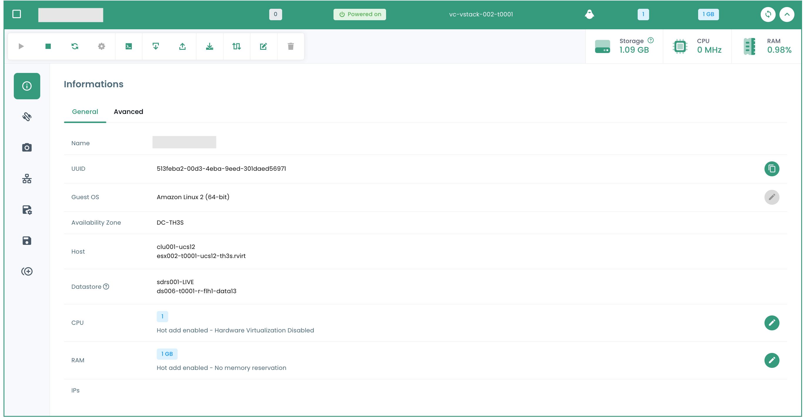
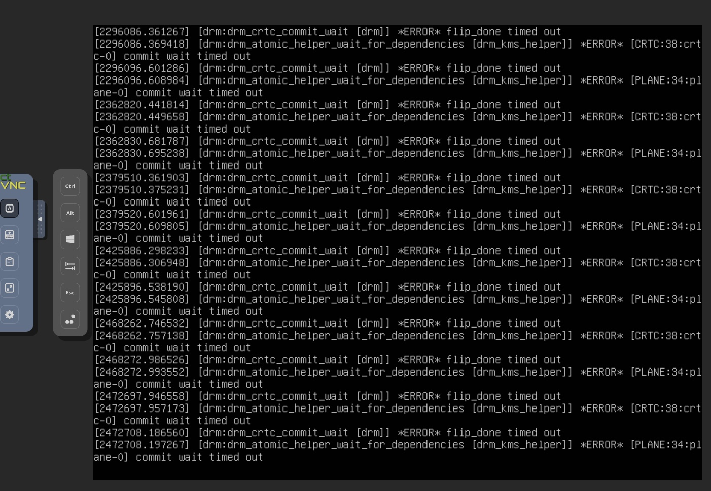
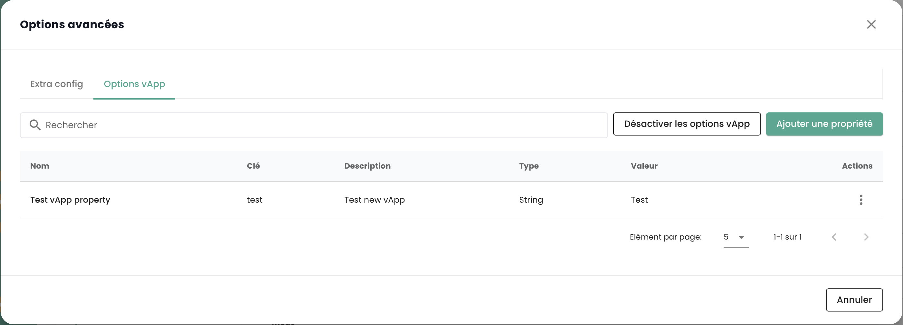

## VMware Virtualisierungsangebot
Das VMware Cloud Temple Virtualisierungsangebot, das mit SecNumCloud qualifiziert ist, basiert auf der Technologie __VMware Vsphere__.

Die Plattform wird von Cloud Temple automatisch verwaltet (Sicherheitsbedingungen aufrechterhalten, Betriebsbedingungen aufrechterhalten, ...).
Sie kann über die grafische Benutzeroberfläche der Shiva-Konsole oder über die zugehörigen APIs gesteuert werden.

*__Anmerkung__* : *Aus Sicherheitsgründen im Zusammenhang mit der SecNumCloud-Qualifizierung
__ist es dem Auftraggeber nicht möglich, direkt auf die VMware-Virtualisierungsplattform zuzugreifen__ (insbesondere kein direkter Zugriff auf das vCenter).
In der Tat verlangt die SecNumCloud-Qualifizierung eine __vollständige Trennung__ zwischen den Steuerungsschnittstellen der Technischen Assets und der Schnittstelle des Auftraggebers (der Shiva-Konsole).*

Die implementierten Produkte sind VMware ESXi, VMware Vcenter und VMware Replication.

*__Anmerkung__* :

- *Das Netzwerk des Virtualisierungsangebots verwendet nicht die Technologie von VMware NSX, sondern wird physisch durch Juniper-Technologie und das VPLS-Protokoll gesteuert.*
- *Die Speicherung verwendet nicht die VMWare vSan-Technologie, sondern nur IBM SANs im 32G-Faserkanal.*
- *Es wird keine Form der versteckten Optimierung eingesetzt (Kompression, Deduplizierung, ...).*

### Rechenblades v2 für die VMware-Virtualisierung
---

__DIESES ANGEBOT WIRD SEIT DEM 31. MÄRZ 2024 NICHT MEHR VERMARKTET__

---


Im Januar 2024 sind die von Cloud Temple gelieferten Blades vom Typ __CISCO UCS B200__ oder __CISCO UCS X210c__. Sie werden vollständig von Cloud Temple (Firmware, Betriebssystemversion, ...) über die Shiva-Konsole verwaltet. 

Verschiedene Kategorien von Rechenblades sind im Katalog verfügbar, um Ihre Workloads zu unterstützen (Virtualisierung, Containerisierung,...).
Diese haben unterschiedliche Eigenschaften und Leistungen, um Ihre Anforderungen bestmöglich zu erfüllen. Der Katalog der Rechenblades wird regelmäßig aktualisiert.

Im Rahmen der Nutzung mit einem Virtualisierungsangebot besteht ein Cluster von Hypervisoren nur aus Rechenblades desselben Typs (es ist nicht möglich, Blades verschiedener Typen in einem Cluster zu mischen).

| Referenz             | Maximal Verfügbarer RAM __(1)__ | Frequenz __(2)__                     | Anzahl der Kerne / Threads | Konnektivität __(3)__ | SKU für das Vmware-Angebot         |
| --------------------- | ------------------------------ | ------------------------------------- | -------------------------- | -------------------- | ------------------------------- |
| Blade ECO v2           | 384 Go                         | 2.20 GHz (Silver 4114 oder äquivalent)  | 20 / 40 Threads            | 2 X 10 Gbit/s        | csp:fr1:iaas:vmware:eco:v2      |
| Blade STANDARD v2      | 384 Go                         | 2.40 GHz (Silver 4314 oder äquivalent)  | 32 / 64 Threads            | 2 X 25 Gbit/s        | csp:fr1:iaas:vmware:standard:v2 |
| Blade ADVANCE v2       | 768 Go                         | 2.80 GHz (Gold 6342 oder äquivalent)    | 48 / 96 Threads            | 2 X 25 Gbit/s        | csp:fr1:iaas:vmware:advance:v2  |
| Blade PERFORMANCE 1 v2 | 384 Go                         | 3.20 GHz (Xeon E-53I5Y oder äquivalent) | 16 / 32 Threads            | 2 X 25 Gbit/s        | csp:fr1:iaas:vmware:perf1:v2    |
| Blade PERFORMANCE 2 v2 | 768 Go                         | 3.00 GHz (Gold 6354 oder äquivalent)    | 36 / 72 Threads            | 2 X 25 Gbit/s        | csp:fr1:iaas:vmware:perf2:v2    |
| Blade PERFORMANCE 3 v2 | 1536 Go                        | 2.60 GHz (Gold 6348 oder äquivalent)    | 56 / 112 Threads           | 2 X 25 Gbit/s        | csp:fr1:iaas:vmware:perf3:v2    |

Die Maßeinheit zur Erweiterung des verfügbaren Speichers eines Rechenblatts ist die folgende:

| Referenz                            | Einheit | SKU                       |
| ----------------------------------- | ----- | ------------------------- |
| Zusätzlicher dedizierter Speicher (RAM) | 1 Gb  | csp:fr1:network:memory:v2 |

__Bemerkungen__ :

- __(1)__ Die maximale Menge ist die, die auf den Blades physisch verfügbar ist.
Die Begrenzung des Speichers im 'IaaS'-Angebot ist eine softwareseitige Begrenzung auf Cluster-Ebene. Es ist nicht möglich, die physische Menge des Speichers auf einer Klinge zu ändern. Die Klingen werden mit 128 GB aktiviertem Speicher geliefert. 16 GB Speicher sind für den Hypervisor reserviert und nicht direkt nutzbar.
- __(2)__ Die minimale Basisfrequenz außerhalb des 'Turbo'-Modus des Prozessors. Standardmäßig sind die Prozessoren für eine maximale Leistung im BIOS konfiguriert.
- __(3)__ Die physische Konnektivität wird für den Netzwerkzugang und den Blockspeicherzugang gemeinsam genutzt, da die CISCO-Plattform konvergent ist. 

Die Verfügbarkeit des Rechenangebotes beträgt 99,99% und wird monatlich berechnet, einschließlich Wartungszeiten. Die Berechtigung bei Nichteinhaltung des SLA ist an
die Erstellung eines Störfalltickets gebunden. Sie müssen auch mindestens zwei Hosts pro Cluster haben und die Funktion __High Availability__ (HA) aktivieren.
Diese Funktion ermöglicht es Ihrer Architektur, Ihre virtuellen Maschinen automatisch auf dem zweiten Hypervisor neu zu starten.
Im Falle, dass eine Verfügbarkeitszone nur einen Hypervisor enthält, ist ein automatischer Neustart nicht möglich. 

### Rechenblades v3 für die VMware-Virtualisierung
__Ab Mai 2024__ werden die von Cloud Temple bereitgestellten Blades vom Typ __CISCO UCS B200__ oder __CISCO UCS X210c__. Sie werden vollständig von Cloud Temple verwaltet (Firmware, Betriebssystemversion, ...) über die Cloud Temple-Konsole.

Im Katalog sind verschiedene Kategorien von Computing Blades verfügbar, um Ihre Workloads zu unterstützen (Virtualisierung, Containerisierung, ...).
Diese haben unterschiedliche Eigenschaften und Leistungen, um Ihren Anforderungen bestmöglich gerecht zu werden. Der Katalog der Computing Blades wird regelmäßig aktualisiert.

Im Rahmen der Nutzung mit einem Virtualisierungsangebot besteht ein Hypervisor-Cluster nur aus Blades einer bestimmten Art (es ist nicht möglich, Blades verschiedener Art in einem Cluster zu mischen).

| Referenz             | RAM  __(1)__ | Frequenz __(2)__                         | Anzahl der Kerne / Threads | Konnektivität __(3)__ | GPU **(4)**          | SKU für das VMware Angebot         |
| --------------------- | ------------ | ----------------------------------------- | -------------------------- | -------------------- | -------------------- | ------------------------------- |
| Blade ECO v3           | 384 Go       | 2.20/3.0 GHz (Silver 4114 oder äquivalent)  | 20 / 40 Threads            | 2 X 10 Gbit/s        |                      | csp:fr1:iaas:vmware:eco:v3      |
| Blade STANDARD v3      | 384 Go       | 2.40/3.4 GHz (Silver 4314 oder äquivalent)  | 32 / 64 Threads            | 2 X 25 Gbit/s        |                      | csp:fr1:iaas:vmware:standard:v3 |
| Blade ADVANCE v3       | 768 Go       | 2.80/3.5 GHz (Gold 6342 oder äquivalent)    | 48 / 96 Threads            | 2 X 25 Gbit/s        |                      | csp:fr1:iaas:vmware:advance:v3  |
| Blade PERFORMANCE 1 v3 | 384 Go       | 3.20/3.6 GHz (Xeon E-53I5Y oder äquivalent) | 16 / 32 Threads            | 2 X 25 Gbit/s        |                      | csp:fr1:iaas:vmware:perf1:v3    |
| Blade PERFORMANCE 2 v3 | 768 Go       | 3.00/3.6 GHz (Gold 6354 oder äquivalent)    | 36 / 72 Threads            | 2 X 25 Gbit/s        |                      | csp:fr1:iaas:vmware:perf2:v3    |
| Blade PERFORMANCE 3 v3 | 1536 Go      | 2.60/3.5 GHz (Gold 6348 oder äquivalent)    | 56 / 112 Threads           | 2 X 25 Gbit/s        |                      | csp:fr1:iaas:vmware:perf3:v3    |
| Blade PERFORMANCE 4 v3 | 512 Go       | 2.50/4.1 GHz (Intel 6426Y oder äquivalent)  | 32 / 64 Threads            | 2 X 25 Gbit/s        | 2 x NVIDIA L40S 48go | csp:fr1:iaas:vmware:perf4:v3    |

__Anmerkungen__:

- __(1)__ Die gelieferte Speichermenge entspricht dem physisch auf den Blades verfügbaren Speicher. Es ist nicht möglich, die physische Speichermenge eines Blades zu ändern.

- __(2)__ Minimale Basisfrequenz / Turbofrequenz, ausgedrückt in GHz. Standardmäßig sind die Prozessoren für maximale Leistung im BIOS konfiguriert.

- __(3)__ Die physische Konnektivität ist für den Netzwerkzugang und den Blockspeicherzugang gemeinsam genutzt, da die CISCO-Plattform konvergiert ist.

- __(4)__ Das tatsächlich verfügbare GPU-Angebot ändert sich ständig. Ab dem 1. Mai 2024 basiert das Angebot auf den NVIDIA LOVELACE L40S-GPUs. Standardmäßig wird das Blade Perf4 mit 2 L40S-Karten mit 48 GB RAM ausgeliefert. Kontaktieren Sie den Support für weitere Erläuterungen, falls erforderlich.

Die Verfügbarkeit des Computing-Angebots beträgt 99,99%, monatlich berechnet, einschließlich Wartungszeiten. Die Berechtigung bei Nichteinhaltung der SLA hängt von
der Erstellung eines Störfalltickets ab. Sie müssen auch mindestens zwei Hosts pro Cluster haben und die Funktion __High Availability__ (HA) aktivieren.
Diese Funktion ermöglicht es Ihrer Architektur, Ihre virtuellen Maschinen automatisch auf dem zweiten Hypervisor neu zu starten.
In dem Fall, dass eine Verfügbarkeitszone nur einen Hypervisor enthält, ist ein automatischer Neustart nicht möglich.

### Definition eines Computing Blade Clusters ('Cpool')
Der __'Cpool'__ ist eine Gruppierung von VMware ESXi Hypervisoren, auch bekannt als *'ESX-Cluster'*.

Die Hosts in einem __'Cpool'__ gehören alle __zum selben Mieter und zur selben Verfügbarkeitszone__ (AZ). Sie müssen notwendigerweise die gleiche Klasse haben:
__es ist nicht möglich, verschiedene Modelle von Rechenblades in einem Cluster zu mischen__.

Da alle Rechenblades mit dem physischen Maximum an Speicher geliefert werden, wird eine Verwendungsbeschränkung des RAMs auf der Cluster-Ebene softwaremäßig angewendet, um sicherzustellen, dass sie dem berechneten RAM entspricht.

Standardmäßig hat jedes Blade 128 GB aktivierten Speicher im __'Cpool'__.

Ein __'Cpool'__ kann maximal 32 Hypervisoren enthalten. Wenn diese Grenze überschritten wird, ist es notwendig, ein zweites Cluster zu erstellen.

Der Speicher kann zwischen den __'Cpool'__ geteilt werden.

### Speicherzuteilung für einen 'Cpool'
Die Reservierung des RAMs ist pro Cluster konfigurierbar. Sie können die Menge an RAM reduzieren oder erhöhen, um sie Ihren Bedürfnissen auf Cluster-Ebene anzupassen.

Um dies zu tun, gehen Sie zum Menü __'Iaas'__ > __'Berechnung'__. Wählen Sie dann das Ziel-Cluster aus:


Wählen Sie dann __'Speicher ändern'__ aus:


Sie können dann die Zuteilung des physischen Speichers für Ihren 'Cpool' variieren.

Achten Sie darauf, den Durchschnittsverbrauch von 85% des Speichers pro Rechenblatt nicht zu überschreiten. Die VMware-Technologie verwendet eine Optimierungsmethode namens Kompression, die die Leistung Ihrer Workloads erheblich beeinträchtigen und die Diagnose verkomplizieren kann.
Ebenso kann ein zu hoher Speicherdruck auf Ihren Rechenblättern den Hypervisor zwingen, einen Teil seines Speichers auf Disk auszulagern, um den Bedürfnissen der virtuellen Maschinen gerecht zu werden.

Dieser Fall, bekannt als __'Ballooning'__, hat erhebliche Auswirkungen auf die Gesamtleistung der auf dem betroffenen Speicher (Datastore) befindlichen virtuellen Maschinen.
__Die Diagnose ist in diesem Kontext schwierig__, da Ihr Metrologie-System Auswirkungen auf CPU-Ebene und nicht auf Speicher- oder Speicherebene feststellen wird.
Behalten Sie auch im Hinterkopf, dass das erste, was der Hypervisor beim Start einer virtuellen Maschine tut, ist die Erstellung __einer Speicher-Swap-Datei__ (.vswap) auf
der Platte, die die Größe des Speichers der betreffenden virtuellen Maschine hat. Sie müssen dies __bei der Dimensionierung Ihres Speichers berücksichtigen__.

Jedes Rechenblatt wird mit 128 GB Speicher geliefert, die softwareseitig im __'Cpool'__ aktiviert sind, verfügt aber physisch über die Gesamtheit des zuweisbaren Speichers.

Zum Beispiel, für ein Cluster von drei Hosts des Typs ```vmware:standard:v2```, wird die RAM-Reservierung bei Aktivierung des __'Cpool'__ 3 x 128GB = 384GB RAM betragen.
Sie können diesen auf maximal 3 x 384GB = 1152GB Speicher ausweiten.

    Mindestspeicher eines 'Cpool' = Anzahl der Hosts X 128GB Speicher
    Maximales Speicher eines 'Cpool' = Anzahl der Hosts X die Menge des physischen Speichers des Rechenblatts


### Steuerung der virtuellen Maschinen
Die Verwaltungsoberfläche für Ihre virtuellen Maschinen ist in der Shiva Konsole im Menü __'IaaS'__ verfügbar, das sich im grünen Banner links auf dem Bildschirm befindet.

#### Liste der virtuellen Maschinen
Im Abschnitt __'Virtuelle Maschinen'__ haben Sie Zugriff auf die Liste Ihrer auf Ihrem vertrauenswürdigen Cloud gehosteten virtuellen Maschinen.


Sie haben Zugang zu den folgenden Informationen für jede virtuelle Maschine:

- ihr Name,
- die Tags, die ihr zugewiesen sind,
- ihr Status (ausgeschaltet, eingeschaltet, in Bearbeitung, Host getrennt oder ungültig),
- ihr Manager (in einer VMware-Umgebung, das zugehörige Vcenter),
- ihr Betriebssystem,
- Die Menge an virtuellen CPUs (vCPU),
- Die Menge des virtuellen Speichers (vRAM).

#### Aktionen auf virtuellen Maschinen
Die folgenden Aktionen sind über diese Benutzeroberfläche möglich:

- Aktualisierung der Liste der virtuellen Maschinen;
- Exportieren der Liste im CSV-Format;
- Filtern der Liste;
- Suchen Sie eine virtuelle Maschine nach ihrem Namen;
- Erstellen Sie eine neue virtuelle Maschine.


__Ein Warnhinweis kann oben in der Liste stehen__: Dies zeigt an, dass kritische Warnmeldungen für eine oder mehrere Ihrer virtuellen Maschinen ausgelöst wurden.
Die Schaltfläche __'Ansehen'__ ermöglicht Ihnen, die virtuellen Maschinen zu überprüfen, die von dieser Benachrichtigung betroffen sind.


Wenn Sie auf den grünen Dropdown-Pfeil rechts in der Liste für eine virtuelle Maschine klicken:


Sie erhalten alle Informationen dazu:



Eine Schnellzugriffsleiste ermöglicht die folgenden Aktionen:


- Schalten Sie die virtuelle Maschine ein;
- Es auszuschalten;
- Neustart;
- Ändern Sie die Stromversorgungsoptionen des Gast-Betriebssystems;
- Öffnen Sie die Konsole;
- Montieren Sie ein ISO;
- Dismount ein ISO;
- Klonen Sie die virtuelle Maschine;
- Bewegen Sie es (vMotion);
- Benennen Sie es um;
- Löschen Sie es.

Eine Quickview bietet eine Visualisierung des __Speichers__, der __CPU__ und des __RAM__ der virtuellen Maschine.


Unter der Registerkarte __'Allgemeine Informationen'__ finden Sie detaillierte Informationen zu Ihrer virtuellen Maschine, wie z. B. ihr Betriebssystem, ihren physischen Speicherort (Rechenzentrum, Datenspeicher usw.), den RAM, die CPU, die IP-Adressen, die Protokolle und andere.


Von dieser Ansicht aus können Sie die folgenden Aktionen ausführen:

- Ändern Sie das Betriebssystem (die virtuelle Maschine muss ausgeschaltet sein),
- Aktualisieren Sie die Hardwareversion (die virtuelle Maschine muss ausgeschaltet sein),
- Ändern Sie RAM oder CPU.

Eine Registerkarte __'Erweitert'__ ermöglicht Ihnen, spezifischere Informationen wie "VMware tools"-Informationen, die Hardwareversion, den Manager usw. abzurufen.


#### Ändern des Festplatten-Controllers einer virtuellen Maschine
Sie können den Festplattentyp für Ihre virtuelle Maschine ändern. Die unterstützten Typen sind **SCSI** und **NVME**. Sie können Controller mit maximal 4 Controllern jedes Typs hinzufügen.


#### Konsole einer virtuellen Maschine
Die Konsole einer virtuellen Maschine ist von der Liste der virtuellen Maschinen aus zugänglich, indem Sie auf das Symbol __'Konsole'__ klicken:


Ein neuer Tab in Ihrem Browser öffnet sich und zeigt dann die Konsole Ihrer Maschine an, die auf einem VNC-Client basiert:



Im VNC-Menü ist es möglich:

- Anforderung des Versands eines speziellen Tastendrucks,
- Kopieren/Einfügen aus der Zwischenablage Ihres Betriebssystems,
- Wechsel in den Vollbildmodus,
- Ändern der Fenstergröße (Skalierung).

Die Tastatursteuerung mit der Konsole der virtuellen Maschinen funktioniert perfekt in einer vollständig *englischen* Umgebung.

Die am Konsoleneingang vorgenommenen Angaben hängen von der Sprache der Tastatur Ihrer physischen Maschine, der Sprache der Tastatur
der virtuellen Maschine und der Aktivierung oder Nichtaktivierung der Option "enforce keyboard" auf der linken Seite des Bildschirms ab.
Hier ist eine Zusammenfassung der möglichen Situationen mit der französischen Sprache:

| Sprache der Tastatur der physischen Maschine (Eingabe) | Sprache der Tastatur der virtuellen Maschine | Option "enforce keyboard" ausgewählt | Ergebnis (Ausgabe)                                   |
| ---------------------------------------------- | ------------------------------------------ | ------------------------------------ | ---------------------------------------------------- |
| Französisch                                    | Französisch                               | Nein                                 | Nicht empfohlen (Problem bei Sonderzeichen) |
| Französisch                                    | Französisch                               | Ja                                   | '<' und '>' funktionieren nicht                      |
| Französisch                                    | Englisch                                  | Nein                                 | Nicht empfohlen (Problem bei Sonderzeichen) |
| Französisch                                    | Englisch                                  | Ja                                   | Englisch                                             |
| Englisch                                       | Französisch                               | Nein                                 | '<' und '>' funktionieren nicht                      |
| Englisch                                       | Französisch                               | Ja                                   | '<' und '>' funktionieren nicht                      |
| Englisch                                       | Englisch                                  | Nein                                 | Englisch                                             |
| Englisch                                       | Englisch                                  | Ja                                   | Englisch                                             |

__Hinweis__ :

- Wenn die Kombination __'AltGr'__ und __'@'__ auf der Tastatur nicht funktioniert, aktivieren Sie die Taste __'enforce key'__ im __'VNC'__ Menü der Konsole und versuchen Sie es erneut.
- Wenn es immer noch nicht funktioniert und das Betriebssystem der physischen Maschine __Windows ist, stellen Sie die Tastatur der physischen Maschine auf Englisch um
und versuchen Sie den @ auf die herkömmliche Art einzugeben__ *(azerty Ausgang: AltGr + 0 Taste oder qwerty Ausgang: 2 Taste)*.

#### Kataloge von Cloud Temple virtuellen Maschinen
Cloud Temple stellt Ihnen einen Katalog von regelmäßig von unseren Teams bereicherten und aktualisierten `Templates` zur Verfügung.
Es umfasst derzeit mehrere Dutzend `Templates` und Bilder zum Hochladen auf Ihre virtuellen Maschinen.


#### Erweiterte Konfiguration der virtuellen Maschinen: Extra Config
Die Extra Config bieten eine flexible Möglichkeit, Schlüssel=Wert-Paare in die Konfiguration einer virtuellen Maschine einzufügen. Schlüssel und Werte werden vom System interpretiert, wenn die virtuelle Maschine bereitgestellt wird.

Jetzt können Sie selbst die Eigenschaften des Typs **Extra Config** in den erweiterten Optionen einer virtuellen Maschine ändern:

{:height="50%" width="50%"}

Sie können eine Eigenschaft aus einer Liste von Schlüsseln hinzufügen. Darüber hinaus können Sie den Wert eines Schlüssels ändern, den Sie selbst hinzugefügt haben. Bestehende Schlüssel=Wert-Paare können nicht geändert werden.

Bitte wenden Sie sich an den Support, wenn Sie neue Schlüssel hinzufügen möchten.

{:height="50%" width="50%"}

**Hinweis** : *Um die GPU für die virtuelle Maschine zu nutzen, ist es obligatorisch den Schlüssel 'pciPassthru.use64bitMMIO' zu aktivieren und den notwendigen MMIO-Bereich (Memory-mapped I/O) über 'pciPassthru.64bitMMIOSizeGB' zuzuweisen. Es wird dringend empfohlen, sich auf die [offizielle Nvidia-Dokumentation](https://docs.nvidia.com/vgpu/17.0/grid-vgpu-release-notes-vmware-vsphere/index.html#tesla-p40-large-memory-vms) zu beziehen.*

#### Erweiterte Einstellungen für virtuelle Maschinen: vAPP

Sie können auch die Eigenschaften des Typs **vAPP** in den erweiterten Optionen einer virtuellen Maschine ändern:

{:height="50%" width="50%"}

Sie können eine Eigenschaft hinzufügen, ändern oder löschen. Vier Arten von Eigenschaften werden angeboten, String, Zahl, Boolean, Passwort:

{:height="50%" width="50%"}

**Hinweis** : *Die virtuelle Maschine muss gestoppt werden, um ihre vAPP-Eigenschaften zu ändern.*

### Steuerung der __'Hypervisoren'__ und __'Cpool'__ (Hypervisor-Cluster)
Die Steuerung Ihrer Hypervisoren erfolgt im Untermenü __'Berechnung'__ des Menüs __'IaaS'__, das sich in der grünen Leiste auf der linken Seite Ihres Bildschirms befindet.


In diesem Untermenü haben Sie eine Ansicht auf:

- Die Hypervisor-Software-Stack, ihre AZ und Ressourcen,
- Den Backup-Software-Stack.

Im Januar 2024 basiert das Hypervisor-Angebot auf der qualifizierten Cloud-Temple-Infrastruktur auf VMware. Die verwendete Backup-Software ist IBM Spectrum Protect Plus.

#### Steuerung der VMware-Cluster

Um auf die Steuerung der VMware-Cluster zuzugreifen, klicken Sie auf das Untermenü __'Berechnung'__ im Menü __'IaaS'__:

Standardmäßig listet die erste Registerkarte alle Hypervisoren auf (alle Cluster kombiniert):


Es ist möglich, die Details eines Hypervisors anzuzeigen, indem Sie auf seinen Namen klicken:


Auf jeder Hypervisor-Cluster-Registerkarte können Sie die Details jedes Clusters anzeigen:


Wenn Sie auf einen Cluster klicken, sehen Sie eine Zusammenfassung seiner Zusammensetzung:

- Die Gesamtleistung, ausgedrückt in Ghz,
- Die Gesamtmenge des verfügbaren Speichers und das verwendete Verhältnis,
- Der gesamte Speicherplatz (alle Arten kombiniert) sowie der verwendete Anteil,
- Automatisierungsmechanismen bei Ausfall einer Recheneinheit (__'Vsphere DRS'__),
- Die Anzahl der virtuellen Maschinen,
- Die Anzahl der Hypervisoren.

Bei der Ansicht der Seite eines Clusters sind mehrere Registerkarten verfügbar. Mit der Registerkarte __'Regeln'__ können Sie die [Regeln für Affinität / Anti-Affinität](compute.md#gestion-de-laffinité-de-vos-machines-virtuelles) festlegen.


Auf der Registerkarte __'Hosts'__ sehen Sie für jeden Hypervisor:

- Die __CPU__ und __Speicher__ Nutzung,
- Die Anzahl der zugewiesenen virtuellen Maschinen,
- Die Verfügbarkeit eines neuen Builds für das Betriebssystem des Hypervisors, wenn vorhanden,
- Der Status des Hypervisors (produktionsverbunden, wartend, ausgeschaltet, ...),
- Ein Aktion-Menü.


Es sind mehrere Aktionen von der Registerkarte __'Hosts'__ aus möglich:

- Bestellen Sie neue Hypervisoren mit der Schaltfläche __'Host hinzufügen'__:


- Möglichkeit, __die Details eines Hypervisors__ zu sehen:


- einen Hypervisor in den __Wartungszustand__ versetzen oder aus ihm herausnehmen,
- gegebenenfalls diesen Hypervisor __aktualisieren__; dazu __muss er unbedingt im Wartungsmodus sein__. Es gibt zwei Arten von Updates:

1. VMware Builds (die neuen Versionen des Hypervisors):

   {:height="50%" width="50%"}

2. Das Firmware-Update Ihrer Rechenlamelle (Bios und Firmware-Tochterkarten):

   {:height="50%" width="50%"}

*__Hinweis__* :

- *Cloud Temple stellt regelmäßig Builds für Hypervisoren zur Verfügung. Es ist wichtig, Ihre Hypervisoren regelmäßig zu aktualisieren, insbesondere um Sicherheitspatches zu installieren. Allerdings __aktualisieren wir Ihre Hypervisoren nicht selbst__. Cloud Temple hat keinen Einblick in die Verfügbarkeitsvereinbarungen Ihrer Workloads. Daher überlassen wir Ihnen die Durchführung Ihrer Change Management und die Installation der neuen Builds zur besten Zeit.*
- *Der Update-Prozess ist vollautomatisch. Sie müssen mindestens zwei Hypervisoren in Ihrem Cluster haben, um ein Update ohne Unterbrechung des Dienstes durchzuführen.*
- *Es ist notwendig, [die entsprechenden Berechtigungen](../console/permissions.md) zu haben, um die verschiedenen Aktionen durchzuführen.*

Sie sehen auch alle Affinitäts-/Anti-Affinitätsregeln für Ihren Hypervisor-Cluster im Abschnitt __'Regeln'__.

#### Verwaltung der Affinität Ihrer virtuellen Maschinen

Die __Affinitäts- und Anti-Affinitätsregeln__ ermöglichen es, die Platzierung von virtuellen Maschinen auf Ihren Hypervisors zu steuern.
Sie können zur Verwaltung der Ressourcennutzung Ihres __'Cpool'__ verwendet werden.
Zum Beispiel können sie dazu beitragen, die Arbeitslast zwischen den Servern auszugleichen oder ressourcenintensive Arbeitslasten zu isolieren.
In einem VMware __'Cpool'__ werden diese Regeln oft verwendet, um das Verhalten von virtuellen Maschinen mit vMotion zu verwalten.
vMotion ermöglicht es, virtuelle Maschinen ohne Unterbrechung des Dienstes von einem Host zu einem anderen zu verschieben.

Sie können dies durch die Regelverwaltung konfigurieren:

- __Affinitätsregeln__: Diese Regeln stellen sicher, dass bestimmte virtuelle Maschinen auf demselben physischen Host ausgeführt werden.
Sie werden verwendet, um die Leistung zu verbessern, indem sie häufig kommunizierende virtuelle Maschinen 
zusammen auf demselben Server halten, um die Netzwerklatenz zu reduzieren. Affinitätsregeln sind in Situationen 
nützlich, in denen Leistung kritisch ist, wie im Falle von Datenbanken oder Anwendungen, die eine schnelle Kommunikation zwischen den Servern erfordern.

- __Anti-Affinitätsregeln__: Umgekehrt stellen diese Regeln sicher, dass bestimmte virtuelle Maschinen nicht 
auf demselben physischen Host ausgeführt werden. Sie sind wichtig für Verfügbarkeit und Resilienz, zum Beispiel, 
um zu verhindern, dass kritische Maschinen alle durch das Versagen eines einzigen Servers betroffen sind.
Anti-Affinitätsregeln sind entscheidend für Anwendungen, die eine hohe Verfügbarkeit benötigen,
wie in Produktionsumgebungen, in denen Ausfalltoleranz eine Priorität ist.
Zum Beispiel möchten Sie nicht, dass Ihre beiden Active Directory auf demselben Hypervisor laufen.

Bei der Erstellung einer Regel definieren Sie die Art der Regel (Affinität / Anti-Affinität), den Namen der Regel,
ihren Aktivierungsstatus (__'Statut'__) und die betroffenen Maschinen in Ihrem Hypervisor-Cluster.

{:height="80%" width="80%"}

*Anmerkung: Die in der Konsole vorgeschlagenen Affinitäts-/Anti-Affinitätsregeln betreffen virtuelle Maschinen untereinander (keine Regeln zwischen Hypervisoren und virtuellen Maschinen).*

### Steuerung der 'StandAlone' Hypervisoren
#### Allgemeines
Cloud Temple bietet die Möglichkeit, __autonome Hypervisors__ mit VMware-Technologie bereitzustellen.
Diese Hypervisors werden direkt über die Shiva-Konsole gesteuert, __ohne Verbindung zu einer VMware VCenter-Verwaltungsplattform__.

Der Hypervisor ist __völlig autonom__ und seine Speicher-LUNs sind verbunden und nicht mit anderen Systemen geteilt.
Es gibt keine Möglichkeit für vMotion und die zugehörigen technischen Netzwerke sind nicht konfiguriert, um bei einer Audit-Situation konform zu sein.

Der Zweck dieses Dienstes ist ausschließlich die __Vereinfachung der Lizenzverwaltung__, insbesondere mit den Herausgebern __Oracle__ und __Microsoft__.

*__Bemerkung__* :

- *Die Bestellung eines autonomen Hypervisors erfordert eine Serviceanfrage beim Support-Team,*
- *Es ist nicht möglich, die Art des Prozessors zu ändern,*
- *Es ist jedoch möglich, einen Prozessor auf der UCS-Firmware zu deaktivieren. __Achtung allerdings sind nicht alle Herausgeberlizenzen mit dieser Aktion kompatibel__,*
- *Alle Leistungsniveaus im Speicher sind auf autonomen Hypervisors verfügbar. Geben Sie bei der Support-Anfrage den gewünschten Speichertyp an,*
- *Speicherreplikation ist nicht verfügbar auf autonomen Hypervisors,*
- *Die Replikation von virtuellen Maschinen ist auf autonomen Hypervisors nicht möglich,*
- *Das Backup-Angebot ist auf autonomen Hypervisors nicht verfügbar: Sie müssen __einen Anwendungs-Backup-Mechanismus bereitstellen.__*
- Das Update des Hypervisors erfolgt über die Cloud Temple-Konsole. __Achtung: Ohne Anwendungsredundanz müssen Sie das Herunterfahren Ihrer virtuellen Maschinen antizipieren.__

## Häufigste Fragen
- [Häufig gestellte Fragen zu virtuellen Maschinen](../faq/iaas/virtual_machine/virtual_machine.md)
- [Häufig gestellte Fragen zur Sicherung virtueller Maschinen](../faq/iaas/backup/backup.md)