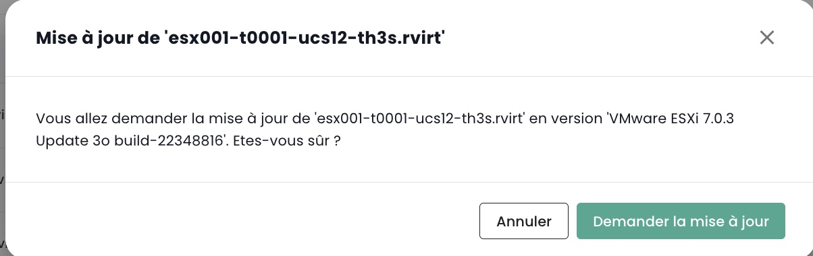

## VMware virtualization offer

The VMware Cloud Temple virtualization offer, qualified as SecNumCloud, is based on __VMware Vsphere__ technology.

The platform is automatically managed by Cloud Temple (maintenance of security conditions, operational maintenance, ...).
It can be controlled via the graphic interface of the Shiva console or via the associated APIs.

*__Remark__* : *For security reasons related to the SecNumCloud qualification,
__it is not possible for the sponsor to directly access the VMware virtualization platform__ (no direct access to vCenter in particular).
Indeed, the SecNumCloud qualification imposes __a total segregation__ between the control interfaces of the technical assets and the sponsor's interface (the Shiva console).*

The implemented products are VMware ESXi, VMware Vcenter and VMware Replication.

*__Remark__* :

- *The network of the virtualization offer does not use VMware NSX technology, but is physically controlled by Juniper technology and the VPLS protocol.*
- *Storage does not use VMWare vSan technology, but only IBM SANs in 32G fiber channel.*
- *No form of hidden optimization is implemented (compression, deduplication, ...).*

### v2 calculation blades for VMware virtualization
---

__THIS OFFER HAS NOT BEEN AVAILABLE SINCE MARCH 31, 2024__

---

In January 2024, the blades provided by Cloud Temple are of __CISCO UCS B200__ or __CISCO UCS X210c__. They are fully managed by Cloud Temple (firmware, operating system version, ...) through the Shiva console.

Several categories of computing blades are available in the catalog to support your workloads (Virtualization, Containerization, ...).
These have different characteristics and performances to best meet your needs. The computing blade catalog is regularly updated.

In the context of use with a virtualization offer, a cluster of hypervisors is only composed of the same type of compute blade (it is not possible to mix blades of different types in the same cluster).

| Reference              | Maximum Available RAM __(1)__ | Frequency __(2)__                    | Number of cores / threads | Connectivity __(3)__ | SKU for VMware offer             |
| ---------------------  | ------------------------------| -------------------------------------| --------------------------| -------------------- | ------------------------------- |
| ECO Blade v2          | 384 Go                        | 2.20 GHz (Silver 4114 or equivalent) | 20 / 40 threads           | 2 X 10 Gbit/s       | csp:fr1:iaas:vmware:eco:v2     |
| STANDARD Blade v2     | 384 Go                        | 2.40 GHz (Silver 4314 or equivalent) | 32 / 64 threads           | 2 X 25 Gbit/s       | csp:fr1:iaas:vmware:standard:v2|
| ADVANCE Blade v2      | 768 Go                        | 2.80 GHz (Gold 6342 or equivalent)   | 48 / 96 threads           | 2 X 25 Gbit/s       | csp:fr1:iaas:vmware:advance:v2 |
| PERFORMANCE 1 Blade v2| 384 Go                        | 3.20 GHz (Xeon E-53I5Y or equivalent)| 16 / 32 threads           | 2 X 25 Gbit/s       | csp:fr1:iaas:vmware:perf1:v2    |
| PERFORMANCE 2 Blade v2| 768 Go                        | 3.00 GHz (Gold 6354 or equivalent)   | 36 / 72 threads           | 2 X 25 Gbit/s       | csp:fr1:iaas:vmware:perf2:v2    |
| PERFORMANCE 3 Blade v2| 1536 Go                       | 2.60 GHz (Gold 6348 or equivalent)   | 56 / 112 threads          | 2 X 25 Gbit/s       | csp:fr1:iaas:vmware:perf3:v2    |

The unit of work to extend the available memory from a compute blade is as follows:

| Reference                           | Unit | SKU                       |
| ----------------------------------- | ----- | ------------------------- |
| Additional dedicated memory (RAM)   | 1 Go  | csp:fr1:network:memory:v2 |

__Notes__ :

- __(1)__ The maximum quantity is the one physically available on the blades.
The memory limitation in the 'IaaS' offer is a software limitation at the cluster computing blade level.
It is not possible to change the physical quantity of memory of a blade. Blades are delivered with 

128GB of enabled memory. 16GB of memory are reserved for the hypervisor and are not directly usable.
- __(2)__ Minimum non-'turbo' base frequency of the processor. By default, processors are configured for maximum performance in BIOS.
- __(3)__ Physical connectivity is shared for network access and block storage access, the CISCO platform being converged.

The availability of the computing offer is 99.99%, calculated monthly, maintenance window included. Eligibility in case of non-compliance with the SLA is subject to
the creation of an incident ticket. You must also have at least two hosts per cluster and activate the __High Availability__ (HA) feature.
This feature allows your architecture to automatically restart your virtual machines on the second hypervisor.
In the event that a availability zone contains only one hypervisor, automatic restart is not possible.

### v3 Computing Blades for VMware Virtualization

__Starting from May 2024__, the blades supplied by Cloud Temple are of the type __CISCO UCS B200__ or __CISCO UCS X210c__. They are fully managed by Cloud Temple (firmware, OS version, ...) through the Cloud Temple console.

Several categories of computing blades are available in the catalog to support your workloads (Virtualization, Containerization, ...).
These offer different characteristics and performances to best meet your needs. The computing blades catalog is regularly updated.

As part of the use with a virtualization offer, a cluster of hypervisors is only composed of computing blades of the same type (it is not possible to mix blades of different types in the same cluster).

| Reference             | RAM  __(1)__ | Frequency __(2)__                         | Number of cores / threads | Connectivity __(3)__ | GPU **(4)**         | SKU for the Vmware offer        |
| --------------------- | ------------ | ----------------------------------------- | -------------------------- | -------------------- | -------------------- | ------------------------------- |
| Blade ECO v3           | 384 GB       | 2.20/3.0 GHz (Silver 4114 or equivalent)  | 20 / 40 threads           | 2 X 10 Gbit/s        |                      | csp:fr1:iaas:vmware:eco:v3      |
| Blade STANDARD v3      | 384 GB       | 2.40/3.4 GHz (Silver 4314 or equivalent)  | 32 / 64 threads           | 2 X 25 Gbit/s        |                      | csp:fr1:iaas:vmware:standard:v3 |
| Blade ADVANCE v3       | 768 GB       | 2.80/3.5 GHz (Gold 6342 or equivalent)    | 48 / 96 threads           | 2 X 25 Gbit/s        |                      | csp:fr1:iaas:vmware:advance:v3  |
| Blade PERFORMANCE 1 v3 | 384 GB       | 3.20/3.6 GHz (Xeon E-53I5Y or equivalent) | 16 / 32 threads           | 2 X 25 Gbit/s        |                      | csp:fr1:iaas:vmware:perf1:v3    |
| Blade PERFORMANCE 2 v3 | 768 GB       | 3.00/3.6 GHz (Gold 6354 or equivalent)    | 36 / 72 threads           | 2 X 25 Gbit/s        |                      | csp:fr1:iaas:vmware:perf2:v3    |
| Blade PERFORMANCE 3 v3 | 1536 GB      | 2.60/3.5 GHz (Gold 6348 or equivalent)    | 56 / 112 threads          | 2 X 25 Gbit/s        |                      | csp:fr1:iaas:vmware:perf3:v3    |
| Blade PERFORMANCE 4 v3 | 512 GB       | 2.50/4.1 GHz (Intel 6426Y or equivalent)  | 32 / 64 threads           | 2 X 25 Gbit/s        | 2 x NVIDIA L40S 48GB | csp:fr1:iaas:vmware:perf4:v3    |

__Remarks__:

- __(1)__ The amount of memory provided is the one physically available on the blades. It is not possible to change the physical amount of a blade's memory.

- __(2)__ The base minimum frequency / turbo frequency, expressed in GHz. By default, the processors are set for maximum performance at the BIOS level.

- __(3)__ Physical connectivity is shared for network access and block storage access, the CISCO platform being converged.

- __(4)__ The GPU offer really available is constantly evolving. As of May 1, 2024, the offer is based on NVIDIA LOVELACE L40S GPUs. By default, the PERF4 blade is delivered with 2 L40S cards with 48 GB of RAM. Contact support for more precision if necessary.

The computing offer's availability is 99.99%, calculated monthly, including the maintenance window. Eligibility in case of non-compliance with the SLA is subject to
the creation of a ticket incident. You must also have at least two hosts per cluster and activate the __High Availability__ (HA) feature.
This feature allows your architecture to automatically restart your virtual machines on the second hypervisor.
In the event that an availability zone contains only one hypervisor, automatic restart is not possible.


### Definition of a computing blade cluster ('Cpool')
The __'Cpool'__ is a grouping of VMware ESXi hypervisors, also known as a *'ESX cluster'*.

The hosts in a __'Cpool'__ all belong __to the same tenant and the same availability zone__ (AZ). They must necessarily be of the same class:
__it is not possible to mix different models of compute blades within the same cluster__.

All compute blades being delivered with the maximum physical memory, a limitation on the use of RAM is applied in software at the cluster level to ensure it matches the billed RAM.

By default, each blade has 128 GB of memory enabled in the __'Cpool'__.

A __'Cpool'__ can contain a maximum of 32 hypervisors. Beyond this limit, a second cluster will need to be created.

Storage can be shared between __'Cpool'__s.

### Memory Allocation for a 'Cpool'
The reservation of RAM is configurable by cluster. You can reduce or increase the amount of RAM to fit your needs at the cluster level.

To do so, go to the __'Iaas'__ > __'Compute'__ menu. Then choose the target cluster:


Next, choose __'Modify Memory'__:


You can then vary the allocation of physical memory for your 'Cpool'.

__Be careful not to exceed an average of 85% memory usage per compute blade__. 
Indeed, VMware technology will use a type of optimization method, compression, which can significantly impact your workload performance and complicate diagnosis.
Similarly, excessive memory pressure on your compute blades will force the hypervisor to offload part of its memory to disk to meet the needs of virtual machines.

This case, called __'Ballooning'__, greatly impacts the overall performance of virtual machines located on the affected storage (datastore).
__Diagnosis is complicated in this context__, as your metrology will notice impacts on the CPU level and not memory or storage.
Keep also in mind that the first thing the hypervisor does when starting a virtual machine is to create __a memory swap file__ (.vswap) on the disk, the size of the memory of the concerned virtual machine. You need to __account for this in sizing your storage__.

Each computation blade is delivered with 128GB of software-activated memory at the __ 'Cpool' __ level but physically has the total allocable memory.

For example, for a cluster of three hosts of type ```vmware:standard:v2```, RAM reservation at the activation of the __'Cpool'__ will be 3 x 128GB = 384GB of RAM.
You can extend it to a maximum of 3 x 384GB = 1152GB of memory.

    Minimum memory of a 'Cpool' = number of hosts X 128GB of memory
    Maximum memory of a 'Cpool' = number of hosts X the quantity of physical memory of the compute blade


### Virtual Machines Operation

The management interface for your virtual machines is available in the Shiva console in the __'IaaS'__ menu located on the green banner on the left side of the screen.

#### List of virtual machines
In the __'Virtual Machines'__ section, you have access to the list of your virtual machines hosted on your trusted Cloud.


You have access to the following information, for each virtual machine:

- its name,
- the tags assigned to it,
- its status (off, on, processing, host disconnected or invalid),
- its manager (in a VMware environment, the associated Vcenter),
- its operating system,
- the quantity of virtual CPUs (vCPUs),
- the quantity of virtual memory (vRAM).

#### Actions on virtual machines
The following actions are possible from this interface:

- Refreshing the virtual machines list;
- Exporting the list in CSV format;
- Filtering the list;
- Searching for a virtual machine by its name;
- Creating a new virtual machine.


__An alert bar may be present at the top of the list__: it indicates that critical alarms have been triggered on one or more of your virtual machines.
The __'View'__ button allows you to consult the virtual machines that are affected by this notification.


When you click on the green drop-down arrow on the right of the list for a virtual machine:


You access all the information related to it:


A quick banner allows you to perform the following actions:
 


- Switch on the virtual machine;
- Turn it off;
- Restart it;
- Modify the guest OS power options;
- Open the console;
- Mount an ISO;
- Dismount an ISO;
- Clone the virtual machine;
- Move it (vMotion);
- Rename it;
- Delete it.

A quick view offers a visualisation of the __storage__, __CPU__ and __RAM__ of the virtual machine.


In the __'General Information'__ tab, you find detailed information related to your virtual machine, such as its OS, physical location (datacenter, datastore, etc.), RAM, CPU, IP addresses, logs, and others.


From this view, you can perform the following actions:

- Modify the operating system (the virtual machine must be turned off),
- Update the hardware version (the virtual machine must be turned off),
- Modify the RAM or the CPU.

A __'Advanced'__ tab allows you to consult more specific information like the "VMware tools" info, the hardware version, the manager, etc...


#### Modifying a virtual machine's disk controller
You can change the type of disk controller for your virtual machine. The supported types are **SCSI** and **NVME**. You can add controllers with a maximum of 4 controllers of each type.


#### Virtual machine console
The console of a virtual machine is accessible from the list of virtual machines by clicking on the __'Console'__ icon:


A new tab of your browser opens and displays the console of your machine, based on a VNC client:


It is possible in the VNC menu:

- to request the sending of a particular key,
- to perform copy/paste from your OS clipboard,
- to switch to full screen mode,
- to change the window size (scaling).

Keyboard management, with the console of virtual machines, works perfectly in an entirely *English* environment.

The input made in the console depends on the language of your physical machine's keyboard, the language of the
keyboard of the virtual machine and whether or not the 'enforce keyboard' option is activated on the left side of the screen.
Here is a synthesis of the possible situations with the French language:

| Physical machine keyboard language (input) | Virtual machine keyboard language | 'Enforce keyboard' option selected | Result (output)                                  |
| ------------------------------------------ | --------------------------------- | ---------------------------------- | ------------------------------------------------ |
| French                                     | French                            | No                                 | Not recommended (problem with special characters)|
| French                                     | French                            | Yes                                | '<' and '>' do not work                         |
| French                                     | English                           | No                                 | Not recommended (problem with special characters)|
| French                                     | English                           | Yes                                | English                                          |
| English                                    | French                            | No                                 | '<' and '>' do not work                         |
| English                                    | French                            | Yes                                | '<' and '>' do not work                         |
| English                                    | English                           | No                                 | English                                          |
| English                                    | English                           | Yes                                | English                                          |

__Note__:

- If the combination __'AltGr'__ and __'@'__ on the keyboard does not work, activate the __'enforce key'__ button in the __'VNC'__ menu of the console and try again.
- If it still does not work and the physical machine OS is __Windows, put the physical machine keyboard in English
and try to enter the @ in the usual way__ *(azerty output : AltGr + 0 key or qwerty output : 2 key)*.

#### Cloud Temple Virtual Machine Catalogues
Cloud Temple provides you with a catalog of `Templates` regularly enriched and updated by our teams.
It currently includes several dozens of `Templates` and images to mount on your virtual machines.


#### Advanced settings of virtual machines: Extra Config
The Extra Config provides a flexible way to include key=value pairs in a virtual machine's configuration. The keys and values are interpreted by the system when the virtual machine is deployed.

From now on, you can modify the **Extra Config** type properties in the advanced options of a virtual machine:

{:height="50%" width="50%"}

You can add a property from a list of keys. In addition, you can modify the value of a key that you added yourself. Existing key=value pairs are not modifiable.

Please contact support for any request to add new keys.

{:height="50%" width="50%"}

**Note**: *For the virtual machine's use of the GPU, it is mandatory to enable the 'pciPassthru.use64bitMMIO' key and allocate the necessary MMIO (Memory-mapped I/O) space through 'pciPassthru.64bitMMIOSizeGB'. It is strongly recommended to refer to the [official Nvidia documentation](https://docs.nvidia.com/vgpu/17.0/grid-vgpu-release-notes-vmware-vsphere/index.html#tesla-p40-large-memory-vms).*

#### Advanced settings of virtual machines: vAPP
You can also modify properties of type **vAPP** in the advanced options of a virtual machine:

{:height="50%" width="50%"}

You can add a property, modify it or delete it. Four types of properties are offered: String, Number, Boolean, Password:

{:height="50%" width="50%"}

**Note**: *The virtual machine must be stopped to modify its vAPP properties.*

### Management of __'hypervisors'__ and __'Cpool'__ (hypervisor clusters)
The management of your hypervisors is done in the sub-menu __'Compute'__ of the __'IaaS'__ menu, located in the green banner on the left side of your screen.


In this sub-menu, you have a view on:

- The software stack of hypervisors, their AZ and their resources,
- The backup software stack.

In January 2024, the hypervisor offer available on the Cloud Temple qualified infrastructure is based on VMware. The backup software used is IBM Spectrum Protect Plus.

#### Management of VMware clusters
To access the control of VMware clusters, click in the submenu __'Compute'__ of the menu __'IaaS'__:

By default, the first tab lists all hypervisors (all clusters combined):


It is possible to view the details of a hypervisor by clicking on its name:


There is a tab for each hypervisor cluster to consult the details of each one:


If you click on a cluster, you see a summary of its composition:

- The total computing power expressed in Ghz,
- The total available memory and the used ratio,
- The total storage space (all types combined) and the used quota,
- Automation mechanisms on unavailability of a computation blade (__'Vsphere DRS'__),
- The number of virtual machines,
- The number of hypervisors.

When consulting a cluster's page, several tabs are available. The __'Rules'__ tab allows you to define the [affinity / anti-affinity rules](compute.md#managing-the-affinity-of-your-virtual-machines)


You will see for each hypervisor in the __'Hosts'__ tab:

- __CPU__ and __Memory__ use,
- The number of assigned virtual machines,
- Availability of a new build for the operating system of the hypervisor if applicable,
- The status of the hypervisor (connected in production, in maintenance, switched off, ...),
- An action menu.


Several actions are possible from the __'Hosts'__ tab:

- order new hypervisors via the __'Add a host'__ button:


- ability to consult __the detail of a hypervisor__:


- to enter or exit the __maintenance state__ a hypervisor,
- to __update__ the hypervisor when necessary; to do this, __it must necessarily be in maintenance__. There are two types of updates:

1. The VMware builds (the new versions of the hypervisor):

{:height="50%" width="50%"}

2. The update of your computation blade firmware (bios and daughter card firmware):

{:height="50%" width="50%"}

*__Note__:*

- *Cloud Temple makes available the builds for hypervisors at regular intervals.
It is important to regularly update your hypervisors, especially to allow the application of security patches.
However, __we do not update your hypervisors ourselves__. Cloud Temple does not have visibility on the availability commitments of your workloads.
We therefore let you implement your change management and apply the new builds at the best time.*
- *The update process is fully automated. You must have at least two hypervisors in your cluster to allow an update without service interruption.*
- *It is necessary to have [the appropriate permissions](../console/permissions.md) to perform the various actions.*

You also see all the affinity/anti-affinity rules for your hypervisor cluster in the __'Rules'__ section.

#### Managing the affinity of your virtual machines
The __affinity and anti-affinity rules__ allow for the control of the location of virtual machines on your hypervisors.
These can be deployed for managing the resource utilization of your __'Cpool'__.
For instance, they can assist in balancing workload among servers or isolating resource-intensive workloads.
In a VMware __'Cpool'__, these rules are often deployed for managing the behavior of virtual machines with vMotion.
vMotion enables moving virtual machines from one host to another without service interruption.

Rules management allows to configure:

- __Affinity Rules__ : These rules ensure that certain virtual machines run on the same physical host.
They are used to boost performance by keeping frequently communicating virtual machines
together on the same server to reduce network latency. Affinity rules are beneficial in scenarios
where performance is critical, such as with databases or applications that require rapid communication between servers.

- __Anti-Affinity Rules__ : Contrarily, these rules ensure that certain virtual machines do not run
on the same physical host. They are crucial for availability and resilience, for example,
to avoid having critical machines all affected in the event of a single server failure.
Anti-affinity rules are crucial for applications requiring high availability,
like in production environments where fault tolerance is a priority.
For example, you wouldn't want your two Active Directories to be on the same hypervisor.

While creating a rule, you define the rule type (affinity / anti-affinity), the rule name,
its activation state (__'Status'__), and the related machines of your hypervisor cluster.

{:height="80%" width="80%"}

*Note: the affinity/anti-affinity rules offered in the console are rules concerning virtual machines among themselves (no rules between hypervisors and virtual machines).*

### Management of 'StandAlone' hypervisors
#### Generalities
Cloud Temple offers the possibility to provide __standalone hypervisors__ using VMware technology.
These hypervisors are driven directly by the Shiva console, __without interconnection with a VMware VCenter management platform__.

The hypervisor is __completely autonomous__ and its storage LUNs are connected and not shared with other systems.
There is no vMotion possibility and the associated technical networks are not configured to be compliant in an audit situation.

The purpose of this service is solely to __facilitate the management of your license compliance__, particularly with __Oracle__ and __Microsoft__ publishers.

*__Note__* :

- *Ordering a standalone hypervisor requires a service request to the support team,*
- *It is not possible to change the type of processor,*
- *However, it is possible to disable a processor at the UCS firmware level. ___Bear in mind__, not all publisher licenses are compatible with this action,*
- *All levels of storage performance are available on standalone hypervisors. Specify the type of storage desired when requesting support,*
- *Storage replication is not available on standalone hypervisors,*
- *Virtual machine replication is not available on standalone hypervisors,*
- *The backup offer is not available on standalone hypervisors: you must __provide an application backup mechanism.__*
- Hypervisor updates are done from the Cloud Temple console. __Attention: without application redundancy, you must anticipate the shutdown of your virtual machines.__

## Most frequent questions

- [Most Frequently Asked Questions about Virtual Machines](../faq/iaas/virtual_machine/virtual_machine.md)
- [Most Frequently Asked Questions about Virtual Machines Backup](../faq/iaas/backup/backup.md)