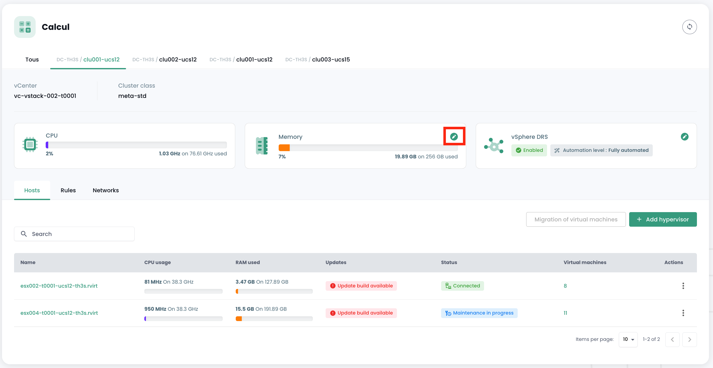
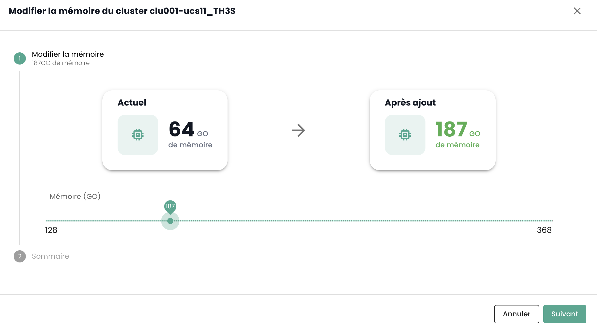
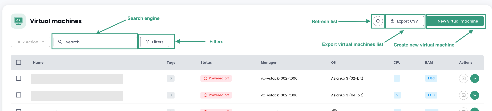
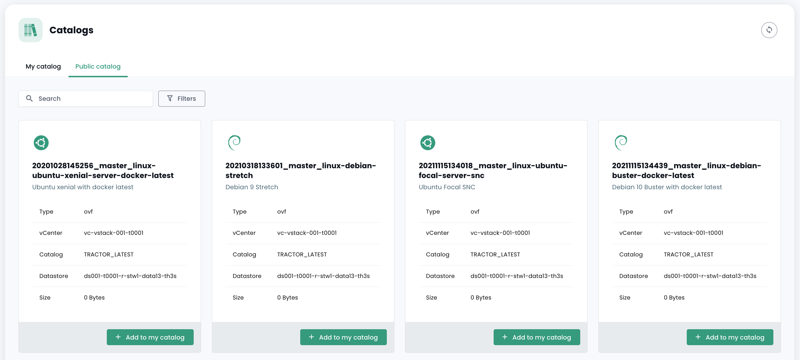
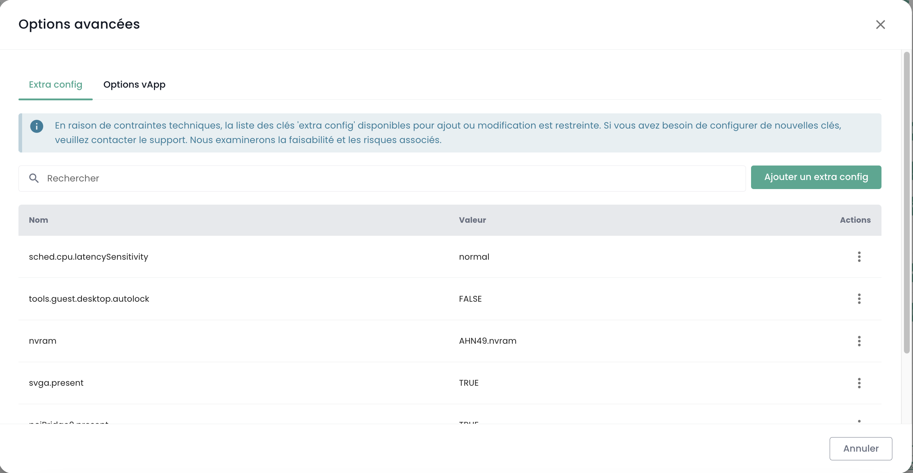
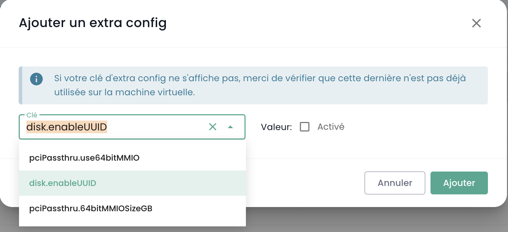
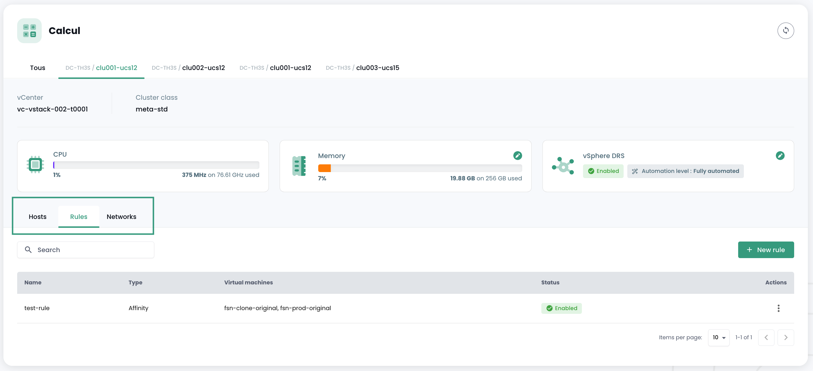
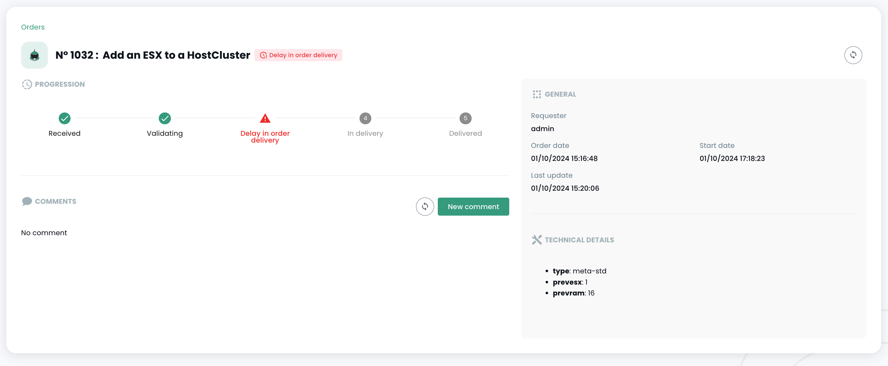
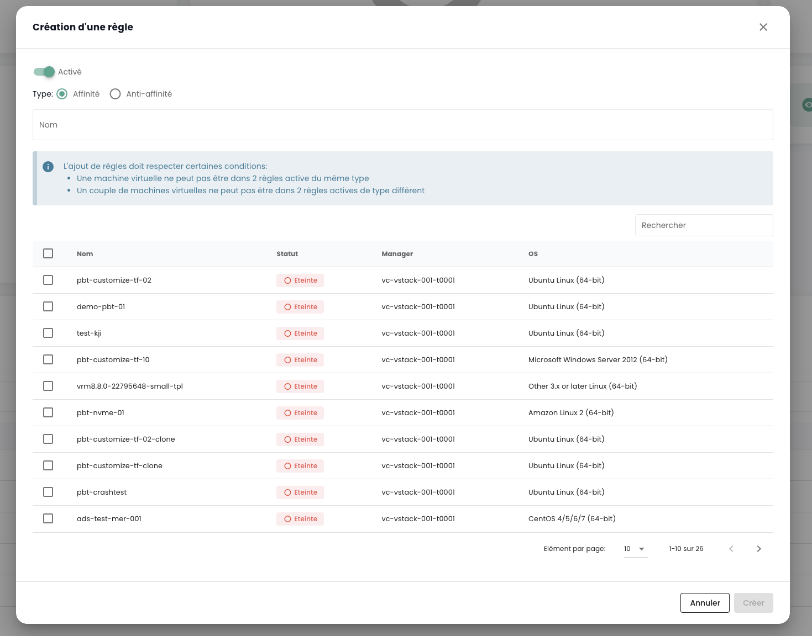

## Oferta de virtualización VMware
La oferta de virtualización VMware Cloud Temple calificada como SecNumCloud se basa en la tecnología __VMware Vsphere__.

La plataforma está gestionada por Cloud Temple de manera automática (mantenimiento de condiciones de seguridad, mantenimiento en condiciones operativas, ...).
Se puede operar a través de la interfaz gráfica de la consola Shiva o a través de las APIs asociadas.

*__Nota__* : *Por razones de seguridad relacionadas con la calificación de SecNumCloud,
__no es posible para el patrocinador acceder directamente a la plataforma de virtualización VMware__ (sin acceso directo al vCenter, en particular).
De hecho, la calificación de SecNumCloud impone __una segregación total__ entre las interfaces de operación de los activos técnicos y la interfaz del patrocinador (la consola Shiva).*

Los productos implementados son VMware ESXi, VMware Vcenter y VMware Replication.

*__Nota__* :

- *La red de la oferta de virtualización no utiliza la tecnología VMware NSX, sino que está controlada físicamente por la tecnología Juniper y el protocolo VPLS.*
- *El almacenamiento no utiliza la tecnología VMWare vSan, sino únicamente SANs de IBM en fiber channel de 32G.*
- *No se implementa ninguna forma de optimización oculta (compresión, deduplicación, ...).*

### Laminas de cálculo v2 para la virtualización VMware

---

__ESTA OFERTA YA NO SE COMERCIALIZEDA DESDE EL 31 DE MARZO DE 2024__

---

En enero de 2024, las hojas suministradas por Cloud Temple son del tipo __CISCO UCS B200__ o __CISCO UCS X210c__. Son totalmente gestionadas por Cloud Temple (firmware, versión de os, ...) a través de la consola Shiva.

Varias categorías de hojas de cálculo están disponibles en el catálogo para soportar sus cargas de trabajo (Virtualización, Contenedorización, ...).
Estas presentan características y rendimiento diferentes para satisfacer mejor sus necesidades. El catálogo de hojas de cálculo se actualiza regularmente.

En el contexto del uso con una oferta de virtualización, un clúster de hipervisores está compuesto únicamente por hojas de cálculo del mismo tipo (no es posible mezclar hojas de diferentes tipos en un mismo clúster).

| Referencia             | Máxima RAM Disponible __(1)__ | Frecuencia __(2)__                       | Número de núcleos / hilos | Conectividad __(3)__ | SKU para oferta Vmware           |
| --------------------- | ------------------------------ | --------------------------------------- | -------------------------- | -------------------- | ------------------------------ |
| Hoja ECO v2           | 384 GB                         | 2.20 GHz (Silver 4114 o equivalente)    | 20 / 40 hilos              | 2 X 10 Gbit/s        | csp:fr1:iaas:vmware:eco:v2     |
| Hoja ESTÁNDAR v2      | 384 GB                         | 2.40 GHz (Silver 4314 o equivalente)    | 32 / 64 hilos              | 2 X 25 Gbit/s        | csp:fr1:iaas:vmware:standard:v2|
| Hoja AVANZADA v2      | 768 GB                         | 2.80 GHz (Gold 6342 o equivalente)      | 48 / 96 hilos              | 2 X 25 Gbit/s        | csp:fr1:iaas:vmware:advance:v2 |
| Hoja RENDIMIENTO 1 v2 | 384 GB                         | 3.20 GHz (Xeon E-53I5Y o equivalente)   | 16 / 32 hilos              | 2 X 25 Gbit/s        | csp:fr1:iaas:vmware:perf1:v2   |
| Hoja RENDIMIENTO 2 v2 | 768 GB                         | 3.00 GHz (Gold 6354 o equivalente)      | 36 / 72 hilos              | 2 X 25 Gbit/s        | csp:fr1:iaas:vmware:perf2:v2   |
| Hoja RENDIMIENTO 3 v2 | 1536 GB                        | 2.60 GHz (Gold 6348 o equivalente)      | 56 / 112 hilos             | 2 X 25 Gbit/s        | csp:fr1:iaas:vmware:perf3:v2   |
 
La unidad de trabajo para ampliar la memoria disponible de una hoja de cálculo es la siguiente:

| Referencia                 | Unidad | SKU                      |
| ------------------------- | ------ | ---------------------- |
| Memoria (RAM) adicional dedicada | 1 GB  | csp:fr1:network:memory:v2|

__Observaciones__:

- __(1)__ La cantidad máxima es la físicamente disponible en las hojas.
La limitación de la memoria en la oferta "IaaS" es una limitación de software a nivel del clúster de hojas de cálculo.
No es posible cambiar la cantidad física de memoria de una hoja. Las hojas se entregan con 128GB de memoria activada. 16GB de memoria están reservados para el hipervisor y no son directamente utilizables.
- __(2)__ Frecuencia de base mínima fuera del modo 'turbo' del procesador. Por defecto, los procesadores están configurados para un rendimiento máximo a nivel del BIOS.
- __(3)__ La conectividad física se comparte para el acceso a la red y al almacenamiento en bloque, la plataforma CISCO siendo convergente.

La disponibilidad de la oferta de cálculo es del 99,99%, calculada mensualmente, incluyendo el período de mantenimiento. La elegibilidad en caso de incumplimiento del SLA está sujeta a
la creación de un ticket de incidente. También debe tener al menos dos hosts por clúster y activar la funcionalidad __High Availability__ (HA).
Esta característica permite que su arquitectura reinicie automáticamente sus máquinas virtuales en el segundo hipervisor.
En el caso de que una zona de disponibilidad contenga sólo un hipervisor, el reinicio automático no es posible.

### Hojas de cálculo v3 para la virtualización VMware
__A partir de mayo de 2024__, las cuchillas proporcionadas por Cloud Temple son de tipo __CISCO UCS B200__ o __CISCO UCS X210c__. Están completamente administradas por Cloud Temple (firmware, versión de sistema operativo, ...) a través de la consola Cloud Temple.

Se dispone de varias categorías de cuchillas de cálculo en el catálogo para soportar sus cargas de trabajo (Virtualización, Contenerización, ...).
Estas presentan diferentes características y rendimiento para satisfacer mejor sus necesidades. El catálogo de cuchillas de cálculo evoluciona regularmente.

En el marco del uso con una oferta de virtualización, un clúster de hipervisores únicamente está compuesto de cuchillas de cálculo del mismo tipo (no es posible mezclar cuchillas de diferentes tipos en un mismo clúster).

| Referencia             | RAM __(1)__ | Frecuencia __(2)__                       | Número de núcleos / hilos | Conectividad __(3)__ | GPU **(4)**          | SKU para la oferta Vmware         |
| --------------------- | ------------ | ----------------------------------------- | -------------------------- | -------------------- | -------------------- | ------------------------------- |
| Cuchilla ECO v3           | 384 Go       | 2.20/3.0 GHz (Silver 4114 o equivalente)  | 20 / 40 hilos            | 2 X 10 Gbit/s        |                      | csp:fr1:iaas:vmware:eco:v3      |
| Cuchilla STANDARD v3      | 384 Go       | 2.40/3.4 GHz (Silver 4314 o equivalente)  | 32 / 64 hilos            | 2 X 25 Gbit/s        |                      | csp:fr1:iaas:vmware:standard:v3 |
| Cuchilla ADVANCE v3       | 768 Go       | 2.80/3.5 GHz (Gold 6342 o equivalente)    | 48 / 96 hilos            | 2 X 25 Gbit/s        |                      | csp:fr1:iaas:vmware:advance:v3  |
| Cuchilla PERFORMANCE 1 v3 | 384 Go       | 3.20/3.6 GHz (Xeon E-53I5Y o equivalente) | 16 / 32 hilos           | 2 X 25 Gbit/s        |                      | csp:fr1:iaas:vmware:perf1:v3    |
| Cuchilla PERFORMANCE 2 v3 | 768 Go       | 3.00/3.6 GHz (Gold 6354 o equivalente)    | 36 / 72 hilos            | 2 X 25 Gbit/s        |                      | csp:fr1:iaas:vmware:perf2:v3    |
| Cuchilla PERFORMANCE 3 v3 | 1536 Go      | 2.60/3.5 GHz (Gold 6348 o equivalente)    | 56 / 112 hilos           | 2 X 25 Gbit/s        |                      | csp:fr1:iaas:vmware:perf3:v3    |
| Cuchilla PERFORMANCE 4 v3 | 512 Go       | 2.50/4.1 GHz (Intel 6426Y o equivalente)  | 32 / 64 hilos            | 2 X 25 Gbit/s        | 2 x NVIDIA L40S 48go | csp:fr1:iaas:vmware:perf4:v3    |

__Observaciones__ :

- __(1)__ La cantidad de memoria suministrada es la que está físicamente disponible en las cuchillas. No es posible cambiar la cantidad física de memoria de una cuchilla.

- __(2)__ La frecuencia mínima base / frecuencia turbo, expresada en Ghz. Por defecto, los procesadores están configurados para un rendimiento máximo en el BIOS.

- __(3)__ La conectividad física está mutualizada para el acceso a la red y al almacenaje en bloque, ya que la plataforma CISCO es convergente.

- __(4)__ La oferta de GPU realmente disponible evoluciona constantemente. A 1° de mayo de 2024, la oferta se basa en la GPU NVIDIA LOVELACE L40S. Por defecto, la cuchilla PERF4 se suministra con 2 tarjetas L40S de 48 GB de RAM. Póngase en contacto con el soporte para obtener más detalles si es necesario.

La disponibilidad de la oferta de cálculo es del 99.99%, calculada mensualmente, incluyendo el período de mantenimiento. La elegibilidad en caso de incumplimiento del SLA está sujeta a la creación de un ticket de incidencia. También debe tener al menos dos anfitriones por clúster y activar la función __High Availability__ (HA).
Esta función permite que su arquitectura reinicie automáticamente sus máquinas virtuales en el segundo hipervisor.
En el caso de que una zona de disponibilidad contenga solo un hipervisor, el reinicio automático no es posible.


### Definición de un clúster de cuchillas de cálculo ('Cpool')

El __'Cpool'__ es un grupo de hipervisores VMware ESXi, también conocido como *'cluster ESX'*.

Los hosts presentes en un __'Cpool'__ todos pertenecen __al mismo inquilino y a la misma zona de disponibilidad__ (AZ). Deben necesariamente tener la misma clase:
__no es posible mezclar diferentes modelos de blades de cálculo en un mismo cluster__.

Como todos los blades de cálculo se entregan con la máxima memoria física, se aplica una limitación de uso de la RAM a nivel de software en el cluster para asegurarse de que se corresponde con la RAM facturada.

Por defecto, cada blade tiene 128 GB de memoria habilitada en el __'Cpool'__.

Un __'Cpool'__ puede contener un máximo de 32 hipervisores. Más allá de este límite, será necesario crear un segundo cluster.

El almacenamiento puede ser compartido entre los __'Cpool'__.

### Asignación de Memoria para un 'Cpool'
La reserva de RAM es configurable por clúster. Puede reducir o aumentar la cantidad de RAM para que se ajuste a sus necesidades a nivel de clúster.

Para hacerlo, vaya al menú __'IaaS'__ > __'Cálculo'__. Luego elija el clúster objetivo:



Luego elija __'Modificar memoria'__:



Entonces puede variar la asignación de memoria física para su 'Cpool'.

__Tenga cuidado de no exceder un promedio del 85% del uso de la memoria por cuchilla de cálculo__.
De hecho, la tecnología VMware utilizará un método de optimización tipo compresión que puede afectar severamente el rendimiento de sus cargas de trabajo y complicar el diagnóstico.
Del mismo modo, una presión excesiva de la memoria en sus cuchillas de cálculo obligará al hipervisor a descargar parte de su memoria en el disco para cubrir las necesidades de las máquinas virtuales.

Este caso, llamado __'Ballooning'__ afecta muy seriamente el rendimiento global de las máquinas virtuales ubicadas en el almacenamiento (datastore) en cuestión.
__El diagnóstico es complicado en este contexto__, ya que su metrología notará impactos a nivel de CPU y no de memoria o almacenamiento.
Tenga en cuenta también que lo primero que hace el hipervisor al iniciar una máquina virtual es crear __un archivo de intercambio de memoria__ (.vswap) en
el disco, del tamaño de la memoria de la máquina virtual en cuestión. Es necesario que esto __se tenga en cuenta en la dimensión de su almacenamiento__.

Cada cuchilla de cálculo se entrega con 128 GB de memoria activada por software en el nivel del __'Cpool'__, pero dispone físicamente de la totalidad de la memoria asignable.

Por ejemplo, para un clúster de tres hosts de tipo ```vmware:standard:v2```, la reserva de RAM al activar el __'Cpool'_ será de 3 x 128GB = 384GB de RAM.
Podrá extenderlo hasta un máximo de 3 x 384GB = 1152GB de memoria.

    Memoria mínima de un 'Cpool' = número de host X 128GB de memoria
    Memoria máxima de un 'Cpool' = número de host X la cantidad de memoria física de la cuchilla de cálculo

### Gestión de las Máquinas virtuales

La interfaz de gestión de sus máquinas virtuales está disponible en la consola Shiva en el menú __'IaaS'__ ubicado en la banda verde a la izquierda de la pantalla.

#### Lista de máquinas virtuales

En la sección __'Máquinas virtuales'__, tiene acceso a la lista de sus máquinas virtuales alojadas en su nube de confianza.


Tiene acceso a la siguiente información, para cada máquina virtual:

- su nombre,
- las etiquetas que se le asignan,
- su estado (apagado, encendido, en procesamiento, host desconectado o inválido),
- su administrador (en el entorno de VMware, el Vcenter asociado),
- su sistema operativo,
- La cantidad de CPU virtuales (vCPU),
- La cantidad de memoria virtual (vRAM).

#### Acciones en las máquinas virtuales
Las siguientes acciones son posibles desde esta interfaz:

- Actualizar la lista de máquinas virtuales;
- Exportar la lista en formato CSV;
- Filtrar la lista;
- Buscar una máquina virtual por su nombre;
- Crear una nueva máquina virtual.



__Un panel de alertas puede estar presente en la parte superior de la lista__: indica que se han activado alarmas críticas en una o más de tus máquinas virtuales.
El botón __'Ver'__ permite consultar las máquinas virtuales que están afectadas por esta notificación.


Cuando haces clic en el triángulo verde desplegable a la derecha de la lista para una máquina virtual:


Accedes a toda la información sobre ella:


Un panel rápido permite realizar las siguientes acciones:


- Encender la máquina virtual;
- Apagarla;
- Reiniciarla;
- Modificar las opciones de alimentación del sistema operativo invitado;
- Abrir la consola;
- Montar un ISO;
- Desmontar un ISO;
- Clonar la máquina virtual;
- Moverla (vMotion);
- Renombrarla;
- Borrarla.

Una vista rápida ofrece una visualización del __almacenamiento__, el __CPU__ y la __RAM__ de la máquina virtual.


En la pestaña __'Información general'__, encuentras información detallada sobre tu máquina virtual, como su sistema operativo, su ubicación física (datacenter, datastore, etc.), la RAM, la CPU, las direcciones IP, los logs, y mas.


Desde esta vista, puedes realizar las siguientes acciones:

- Modificar el sistema operativo (la máquina virtual debe estar apagada),
- Actualizar la versión del hardware (la máquina virtual debe estar apagada),
- Modificar la RAM o la CPU.

Una pestaña __'Avanzada'__ permite consultar información más específica como las informaciones de "herramientas VMware", la versión del hardware, el manager, etc...


#### Modificación del controlador de disco de una máquina virtual
Puede modificar el tipo de controlador de disco para su máquina virtual. Los tipos admitidos son **SCSI** y **NVME**. Puede agregar controladores con un máximo de 4 controladores de cada tipo. 


#### Consola de una máquina virtual
La consola de una máquina virtual es accesible desde la lista de máquinas virtuales haciendo clic en el icono __'Consola'__:


Se abre una nueva pestaña en su navegador y luego se muestra la consola de su máquina, basada en un cliente VNC:


Es posible en el menú VNC:

- pedir el envío de una tecla particular,
- realizar copiar/pegar desde el portapapeles de su sistema operativo,
- pasar al modo de pantalla completa,
- cambiar el tamaño de la ventana (escalado).

La gestión del teclado, con la consola de las máquinas virtuales, funciona perfectamente en un entorno totalmente *inglés*.

La entrada realizada en la consola depende del idioma del teclado de su máquina física, del idioma del teclado de la máquina virtual y de la activación o no de la opción 'enforce keyboard' a la izquierda de la pantalla. Aquí hay una síntesis de las situaciones posibles con el idioma francés:

| Idioma del teclado de la máquina física (entrada) | Idioma del teclado de la máquina virtual | Opción 'enforce keyboard' seleccionada | Resultado (salida)                                   |
| ----------------------------------------------- | ------------------------------------- | ---------------------------------- | ------------------------------------------------- |
| Francés                                        | Francés                                | No                                 | Desaconsejado (problema con los caracteres especiales) |
| Francés                                        | Francés                                | Sí                                 | '<' y '>' no funcionan                             |
| Francés                                        | Inglés                                 | No                                 | Desaconsejado (problema con los caracteres especiales) |
| Francés                                        | Inglés                                 | Sí                                 | Inglés                                              |
| Inglés                                         | Francés                                | No                                 | '<' y '>' no funcionan                             |
| Inglés                                         | Francés                                | Sí                                 | '<' y '>' no funcionan                             |
| Inglés                                         | Inglés                                 | No                                 | Inglés                                              |
| Inglés                                         | Inglés                                 | Sí                                 | Inglés                                              |

__Nota__ :

- Si la combinación __'AltGr'__ y __'@'__ en el teclado no funciona, active el botón __'enforce key'__ en el menú __'VNC'__ de la consola y vuelva a intentarlo.
- Si todavía no funciona y el sistema operativo de la máquina física es __Windows, cambie el teclado de la máquina física a inglés y pruebe a introducir el @ de manera habitual__ *(salida azerty: AltGr + tecla del 0 o salida qwerty: tecla del 2)*.

#### Catálogos de máquinas virtuales Cloud Temple

Cloud Temple pone a su disposición un catálogo de `Templates` que se enriquece y actualiza regularmente por nuestros equipos.
Hoy en día, comprende varias docenas de `Templates` e imágenes para montar en sus máquinas virtuales.



#### Configuración avanzada de las máquinas virtuales: Extra Config

Las Extra Config proporcionan un medio flexible para incluir pares de clave=valor en la configuración de una máquina virtual. Los candados y los valores son interpretados por el sistema cuando la máquina virtual se despliega.

Ahora, puedes, tú mismo, modificar las propiedades del tipo **Extra Config** en las opciones avanzadas de una máquina virtual:

{:height="50%" width="50%"}

Puedes agregar una propiedad de una lista de claves. Además, puedes modificar el valor de una clave que tú mismo has agregado. Los pares clave=valor ya existentes no son modificables.

Por favor, ponga se en contacto con el soporte para cualquier solicitud de agregar nuevas claves.

{:height="50%" width="50%"}

**Nota** : *Para el uso de GPU por la máquina virtual, es obligatorio activar la clave 'pciPassthru.use64bitMMIO' y asignar la cantidad de espacio MMIO (Memory-mapped I/O) necesario a través de 'pciPassthru.64bitMMIOSizeGB'. Es muy recomendado que te refieras a la [documentación oficial Nvidia](https://docs.nvidia.com/vgpu/17.0/grid-vgpu-release-notes-vmware-vsphere/index.html#tesla-p40-large-memory-vms).*

#### Configuración avanzada de máquinas virtuales: vAPP
También puede modificar las propiedades del tipo **vAPP** en las opciones avanzadas de una máquina virtual:

{:height="50%" width="50%"}

Puede agregar una propiedad, modificarla o eliminarla. Se proponen cuatro tipos de propiedades: Cadena, Número, Booleano, Contraseña:

{:height="50%" width="50%"}

**Nota** : *La máquina virtual debe estar detenida para modificar sus propiedades vAPP.*

### Control de __'hipervisores'__ y __'Cpool'__ (clusters de hipervisores)
La gestión de sus hipervisores se realiza en el submenú __'Calcul'__ del menú __'IaaS'__, ubicado en la barra verde a la izquierda de su pantalla.


En este submenú, tiene una vista de:

- El software de hipervisores, su AZ y sus recursos,
- El software de respaldo.

En enero de 2024, la oferta de hipervisor disponible en la infraestructura calificada Cloud Temple se basa en VMware. El software de respaldo utilizado es IBM Spectrum Protect Plus.

#### Gestión de clústeres de VMware
Para acceder a la administración de los clusters de VMware, haga clic en el submenú __'Cómputo'__ del menú __'IaaS'__ :

Por defecto, la primera pestaña lista todos los hipervisores (todos los clústeres mezclados):


Es posible visualizar los detalles de un hipervisor haciendo clic en su nombre:


Existe una pestaña por clúster de hipervisor para consultar los detalles de cada uno:


Si hace clic en un clúster, verá un resumen de su composición :

- El total de la potencia de cálculo expresada en Ghz,
- El total de la memoria disponible y la proporción utilizada,
- El total de espacio de almacenamiento (todos los tipos mezclados) y la parte proporcional utilizada,
- Los mecanismos de automatización en caso de indisponibilidad de una cuchilla de cálculo (__'Vsphere DRS'__),
- El número de máquinas virtuales,
- El número de hipervisores.

Al consultar la página de un clúster, hay varias pestañas disponibles. La pestaña __'Reglas'__ le permite definir las [reglas de afinidad / anti-afinidad](compute.md#gestion-de-laffinité-de-vos-machines-virtuelles)



Aparece para cada hipervisor en la pestaña __'Hosts'__ :

- El uso de __CPU__ y __Memoria__,
- El número de máquinas virtuales asignadas,
- La disponibilidad de una nueva compilación para el sistema operativo del hipervisor si es necesario,
- El estado del hipervisor (conectado en producción, en mantenimiento, apagado, ...),
- Un menú de acción.


Hay varias acciones posibles desde la pestaña __'Hosts'__ :

- ordenar nuevos hipervisores a través del botón __'Añadir un host'__ :



- posibilidad de consultar __los detalles de un hipervisor__ :


- Entrar o salir del __estado de mantenimiento__ un hipervisor,
- para __actualizar__ este hipervisor si es necesario; para hacer esto, __debe estar necesariamente en mantenimiento__. Existen dos tipos de actualizaciones:

1. Builds de VMware (las nuevas versiones del hipervisor):

{:height="50%" width="50%"}

2. Actualización del firmware de su cuchilla de cálculo (bios y firmware de tarjetas hijas):

{:height="50%" width="50%"}

*__Nota__* :

- *Cloud Temple pone a disposición las compilaciones para los hipervisores a intervalos regulares. 
Es importante actualizar regularmente sus hipervisores, especialmente para permitir la aplicación de parches de seguridad. 
Sin embargo, __no actualizamos sus hipervisores por nosotros mismos__. Cloud Temple no tiene visibilidad sobre los compromisos de disponibilidad de sus cargas de trabajo. 
Por lo tanto, le dejamos implementar su gestión de cambio y aplicar las nuevas compilaciones en el momento más adecuado.*
- *El proceso de actualización está completamente automatizado. Debe tener al menos dos hipervisores en su clúster para permitir una actualización sin interrupción del servicio.*
- *Es necesario tener [los permisos adecuados](../console/permissions.md) para realizar las diferentes acciones.*

También puede ver todas las reglas de afinidad/anti-afinidad para su clúster de hipervisores en la sección __'Reglas'__.

#### Gestión de la afinidad de sus máquinas virtuales

Las __reglas de afinidad y anti-afinidad__ permiten controlar la ubicación de las máquinas virtuales en sus hipervisores.
Se pueden utilizar para gestionar el uso de los recursos de su __'Cpool'__.
Por ejemplo, pueden ayudar a equilibrar la carga de trabajo entre los servidores o aislar las cargas de trabajo que consumen muchos recursos.
En un __'Cpool'__ de VMware, estas reglas a menudo se utilizan para gestionar el comportamiento de las máquinas virtuales con vMotion.
vMotion permite mover máquinas virtuales de un anfitrión a otro sin interrupción del servicio.

Puede configurarlas a través de la gestión de reglas:

- __Reglas de Afinidad__: Estas reglas aseguran que ciertas máquinas virtuales se ejecuten en el mismo host físico.
Se utilizan para mejorar el rendimiento, manteniendo las máquinas virtuales que se comunican con frecuencia
juntas en el mismo servidor para reducir la latencia de la red. Las reglas de afinidad son útiles en escenarios
donde el rendimiento es crítico, como en el caso de bases de datos o aplicaciones que requieren una comunicación rápida entre los servidores.

- __Reglas de Anti-afinidad__: En contraste, estas reglas garantizan que ciertas máquinas virtuales no se ejecuten
en el mismo host físico. Son importantes para la disponibilidad y la resiliencia, por ejemplo,
para evitar que todas las máquinas críticas sean afectadas en caso de fallo de un solo servidor.
Las reglas de anti-afinidad son cruciales para aplicaciones que requieren alta disponibilidad,
como en los entornos de producción donde la tolerancia a fallas es una prioridad.
Por ejemplo, no querría que sus dos Directivos Activos estuvieran en el mismo hipervisor.

Al crear una regla, define el tipo de regla (afinidad / anti-afinidad), el nombre de la regla,
su estado de activación (__'Estado'__) y las máquinas afectadas de su clúster de hipervisores.

{:height="80%" width="80%"}

*Nota: las reglas de afinidad/anti-afinidad propuestas en la consola son reglas que se refieren a las máquinas virtuales entre sí (no hay reglas entre hipervisores y máquinas virtuales).*

### Pilotaje de hipervisores 'StandAlone'
#### Generalidades
Cloud Temple ofrece la posibilidad de poner a disposición __hipervisores autónomos__ con tecnología VMware.
Estos hipervisores se controlan directamente desde la consola Shiva, __sin interconectar con una plataforma de gestión VMware VCenter__.

El hipervisor es __totalmente autónomo__ y sus LUNs de almacenamiento están conectadas y no se comparten con otros sistemas.
No hay ninguna posibilidad de vMotion y las redes técnicas asociadas no están configuradas para ser conformes en una situación de auditoría.

El objetivo de este servicio es únicamente poder __facilitar la gestión del cumplimiento de sus licencias__, especialmente con los editores __Oracle__ y __Microsoft__.

*__Nota__* :

- *El pedido de un hipervisor autónomo requiere hacer una solicitud de servicio al equipo de soporte,*
- *No es posible cambiar el tipo de procesador,*
- *Sin embargo, es posible desactivar un procesador a nivel de firmware UCS. __Presta atención, no todas las licencias de los editores son compatibles con esta acción__,*
- *Todos los niveles de rendimiento de almacenamiento están disponibles en los hipervisores autónomos. Especificar en la solicitud de soporte el tipo de almacenamiento deseado,*
- *La __replicación de almacenamiento no está disponible__ en los hipervisores autónomos,*
- *La __replicación de las máquinas virtuales no está disponible__ en los hipervisores autónomos,*
- *La oferta de respaldo no está disponible en los hipervisores autónomos: debes __prever un mecanismo de respaldo de aplicaciones.__*
- La actualización del hipervisor se realiza desde la consola Cloud Temple. __Precaución: sin redundancia de aplicaciones, debes anticipar el apagado de tus máquinas virtuales.__

## Preguntas más frecuentes
- [Preguntas más frecuentes sobre máquinas virtuales](../faq/iaas/virtual_machine/virtual_machine.md)
- [Preguntas más frecuentes sobre la copia de seguridad de las máquinas virtuales](../faq/iaas/backup/backup.md)