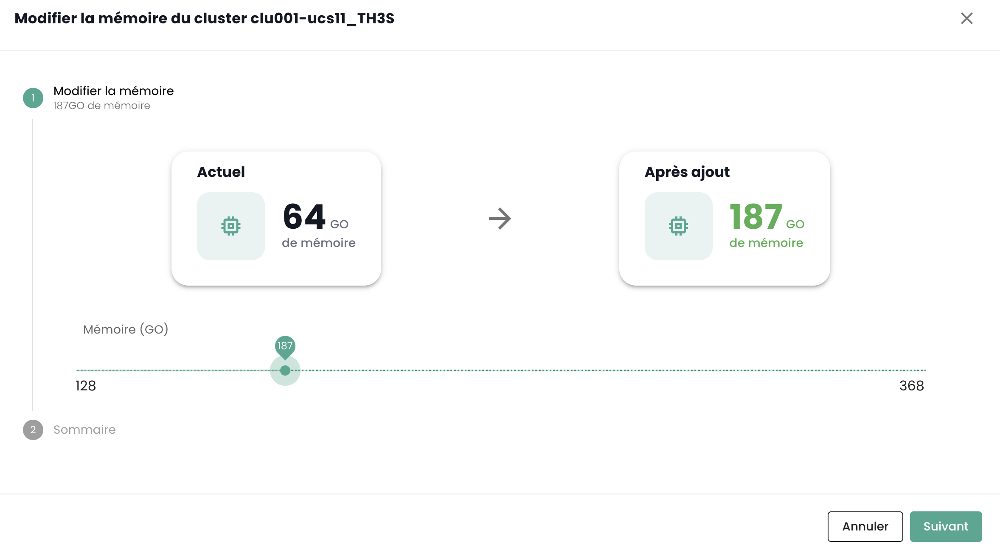
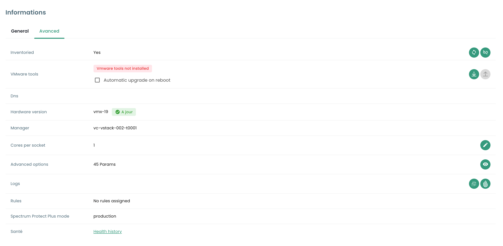
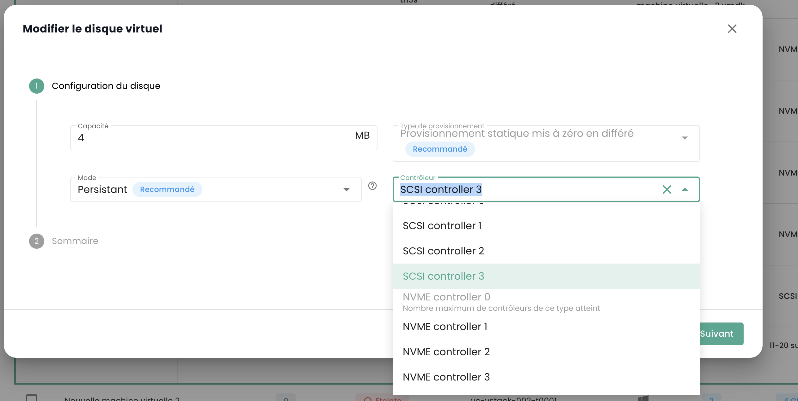
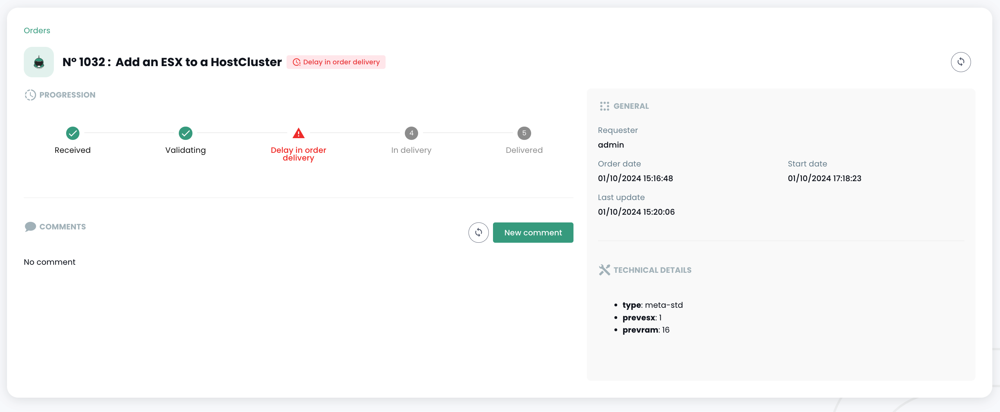
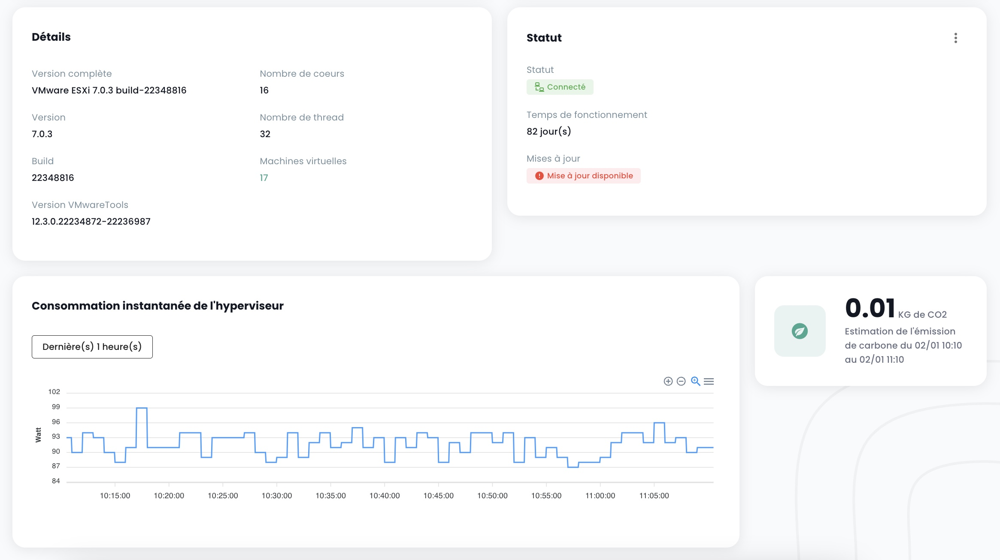

## Offerta di virtualizzazione VMware
L'offerta di virtualizzazione VMware Cloud Temple qualificata SecNumCloud si basa sulla tecnologia __VMware Vsphere__.

La piattaforma viene gestita automaticamente da Cloud Temple (mantenimento delle condizioni di sicurezza, mantenimento delle condizioni operative, ...).
Può essere controllata attraverso l'interfaccia grafica della console Shiva o tramite le API associate.

*__Nota__* : *Per motivi di sicurezza legati alla qualificazione SecNumCloud,
__non è possibile per il committente accedere direttamente alla piattaforma di virtualizzazione VMware__ (nessun accesso diretto a vCenter in particolare).
Infatti, la qualificazione SecNumCloud richiede __una totale segregazione__ tra le interfacce di controllo degli asset tecnici e l'interfaccia del committente (la console Shiva).*

I prodotti implementati sono VMware ESXi, VMware Vcenter e VMware Replication.

*__Nota__* :

- *La rete dell'offerta di virtualizzazione non utilizza la tecnologia VMware NSX, ma viene controllata materialmente dalla tecnologia Juniper e dal protocollo VPLS.*
- *La memorizzazione non utilizza la tecnologia VMWare vSan, ma solo SANs IBM in fibra channel 32G.*
- *Non viene implementata alcuna forma di ottimizzazione nascosta (compressione, deduplicazione, ...).*

### Lame di calcolo v2 per la virtualizzazione VMware

---

__QUESTA OFFERTA NON È PIÙ COMMERCIALIZZATA DAL 31 MARZO 2024__

---

Nel gennaio 2024, le lame fornite da Cloud Temple sono di tipo __CISCO UCS B200__ o __CISCO UCS X210c__. Sono interamente gestite da Cloud Temple (firmware, versione di OS, ...) tramite la console Shiva.

Esistono diverse categorie di lami di calcolo disponibili nel catalogo per supportare le vostre carichi di lavoro (Virtualizzazione, Contenimento, ...).
Queste presentano caratteristiche e prestazioni diverse per soddisfare meglio le vostre esigenze. Il catalogo delle lami di calcolo si evolve regolarmente.

Nell'ambito dell'uso con un'offerta di virtualizzazione, un cluster di hypervisor è composto esclusivamente da lame di calcolo dello stesso tipo (non è possibile mescolare lame di diversi tipi nello stesso cluster).

| Riferimento             | RAM Massima Disponibile __(1)__ | Frequenza __(2)__                     | Numero di core / thread | Connettività __(3)__ | SKU per l'offerta Vmware           |
| ----------------------- | ------------------------------  | ------------------------------------- | ----------------------- | -------------------- | ---------------------------------- |
| Lama ECO v2             | 384 GB                          | 2.20 GHz (Silver 4114 o equivalente)  | 20 / 40 thread          | 2 X 10 Gbit/s        | csp:fr1:iaas:vmware:eco:v2         |
| Lama STANDARD v2        | 384 GB                          | 2.40 GHz (Silver 4314 o equivalente)  | 32 / 64 thread          | 2 X 25 Gbit/s        | csp:fr1:iaas:vmware:standard:v2    |
| Lama ADVANCE v2         | 768 GB                          | 2.80 GHz (Gold 6342 o equivalente)    | 48 / 96 thread          | 2 X 25 Gbit/s        | csp:fr1:iaas:vmware:advance:v2     |
| Lama PERFORMANCE 1 v2   | 384 GB                          | 3.20 GHz (Xeon E-53I5Y o equivalente) | 16 / 32 thread          | 2 X 25 Gbit/s        | csp:fr1:iaas:vmware:perf1:v2       |
| Lama PERFORMANCE 2 v2   | 768 GB                          | 3.00 GHz (Gold 6354 o equivalente)    | 36 / 72 thread          | 2 X 25 Gbit/s        | csp:fr1:iaas:vmware:perf2:v2       |
| Lama PERFORMANCE 3 v2   | 1536 GB                         | 2.60 GHz (Gold 6348 o equivalente)    | 56 / 112 thread         | 2 X 25 Gbit/s        | csp:fr1:iaas:vmware:perf3:v2       |

L'unità di lavoro per estendere la memoria disponibile di una lama di calcolo è la seguente:

| Riferimento                           | Unità | SKU                         |
| ------------------------------------- | ----- | --------------------------- |
| Memoria (RAM) dedicata in più         | 1 GB  | csp:fr1:network:memory:v2   |

__Osservazioni__ :

- __(1)__ La quantità massima è quella fisicamente disponibile sulle lame. La limitazione della memoria nell'offerta 'IaaS' è una limitazione software a livello del cluster di lame di calcolo. Non è possibile modificare la quantità fisica di memoria di una lama. Le lame sono fornite con 128GB di memoria attiva. 16GB di memoria sono riservati all'hypervisor e non sono direttamente utilizzabili.
- __(2)__ La frequenza di base minima al di fuori della modalità 'turbo' del processore. Di default, i processori sono configurati per una performance massima a livello del BIOS.
- __(3)__ La connettività fisica è condivisa per l'accesso alla rete e l'accesso allo storage di blocchi, la piattaforma CISCO è convergente.

La disponibilità dell'offerta di calcolo è del 99,99%, calcolata mensilmente, inclusi gli intervalli di manutenzione. L'idoneità in caso di mancato rispetto del SLA è soggetta alla creazione di un ticket d'incidente. Dovete anche avere almeno due host per cluster e attivare la funzione __High Availability__ (HA). Questa funzione consente alla vostra architettura di riavviare automaticamente le vostre macchine virtuali sul secondo hypervisor. Nel caso in cui una zona di disponibilità contenga solo un hypervisor, il riavvio automatico non è possibile.

### Lama di calcolo v3 per la virtualizzazione VMware
__A partire da maggio 2024__, le lame fornite da Cloud Temple sono di tipo __CISCO UCS B200__ o __CISCO UCS X210c__. Sono completamente gestite da Cloud Temple (firmware, versione del sistema operativo, ...) attraverso la console Cloud Temple.

Diverse categorie di lame di calcolo sono disponibili nel catalogo per supportare il vostro carico di lavoro (Virtualizzazione, Contenitorizzazione, ...).
Queste presentano caratteristiche e prestazioni diverse per soddisfare al meglio le vostre esigenze. Il catalogo delle lame di calcolo si evolve regolarmente.

Nel caso dell'uso con un'offerta di virtualizzazione, un cluster di hypervisor è composto esclusivamente da lame di calcolo dello stesso tipo (non è possibile mixare lame di diversi tipi nello stesso cluster).

| Riferimento           | RAM  __(1)__ | Frequenza __(2)__                         | Numero di core / threads | Connettività __(3)__ | GPU **(4)**          | SKU per l'offerta Vmware         |
| --------------------- | ------------ | ----------------------------------------- | ------------------------ | -------------------- | -------------------- | ------------------------------- |
| Lama ECO v3           | 384 Go       | 2.20/3.0 GHz (Silver 4114 o equivalente) | 20 / 40 threads          | 2 X 10 Gbit/s        |                      | csp:fr1:iaas:vmware:eco:v3      |
| Lama STANDARD v3      | 384 Go       | 2.40/3.4 GHz (Silver 4314 o equivalente) | 32 / 64 threads          | 2 X 25 Gbit/s        |                      | csp:fr1:iaas:vmware:standard:v3 |
| Lama ADVANCE v3       | 768 Go       | 2.80/3.5 GHz (Gold 6342 o equivalente)   | 48 / 96 threads          | 2 X 25 Gbit/s        |                      | csp:fr1:iaas:vmware:advance:v3  |
| Lama PERFORMANCE 1 v3 | 384 Go       | 3.20/3.6 GHz (Xeon E-53I5Y o equivalente)| 16 / 32 threads         | 2 X 25 Gbit/s        |                      | csp:fr1:iaas:vmware:perf1:v3    |
| Lama PERFORMANCE 2 v3 | 768 Go       | 3.00/3.6 GHz (Gold 6354 o equivalente)   | 36 / 72 threads          | 2 X 25 Gbit/s        |                      | csp:fr1:iaas:vmware:perf2:v3    |
| Lama PERFORMANCE 3 v3 | 1536 Go      | 2.60/3.5 GHz (Gold 6348 o equivalente)   | 56 / 112 threads         | 2 X 25 Gbit/s        |                      | csp:fr1:iaas:vmware:perf3:v3    |
| Lama PERFORMANCE 4 v3 | 512 Go       | 2.50/4.1 GHz (Intel 6426Y o equivalente) | 32 / 64 threads          | 2 X 25 Gbit/s        | 2 x NVIDIA L40S 48go | csp:fr1:iaas:vmware:perf4:v3    |

__Osservazioni__:

- __(1)__ La quantità di memoria fornita è quella fisicamente disponibile sulle lame. Non è possibile cambiare la quantità fisica di memoria di una lama.

- __(2)__ La frequenza di base minima / frequenza turbo, espresse in Ghz. Per impostazione predefinita, i processori sono configurati per una prestazione massima a livello del BIOS.

- __(3)__ La connettività fisica è condivisa per l'accesso alla rete e l'accesso allo storage block, la piattaforma CISCO è convergente.

- __(4)__ L'offerta GPU effettivamente disponibile cambia continuamente. Al 1° Maggio 2024, l'offerta è basata sulle GPU NVIDIA LOVELACE L40S. Per impostazione predefinita, la lama PERF4 è fornita con 2 schede L40S da 48 GB di ram. Contatta il supporto per ulteriori dettagli se necessario.

La disponibilità dell'offerta di calcolo è del 99,99%, calcolata mensilmente, compreso il periodo di manutenzione. L'ammissibilità in caso di mancato rispetto del SLA è subordinata
alla creazione di un ticket di incidente. È inoltre necessario disporre di almeno due host per cluster e attivare la funzione di __High Availability__ (HA).
Questa funzione permette alla vostra architettura di riavviare automaticamente le vostre macchine virtuali sul secondo hypervisor.
Nel caso in cui una zona di disponibilità contenga solo un hypervisor, il riavvio automatico non è possibile.


### Definizione di un cluster di lame di calcolo ('Cpool')
Il __'Cpool'__ è un raggruppamento di ipervisori VMware ESXi, noto anche come *'cluster ESX'*.

Gli host presenti in un __'Cpool'__ appartengono tutti __allo stesso tenant e alla stessa zona di disponibilità__ (AZ). Devono necessariamente avere la stessa classe:
__non è possibile mescolare modelli diversi di lama di calcolo all'interno dello stesso cluster__.

Tutte le lame di calcolo vengono fornite con la massima quantità fisica di memoria, un limite di utilizzo della RAM viene applicato a livello software a livello di cluster per garantire che corrisponda alla RAM fatturata.

Di default, ogni lama ha 128 GB di memoria attivata all'interno del __'Cpool'__.

Un __'Cpool'__ può contenere al massimo 32 ipervisori. Oltre questo limite, sarà necessario creare un secondo cluster.

L'archiviazione può essere condivisa tra i __'Cpool'__.

### Assegnazione Memoria per un 'Cpool'
La prenotazione della RAM è configurabile per cluster. Potete diminuire o aumentare la quantità della RAM in modo che corrisponda alle vostre esigenze su scala del cluster.

Per fare ciò, andate nel menu __'Iaas'__ > __'Computazione'__ Scegliete il cluster target:


Scegliete poi __'Modifica la memoria'__:



Potete quindi variare l'assegnazione della memoria fisica per il vostro 'Cpool'.

__Fate attenzione a non superare una media del 85% del consumo di memoria per lama di calcolo__.
Infatti, la tecnologia VMware utilizzerà un metodo di ottimizzazione di tipo compressione che può impattare fortemente le prestazioni delle vostre cariche di lavoro e complicare la diagnosi.
Allo stesso modo, una pressione di memoria troppo forte sulle vostre lame di calcolo costringerà l'ipervisore a scaricare una parte della sua memoria sul disco per rispondere alle esigenze delle macchine virtuali.

Questo caso, chiamato __'Ballooning'__, impatta molto fortemente l'insieme delle prestazioni delle macchine virtuali situate sullo storage (datastore) interessato.
__La diagnosi è complicata in questo contesto__, perché la vostra metrologia riscontrerà impatti al livello CPU e non della memoria o dello storage.
Ricordatevi anche che la prima cosa che fa l'ipervisore all'avvio di una macchina virtuale è creare __un file di swap di memoria__ (.vswap) sul
disco, della dimensione della memoria della macchina virtuale interessata. Dovete __tenerne conto nella dimensione del vostro storage__.

Ogni lama di calcolo viene fornita con 128GB di memoria attivata a livello software nel __'Cpool'__ ma ha fisicamente la totale memoria allocabile.

Per esempio, per un cluster di tre host di tipo ```vmware:standard:v2```, la prenotazione della RAM all'attivazione del __'Cpool'_ sarà 3 x 128GB = 384 GB di RAM.
Potrete estenderla al massimo a 3 x 384GB = 1152GB di memoria. 

    Memoria minima di un 'Cpool' = numero di host X 128GB di memoria
    Memoria massima di un 'Cpool' = numero di host X la quantità di memoria fisica della lama di calcolo


### Gestione delle Macchine virtuali
L'interfaccia di gestione delle vostre macchine virtuali è disponibile nella console Shiva nel menu __'IaaS'__ situato nella barra verde a sinistra dello schermo.

#### Elenco delle macchine virtuali
Nella sezione __'Macchine virtuali'__, hai accesso all'elenco delle tue macchine virtuali ospitate sul tuo Cloud di fiducia.


Hai accesso alle seguenti informazioni, per ciascuna macchina virtuale:

- il suo nome,
- i tag che le sono assegnati,
- il suo stato (spento, acceso, in trattamento, host disconnesso o non valido),
- il suo manager (nell'ambiente VMware, il Vcenter associato),
- il suo sistema operativo,
- La quantità di CPU virtuali (vCPU),
- La quantità di memoria virtuale (vRAM).

#### Azioni sulle macchine virtuali
Le seguenti azioni sono possibili da questa interfaccia : 

- Aggiornare l'elenco delle macchine virtuali;
- Esporta l'elenco in formato CSV;
- Filtrare l'elenco;
- Cerca una macchina virtuale per nome;
- Creare una nuova macchina virtuale.


__Una barra di avviso può essere presente nella parte superiore dell'elenco__: indica che sono stati attivati allarmi critici su una o più delle vostre macchine virtuali.
Il pulsante __'Vedi'__ permette di consultare le macchine virtuali che sono interessate da questa notifica.


Quando clicchi sulla freccia verde a discesa sulla destra dell'elenco per una macchina virtuale:


Hai accesso a tutte le informazioni su di essa:


Una barra rapida permette di eseguire le seguenti azioni :


- Accendere la macchina virtuale;
- Spegnere;
- Riavviarla;
- Modificare le opzioni di alimentazione del sistema operativo ospite;
- Apri la console;
- Monta un'ISO;
- Smonta un'ISO;
- Clona la macchina virtuale;
- Spostarla (vMotion);
- Rinominarla;
- Eliminarla.

Una vista rapida offre una visualizzazione del __storage__, della __CPU__ e della __RAM__ della macchina virtuale.


Nella scheda __'Informazioni generali'__, trovi informazioni dettagliate relative alla tua macchina virtuale, come il suo sistema operativo, la sua posizione fisica (datacenter, datastore, ecc.), la RAM, la CPU, gli indirizzi IP, i log, ecc.


Da questa vista, puoi eseguire le seguenti azioni :

- Modificare il sistema operativo (la macchina virtuale deve essere spenta),
- Aggiornare la versione dell'hardware (la macchina virtuale deve essere spenta),
- Modificare la RAM o la CPU.

Una scheda __'Avanzate'__ permette di consultare informazioni più specifiche come le informazioni "VMware tools", la versione dell'hardware, il manager, ecc...



#### Modifica del controller disco di una macchina virtuale

È possibile modificare il tipo di controller del disco per la vostra macchina virtuale. I tipi supportati sono **SCSI** e **NVME**. È possibile aggiungere i controller con un massimo di 4 controller di ciascun tipo.




#### Console di una macchina virtuale
La console di una macchina virtuale è accessibile dall'elenco delle macchine virtuali facendo clic sull'icona __'Console'__ :


Si apre una nuova scheda del tuo browser e viene visualizzata la console della tua macchina, basata su un client VNC :


È possibile nel menu VNC :

- chiedere l'invio di un tasto particolare,
- effettuare copia/incolla dalla clipboard del tuo sistema operativo,
- passare alla modalità a schermo intero,
- modificare la dimensione della finestra (scaling).

La gestione della tastiera, con la console delle macchine virtuali, funziona perfettamente in un ambiente completamente *inglese*.

L'input effettuato nella console dipende dalla lingua della tastiera della vostra macchina fisica, dalla lingua della tastiera
della macchina virtuale e dall'attivazione o meno dell'opzione 'enforce keyboard' a sinistra dello schermo.
Ecco un riassunto delle possibili situazioni con la lingua francese :

| Lingua della tastiera della macchina fisica (input) | Lingua della tastiera della macchina virtuale | Opzione 'enforce keyboard' selezionata | Risultato (output)                                   |
| --------------------------------------------------- | --------------------------------------------- | -------------------------------------- | --------------------------------------------------- |
| Francese                                            | Francese                                      | No                                     | Sconsigliato (problema con i caratteri speciali)     |
| Francese                                            | Francese                                      | Si                                     | '<' e '>' non funzionano                             |
| Francese                                            | Inglese                                       | No                                     | Sconsigliato (problema con i caratteri speciali)     |
| Francese                                            | Inglese                                       | Si                                     | Inglese                                              |
| Inglese                                             | Francese                                      | No                                     | '<' e '>' non funzionano                             |
| Inglese                                             | Francese                                      | Si                                     | '<' e '>' non funzionano                             |
| Inglese                                             | Inglese                                       | No                                     | Inglese                                              |
| Inglese                                             | Inglese                                       | Si                                     | Inglese                                              |

__Nota__ :

- Se la combinazione __'AltGr'__ e __'@'__ sulla tastiera non funziona, attiva il pulsante __'enforce key'__ nel menu __'VNC'__ della console e riprova.
- Se ancora non funziona e il sistema operativo della macchina fisica è __Windows, imposta la tastiera della macchina fisica in inglese
e prova a inserire il @ nel modo classico__ *(uscita azerty : AltGr + tasto 0 o uscita qwerty : tasto 2)*.

#### Cataloghi di macchine virtuali Cloud Temple
Cloud Temple mette a vostra disposizione un catalogo di `Templates` regolarmente arricchito e aggiornato dai nostri team.
Allo stato attuale comprende diverse decine di `Templates` e immagini da montare sulle vostre macchine virtuali.


#### Configurazione avanzata delle macchine virtuali : Extra Config
Le Extra Config forniscono un modo flessibile per includere coppie chiave=valore nella configurazione di una macchina virtuale. Le chiavi e i valori vengono interpretati dal sistema quando la macchina virtuale viene implementata.

Ora puoi modificare le proprietà di tipo **Extra Config** nelle opzioni avanzate di una macchina virtuale :

{:height="50%" width="50%"}

È possibile aggiungere una proprietà da un elenco di chiavi. Inoltre, è possibile modificare il valore di una chiave che hai aggiunto tu stesso. Le coppie chiave=valore esistenti non possono essere modificate.

Si prega di contattare il supporto per qualsiasi richiesta di aggiunta di nuove chiavi.

{:height="50%" width="50%"}

**Nota** : *Per l'uso del GPU dalla macchina virtuale, è obbligatorio attivare la chiave 'pciPassthru.use64bitMMIO' e allocare la quantità di spazio MMIO (Memory-mapped I/O) necessario tramite 'pciPassthru.64bitMMIOSizeGB'. Si consiglia vivamente di fare riferimento alla [documentazione ufficiale Nvidia](https://docs.nvidia.com/vgpu/17.0/grid-vgpu-release-notes-vmware-vsphere/index.html#tesla-p40-large-memory-vms).*

#### Configurazione avanzata delle macchine virtuali : vAPP
Potete anche modificare le proprietà di tipo **vAPP** nelle opzioni avanzate di una macchina virtuale:

{:height="50%" width="50%"}

Potete aggiungere una proprietà, modificarla o eliminarla. Quattro tipi di proprietà sono proposti, Stringa, Numero, Booleano, Password:

{:height="50%" width="50%"}

**Nota** : *La macchina virtuale deve essere fermata per modificare le sue proprietà vAPP.*

### Guida degli __'hypervisor'__ e dei __'Cpool'__ (cluster di hypervisor)
La gestione dei vostri hypervisor si svolge nel sottomenu __'Calcolo'__ del menu __'IaaS'__, situato nella barra verde a sinistra dello schermo.


In questo sottomenu, hai una visione di :

- La stack software di hypervisor, la loro AZ e le loro risorse,
- Lo stack software di backup.

Nel gennaio 2024, l'offerta di hypervisor disponibile sull'infrastruttura qualificata Cloud Temple è basata su VMware. Il software di backup utilizzato è IBM Spectrum Protect Plus.

#### Gestione dei cluster VMware
Per accedere alla gestione dei cluster VMware, fare clic sul sottomenu __'Calcolo'__ del menu __'IaaS'__:

Per impostazione predefinita, la prima scheda elenca tutti gli hypervisor (tutti i cluster combinati):


È possibile visualizzare i dettagli di un hypervisor cliccando sul suo nome:


Esiste una scheda per cluster di hypervisor per visualizzare i dettagli di ciascuno:


Se fai clic su un cluster, vedrai il riassunto della sua composizione:

- Il totale del potere di calcolo espresso in GHz,
- Il totale della memoria disponibile e il rapporto utilizzato,
- Il totale dello spazio di archiviazione (tutti i tipi combinati) e la quota utilizzata,
- I meccanismi di automazione in caso di indisponibilità di una lama di calcolo (__'Vsphere DRS'__),
- Il numero di macchine virtuali,
- Il numero di hypervisor.

Consultando la pagina di un cluster, sono disponibili diverse schede. La scheda __'Regole'__ ti permette di definire le [regole di affinità / anti-affinità](compute.md#gestione-dellaffinità-delle-vostre-macchine-virtuali)


Vedrai apparire per ogni hypervisor nella scheda __'Hosts'__:

- L'uso di __CPU__ e __Memoria__,
- Il numero di macchine virtuali assegnate,
- La disponibilità di una nuova build per il sistema operativo dell'hypervisor se necessario,
- Lo stato dell'hypervisor (collegato in produzione, in manutenzione, spento, ...),
- Un menu azione.


Sono possibili diverse azioni dalla scheda __'Hosts'__:

- ordinare nuovi hypervisor tramite il pulsante __'Aggiungi un host'__:



- possibilità di consultare __i dettagli di un hypervisor__:



- per entrare o uscire dallo __stato di manutenzione__ un hypervisor,
- per __aggiornare__ se necessario questo hypervisor; per farlo, __deve essere assolutamente in manutenzione__. Esistono due tipi di aggiornamenti:

1. Le build VMware (le nuove versioni dell'hypervisor):

{:height="50%" width="50%"}

2. L'aggiornamento del firmware della tua lama di calcolo (bios e firmware schede figlie):

{:height="50%" width="50%"}

*__Nota__* :

- *Cloud Temple mette a disposizione le build per gli hypervisor a intervalli regolari. 
È importante aggiornare regolarmente i vostri hypervisor, in particolare per l'applicazione delle patch di sicurezza. 
Tuttavia, __non aggiorniamo noi stessi i vostri hypervisor__. Cloud Temple non ha visibilità sugli impegni di disponibilità dei vostri carichi di lavoro. 
Vi lasciamo quindi implementare la vostra gestione del cambiamento e applicare al momento più opportuno le nuove build.*
- *Il processo di aggiornamento è completamente automatizzato. Devi avere almeno due hypervisor nel tuo cluster per permettere un aggiornamento senza interruzione del servizio.*
- *È necessario avere [i permessi adeguati](../console/permissions.md) per effettuare le diverse azioni.*

Vedi anche l'insieme delle regole di affinità/anti-affinità per il tuo cluster di hypervisor nella sezione __'Regole'__.

#### Gestione dell'affinità delle tue macchine virtuali

Le __regole di affinità e anti-affinità__ consentono di controllare il posizionamento delle macchine virtuali sui vostri hypervisor.
Possono essere utilizzate per gestire l'uso delle risorse del vostro __'Cpool'__. 
Ad esempio, possono aiutare a bilanciare il carico di lavoro tra i server o a isolare i carichi di lavoro ad alto consumo di risorse.
In un __'Cpool'__ VMware, queste regole sono spesso utilizzate per gestire il comportamento delle macchine virtuali con vMotion.
vMotion permette di spostare le macchine virtuali da un host all'altro senza interruzioni di servizio.

È possibile configurare le regole di gestione in questo modo:

- __Regole di Affinità__: Queste regole assicurano che alcune macchine virtuali vengano eseguite sullo stesso host fisico.
Vengono utilizzate per migliorare le prestazioni mantenendo le macchine virtuali che comunicano frequentemente
insieme sullo stesso server per ridurre la latenza della rete. Le regole di affinità sono utili in scenari
dove le prestazioni sono critiche, come nel caso di database o applicazioni che richiedono una comunicazione veloce tra i server.

- __Regole di Anti-affinità__: Al contrario, queste regole garantiscono che alcune macchine virtuali non vengano eseguite
sullo stesso host fisico. Sono importanti per la disponibilità e la resilienza, per esempio,
per evitare che macchine critiche siano tutte influenzate in caso di malfunzionamento di un singolo server.
Le regole di anti-affinità sono cruciali per le applicazioni che richiedono un'alta disponibilità, 
come negli ambienti di produzione dove la tolleranza ai guasti è una priorità.
Ad esempio, non vorreste che i vostri due Active Directory fossero sullo stesso hypervisor.

Quando si crea una regola, si definisce il tipo di regola (affinità / anti-affinità), il nome della regola,
il suo stato di attivazione (__'Status'__) e le macchine coinvolte nel vostro cluster di hypervisor.

{:height="80%" width="80%"}

*Nota: le regole di affinità/anti-affinità proposte nella console sono regole che riguardano le macchine virtuali tra di loro (non ci sono regole tra hypervisor e macchine virtuali).*

### Controllo degli hypervisor 'StandAlone'
#### Generalità
Cloud Temple offre la possibilità di fornire __hypervisor autonomi__ con la tecnologia VMware.
Questi hypervisor sono controllati direttamente dalla console Shiva, __senza interconnessione con una piattaforma di gestione VMware VCenter__.

L'hypervisor è __completamente autonomo__ e i suoi LUN di storage sono connessi e non condivisi con altri sistemi.
Non c'è possibilità di vMotion e le reti tecniche associate non sono configurate per essere conformi in caso di audit.

L'obiettivo di questo servizio è esclusivamente di facilitare la gestione del rispetto delle licenze, in particolare con i produttori __Oracle__ e __Microsoft__.

*__Nota__* :

- *L'ordine di un hypervisor standalone richiede di fare una richiesta di servizio al team di supporto,*
- *Non è possibile cambiare il tipo di processore,*
- *Tuttavia, è possibile disabilitare un processore a livello di firmware UCS. __Attenzione, tuttavia, non tutte le licenze del produttore sono compatibili con questa azione__,*
- *Tutti i livelli di performance di storage sono disponibili sugli hypervisor standalone. Specificare durante la richiesta di supporto il tipo di storage desiderato,*
- *La __replicazione dello storage non è disponibile__ sugli hypervisor standalone,*
- *La __replicazione delle macchine virtuali non è disponibile__ sugli hypervisor standalone,*
- *L'offerta di backup non è disponibile sugli hypervisor standalone: dovete __prevedere un meccanismo di backup applicativo.__*
- L'aggiornamento dell'hypervisor avviene dalla console Cloud Temple. __Attenzione: senza ridondanza applicativa, dovete anticipare l'arresto delle vostre macchine virtuali.__

## Domande più frequenti
- [Domande più frequenti sulle macchine virtuali](../faq/iaas/virtual_machine/virtual_machine.md)
- [Domande più frequenti sulla salvaguardia delle macchine virtuali](../faq/iaas/backup/backup.md)