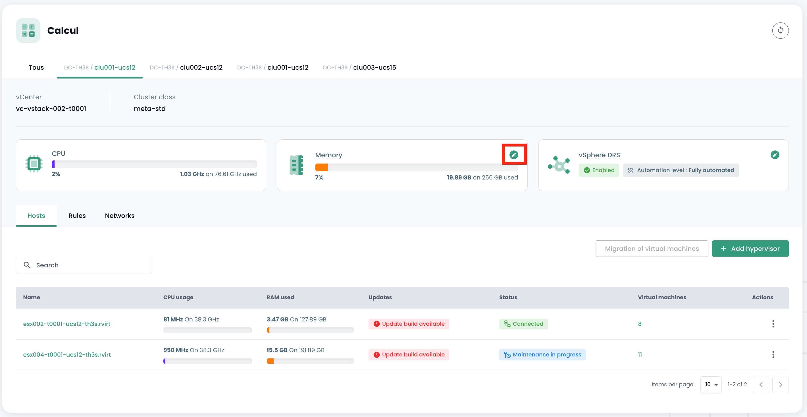
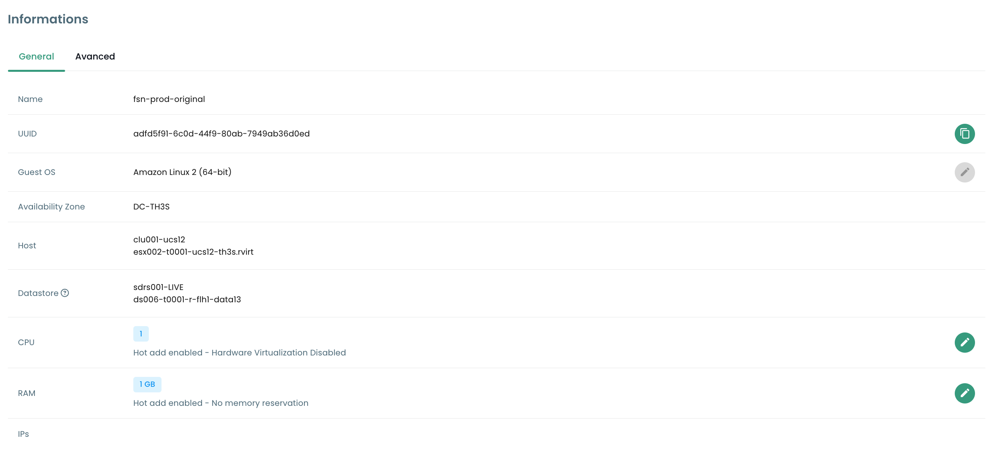
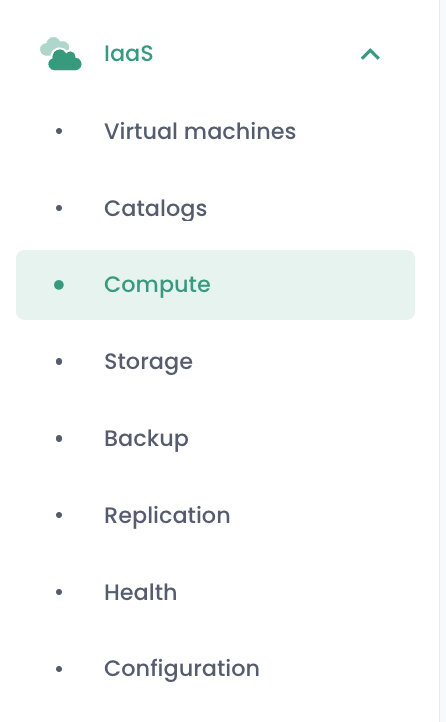

## Offre de virtualisation VMware

L'offre de virtualisation VMware Cloud Temple qualifiée SecNumCloud est basée sur la technologie __VMware Vsphere__.

La plateforme est managées par Cloud Temple de façon automatique (maintien de condition de sécurité, maintien en condition opérationnelle, ...).
Elle est pilotable via l'interface graphique de la console Shiva ou via les APIs associées.

*__Remarque__* : *Pour des raisons de sécurité liées à la qualification SecNumCloud,
__il n'est pas possible pour le commanditaire d'accéder directement à la plateforme de virtualisation VMware__ (aucun accès direct au vCenter notamment).
En effet, la qualification SecNumCloud impose __une totale ségrégation__ entre les interfaces de pilotage des actifs techniques et l'interface du commanditaire (la console Shiva).*

Les produits misent en oeuvre sont VMware ESXi, VMware Vcenter et VMware Replication.

*__Remarque__* :

- *Le réseau de l'offre de virtualisation n'utilise pas la technologie VMware NSX, mais est piloté matériellement par la technologie Juniper et le protocole VPLS.*
- *Le stockage n'utilise pas la technologie VMWare vSan, mais uniquement des SANs IBM en fiber channel 32G.*
- *Aucune forme d'optimisation cachée n'est mise en œuvre (compression, deduplication, ...).*

### Lames de calcul v2 pour la virtualisation VMware

---

__CETTE OFFRE N'EST PLUS COMMERCIALISÉE DEPUIS LE 31 MARS 2024__

---


En janvier 2024, les lames fournies par Cloud Temple sont de type __CISCO UCS B200__ ou des __CISCO UCS X210c__ . Elles sont entièrement managées par Cloud Temple (firmware, version d'os, ...) au travers de la console Shiva.

Plusieurs catégories de lames de calcul sont disponibles au catalogue pour supporter vos charges de travail (Virtualisation, Conteneurisation, ...).
Celles-ci présentent des caractéristiques et performances différentes pour répondre au mieux à vos besoins. Le catalogue des lames de calcul évolue régulièrement.

Dans le cadre de l'usage avec une offre de virtualisation, un cluster d'hyperviseurs est uniquement composé de lame de calcul du même type (il n'est pas possible de mixer les lames de différents types dans un meme cluster).

| Référence             | RAM Maximum Disponible __(1)__ | Fréquence __(2)__                     | Nombre de coeurs / threads | Connectivité __(3)__ | SKU pour l'offre Vmware         |
| --------------------- | ------------------------------ | ------------------------------------- | -------------------------- | -------------------- | ------------------------------- |
| Lame ECO v2           | 384 Go                         | 2.20 GHz (Silver 4114 ou équivalent)  | 20 / 40 threads            | 2 X 10 Gbit/s        | csp:fr1:iaas:vmware:eco:v2      |
| Lame STANDARD v2      | 384 Go                         | 2.40 GHz (Silver 4314 ou équivalent)  | 32 / 64 threads            | 2 X 25 Gbit/s        | csp:fr1:iaas:vmware:standard:v2 |
| Lame ADVANCE v2       | 768 Go                         | 2.80 GHz (Gold 6342 ou équivalent)    | 48 / 96 threads            | 2 X 25 Gbit/s        | csp:fr1:iaas:vmware:advance:v2  |
| Lame PERFORMANCE 1 v2 | 384 Go                         | 3.20 GHz (Xeon E-53I5Y ou équivalent) | 16 / 32 threads            | 2 X 25 Gbit/s        | csp:fr1:iaas:vmware:perf1:v2    |
| Lame PERFORMANCE 2 v2 | 768 Go                         | 3.00 GHz (Gold 6354 ou équivalent)    | 36 / 72 threads            | 2 X 25 Gbit/s        | csp:fr1:iaas:vmware:perf2:v2    |
| Lame PERFORMANCE 3 v2 | 1536 Go                        | 2.60 GHz (Gold 6348 ou équivalent)    | 56 / 112 threads           | 2 X 25 Gbit/s        | csp:fr1:iaas:vmware:perf3:v2    |

L'unité d'œuvre pour étendre la mémoire disponible d'une lame de calcul est la suivante :

| Référence                           | Unité | SKU                       |
| ----------------------------------- | ----- | ------------------------- |
| Mémoire (RAM) dédiée complémentaire | 1 Go  | csp:fr1:network:memory:v2 |

__Remarques__ :

- __(1)__ La quantité maximale est celle physiquement disponible sur les lames.
La limitation de la mémoire dans l'offre 'IaaS' est une limitation logicielle au niveau du cluster de lame de calcul.
Il n'est pas possible de changer la quantité physique de mémoire d'une lame. Les lames sont livrées avec 128Go de mémoire activée. 16Go de mémoire sont réservés à l'hyperviseur et ne sont pas directement utilisables.
- __(2)__ La fréquence de base minimum hors mode 'turbo' du processeur. Par défaut, les processeurs sont configurés pour une performance maximale au niveau du BIOS.
- __(3)__ La connectivité physique est mutualisée pour l'accès réseau et l'accès storage bloc, la plateforme CISCO étant convergée.

La disponibilité de l'offre de calcul est de 99.99%, calculée mensuellement, plage de maintenance incluse. L'éligibilité en cas de non-respect du SLA est soumise à
la création d'un ticket incident. Vous devez également posséder au moins deux hôtes par cluster et activer la fonctionnalité __High Availability__ (HA).
Cette fonctionnalité permet à votre architecture de redémarrer automatiquement vos machines virtuelles sur le deuxième hyperviseur.
Dans l'hypothèse où une zone de disponibilité ne contient qu'un seul hyperviseur, le redémarrage automatique n'est pas possible.

### Lames de calcul v3 pour la virtualisation VMware

__A partir de mai 2024__, les lames fournies par Cloud Temple sont de type __CISCO UCS B200__ ou des __CISCO UCS X210c__ . Elles sont entièrement managées par Cloud Temple (firmware, version d'os, ...) au travers de la console Cloud Temple.

Plusieurs catégories de lames de calcul sont disponibles au catalogue pour supporter vos charges de travail (Virtualisation, Conteneurisation, ...).
Celles-ci présentent des caractéristiques et performances différentes pour répondre au mieux à vos besoins. Le catalogue des lames de calcul évolue régulièrement.

Dans le cadre de l'usage avec une offre de virtualisation, un cluster d'hyperviseurs est uniquement composé de lame de calcul du même type (il n'est pas possible de mixer les lames de différents types dans un meme cluster).

| Référence             | RAM  __(1)__ | Fréquence __(2)__                         | Nombre de coeurs / threads | Connectivité __(3)__ | GPU **(4)**          | SKU pour l'offre Vmware         |
| --------------------- | ------------ | ----------------------------------------- | -------------------------- | -------------------- | -------------------- | ------------------------------- |
| Lame ECO v3           | 384 Go       | 2.20/3.0 GHz (Silver 4114 ou équivalent)  | 20 / 40 threads            | 2 X 10 Gbit/s        |                      | csp:fr1:iaas:vmware:eco:v3      |
| Lame STANDARD v3      | 384 Go       | 2.40/3.4 GHz (Silver 4314 ou équivalent)  | 32 / 64 threads            | 2 X 25 Gbit/s        |                      | csp:fr1:iaas:vmware:standard:v3 |
| Lame ADVANCE v3       | 768 Go       | 2.80/3.5 GHz (Gold 6342 ou équivalent)    | 48 / 96 threads            | 2 X 25 Gbit/s        |                      | csp:fr1:iaas:vmware:advance:v3  |
| Lame PERFORMANCE 1 v3 | 384 Go       | 3.20/3.6 GHz (Xeon E-53I5Y ou équivalent) | 16 / 32 threads            | 2 X 25 Gbit/s        |                      | csp:fr1:iaas:vmware:perf1:v3    |
| Lame PERFORMANCE 2 v3 | 768 Go       | 3.00/3.6 GHz (Gold 6354 ou équivalent)    | 36 / 72 threads            | 2 X 25 Gbit/s        |                      | csp:fr1:iaas:vmware:perf2:v3    |
| Lame PERFORMANCE 3 v3 | 1536 Go      | 2.60/3.5 GHz (Gold 6348 ou équivalent)    | 56 / 112 threads           | 2 X 25 Gbit/s        |                      | csp:fr1:iaas:vmware:perf3:v3    |
| Lame PERFORMANCE 4 v3 | 512 Go       | 2.50/4.1 GHz (Intel 6426Y ou equivalent)  | 32 / 64 threads            | 2 X 25 Gbit/s        | 2 x NVIDIA L40S 48go | csp:fr1:iaas:vmware:perf4:v3    |

__Remarques__ :

- __(1)__ La quantité de mémoire livrée est celle physiquement disponible sur les lames. Il n'est pas possible de changer la quantité physique de mémoire d'une lame.

- __(2)__ La fréquence de base minimum / fréquence turbo, exprimée en Ghz. Par défaut, les processeurs sont configurés pour une performance maximale au niveau du BIOS.

- __(3)__ La connectivité physique est mutualisée pour l'accès réseau et l'accès storage bloc, la plateforme CISCO étant convergée.

- __(4)__ L'offre de GPU disponible réellement évolue en permanence. Au 1° Mai 2024, l'offre est basée sur les GPU NVIDIA LOVELACE L40S. Par défaut, la lame PERF4 est livrée avec 2 cartes L40S de 48 Go de ram. Contactez le support pour plus de précision si nécessaire.

La disponibilité de l'offre de calcul est de 99.99%, calculée mensuellement, plage de maintenance incluse. L'éligibilité en cas de non-respect du SLA est soumise à
la création d'un ticket incident. Vous devez également posséder au moins deux hôtes par cluster et activer la fonctionnalité __High Availability__ (HA).
Cette fonctionnalité permet à votre architecture de redémarrer automatiquement vos machines virtuelles sur le deuxième hyperviseur.
Dans l'hypothèse où une zone de disponibilité ne contient qu'un seul hyperviseur, le redémarrage automatique n'est pas possible.


### Définition d'un cluster de lame de calcul ('Cpool')

Le __'Cpool'__ est un regroupement d'hyperviseur VMware ESXi, également connu sous le nom de *'cluster ESX'*.

Les hôtes présents dans un __'Cpool'__ appartiennent tous __au même tenant et à la même zone de disponibilité__ (AZ). Ils doivent nécessairement avoir la même classe :
__il n'est pas possible de mixer des modèles différents de lame de calcul au sein d'un même cluster__.

Toutes les lames de calcul étant livrées avec le maximum physique de mémoire, une limitation d'utilisation de la RAM est appliquée logiciellement au niveau du cluster pour s'assurer qu'elle correspond à la RAM facturée.

Par défaut, chaque lame dispose de 128 Go de mémoire activée au sein du __'Cpool'__.

Un __'Cpool'__ peut contenir au maximum 32 hyperviseurs. Au-delà de cette limite, il sera nécessaire de créer un deuxième cluster.

Le stockage peut être partagé entre les __'Cpool'__.

### Allocation Mémoire pour un 'Cpool'

La réservation de la RAM est configurable par cluster. Vous pouvez réduire ou augmenter la quantité de la RAM pour qu'elle corresponde à vos besoins à l'échelle du cluster.

Pour ce faire, aller dans le menu __'Iaas'__ > __'Calcul'__ Choisissez alors le cluster cible :



Choisissez ensuite __'Modifier la mémoire'__ :


Vous pouvez alors faire varier l'allocation de mémoire physique pour votre 'Cpool'.

__Attention à ne pas dépasser une moyenne de 85 % de consommation mémoire par lame de calcul__.
En effet, la technologie VMware utilisera une méthode d'optimisation de type compression qui peut impacter fortement les performances de vos charges de travail et complexifier le diagnostic.
De même, une trop forte pression mémoire sur vos lames de calcul forcera l'hyperviseur à décharger une partie de sa mémoire sur disque pour répondre aux besoins des machines virtuelles.

Ce cas, appelé __'Ballooning'__ impacte très fortement l'ensemble des performances des machines virtuelles situées sur le stockage (datastore) concerné.
__Le diagnostic est compliqué dans ce contexte__, car votre métrologie constatera des impacts au niveau CPU et non de la mémoire ou du stockage.
Gardez aussi à l'esprit que la première chose que fait l'hyperviseur au démarrage d'une machine virtuelle est de créer __un fichier de swap mémoire__ (.vswap) sur
le disque, de la taille de la mémoire de la machine virtuelle concernée. Il vous faut __en tenir compte sur le dimensionnement de votre stockage__.

Chaque lame de calcul est livré avec 128Go de mémoire activée logiciellement au niveau du __'Cpool'__ mais dispose physiquement de la totalité de la mémoire allouable.

Par exemple, pour un cluster de trois hosts de type ```vmware:standard:v2```, la réservation de la RAM à l'activation du __'Cpool'_ sera de 3 x 128Go = 384 Go de RAM.
Vous pourrez l'étendre au maximum à 3 x 384Go = 1152Go de mémoire.

    Minimum de mémoire d'un 'Cpool' = nombre de host X 128Go de mémoire
    Maximum de mémoire d'un 'Cpool' = nombre de host X la quantitée de mémoire physique de la lame de calcul


### Pilotage des Machines virtuelles

L’interface de gestion de vos machines virtuelles est disponible dans la console Shiva dans le menu __'IaaS'__ situé sur le bandeau vert à gauche de l'écran.

#### Liste des machines virtuelles

Dans la section __'Machines virtuelles'__, vous avez accès à la liste de vos machines virtuelles hébergées sur votre Cloud de confiance.


Vous avez accès aux informations suivantes, pour chaque machine virtuelle :

- son nom,
- les tags qui lui sont assignés,
- son statut (éteinte, allumée, en traitement, host déconnecté ou invalid),
- son manager (en environnement VMware, le Vcenter associé),
- son système d’exploitation,
- La quantité de CPU virtuels (vCPU),
- La quantité de mémoire virtuelle (vRAM).

#### Actions sur les machines virtuelles

Les actions suivantes sont possibles à partir de cette interface :

- Rafraîchir la liste des machines virtuelles ;
- Exporter la liste dans le format CSV ;
- Filtrer la liste ;
- Rechercher une machine virtuelle par son nom ;
- Créer une nouvelle machine virtuelle.


__Un bandeau d'alertes peut être présent en haut de la liste__ : il indique que des alarmes critiques ont été déclenchées sur une ou plusieurs de vos machines virtuelles.
Le bouton __'Voir'__ permet de consulter les machines virtuelles qui sont concernées par cette notification.


Lorsque vous cliquez sur la flèche déroulante verte sur la droite de la liste pour une machine virtuelle :


Vous accédez à toutes les informations concernant celle-ci :


Un bandeau rapide permet de réaliser les actions suivantes :


- Allumer la machine virtuelle ;
- L'éteindre ;
- La redémarrer ;
- Modifier les options d'alimentation du SE invité ;
- Ouvrir la console ;
- Monter un ISO ;
- Démonter un ISO ;
- Cloner la machine virtuelle ;
- La déplacer (vMotion) ;
- La renommer ;
- La supprimer.

Une vue rapide offre une visualisation du __stockage__, du __CPU__ et de la __RAM__ de la machine virtuelle.


Dans l'onglet __'Informations générales'__, vous trouvez des informations détaillées relatives à votre machine virtuelle, telles que son OS, son emplacement physique (datacenter, datastore, etc.), la RAM, le CPU, les adresses IP, les logs, et autres.



Depuis cette vue, vous pouvez effectuer les actions suivantes :

- Modifier le système d'exploitation (la machine virtuelle devant être éteinte),
- Mettre à jour la version du matériel (la machine virtuelle devant être éteinte),
- Modifier la RAM ou le CPU.

Un onglet __'Avancé'__ permet de consulter des informations plus spécifiques comme les infos "VMware tools", la version hardware, le manager, etc...


#### Modification du contrôleur disque d'une machine virtuelle

Vous pouvez modifier le type de contrôleur de disque pour votre machine virtuelle. Les types supportés sont **SCSI** et **NVME**. Vous pouvez ajouter des contrôleurs avec un maximum de 4 contrôleurs de chaque type.


#### Console d'une machine virtuelle

La console d'une machine virtuelle est accessible depuis la liste des machines virtuelles en cliquant sur l'icône __'Console'__ :


Un nouvel onglet de votre navigateur s'ouvre et s'affiche alors la console de votre machine, basée sur un client VNC :


Il est possible dans le menu VNC :

- de demander l'envoi de touche particulière,
- de réaliser des copier/coller depuis le presse-papier de votre OS,
- de passer en mode plein écran,
- de changer la taille de la fenêtre (scaling).

La gestion du clavier, avec la console des machines virtuelles, fonctionne parfaite dans un environnement entièrement *anglais*.

La saisie effectuée dans la console dépend du langage du clavier de votre machine physique, du langage du clavier
de la machine virtuelle et de l'activation ou non de l'option 'enforce keyboard' à gauche de l'écran.
Voici une synthèse des situations possibles avec la langue française :

| Langue du clavier de la machine physique (entrée) | Langue du clavier de la machine virtuelle | Option 'enforce keyboard' sélectionnée | Resultat (sortie)                                   |
| ------------------------------------------------- | ----------------------------------------- | -------------------------------------- | --------------------------------------------------- |
| Français                                          | Français                                  | Non                                    | Déconseillé (problème avec les caractères spéciaux) |
| Français                                          | Français                                  | Oui                                    | '<' et '>' ne fonctionnent pas                      |
| Français                                          | Anglais                                   | Non                                    | Déconseillé (problème avec les caractères spéciaux) |
| Français                                          | Anglais                                   | Oui                                    | Anglais                                             |
| Anglais                                           | Français                                  | Non                                    | '<' et '>' ne fonctionnent pas                      |
| Anglais                                           | Français                                  | Oui                                    | '<' et '>' ne fonctionnent pas                      |
| Anglais                                           | Anglais                                   | Non                                    | Anglais                                             |
| Anglais                                           | Anglais                                   | Oui                                    | Anglais                                             |

__Note__ :

- Si la combinaison __'AltGr'__ et __'@'__ sur le clavier ne fonctionne pas, activez le bouton __'enforce key'__ dans le menu __'VNC'__ de la console et réessayez.
- Si cela ne fonctionne toujours pas et que l'OS de la machine physique est __Windows, mettez le clavier de la machine physique en anglais
et essayez d'entrer le @ de manière classique__ *(sortie azerty : AltGr + touche du 0 ou sortie qwerty : touche du 2)*.


#### Catalogues de machines virtuelles Cloud Temple

Cloud Temple met à votre disposition un catalogue de `Templates` régulièrement enrichi et mis à jour par nos équipes.
Il comprend à ce jour plusieurs dizaines de `Templates` et images à monter sur vos machines virtuelles.


#### Paramétrage avancé des machines virtuelles : Extra Config

Les Extra Config fournissent un moyen flexible d'inclure des paires clé=valeur dans la configuration d'une machine virtuelle. Les clés et les valeurs sont interprétées par le système lorsque la machine virtuelle est déployée.

Désormais, vous pouvez, vous même, modifier les propriétés de type **Extra Config** dans les options avancées d'une machine virtuelle :

{:height="50%" width="50%"}

Vous pouvez ajouter une propriété parmi une liste de clés. De plus, vous pouvez modifier la valeur d'une clé que vous avez vous-même ajouté. Les paires clé=valeur déjà existantes ne sont pas modifiables.

Veuillez contacter le support pour toute demande d'ajout de nouvelles clés.

{:height="50%" width="50%"}

**Note** : *Pour l'utilisation de GPU par la machine virtuelle, il est obligatoire d'activer la clé 'pciPassthru.use64bitMMIO' et d'allouer la quantité d'espace MMIO (Memory-mapped I/O) nécessaire via 'pciPassthru.64bitMMIOSizeGB'. Il est fortement recommandé de vous référerer à la [documentation officielle Nvidia](https://docs.nvidia.com/vgpu/17.0/grid-vgpu-release-notes-vmware-vsphere/index.html#tesla-p40-large-memory-vms).*

#### Paramétrage avancé des machines virtuelles : vAPP

Vous pouvez, également, modifier les propriétés de type **vAPP** dans les options avancées d'une machine virtuelle :

{:height="50%" width="50%"}

Vous pouvez ajouter une propriété, la modifier ou la supprimer. Quatre types de propriétés sont proposées, String, Nombre, Booléen, Mot de passe:

{:height="50%" width="50%"}

**Note** : *La machine virtuelle doit être stoppée pour modifier ses propriétés vAPP.*

### Pilotage des __'hyperviseurs'__ et __'Cpool'__ (clusters d'hyperviseurs)

Le pilotage de vos hyperviseurs se fait dans le sous menu __'Calcul'__ du menu __'IaaS'__, situé dans le bandeau vert à gauche de votre écran.



Dans ce sous menu, vous disposez d'une vue sur :

- La stack logicielle d'hyperviseurs, leur AZ et leurs ressources,
- La stack logicielle de sauvegarde.

En janvier 2024, l'offre d'hyperviseur disponible sur l'infrastructure qualifiée Cloud Temple est basée sur VMware. Le logiciel de sauvegarde utilisé est IBM Spectrum Protect Plus.

#### Pilotage des clusters VMware

Pour accéder au pilotage des clusters VMware, cliquez dans le sous menu __'Calcul'__ du menu __'IaaS'__ :

Par défaut, le premier onglet liste tous les hyperviseurs (tous cluster confondus):


Il est possible de visualiser les détails d'un hyperviseur en cliquant sur son nom:


Il existe un onglet par cluster d'hyperviseur pour consulter les détails de chacun:


Si vous cliquez sur un cluster, vous voyez la synthèse de sa composition :

- Le total de la puissance de calcul exprimé en Ghz,
- Le total de la mémoire disponible et le ratio utilisé,
- Le total de l'espace de stockage (tous types confondus) ainsi que la cote part utilisée,
- Les mécanismes d'automatisation sur indisponibilité d'une lame de calcul (__'Vsphere DRS'__),
- Le nombre de machines virtuelles,
- Le nombre d'hyperviseurs.

En consultant la page d'un cluster, plusieurs onglets sont disponibles. L'onglet __'Règles'__ vous permet de définir les [règles d'affinité / anti-affinité](compute.md#gestion-de-laffinité-de-vos-machines-virtuelles)


Vous voyez apparaitre pour chaque hyperviseur dans l'onglet __'Hosts'__ :

- L'usage __CPU__ et __Mémoire__,
- Le nombre de machines virtuelles affectées,
- La disponibilité d'un nouveau build pour le système d'exploitation de l'hyperviseur le cas échéant,
- Le statut de l'hyperviseur (connecté en production, en maintenance, éteint, ...),
- Un menu action.


Plusieurs actions sont possibles depsuis l'onglet __'Hosts'__ :

- commander de nouveaux hyperviseurs via le bouton __'Ajouter un host'__ :


- possibilité de consulter __le détail d'un hyperviseur__ :


- de rentrer ou de sortir de l'__état de maintenance__ un hyperviseur,
- de __mettre à jour__ le cas échéant cet hyperviseur ; pour ce faire, __il doit impérativement être en maintenance__. Il existe deux types de mises à jours :

1. Les builds VMware (les nouvelles versions de l'hyperviseur):

{:height="50%" width="50%"}

2. La mise à jour du firmware de votre lame de calcul (bios et firmware cartes filles):

{:height="50%" width="50%"}

*__Remarque__* :

- *Cloud Temple met à disposition les builds pour les hyperviseurs à intervalles réguliers.
Il est important de mettre régulièrement à jour vos hyperviseurs, notamment pour permettre l'application des correctifs de sécurité.
Cependant, __nous ne mettons pas de nous même à jour vos hyperviseurs__. Cloud Temple n'a pas de visibilité sur les engagements de disponibilité de vos workloads.
Nous vous laissons donc mettre en œuvre votre gestion du changement et appliquer au meilleur moment les nouveaux builds.*
- *Le processus de mise à jour est entièrement automatisé. Vous devez disposer d'au moins deux hyperviseurs dans votre cluster pour permettre une mise à jour sans interruption de service.*
- *Il est nécessaire d'avoir [les permissions adéquates](../console/permissions.md) pour effectuer les différentes actions.*

Vous voyez aussi l'ensemble des règles d'affinité/anti-affinité pour votre cluster d'hyperviseurs dans la partie __'Règles'__.

#### Gestion de l'affinité de vos machines virtuelles

Les __règles d'affinité et d'anti-affinité__ permettent de contrôler l'emplacement des machines virtuelles sur vos hyperviseurs.
Elles peuvent être utilisées pour gérer l'utilisation des ressources de votre __'Cpool'__.
Par exemple, elles peuvent aider à équilibrer la charge de travail entre les serveurs ou à isoler les charges de travail gourmandes en ressources.
Dans un __'Cpool'__ VMware, ces règles sont souvent utilisées pour gérer le comportement des machines virtuelles avec vMotion.
vMotion permet de déplacer des machines virtuelles d'un hôte à un autre sans interruption de service.

Vous pouvez configurer grâce à la gestion des règles :

- __Règles d'Affinité__ : Ces règles assurent que certaines machines virtuelles soient exécutées sur le même hôte physique.
Elles sont utilisées pour améliorer les performances en maintenant les machines virtuelles qui communiquent fréquemment
ensemble sur le même serveur pour réduire la latence réseau. Les règles d'affinité sont utiles dans des scénarios
où la performance est critique, comme dans le cas de bases de données ou d'applications qui nécessitent une communication rapide entre les serveurs.

- __Règles d'Anti-affinité__ : À l'inverse, ces règles garantissent que certaines machines virtuelles ne soient pas exécutées
sur le même hôte physique. Elles sont importantes pour la disponibilité et la résilience, par exemple,
pour éviter que des machines critiques ne soient toutes affectées en cas de défaillance d'un serveur unique.
Les règles d'anti-affinité sont cruciales pour les applications nécessitant une haute disponibilité,
comme dans les environnements de production où la tolérance aux pannes est une priorité.
Par exemple, vous ne souhaitez pas que vos deux Actives Directory soient sur le même hyperviseur.

Lors de la création d'une règle, vous définissez le type de règle (affinité / anti-affinité), le nom de la règle,
son état d'activation (__'Statut'__) et les machines concernées de votre cluster d'hyperviseurs.

{:height="80%" width="80%"}

*Remarque : les règles affinité/aint-affinité proposées dans la console sont des règles concernant les machines virtuelles entre elles (pas de règles entre hyperviseurs et machines virtuelles).*

### Pilotage des hyperviseurs 'StandAlone'

#### Généralités

Cloud Temple offre la possibilité de mettre à disposition des __hyperviseurs autonomes__ avec la technologie VMware.
Ces hyperviseurs sont pilotés directement par la console Shiva, __sans interconnexion avec une plateforme de gestion VMware VCenter__.

L'hyperviseur est __totalement autonome__ et ses LUNs de stockage sont connectées et non partagées avec d'autres systèmes.
Il n'y a aucune possibilité de vMotion et les réseaux techniques associés ne sont pas configurés afin d'être conforme lors d'une situation d'audit.

L'objectif de ce service est uniquement de pouvoir __faciliter la gestion du respect de vos licences__, notamment avec les éditeurs __Oracle__ et __Microsoft__.

*__Remarque__* :

- *La commande d'un hyperviseur standalone nécessite de réaliser une demande de service auprès de l'équipe support,*
- *Il n'est pas possible de changer de type de processeur,*
- *En revanche, il est possible de désactiver un processeur au niveau du firmware UCS. __Attention cependant, toutes les licences éditeurs ne sont pas compatible avec cette action__,*
- *Tous les niveaux de performance en stockage sont disponibles sur les hyperviseurs standalone. Préciser lors de la demande de support le type de stockage souhaité,*
- *La __réplication du stockage n'est pas disponible__ sur les hyperviseurs standalone,*
- *La __réplication des machines virtuelles n'est pas disponible__ sur les hyperviseurs standalone,*
- *L'offre de sauvegarde n'est pas disponible sur les hyperviseurs standalone : vous devez __prévoir un mécanisme de sauvegarde applicatif.__*
- La mise à jour de l'hyperviseur se fait depuis la console Cloud Temple. __Attention : sans redondance applicative, vous devez anticiper l'arrêt de vos machines virtuelles.__

## Questions les plus fréquentes

- [Questions les plus fréquentes concernant les machines virtuelles](../faq/iaas/virtual_machine/virtual_machine.md)
- [Questions les plus fréquentes concernant la sauvegarde des machines virtuelles](../faq/iaas/backup/backup.md)
