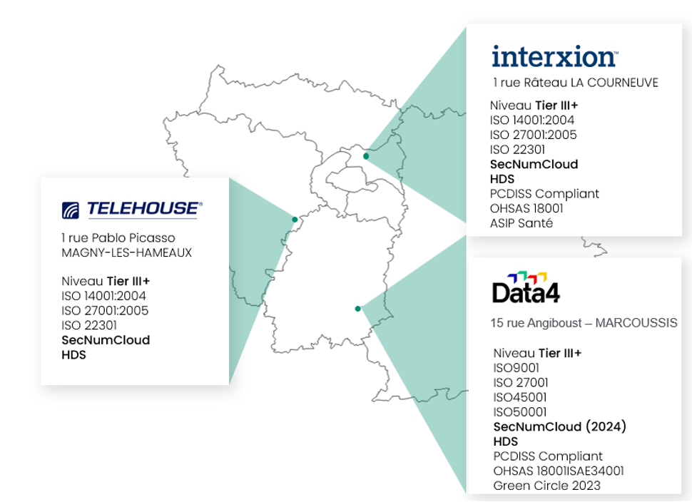

## Regioni

L'infrastruttura Cloud Temple è progettata per consentire la continuità operativa delle vostre applicazioni e delle vostre piattaforme. 
All'interno di una regione, beneficiate di una continuità di rete di livello 2.

Quindi, è possibile definire un'architettura tecnica sulla regione di Parigi, utilizzando 3 siti fisici per consentire l'implementazione di una piattaforma ad alta disponibilità con quorum.

Nel gennaio 2024, la piattaforma IaaS Cloud Temple dispone delle seguenti aree:

- Regione FR1 (Parigi)

### Regione FR1

La regione FR1 si basa su tre siti fisici nella regione di Parigi. 

{:height="50%" width="50%"}

Ogni sito è a più di 30km di distanza in linea d'aria dagli altri. Mediamente, la distanza ottica tra ciascun sito è di 80 km. La latenza garantita tra i siti è inferiore a 4 ms.

### Estensioni regionali

L'apertura di nuove regioni è principalmente associata alle opportunità di mercato. Nel gennaio 2024, sono in fase di studio l'apertura di una regione nel sud Europa e di una regione nel nord Europa. 

## Zone di disponibilità 

Ogni sito fisico all'interno di una regione dispone di una o più sale private per le nostre infrastrutture. Queste sale sono ad uso esclusivo di Cloud Temple.  

__Ogni sala fisica corrisponde a una zona di disponibilità (AZ / Availability Zone)__ ed è completamente autonoma dal punto di vista dell'elettricità, del raffreddamento, del calcolo, del magazzinaggio e della rete. 
La scelta di una zona di disponibilità implica quindi la scelta di un sito fisico e di una regione. 

Durante la prima implementazione della vostra [organizzazione](../console/organisations.md), scegliete il numero di zone di disponibilità che desiderate (tra 1 e 3) per ognuno dei vostri [tenant](../console/tenants.md). 

La console Shiva vi propone automaticamente zone di disponibilità su siti fisici differenti, così da distribuire la vostra infrastruttura sul maggior numero possibile di siti fisici. 

*__Nota: Se si desidera una configurazione specifica per un particolare contesto (più AZ sullo stesso sito fisico), si deve fare una richiesta di supporto.__*

| Riferimento dell'ordine                                  | Unità          | SKU                     |  
|----------------------------------------------------------|----------------|-------------------------|
| TENANT - *(REGIONE)* - Attivazione di una zona disponibile | 1 AZ per tenant | csp:*(REGIONE)*:iaas:az:v1 |

## Macchine virtuali

Una macchina virtuale è un ambiente virtualizzato che funziona su una macchina fisica. 
Ha il suo proprio sistema operativo (OS) e gode delle stesse caratteristiche di un computer fisico: CPU, memoria RAM, hard disk e scheda di rete, GPU, Bios, ... 
Nell'ambito dell'offerta IaaS, è ospitata su risorse calcolate e stoccate dedicate. 
Hai la possibilità di creare macchine virtuali "da zero" o di distribuirle a partire da `Templates` disponibili in un catalogo pubblico fornito da Cloud Temple. 

 

