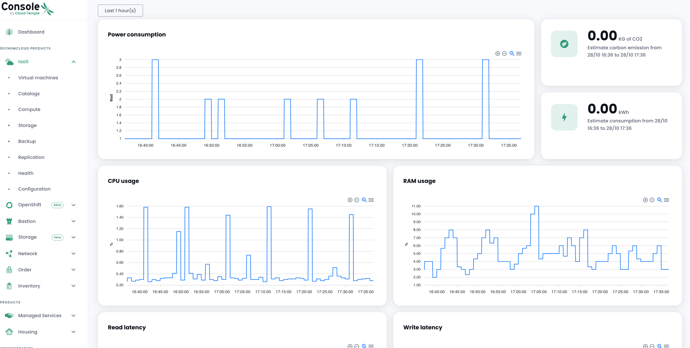

Die Metrologie auf der __'IaaS'__-Infrastruktur ermöglicht es, Leistungsdiagramme sowie den Stromverbrauch zu visualisieren.

Die Konzepte, die mit [der Metrologie in der Cloud Temple-Konsole verbunden sind, werden hier beschrieben](../console/metrics.md).

Die Daten sind über das Dashboard und ein neues Menü namens Gesundheit verfügbar.


Ein Menü, das es ermöglicht, den Gesundheitszustand der virtuellen Maschinen über Leistungsdaten zu visualisieren.


Visualisieren Sie detailliert die Leistungsdaten



Obwohl wir Dashboards zur Visualisierung der Leistungsmetriken unserer Produkte bereitstellen,
stellen wir ebenfalls einen Proxy zur Verfügung, damit Sie die Daten in Ihren Tools anzeigen können.
Wenn Sie Ihr eigenes Grafana verwenden möchten, können Sie dies tun, indem Sie diesem Tutorial folgen.
[Grafana-Datenquelle konfigurieren](../console/howto.md#etape-7--configurer-la-console-shiva-en-tant-que-datasource-dans-grafana)

__*Hinweis* :__

``` Die Berechtigung metrics_read ist erforderlich, um Zugriff auf die Metriken zu haben```

``` Bitte beachten Sie, dass es wichtig ist, Ihre ESX auf dem neuesten Stand zu halten, da sonst die Metriken des Stromverbrauchs ungenau sein können.```
