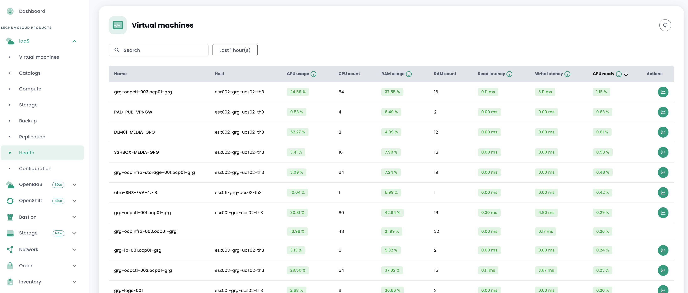

Metrology on the __'IaaS'__ infrastructure allows visualization of performance graphs as well as power consumption.

The concepts associated with [metrology in the Cloud Temple console are described here](../console/metrics.md).

The data is available from the dashboard and from a new menu called Health.


A menu for visualizing the health status of virtual machines via performance data.



Visualize detailed performance data


Although we provide dashboards that allow you to visualize the performance metrics of our products, we also offer a proxy so that you can view them in your own tools.
If you want to use your own Grafana, you can do so by following this tutorial.
[Configure a Grafana datasource](../console/howto.md#etape-7--configurer-la-console-shiva-en-tant-que-datasource-dans-grafana)

__*Note* :__

``` The metrics_read permission is necessary to access the metrics```

``` Please note it is important to have your ESX in the latest version, otherwise the power consumption metrics may be incorrect.```