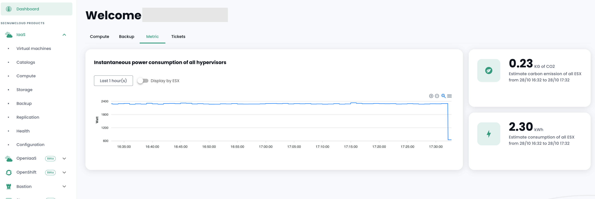
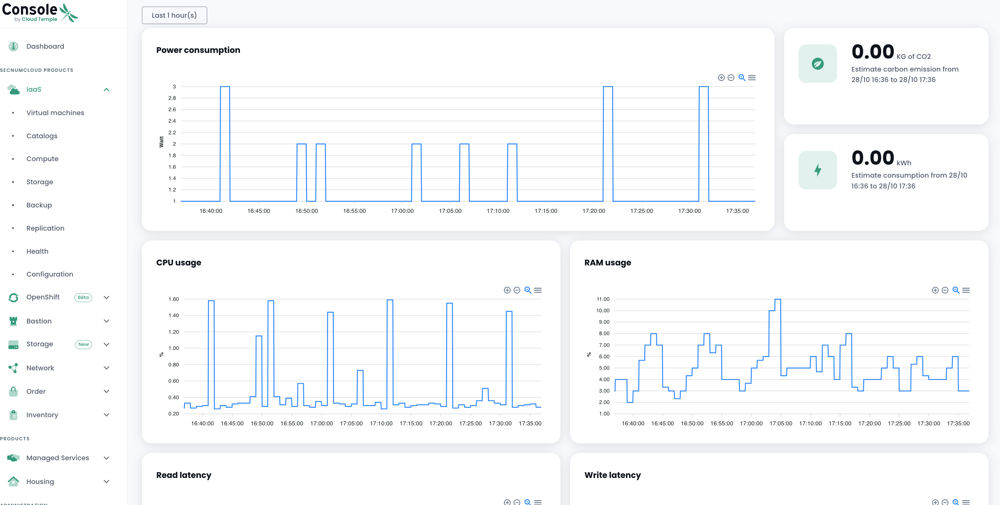

La metrologia sull'infrastruttura __'IaaS'__ consente di visualizzare i grafici delle prestazioni così come il consumo energetico.

I concetti associati alla [metrologia nella console Cloud Temple sono descritti qui](../console/metrics.md).

I dati sono disponibili dal cruscotto e da un nuovo menu chiamato Salute.



Un menu che permette di visualizzare lo stato di salute delle macchine virtuali attraverso i dati di prestazione.


Visualizzate in dettaglio i dati di prestazioni



Sebbene forniamo pannelli di controllo per visualizzare le metriche di prestazione dei nostri prodotti, mettiamo anche a disposizione un proxy affinché possiate visualizzarli nei vostri strumenti.
Se desiderate utilizzare il vostro Grafana personale, potete farlo seguendo questa guida.
[Configurare una datasource Grafana](../console/howto.md#etape-7--configurer-la-console-shiva-en-tant-que-datasource-dans-grafana)

__*Nota* :__

``` È necessario il permesso metrics_read per accedere alle metriche```

``` Si prega di notare che è importante mantenere i vostri ESX aggiornati all'ultima versione, altrimenti le metriche del consumo potrebbero essere incorrette.```