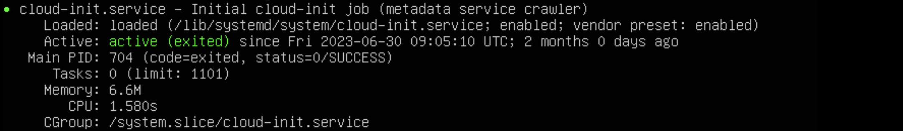

This guide will allow you to deploy your first instances on the Cloud de Confiance in less than 5 minutes.


## __Prerequisites__
1. Have subscribed to the Cloud Temple offer (subscription to the IaaS offer).
2. Have permissions enabled for the 'IaaS' object driver.

## Deploy a virtual machine using Terraform
In this section, we will see how to deploy a virtual machine on the Cloud de Confiance using the Terraform Cloud Temple provider in just a few minutes. 
If you have not yet used the Cloud Temple provider, follow the instructions at the following address to install it and authenticate to your tenant:

    https://registry.terraform.io/providers/Cloud-Temple/cloudtemple/latest/docs.

We will start by creating a .tf file that describes the instance we want to deploy.
The following script deploys a virtual machine from scratch. 


    data "cloudtemple_compute_virtual_datacenter" "dc" {
      name = "DC-EQX6"
    }

    data "cloudtemple_compute_host_cluster" "flo" {
      name = "clu002-ucs01_FLO"
    }

    data "cloudtemple_compute_datastore_cluster" "koukou" {
      name = "sdrs001-LIVE_KOUKOU"
    }

    resource "cloudtemple_compute_virtual_machine" "scratch" {
      name = "from-scratch"

      memory                 = 8 * 1024 * 1024 * 1024
      cpu                    = 2
      num_cores_per_socket   = 1
      cpu_hot_add_enabled    = true
      cpu_hot_remove_enabled = true
      memory_hot_add_enabled = true

      datacenter_id                = data.cloudtemple_compute_virtual_datacenter.dc.id
      host_cluster_id              = data.cloudtemple_compute_host_cluster.flo.id
      datastore_cluster_id         = data.cloudtemple_compute_datastore_cluster.koukou.id
      guest_operating_system_moref = "amazonlinux2_64Guest"
 
      tags = {
        created_by = "Terraform"
      }
    }

The parameters used in this script are as follows:

    - datacenter_id (required): the datacenter in which the virtual machine is deployed
    - host_cluster_id (required): the cluster in which the virtual machine is deployed
    - name (required): the name of the machine
    - memory: the amount of RAM allocated to the machine initially
    - cpu: the number of vCPUs allocated to the machine initially
    - num_cores_per_socket: the number of cores per socket
    - datastore_cluster_id: the datastore to which the machine is attached
    - guest_operating_system_moref: the operating system of the machine

Other parameters can be applied to a virtual machine during deployment. You can find all of these parameters on the following Terraform documentation page:

    https://registry.terraform.io/providers/Cloud-Temple/cloudtemple/latest/docs/resources/compute_virtual_machine


Once the .tf file is created and saved, execute the following command to validate your code:

    terraform validate

Then, plan the deployment and verify that the plan corresponds to what you want to achieve:

    terraform plan

Finally, deploy the virtual machine by executing the following command:

    terraform apply

## Use cloud-init to configure a virtual machine deployed with the Terraform provider

The __'cloud-init'__ tool allows you to customize a virtual machine or cloud instance during its first boot. It is a widely used standard.
For more information, refer to the documentation: https://cloudinit.readthedocs.io/en/latest/

### Compatibility

In order to be able to configure a virtual machine deployed from the Terraform Cloud Temple provider using cloud-init, the **OVF** used to deploy it must be **compatible** with **cloud-init**.

To check the compatibility of your virtual machine with cloud-init, enter the following command:

`systemctl status cloud-init.service`

If cloud-init is properly installed on the machine, you should see a response like this. (See screenshot below)



If necessary, you can find cloud-init compatible images on the internet (for example [Ubuntu Cloud Image](https://cloud-images.ubuntu.com/)) or install it yourself on your machine before converting it to an OVF.


### Deployment

Now that you are certain that the deployed OVF is compatible with cloud-init, here is an example of a terraform (.tf) file that you can use to configure your virtual machine.
Note: All the examples shown here can be found in the examples folder of the Terraform Cloud Temple provider repository here: https://github.com/Cloud-Temple/terraform-provider-cloudtemple/tree/main/examples

####`main.tf`

```HCL
resource "cloudtemple_compute_virtual_machine" "ubuntu-cloud-init" {
  name = "ubuntu-cloud-init"

  memory                 = 8 * 1024 * 1024 * 1024
  cpu                    = 2
  num_cores_per_socket   = 1
  cpu_hot_add_enabled    = true
  cpu_hot_remove_enabled = true
  memory_hot_add_enabled = true

  datacenter_id   = data.cloudtemple_compute_virtual_datacenter.TH3S.id
  host_cluster_id = data.cloudtemple_compute_host_cluster.CLU001.id
  datastore_id    = data.cloudtemple_compute_datastore.DS003.id

  content_library_id      = data.cloudtemple_compute_content_library.local.id
  content_library_item_id = data.cloudtemple_compute_content_library_item.ubuntu-cloudimg.id

  power_state = "on"

  backup_sla_policies = [
    data.cloudtemple_backup_sla_policy.sla001-daily-par7s.id,
    data.cloudtemple_backup_sla_policy.sla001-weekly-par7s.id,
  ]

  cloud_init = {
    network-config = filebase64("./cloud-init/network-config.yml")
    user-data      = filebase64("./cloud-init/user-data.yml")
  }
}
```

####`network-config.yml`
```YAML
#cloud-config
network:
  version: 2
  ethernets:
    eth0:
      dhcp4: false
      addresses:
        - 172.16.100.192/24
      gateway4: 172.16.100.1
      nameservers:
        addresses:
          - 172.16.11.4
```

####`user-data.yml`
```YAML
#cloud-config
users:
  - default
  - name: terraform
    primary_group: users
    shell: /bin/bash
    sudo: ['ALL=(ALL) NOPASSWD:ALL']
    groups: sudo
    lock_passwd: false  
    plain_text_passwd: password
```

The interesting element here is the presence of the cloud-init property, as you can see it consists of two sub-properties: **network-config**, and **user-data**.

These are part of a set of 7 properties that you can use to configure your virtual machine with cloud-init.

* **user-data**: This value must be base64 encoded and contains configuration information for the user accounts on the virtual machine. You can also add scripts to install or update packages.
* **network-config**: This value must be base64 encoded and contains network configuration information for the virtual machine.
* **public-keys**: Indicates that the instance should populate the default user's 'authorized_keys' with this value.
* **instance-id**: Allows you to set a unique instance identifier with cloud-init.
* **password**: If set, the default user's password will be set to this value to allow password-based login. The password will only be valid for a single login. If the value is 'RANDOM', a random password will be generated and displayed on the console.
* **hostname**: Specifies a hostname for the deployed instance.
* **seedfrom**: Allows you to set a URL on which cloud-init will retrieve the configuration files it needs to use.
For more information on how cloud-init works, please refer to the official documentation. https://cloudinit.readthedocs.io/en/latest/

### Execution

To verify that cloud-init is executed correctly, you should be able to connect with the user you configured in the user-data.yml file or the hostname should change to the one you set in 'hostname'.

If you encounter any issues, you can check the cloud-init logs using the following command:

`sudo cat /var/log/cloud-init-output.log`

You should see various information about the execution of cloud-init. In the following screenshot, you can see that the network configuration was successful.


