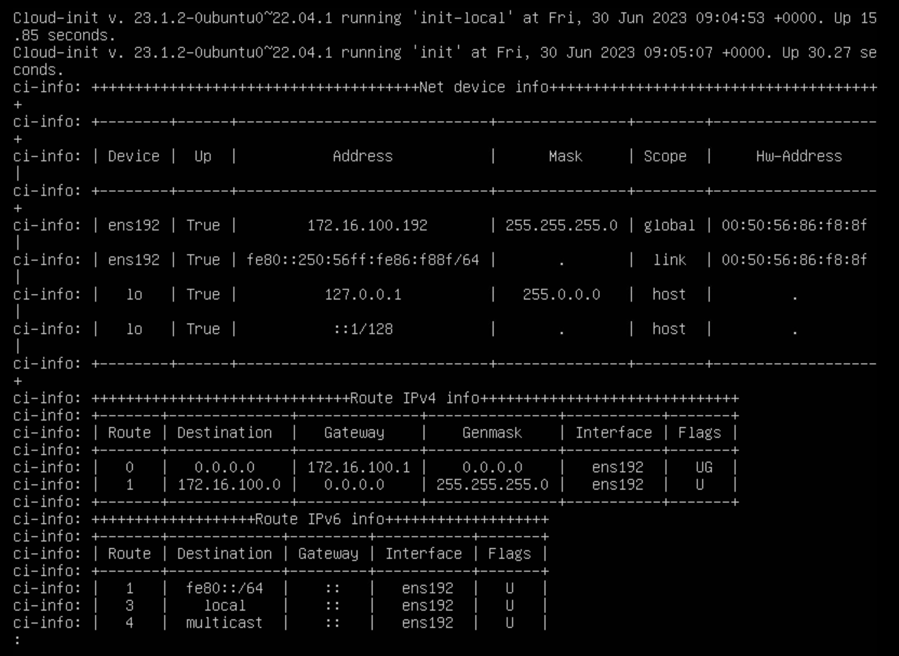

Questa guida ti permetterà di distribuire le tue prime istanze nel Cloud di Fiducia in meno di 5 minuti.


## __Prerequisiti__
1. Avere sottoscritto l'offerta di Cloud Temple (sottoscrizione all'offerta IaaS).
2. Avere le autorizzazioni attivate per il driver degli oggetti __'IaaS'__

## Distribuire una macchina virtuale tramite Terraform
In questa sezione, vedremo come distribuire in pochi minuti una macchina virtuale nel Cloud di Fiducia tramite il provider Terraform Cloud Temple. 
Se non hai ancora utilizzato il provider Cloud Temple, segui le istruzioni al seguente indirizzo per installarlo e autenticarti al tuo tenant:

    https://registry.terraform.io/providers/Cloud-Temple/cloudtemple/latest/docs.

Inizieremo creando un file .tf che descrive l'istanza che vogliamo distribuire.
Lo script seguente consente di distribuire una macchina virtuale da zero. 


    data "cloudtemple_compute_virtual_datacenter" "dc" {
      name = "DC-EQX6"
    }

    data "cloudtemple_compute_host_cluster" "flo" {
      name = "clu002-ucs01_FLO"
    }

    data "cloudtemple_compute_datastore_cluster" "koukou" {
      name = "sdrs001-LIVE_KOUKOU"
    }

    resource "cloudtemple_compute_virtual_machine" "scratch" {
      name = "from-scratch"

      memory                 = 8 * 1024 * 1024 * 1024
      cpu                    = 2
      num_cores_per_socket   = 1
      cpu_hot_add_enabled    = true
      cpu_hot_remove_enabled = true
      memory_hot_add_enabled = true

      datacenter_id                = data.cloudtemple_compute_virtual_datacenter.dc.id
      host_cluster_id              = data.cloudtemple_compute_host_cluster.flo.id
      datastore_cluster_id         = data.cloudtemple_compute_datastore_cluster.koukou.id
      guest_operating_system_moref = "amazonlinux2_64Guest"
 
      tags = {
        created_by = "Terraform"
      }
    }

I parametri utilizzati in questo script sono i seguenti:

    - datacenter_id (obbligatorio): datacenter in cui viene distribuita la macchina virtuale
    - host_cluster_id (obbligatorio): cluster in cui viene distribuita la macchina virtuale
    - name (obbligatorio): nome della macchina
    - memory: memoria assegnata alla macchina inizialmente
    - cpu: numero di vCPU assegnate alla macchina inizialmente
    - num_cores_per_socket: numero di core per socket
    - datastore_cluster_id: datastore a cui la macchina è collegata
    - guest_operating_system_moref: sistema operativo guest della macchina

Altri parametri possono essere applicati a una macchina virtuale durante la sua distribuzione. Puoi trovare l'elenco completo di questi parametri nella pagina seguente della documentazione di Terraform: 

    https://registry.terraform.io/providers/Cloud-Temple/cloudtemple/latest/docs/resources/compute_virtual_machine


Una volta creato e salvato il file .tf, esegui il seguente comando per verificare il tuo codice:

    terraform validate

Poi, pianifica la distribuzione e verifica che il piano corrisponda a ciò che desideri realizzare:

    terraform plan

Infine, distribuisci la macchina virtuale eseguendo il seguente comando:

    terraform apply

## Utilizzare cloud-init per configurare una macchina virtuale distribuita dal provider Terraform

Lo strumento __'cloud-init'__ consente di personalizzare una macchina virtuale o un'istanza cloud durante il suo primo avvio. È uno standard ampiamente diffuso.
Per ulteriori informazioni, consulta la documentazione: https://cloudinit.readthedocs.io/en/latest/

### Compatibilità

Per poter configurare utilizzando cloud-init una macchina virtuale distribuita dal provider Terraform Cloud Temple, l'**OVF** utilizzato per distribuire quest'ultima deve essere **compatibile** con **cloud-init**.

Per verificare la compatibilità della tua macchina virtuale con cloud-init, inserisci il seguente comando:

`systemctl status cloud-init.service`

Se cloud-init è correttamente installato sulla macchina, dovresti vedere una risposta simile a questa. (Vedi screenshot di seguito)


Se necessario, è possibile trovare immagini compatibili con cloud-init su Internet (ad esempio [Ubuntu Cloud Image](https://cloud-images.ubuntu.com/)) o installarlo manualmente sulla propria macchina prima di trasformarla in un OVF.


### Distribuzione

Ora che sei certo che l'OVF distribuito sia compatibile con cloud-init, ecco un esempio di file terraform (.tf) che puoi utilizzare per configurare la tua macchina virtuale.
NOTA: Tutti gli esempi mostrati qui possono essere trovati nella cartella "esempi" del repository del provider Terraform Cloud Temple qui: https://github.com/Cloud-Temple/terraform-provider-cloudtemple/tree/main/examples

#### `main.tf`

```HCL
resource "cloudtemple_compute_virtual_machine" "ubuntu-cloud-init" {
  name = "ubuntu-cloud-init"

  memory                 = 8 * 1024 * 1024 * 1024
  cpu                    = 2
  num_cores_per_socket   = 1
  cpu_hot_add_enabled    = true
  cpu_hot_remove_enabled = true
  memory_hot_add_enabled = true

  datacenter_id   = data.cloudtemple_compute_virtual_datacenter.TH3S.id
  host_cluster_id = data.cloudtemple_compute_host_cluster.CLU001.id
  datastore_id    = data.cloudtemple_compute_datastore.DS003.id

  content_library_id      = data.cloudtemple_compute_content_library.local.id
  content_library_item_id = data.cloudtemple_compute_content_library_item.ubuntu-cloudimg.id

  power_state = "on"

  backup_sla_policies = [
    data.cloudtemple_backup_sla_policy.sla001-daily-par7s.id,
    data.cloudtemple_backup_sla_policy.sla001-weekly-par7s.id,
  ]

  cloud_init = {
    network-config = filebase64("./cloud-init/network-config.yml")
    user-data      = filebase64("./cloud-init/user-data.yml")
  }
}
```

#### `network-config.yml`
```YAML
#cloud-config
network:
  version: 2
  ethernets:
    eth0:
      dhcp4: false
      addresses:
        - 172.16.100.192/24
      gateway4: 172.16.100.1
      nameservers:
        addresses:
          - 172.16.11.4
```

#### `user-data.yml`
```YAML
#cloud-config
users:
  - default
  - name: terraform
    primary_group: users
    shell: /bin/bash
    sudo: ['ALL=(ALL) NOPASSWD:ALL']
    groups: sudo
    lock_passwd: false  
    plain_text_passwd: password
```

L'elemento interessante qui è la presenza della proprietà cloud-init, che è composta da due sotto-proprietà: **network-config** e **user-data**.

Questi fanno parte di un insieme di 7 proprietà che è possibile utilizzare per configurare la propria macchina virtuale con cloud-init.

* **user-data**: Questo valore deve essere codificato in base64 e contiene informazioni di configurazione, ad esempio per gli account utente della macchina virtuale. È anche possibile aggiungere script per l'installazione o l'aggiornamento di pacchetti.
* **network-config**: Questo valore deve essere codificato in base64 e contiene informazioni di configurazione della rete per la macchina virtuale.
* **public-keys**: Indica che l'istanza deve popolare le 'authorized_keys' dell'utente predefinito con questo valore.
* **instance-id**: Permette di definire un ID univoco dell'istanza per cloud-init.
* **password**: Se impostata, la password dell'utente predefinito verrà impostata su questo valore per consentire una connessione basata su password. La password sarà valida solo per una singola connessione. Se il valore è 'RANDOM', verrà generata una password casuale che verrà visualizzata sulla console.
* **hostname**: Specifica un hostname per l'istanza distribuita.
* **seedfrom**: Permette di specificare un URL da cui cloud-init recupererà i file di configurazione da utilizzare.
Per ulteriori informazioni sul funzionamento di cloud-init, consulta la documentazione ufficiale. https://cloudinit.readthedocs.io/en/latest/

### Esecuzione

Per verificare il corretto funzionamento di cloud-init, dovresti essere in grado di effettuare l'accesso con l'utente configurato nel file user-data.yml o vedere che l'hostname cambia secondo quanto specificato in 'hostname'.

In caso di problemi, è possibile verificare i log di cloud-init utilizzando il seguente comando:

`sudo cat /var/log/cloud-init-output.log`

Dovresti vedere diverse informazioni sull'esecuzione di cloud-init. Nello screenshot seguente, è possibile vedere che la configurazione di rete è stata eseguita correttamente.


