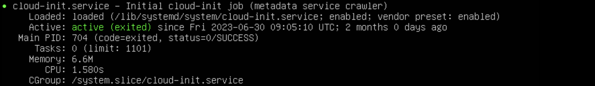
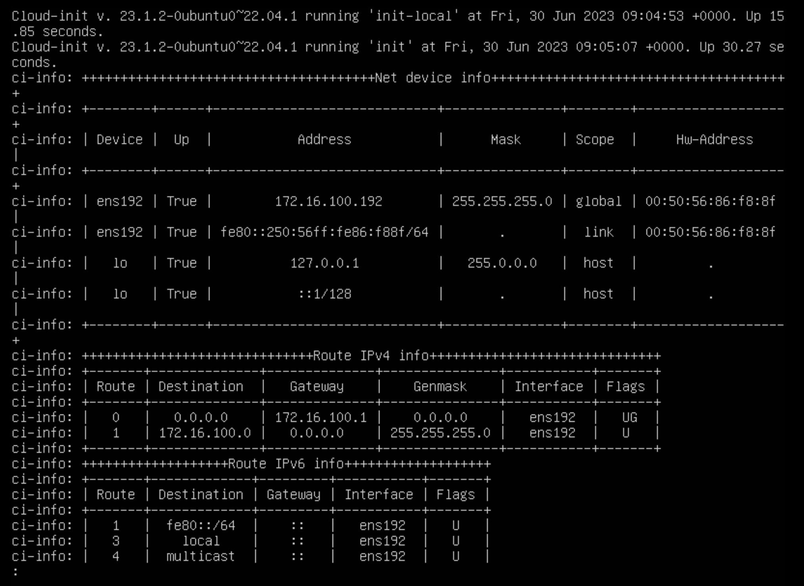

Ce guide va vous permettre de déployer en moins de 5 minutes vos premières instances sur le Cloud de Confiance.


## __Prérequis__
1. Avoir souscrit à l'offre Cloud Temple (souscription à l'offre IaaS).
2. Avoir les permissions activées pour le pilote des objets __'IaaS'__

## Déployer une machine virtuelle via Terraform
Dans cette section, nous allons voir comment déployer en quelques minutes une machine virtuelle sur le Cloud de Confiance via le provider Terraform Cloud Temple. 
Si vous n'avez pas encore utilisé le provider Cloud Temple, suivez les instructions qui figurent à l'adresse suivante pour l'installer et vous authentifier à votre tenant :

    https://registry.terraform.io/providers/Cloud-Temple/cloudtemple/latest/docs.

On va commencer par créer un fichier .tf qui décrit l'instance que l'on souhaite déployer.
Le script suivant permet de déployer une machine virtuelle from scratch. 


    data "cloudtemple_compute_virtual_datacenter" "dc" {
      name = "DC-EQX6"
    }

    data "cloudtemple_compute_host_cluster" "flo" {
      name = "clu002-ucs01_FLO"
    }

    data "cloudtemple_compute_datastore_cluster" "koukou" {
      name = "sdrs001-LIVE_KOUKOU"
    }

    resource "cloudtemple_compute_virtual_machine" "scratch" {
      name = "from-scratch"

      memory                 = 8 * 1024 * 1024 * 1024
      cpu                    = 2
      num_cores_per_socket   = 1
      cpu_hot_add_enabled    = true
      cpu_hot_remove_enabled = true
      memory_hot_add_enabled = true

      datacenter_id                = data.cloudtemple_compute_virtual_datacenter.dc.id
      host_cluster_id              = data.cloudtemple_compute_host_cluster.flo.id
      datastore_cluster_id         = data.cloudtemple_compute_datastore_cluster.koukou.id
      guest_operating_system_moref = "amazonlinux2_64Guest"
 
      tags = {
        created_by = "Terraform"
      }
    }

Les paramètres utilisés dans ce script sont les suivants :

    - datacenter_id (obligatoire) : datacenter dans lequel la machine virtuelle est déployée
    - host_cluster_id (obligatoire) : cluster dans lequel la machine virtuelle est déployée
    - name (obligatoire) : nom de la machine
    - memory : RAM allouée à la machine au départ
    - cpu : nombre de vCPU alloués à la machine au départ
    - num_cores_per_socket : nombre de cores par socket
    - datastore_cluster_id : datastore auquel la machine est rattachée
    - guest_operating_system_moref : système d'exploitation de la machine

D'autres paramètres peuvent être appliqués à une machine virtuelle lors de son déploiement. Vous pouvez retrouver l'ensemble de ces paramètres à la page suivante de la documentation Terraform : 

    https://registry.terraform.io/providers/Cloud-Temple/cloudtemple/latest/docs/resources/compute_virtual_machine


Une fois le fichier .tf créé et sauvegardé, exécutez la commande suivante pour vérifier votre code :

    terraform validate

Puis, planifiez le déploiement et vérifiez que le plan correspond à ce que vous souhaitez réaliser :

    terraform plan

Enfin, déployez la machine virtuelle en exécutant la commande suivante :

    terraform apply

##Utiliser cloud-init pour configurer une machine virtuelle déployée depuis le provider Terraform

L'outil __'cloud-init'__ permet de personnaliser une machine virtuelle, ou une instance cloud, lors de son premier démarrage. Il s'agit d'un standard qui est très largement répandu.
Pour plus d'informations, se référer à la documentation : https://cloudinit.readthedocs.io/en/latest/

###Compatibilité

Afin d’être en mesure de configurer via cloud-init une machine virtuelle déployée depuis le provider Terraform Cloud Temple, l’**OVF** utilisé pour déployer cette dernière doit être **compatible** avec **cloud-init**.

Pour vérifier la compatibilité de votre machine virtuelle avec cloud-init, entrez la commande suivante :

`systemctl status cloud-init.service`

Si cloud-init est correctement installé sur la machine, vous devriez constater une réponse comme ceci. (Voir capture d’écran ci-dessous)



Si besoin, vous pouvez trouver des images compatibles cloud-init sur internet (par exemple [Ubuntu Cloud Image](https://cloud-images.ubuntu.com/)) ou l’installer vous-même sur votre machine avant de la transformer en OVF.


###Déploiement

Maintenant que vous êtes certain que l’OVF déployé est bien compatible à cloud-init, voici un exemple de fichier terraform (.tf) que vous pouvez utiliser pour configurer votre machine virtuelle.
NB : Tous les exemples montrés ici peuvent être retrouvés dans le dossier exemples du repository du provider Terraform Cloud Temple ici : https://github.com/Cloud-Temple/terraform-provider-cloudtemple/tree/main/examples

####`main.tf`

```HCL
resource "cloudtemple_compute_virtual_machine" "ubuntu-cloud-init" {
  name = "ubuntu-cloud-init"

  memory                 = 8 * 1024 * 1024 * 1024
  cpu                    = 2
  num_cores_per_socket   = 1
  cpu_hot_add_enabled    = true
  cpu_hot_remove_enabled = true
  memory_hot_add_enabled = true

  datacenter_id   = data.cloudtemple_compute_virtual_datacenter.TH3S.id
  host_cluster_id = data.cloudtemple_compute_host_cluster.CLU001.id
  datastore_id    = data.cloudtemple_compute_datastore.DS003.id

  content_library_id      = data.cloudtemple_compute_content_library.local.id
  content_library_item_id = data.cloudtemple_compute_content_library_item.ubuntu-cloudimg.id

  power_state = "on"

  backup_sla_policies = [
    data.cloudtemple_backup_sla_policy.sla001-daily-par7s.id,
    data.cloudtemple_backup_sla_policy.sla001-weekly-par7s.id,
  ]

  cloud_init = {
    network-config = filebase64("./cloud-init/network-config.yml")
    user-data      = filebase64("./cloud-init/user-data.yml")
  }
}
```

####`network-config.yml`
```YAML
#cloud-config
network:
  version: 2
  ethernets:
    eth0:
      dhcp4: false
      addresses:
        - 172.16.100.192/24
      gateway4: 172.16.100.1
      nameservers:
        addresses:
          - 172.16.11.4
```

####`user-data.yml`
```YAML
#cloud-config
users:
  - default
  - name: terraform
    primary_group: users
    shell: /bin/bash
    sudo: ['ALL=(ALL) NOPASSWD:ALL']
    groups: sudo
    lock_passwd: false  
    plain_text_passwd: password
```

L’élement intéressant ici, est la présence de la propriété cloud-init, vous pouvez constater qu’elle est composé de deux sous-propriétés : **network-config**, et **user-data**.

Ces dernières font partie d’un ensemble de 7 propriétés que vous pouvez utiliser pour configurer votre machine virtuelle avec cloud-init.

* **user-data** : Cette valeur doit être encodée en base64 et contient des notamment des informations de configuration pour les comptes utilisateurs de la machine virtuelle. Vous pouvez aussi y ajouter des scripts permettant d’installer ou mettre à jour des paquets.
* **network-config** : Cette valeur doit être encodée en base64 et contient notamment des informations de configuration réseau de la machine virtuelle.
* **public-keys** : Indique que l'instance doit remplir les 'authorized_keys' de l'utilisateur par défaut avec cette valeur.
* **instance-id** : Permet de définir un identifiant unique d’instance auprès de cloud-init.
* **password** : S'il est défini, le mot de passe de l'utilisateur par défaut sera défini à cette valeur pour permettre une connexion basée sur un mot de passe. Le mot de passe ne sera valable que pour une seule connexion. Si la valeur est 'RANDOM', un mot de passe aléatoire sera généré et affiché sur la console.
* **hostname** : Spécifie un nom d’hôte pour l’instance déployée.
* **seedfrom** : Permet de définir une URL sur laquelle cloud-init ira chercher les fichiers de configuration qu’il doit utiliser.
Pour plus d'information sur le fonctionnement de cloud-init, veuillez vous référer à la documentation officielle. https://cloudinit.readthedocs.io/en/latest/

###Execution

Pour vérifier la bonne exécution de cloud-init, vous devriez pouvoir vous connecter avec l’utilisateur que vous avez configuré dans le fichier user-data.yml ou le nom d’hôte changer pour être défini sur celui que vous avez mis dans ‘hostname’.

En cas de soucis, vous pouvez vérifier les logs de cloud-init en utilisant la commande suivante :

`sudo cat /var/log/cloud-init-output.log`

Vous devriez voir diverses informations sur l’execution de cloud-init. Sur la capture d’écran qui suit, on peut constater que la configuration du réseau s’est correctement passée.


