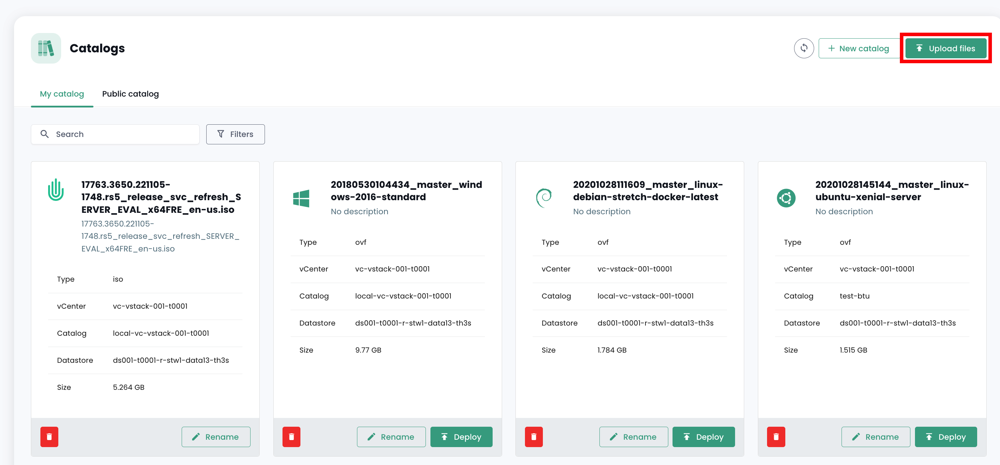

Esta guía le permitirá desplegar sus primeras instancias en la Nube de Confianza en menos de 5 minutos.

## __Prerrequisitos__
1. Suscripción al servicio Cloud Temple (suscripción al servicio IaaS).
2. Permisos activados para el controlador de objetos __'IaaS'__

## Desplegar una máquina virtual desde una plantilla
Esta guía le muestra paso a paso cómo desplegar una máquina virtual desde una plantilla en la consola Shiva.

En el portal Shiva, vaya a la pestaña "Nube de confianza" y después a "Catálogos". Antes de poder desplegar una plantilla, ésta debe cargarse en su catálogo privado, en la pestaña "Mi catálogo".

Para ello, tiene dos opciones: importar su propia plantilla directamente en su catálogo privado o importar un modelo desde el catálogo público de Cloud Temple.

### Importar una plantilla personal en el catálogo privado
En la pestaña "Mi catálogo", haga clic en "Publicar archivos".

A continuación, siga los pasos de publicación de la plantilla, especificando su nombre y una descripción, y eligiendo su ubicación en una biblioteca.

La plantilla debe aparecer después en su catálogo privado.

### Importar una plantilla desde el catálogo público
En la pestaña "Catálogo público", haga clic en el botón "Agregar a mi catálogo" de la plantilla de su elección para importarla a su catálogo privado. La plantilla debe aparecer después en su catálogo privado.

### Desplegar la plantilla
Una vez que la plantilla esté importada en su catálogo privado, puede desplegarla haciendo clic en "Desplegar".

A continuación, siga los diferentes pasos de despliegue del recurso, seleccionando su ubicación física (centro de datos, grupo de cálculo, almacenamiento de datos) y otros parámetros de configuración opcionales.
