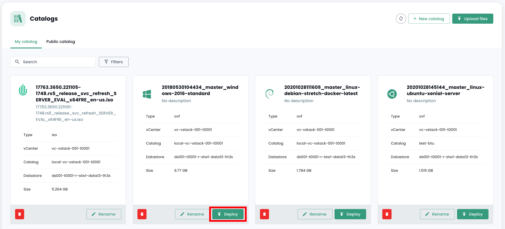

Questa guida ti permetterà di distribuire le tue prime istanze nel Cloud di Fiducia in meno di 5 minuti.

## Prerequisiti
1. Avere sottoscritto l'offerta Cloud Temple (sottoscrizione all'offerta IaaS).
2. Avere i permessi attivati per il driver degli oggetti __'IaaS'__

## Distribuzione di una macchina virtuale da un modello
Questa guida ti mostra passo passo come distribuire una macchina virtuale da un modello nella console Shiva.

Nel portale Shiva, vai alla scheda "Cloud di Fiducia", poi a "Cataloghi". Prima di poter distribuire un modello, devi caricarlo nel tuo catalogo privato, nella scheda "Il mio catalogo".

A tal scopo, hai due possibilità: importare il tuo modello personale direttamente nel tuo catalogo privato o importare un modello dal catalogo pubblico di Cloud Temple.

### Importazione di un modello personale nel catalogo privato
Nella scheda "Il mio catalogo", fai clic su "Pubblica file".

Segui quindi i passaggi per pubblicare il modello, fornendo il suo nome e una descrizione e scegliendo la sua posizione in una libreria.

Il modello dovrebbe quindi apparire nel tuo catalogo privato.

### Importazione di un modello dal catalogo pubblico
Nella scheda "Catalogo pubblico", fai clic sul pulsante "Aggiungi al mio catalogo" del modello desiderato per importarlo nel tuo catalogo privato. Successivamente, dovrebbe apparire nel tuo catalogo privato.

### Distribuzione del modello
Una volta importato il modello nel tuo catalogo privato, puoi distribuirlo facendo clic su "Distribuisci".

Segui quindi i vari passaggi per distribuire la risorsa, selezionando la sua posizione fisica (datacenter, cluster di calcolo, datastore) e altri parametri di configurazione opzionali.
