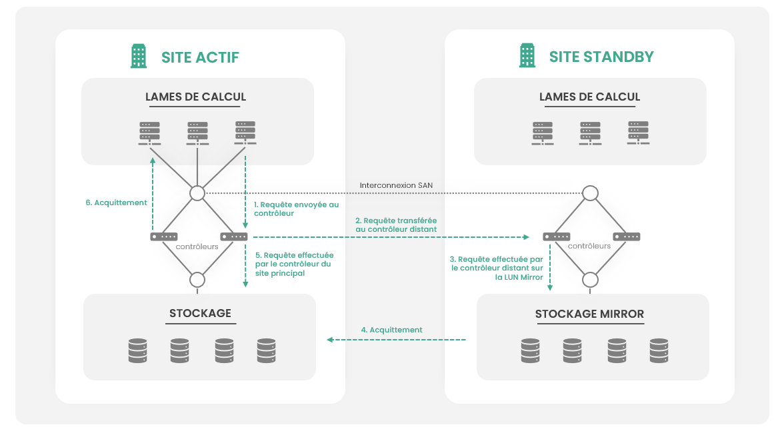
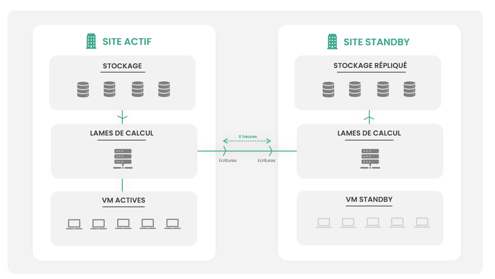

## Overview of Storage

Cloud Temple offers several storage classes based on [IBM FlashSystem](https://www.ibm.com/flashsystem/) 
and [IBM SVC](https://www.ibm.com/products/san-volume-controller) technology.

The __IBM SVC__ technology allows for delivering the required performance level for our clients' environments thanks to the large
amount of cache memory embedded in the controllers and the capability to distribute all IOPS
from a server across multiple SANs.

It is also used to enable the replication of your block storage LUNs between
availability zones or to facilitate interventions on storage arrays.

## Block Storage
### Generalities
Storage is primarily FLASH NVME storage designed for professional workloads. 
The disks are used by storage arrays in ['Distributed Raid 6'](https://www.ibm.com/docs/en/flashsystem-5x00/8.6.x?topic=configurations-distributed-raid-array-properties).

The __'Mass Storage'__ class offers mechanical disks for archiving needs in a context of economic efficiency. Several performance levels are available:

| Reference                          | Unit | SKU                                          |
|------------------------------------|------|----------------------------------------------|
| FLASH - Essential - 500 IOPS/To    | 1 GiB | csp:(region):iaas:storage:block:live:v1       |
| FLASH - Standard - 1500 IOPS/To    | 1 GiB | csp:(region):iaas:storage:block:medium:v1     |
| FLASH - Premium - 3000 IOPS/To     | 1 GiB | csp:(region):iaas:storage:block:premium:v1    |
| FLASH - Enterprise - 7500 IOPS/To  | 1 GiB | csp:(region):iaas:storage:block:enterprise:v1 |
| FLASH - Ultra - 15000 IOPS/To      | 1 GiB | csp:(region):iaas:storage:block:ultra:v1      |
| MASS STORAGE - Archiving           | 1 TiB | csp:(region):iaas:storage:block:mass:v1       |

*__Notes__ :*

- *Storage availability is 99.99% measured monthly, including maintenance window,*
- *There are no restrictions or quotas on read or write operations,*
- *There is no billing per IOPS,*
- *There is no performance commitment for the __'Mass Storage'__ class,*
- *The minimum size of a storage LUN is 500GiB,*
- *When using a storage replication mechanism, performance must be identical across both availability zones,*
- *No "smart" optimization mechanisms such as compression or deduplication are implemented: when you reserve 10TiB of storage, you physically have 10TiB of useful storage deployed on IBM machines.*
- *Storage LUNs are dedicated to the client environment.*

### Use in the context of the vmware computing offer
In the context of using block storage as a datastore within Cloud Temple's VMware compute offering, **you must take several important considerations into account**:

1. **Swap File (.VSWP) at Virtual Machine Startup**: When a virtual machine starts, it creates a .VSWP file the size of its memory on disk. As a result, to be able to start your virtual machines, you must always have free space in your datastore equivalent to the sum of the memory sizes of your virtual machines. For example, if your datastore has 1 TiB of block storage and you want to start 10 virtual machines with 64 GiB of memory each, 640 GiB of disk space would be required. Without this space, machine startups would be limited by the available capacity to create swap files.

2. **Free Space for Backup Snapshots**: The backup service uses snapshots. Therefore, you must always have enough free space to allow for the creation of a snapshot during the backup of a virtual machine. The size of the snapshot depends on the virtual machine's write volume and the time required to perform the backup. As a general rule, it is recommended to maintain at least 10% free space for this operation.

3. **Management of Dynamic Disks**: Exercise caution with the use of dynamic disks. If you do not control their growth, a lack of physical space can lead to a freeze of the virtual machine at best, or a crash with corruption at worst. It is critical to monitor the available space on your datastores closely when using this type of disk.

Proactive disk space management is essential to ensure the smooth operation of your virtual machines and the reliability of backups. Make sure to always have the necessary space for swap files, snapshots, and the growth of dynamic disks.

## Backup Mode Storage
The storage dedicated to the backup of your virtual machines is auto-provisioned by the [IBM Spectrum Protect Plus](backup.md) platform within the limit of the ordered quota.

| Reference                | Unit | SKU                                       |
|--------------------------|------|-------------------------------------------|
| MASS STORAGE - Archiving | 1 TiB | csp:(region):iaas:storage:block:backup:v1 |

## Object Storage
Cloud Temple's object storage is based on [DELL ECS](https://www.dell.com/en-us/dt/storage/ecs/) technology.

You will find the description of this storage in the PaaS section: [object storage]().

## Block storage replication
### Principles
To facilitate the implementation of your disaster recovery plans, when it is not possible to be in a situation of business continuity with application mechanisms and when virtual machine replication is not suitable, Cloud Temple offers __block storage replication mechanisms between availability zones within a region__.

These replication mechanisms are applied to the storage LUNs of your environments, in addition to backups. 
The choice to use a replication mechanism on an environment __depends on many factors including its criticality, the tolerated data loss, and the desired performance__ for the application.

Cloud Temple offers two types of mechanisms deployed in an active/passive configuration:

- __Asynchronous replication__ (or __'Global Mirror'__): *The __'Global Mirror'__ function provides an asynchronous copying process. 
When a host writes to the primary volume, the confirmation of the I/O completion is received before the write operation 
is finished on the secondary volume. If a failover operation is initiated, the application 
must recover and apply any updates that were not confirmed on the secondary volume. 
If I/O operations on the primary volume are paused for a short period, 
the secondary volume can become an exact match of the primary volume. This function is comparable to a 
continuous backup process in which the latest updates are always missing. 
When using Global Mirror for disaster recovery, you should consider how you want to handle these missing updates.*

- __Synchronous replication__ (or __'Metro Mirror'__): *The __'Metro Mirror'__ function is a type of remote copying that creates a synchronous copy 
of data from a primary volume to a secondary volume. With synchronous copies, the host applications write to the primary volume, but do not receive confirmation 
that the write operation is completed until the data is written to the secondary volume. This ensures that both volumes contain identical data when 
the copy operation is completed. After the initial copy operation is completed, the Metro Mirror function 
consistently maintains a fully synchronized copy of the source data at the target site. __As of January 1, 2024, the 'Metro Mirror' function is no longer available.__*

A so-called "active" or "primary" site and a "passive" or "standby" site are then defined.
The disaster recovery plan is activated in case of a disaster or as part of a test request of the DRP. 
The passive site then takes over from the active site.

### Asynchronous Replication
When your workloads require short recovery time objectives and it's not acceptable or suitable to use application replication mechanisms / virtual machine replication, it is possible to replicate a SAN storage LUN between two availability zones within the same region.

This offer allows for a __RPO of 15 minutes__ and a __RTO of less than 4 hours__. It enables much quicker recovery than implementing a backup restoration.

In a storage volume with asynchronous replication (__Global Mirror__), the SAN virtualization controllers from both availability zones work together to carry out write operations on both sites. The master site does not wait for the write acknowledgment from the slave site.

The steps of a write operation are as follows:

1. A hypervisor wants to perform __a write operation on a Global-Mirror volume__: it sends its request to the SAN controller of its availability zone,
2. The local SAN controller asks the SAN controller of the remote zone to carry out the write operation,
3. The local SAN controller does not wait for the acknowledgment from the remote SAN and then performs the write locally,
4. It gives __acknowledgment__ to the hypervisor that issued the request,
5. __Hypervisors at the remote site do not access the Global Mirror LUN directly__: A service request is necessary.

| SLA       | Description                                                                                                                                            |
|-----------|--------------------------------------------------------------------------------------------------------------------------------------------------------|
| RPO 15mn  | In the event of a disaster at the main datacenter, the maximum quantity of data loss corresponds to the last 15 minutes of writing at most |
| RTO < 4H  | In the event of a disaster at the main datacenter, business recovery is guaranteed within 4 hours depending on the complexity of the environments.      |

In the event of the activation of the disaster recovery plan, the Cloud Temple team carries out an operation to present the __'Global Mirror'__ LUN to the hypervisors at the distant site so that they can access the data. The implementation of this solution thus requires having reserved compute resources and RAM at the 'standby' site to resume activity in case of disaster.

The use of this technology also requires doubling the disk space: it is necessary to have exactly the same amount of space at the remote site as at the local site.

The use of this mechanism can impact the application's performance by up to 10%. __Only storage classes of 500 IOPS/TB, 1500 IOPS/TB, and 3000 IOPS/TB are compatible.__

| Reference                          | Unit  | SKU                                               |
|------------------------------------|--------|---------------------------------------------------|
| STORAGE - Global Replication SAN   | 1 TiB  | csp:(region):iaas:storage:licence:globalmirror:v1 |

*__Note__*:

- *As the offering is asynchronous, it is possible in the event of a disaster that some disk operations have not been written to the remote site. There can thus be a risk to data consistency, which should be mitigated in the risk analysis of the disaster recovery plan.*
- *The block storage replication is transparent to virtual machines and applications,*
- *As such, it is important to prioritize application replication scenarios or possibly virtual machine replication,*
- *The compute and memory, at the recovery site, can be reduced to optimize costs if a degraded situation is acceptable to the business when executing the disaster recovery plan.*

### Synchronous Replication

__As of January 1, 2024, the synchronous replication mechanism is no longer sold__

In the case of applications with very high criticality that cannot tolerate any data loss, it is recommended to adopt 
a synchronous replication system (or metro-replication) SAN between the two availability zones. 
This plan allows for a zero RPO (of the 'last disk write' type).

In a metro-replication storage volume, the SAN virtualization controllers work together to perform the write operations on both sites simultaneously.

The steps of a write operation are as follows:

1. A hypervisor wants to perform a write operation on a Metro-Mirror volume: it sends its request to the SAN controller of its site.
2. The local SAN controller asks the SAN controller at the remote site to perform the write operation.
3. Once the write is made, the remote SAN controller acknowledges.
4. The local SAN controller then performs the write locally and acknowledges to the hypervisor that issued the request.
5. Hypervisors at the remote site do not access the Metro Mirror LUN directly.

| SLA                            | Description                                                                                                                                                         |   
|--------------------------------|---------------------------------------------------------------------------------------------------------------------------------------------------------------------|
| RPO = last disk write          | In the event of a disaster at the main data center, the maximum amount of data lost is that of the last disk write, resulting in an RPO close to zero. |
| RTO < 4H                       | In the event of a disaster at the main data center, business recovery is guaranteed within 4 hours, depending on the complexity of the environments.                      |

In case of DRP activation, the Cloud Temple team performs an operation of presentation of the metro-mirror LUN to the remote hypervisors so they can access the data.

The deployment of this solution therefore requires reserved compute resources and RAM on the standby site to resume activity in case of disaster.
The use of this technology also requires doubling the disk space: it is necessary to have the same space on the remote site as on the local site.

Note that the use of this mechanism can impact the performance of the application by up to 30%. __Only the 500 Iops/TB storage class is supported__.

| Reference                                            | Unit  | SKU                                              |  
|------------------------------------------------------|-------|--------------------------------------------------|
| STORAGE - Metro Replication SAN inter-datacenter     | 1 TiB  | csp:(region):iaas:storage:licence:metromirror:v1 |

*__Notes__*:

- *Storage replication in block mode is masked from virtual machines and applications,*
- *As such, it is important to prioritize application replication scenarios or possibly virtual machine replication,*
- *Compute and memory at the recovery site may be reduced to optimize costs if a degraded situation is acceptable for the business during the execution of the disaster recovery plan.*

## Asynchronous replication of your virtual machines in a VMware environment
Asynchronous replication of your virtual machines is a mechanism that involves pushing write operations at the source hypervisor to the standby site at regular time intervals.

After an initial hot copy of the entirety of the active storage to the standby site, only write operations are pushed at regular intervals to the dormant site. 
This interval depends on the volume of writes (from every hour to every 24 hours).

The replication of virtual machines relies on the hypervisor's snapshot mechanism. As such, this solution has the same disadvantages, particularly sensitivity to the volume of writes in the virtual machine, as the snapshot process is a recursive mechanism for the closure of the snapshot.

The typical example of a machine that does not support the virtual machine replication mechanism is an FTP server receiving real-time feeds from surveillance cameras. __The machine spends its time writing and will not be able to close a snapshot without pausing the operating system for a significant period (several tens of minutes)__. If the hypervisor is unable to close the snapshot, that's exactly what it will do, without the possibility of intervening except to corrupt the virtual machine.

| SLA                 | Description                                                                                                                                               |   
|---------------------|-----------------------------------------------------------------------------------------------------------------------------------------------------------|
| RPO from 1H to 24H  | In case of a disaster at the primary datacenter, the maximum amount of data loss is that of the last push of the write to the standby site.                  |
| RTO < 15mn          | Operation to start the virtual machine stopped on the remote site.                                                                                        |

If necessary, or in case of a defect on a machine at the primary site, the mirror machine on the standby site is activated. 
The resumption of activity requires having reserved on the standby site standby compute and RAM. It 
is necessary to have the same storage space on the passive site as on the active site.

| Reference                            | Unit | SKU                                                     |  
|--------------------------------------|------|---------------------------------------------------------|
| DRP - Inter-AZ VMware Replication    | 1 vm | csp:(region):iaas:vmware:licence:replication:v1         |

*__Note__ : The calculation of the minimum RPO must be defined according to the change rate on the virtual machine.*