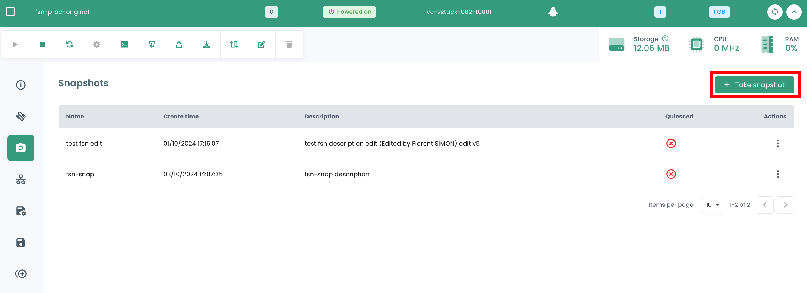
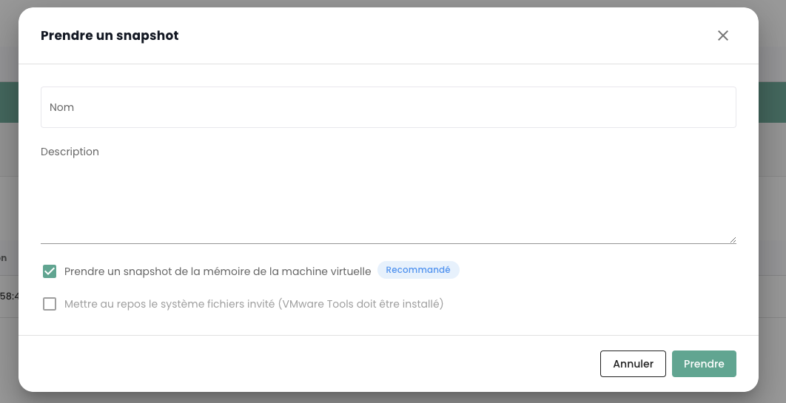

In diesen Anleitungen werden Sie lernen, wie Sie Ihre IaaS-Ressourcen im Vertrauenswürdigen Cloud steuern können.

## Ein virtuelles Gerät von einem Template aus einsetzen
Dieser Leitfaden zeigt Ihnen Schritt für Schritt, wie Sie eine virtuelle Maschine über ein Template in der Shiva-Konsole bereitstellen können.

Im Shiva-Portal gehen Sie zum Reiter __'IaaS'__, dann __'Kataloge'__. Bevor Sie ein Template bereitstellen können, muss es in Ihrem privaten Katalog im Reiter __'Mein Katalog'__ geladen werden.

Dafür haben Sie zwei Möglichkeiten:

- *Importieren Sie Ihr eigenes Template direkt in Ihren privaten Katalog,*
- *Importieren Sie ein Modell aus dem öffentlichen Katalog von Cloud Temple.*

### Ein persönliches Template in den privaten Katalog importieren
Im Tab __'Mein Katalog'__ klicken Sie auf __'Dateien veröffentlichen'__.

Folgen Sie dann den Schritten zur Veröffentlichung der Vorlage, indem Sie den Namen und eine Beschreibung angeben und den Speicherort in einer Bibliothek auswählen.

Die Vorlage sollte dann in Ihrem privaten Katalog erscheinen.

### Eine Vorlage aus dem öffentlichen Katalog importieren
Im Tab __'Öffentlicher Katalog'__ klicken Sie auf die Schaltfläche __'Zu meinem Katalog hinzufügen'__ bei der Vorlage Ihrer Wahl, um diese in Ihren privaten Katalog zu importieren. Diese sollte anschließend in Ihrem privaten Katalog erscheinen.

### Die Vorlage bereitstellen
Nachdem die Vorlage in Ihren privaten Katalog importiert wurde, können Sie sie bereitstellen, indem Sie auf __'Bereitstellen'__ klicken.

Folgen Sie dann den verschiedenen Schritten zur Bereitstellung der Ressource, indem Sie ihren physischen Standort (Rechenzentrum, Rechencluster, Datenspeicher) sowie andere optionale Konfigurationsparameter auswählen.

## Eine virtuelle Maschine von Grund auf neu erstellen
Im Abschnitt __'IaaS'__ dann __'Virtuelle Maschinen'__, klicken Sie auf die Schaltfläche __'Neue virtuelle Maschine'__ und folgen Sie den verschiedenen Schritten zur Erstellung der Maschine.

1. __Allgemeine Informationen__:
    - Wählen Sie die Option *'Erstellen einer virtuellen Maschine'*;
    - Wählen Sie das vCenter;
    - Benennen Sie die virtuelle Maschine.

2. __Standort der virtuellen Maschine wählen__:
    - Das Rechenzentrum;
    - Der Rechencluster;
    - Der Datenspeicher.

3. __Konfiguration der virtuellen Maschine__:
    - Betriebssystem;
    - vCPU;
    - RAM.

4. __Erweiterte Optionen__:
    - Virtuelle Festplatten;
    - Controller;
    - Netzwerkadapter.

## Virtuelle Festplatten
### Einen neuen virtuellen Datenträger erstellen
Im Menü einer virtuellen Maschine klicken Sie auf den Tab __'Geräte'__, um auf die Liste der virtuellen Festplatten und Controller Ihrer virtuellen Maschine zuzugreifen.
Im Abschnitt __'Virtuelle Festplatten'__ klicken Sie auf __'Neue virtuelle Festplatte'__, um einer Ihrer Maschine eine neue Festplatte hinzuzufügen, und wählen dann die Option __'Neue Festplatte'__ aus.

Wenn Sie eine neue Festplatte erstellen, müssen Sie die folgenden Schritte durchführen:

1. Wahl des Speicherorts der Festplatte (Datastore).

2. Kapazität der Festplatte.

3. Art der Bereitstellung:

    - **Lazy Zeroed Thick Provisioning** (dies ist der empfohlene Modus),
    - **Eager Zeroed Thick Provisioning**,
    - **Thin Provisioning** (*)

4. Modus:

    - **Persistent** (Änderungen werden sofort und dauerhaft auf die virtuelle Festplatte geschrieben). **Dies ist der empfohlene Modus.**
    - **Unabhängig nicht-persistent** (Änderungen an der virtuellen Festplatte werden in einem neuen Log aufgezeichnet und beim Ausschalten gelöscht und sind nicht von Schnappschüssen betroffen). **Dieser Modus wird von der Sicherung nicht unterstützt.**
    - **Unabhängig persistent** (Änderungen werden sofort und dauerhaft auf die virtuelle Festplatte geschrieben und sind nicht von Schnappschüssen betroffen). **Dieser Modus wird von der Sicherung nicht unterstützt.**

5. Automatischer oder manueller Controller (IDE 0, IDE1, SCSI-Controller 0).

(*) *Der Thin-Provisioning-Modus erleichtert die schrittweise Zuweisung von Speicherplatz im Datastore, wenn die virtuelle Maschine mehr Platz benötigt. Diese Methode kann jedoch zum Blockieren der virtuellen Maschine führen, wenn der erforderliche Platz im Datastore nicht verfügbar ist, was zur Korruption der Maschine führen kann. Die Wahl dieser Option erfordert daher eine genaue und detaillierte Analyse Ihrer Umgebungen.*

### Eine bestehende virtuelle Festplatte zu einer virtuellen Maschine hinzufügen
Im Menü einer virtuellen Maschine klicken Sie auf die Registerkarte __'Geräte'__, klicken auf __'Neue Festplatte'__ und wählen die Option __'Vorhandene Disk'__.

### Eine virtuelle Festplatte bearbeiten
Im Menü einer virtuellen Maschine klicken Sie auf die Registerkarte __'Geräte'__ und dann auf die virtuelle Festplatte, die Sie ändern möchten. In dem sich öffnenden Fenster können Sie die Kapazität der Festplatte und/oder ihren Provisionierungsmodus ändern.

### Eine virtuelle Festplatte aushängen oder entfernen
Klicken Sie auf die Aktionsleiste der gewünschten virtuellen Disk. Um sie zu löschen, klicken Sie auf __'Löschen'__, und um sie zu demontieren, klicken Sie auf __'Aushängen'__.

Beachten Sie, dass __um eine Disk von einer virtuellen Maschine zu entfernen, muss diese ausgeschaltet sein__.

## Snapshots

### Ein Snapshot erstellen
Besuchen Sie den Tab __'Snapshots'__ einer virtuellen Maschine. Dieser Abschnitt listet alle Snapshots der virtuellen Maschine auf, mit Angabe des jeweiligen Datums und ob das Quiescing aktiviert ist oder nicht.

Um einen neuen Snapshot zu erstellen, klicken Sie auf die Schaltfläche __'Neuer Snapshot'__.

Dann können Sie Ihren Snapshot benennen und insbesondere angeben, ob:

1. Sie den Speicher erfassen möchten: Dies ermöglicht es Ihnen, zum vollständigen Zustand der Maschine mit den Prozessen, die zum Zeitpunkt des Snapshots ausgeführt wurden, zurückzukehren. **Dies ist die empfohlene Option.**
2. Sie den Speicher nicht erfassen möchten: In diesem Fall wird die Maschine einfach neu gestartet, wenn auf den Snapshot ein Rollback gefordert wird. Dies ist die schnellste zu ausführende Option.
3. Wenn Sie das Betriebssystem über die VMware-Tools informieren möchten, dass ein Snapshot ausgelöst wird, um es zu ermöglichen, die Schreibpuffer zu leeren.

{:height="70%" width="70%"}

### Einen Snapshot wiederherstellen

Um ein Snapshot wiederherzustellen, klicken Sie auf die Aktionsleiste, die dem Snapshot entspricht, den Sie wiederherstellen möchten. Dann klicken Sie auf __'Wiederherstellen zu'__.

Diese Aktionsleiste ermöglicht Ihnen auch, den Snapshot umzubenennen, indem Sie auf __'Bearbeiten'__ klicken, oder ihn zu löschen, indem Sie auf __'Löschen'__ klicken.

**ACHTUNG:**

- *Diese Aktion ist **destruktiv**. Alle Daten seit dem Snapshot gehen verloren.*
- *Seien Sie vorsichtig **mit unabhängigen Disks**, diese sollten nicht Teil eines LVM-Clusters sein, da dies zum Einfrieren der virtuellen Maschine führen kann.*

## Netzwerke
Im Abschnitt __'IaaS'__ des Cloud Temple-Konsolenmenüs gehen Sie zum Teil [__Netzwerke__](../network/private_network.md#le-réseau-dans-loffre-de-virtualisation-vmware).

Dort finden Sie die Liste Ihrer privaten virtuellen Netzwerke, die in Ihren Tenants bereitgestellt sind.

### Ein vLAN erstellen
Um ein neues virtuelles Privatnetzwerk zu erstellen, besuchen Sie den Abschnitt [__Netzwerke__](../network/private_network.md#das-netzwerk-im-vmware-virtualisierungsangebot).

### Eine virtuelle Maschine mit einem Netzwerk verbinden
Besuchen Sie die Registerkarte __'Netzwerke'__ Ihrer virtuellen Maschine. Dort finden Sie eine Liste der Netzwerkadapter Ihrer virtuellen Maschine. Klicken Sie auf die Schaltfläche __'Neuen Netzwerkadapter hinzufügen'__ und wählen Sie das gewünschte Netzwerk aus.

Dann müssen Sie den Typ des Adapters sowie die Wahl der MAC-Adressengenerierung (automatisch oder manuell) auswählen.

### Netzwerkadapter trennen oder entfernen
Klicken Sie auf die Aktionsleiste des Netzwerkgeräts, das Sie trennen oder entfernen möchten.
Klicken Sie auf __'Trennen'__, um den Netzwerkadapter zu trennen. Wenn Sie den Netzwerkadapter entfernen möchten, müssen Sie ihn zunächst trennen und dann können Sie ihn durch Klicken auf __'Entfernen'__ löschen.

