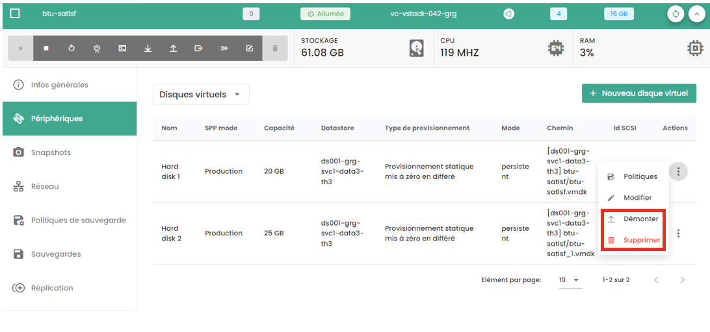
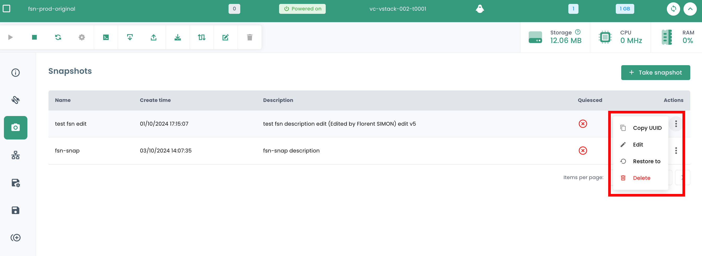

In these guides, you will learn how to manage your IaaS resources in the Trustworthy Cloud.

## Deploy a virtual machine from a Template
This guide shows you step by step how to deploy a virtual machine from a Template in the Shiva console.

On the Shiva portal, go to the __'IaaS'__ tab, then __'Catalogs'__. Before you can deploy a Template, it must be loaded into your private catalog, under the __'My Catalog'__ tab.

You have two options for this:

- *import your own Template directly into your private catalog,*
- *import a model from the Cloud Temple public catalog.*

### Import Your Own Template to the Private Catalog
In the __'My Catalog'__ tab, click on __'Publish files'__.

Then follow the steps of publishing the template, by entering its name and a description, and choosing its location in a library.

The Template should then appear in your private catalog.

### Import a Template from the public catalog
In the __'Public Catalog'__ tab, click on the __'Add to My Catalog'__ button of the Template of your choice to import it into your private catalog. It should then appear in your private catalog.

### Deploy the Template

Once the Template is imported into your private catalog, you can deploy it by clicking on __'Deploy'__.

Then follow the various deployment steps for the resource, selecting its physical location (datacenter, compute cluster, datastore) and other optional configuration parameters.

## Creating a Virtual Machine from Scratch

In the __'IaaS'__ then __'Virtual Machines'__ section, click on the __'New Virtual Machine'__ button and follow the various creation steps for the machine.

1. __General Information__:
    - Select the option *'Create a virtual machine'*;
    - Select the vCenter;
    - Name the virtual machine.

2. __Choose the location of the virtual machine__:
    - The datacenter;
    - The compute cluster;
    - The datastore.

3. __Virtual Machine Configuration__:
    - Operating system;
    - vCPU;
    - RAM.

4. __Advanced Options__:
    - Virtual disks;
    - Controllers;
    - Network adapters.

## Virtual Disks

### Create a New Virtual Disk
Within the menu of a virtual machine, click on the __'Devices'__ tab to access the list of virtual disks and controllers of your virtual machine. 
In the __'Virtual Disks'__ section, click on __'New Virtual Disk'__ to add a new disk to your machine, then select the __'New Disk'__ option.

When creating a new disk, you must follow the steps below:

1. Choice of disk location (datastore).

2. Disk capacity.

3. Provisioning type:

    - **Lazy Zeroed Thick** (this is the recommended mode),
    - **Eager Zeroed Thick**,
    - **Thin Provision** (*)

4. Mode:

    - **Persistent** (changes are immediately and permanently written to the virtual disk). **This is the recommended mode.**
    - **Nonpersistent Independent** (the changes made to the virtual disk are logged in a new log and deleted upon power off, and are not affected by snapshots). **This mode is not supported by backup.**
    - **Persistent Independent** (changes are immediately and permanently written to the virtual disk, and are not affected by snapshots). **This mode is not supported by backup.**

5. Automatic or manual controller selection (IDE 0, IDE1, SCSI controller 0).

(*) *Thin provision mode allows for progressive allocation of disk space in the datastore as the virtual machine uses more space. However, **this method can lead to the blocking of the virtual machine if the required space is not available in the datastore, potentially leading to machine corruption**. Opting for this option thus requires a precise and detailed analysis of your environments.*

### Adding an Existing Virtual Disk to a Virtual Machine
In the menu of a virtual machine, click on the __'Devices'__ tab, click on __'New virtual disk'__ and select the __'existing disk'__ option. 

### Modify a Virtual Disk

In the virtual machine's menu, click on the __'Devices'__ tab, then click on the virtual disk you want to modify. In the window that opens, you can change the disk's capacity and/or its provisioning mode.

### Unmount or Remove a Virtual Disk
Click on the action bar of the desired virtual disk. To delete it, click on __'Delete'__, and to unmount it, click on __'Unmount'__.

Note that __to delete a disk from a virtual machine, the machine must be powered off__.

## Snapshots
### Taking a Snapshot
Visit the __'Snapshots'__ tab of a virtual machine. This section provides a list of snapshots for this virtual machine, indicating each time their date and whether quiescing is enabled or not.

To take a new snapshot, click on the __'New Snapshot'__ button.

You can then name your snapshots and specify if you:

1. Want to capture the memory: This allows for reverting to the complete state of the machine with the processes that were running at the moment of the snapshot. **This is the recommended option.**
2. Do not want to capture the memory: in this case, the machine will simply be restarted if a rollback is requested on the snapshot. This is the fastest option to execute.
3. If you want to notify the operating system via the VMware Tools of the snapshot trigger to allow it to flush write buffers.

{:height="70%" width="70%"}

### Restore a Snapshot

To restore a snapshot, click on the action bar corresponding to the snapshot you wish to restore. Then, click on __'Restore to'__.

This action bar also allows you to rename the snapshot by clicking on __'Edit'__, or to delete it by clicking on __'Delete'__.

**CAUTION:**

- *This action is **destructive**. All data since the snapshot will be lost.*
- *Be careful with **independent disks**, they should not be part of an LVM array for example, as it may freeze the virtual machine.*

## Networks

In the __'IaaS'__ section of the Cloud Temple console menu, go to [__Networks__](../network/private_network.md#the-network-in-the-vmware-virtualization-offer).

There, you will find a list of your private virtual networks deployed in your tenants.

### Create a VLAN
To create a new private virtual network, please go to the [__Networks__](../network/private_network.md#le-réseau-dans-loffre-de-virtualisation-vmware) section.

### Connecting a Virtual Machine to a Network
Navigate to the __'Networks'__ tab of your virtual machine. There you will find the list of network adapters for your virtual machine. Click on the __'New network adapter'__ button and select the desired network.

You must then select the type of adapter as well as the choice of MAC address generation (automatic or manual).

### Disconnect or Remove a Network Adapter
Click on the action bar of the network device you want to disconnect or remove.
Click on __'Disconnect'__ to disconnect the network adapter. If you want to remove the network adapter, you must first disconnect it, then you can delete it by clicking on __'Remove'__.

