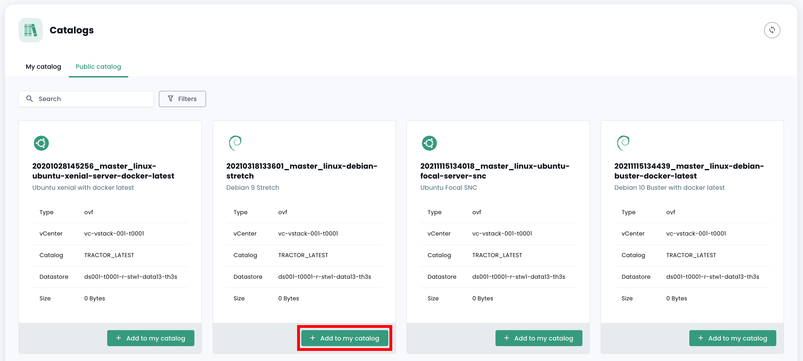
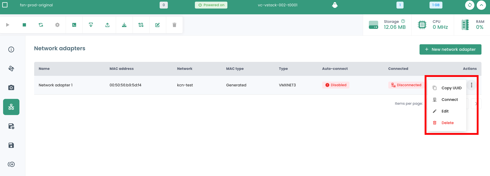

En estas guías, aprenderá a gestionar sus recursos IaaS del Cloud de Confianza.

## Desplegar una máquina virtual desde una plantilla
Esta guía le muestra paso a paso cómo desplegar una máquina virtual desde una plantilla en la consola Shiva.

En el portal Shiva, vaya a la pestaña __'IaaS'__, luego __'Catálogos'__. Antes de poder desplegar una plantilla, ésta debe estar cargada en su catálogo privado, en la pestaña __'Mi catálogo'__.

Para ello, tiene dos posibilidades:

- *importar su propia plantilla directamente en su catálogo privado,*
- *importar un modelo desde el catálogo público de Cloud Temple.*

### Importar una Plantilla personal en el catálogo privado
En la pestaña __'Mi catálogo'__, haga clic en __'Publicar archivos'__.

Después, siga los pasos para publicar la plantilla, ingresando su nombre y una descripción, y seleccionando su ubicación en una biblioteca.

La plantilla debería aparecer en su catálogo privado.

### Importar una plantilla desde el catálogo público
En la pestaña __'Catálogo público'__, haga clic en el botón __'Añadir a mi catálogo'__ en la plantilla de su elección para importarla en su catálogo privado. Esta debería aparecer luego en su catálogo privado.

### Desplegar la Plantilla
Una vez que la plantilla se ha importado en su catálogo privado, puede desplegarla haciendo clic en __'Desplegar'__.

Luego siga los diferentes pasos para desplegar el recurso, seleccionando su ubicación física (centro de datos, clúster de cómputo, datastore) y otros parámetros de configuración opcionales.

## Crear una máquina virtual desde cero
En la sección __'IaaS'__ luego __'Máquinas virtuales'__, haga clic en el botón __'Nueva máquina virtual'__ y siga los diferentes pasos para crear la máquina.

1. __Información general__:
    - Seleccionar la opción *'Crear una máquina virtual'*;
    - Seleccionar el vCenter;
    - Nombrar la máquina virtual.

2. __Elegir la ubicación de la máquina virtual__:
    - El datacenter;
    - El clúster de cómputo;
    - El datastore.

3. __Configuración de la máquina virtual__:
    - Sistema operativo;
    - vCPU;
    - RAM.

4. __Opciones avanzadas__:
    - Discos virtuales;
    - Controladores;
    - Adaptadores de red.

## Discos virtuales

### Crear un nuevo disco virtual
En el menú de una máquina virtual, haga clic en la pestaña __'Dispositivos'__ para acceder a la lista de discos virtuales y controladores de su máquina virtual.
En la sección __'Discos virtuales'__, haga clic en __'Nuevo disco virtual'__ para agregar un nuevo disco a su máquina y luego seleccione la opción __'Nuevo disco'__.

Cuando cree un nuevo disco, debe seguir los siguientes pasos:

1. Elección de la ubicación del disco (almacenamiento de datos).

2. Capacidad del disco.

3. Tipo de aprovisionamiento:

    - **Estático de cero demorado** (este es el modo recomendado),
    - **Estático inmediatamente a cero**,
    - **Dinámico** (*)

4. Modo:

    - **Persistente** (los cambios se escriben de inmediato y de manera permanente en el disco virtual). **Este es el modo recomendado.**
    - **Independiente no persistente** (los cambios realizados en el disco virtual se registran en un nuevo log y se eliminan al apagarlo, y no se ven afectados por las instantáneas). **Este modo no es compatible con la copia de seguridad.**
    - **Independiente persistente** (los cambios se escriben de inmediato y de manera permanente en el disco virtual, y no se ven afectados por las instantáneas). **Este modo no es compatible con la copia de seguridad.**

5. Controlador automático o manual (IDE 0, IDE1, controlador SCSI 0).

(*) *El modo dinámico facilita la asignación progresiva de espacio en el almacenamiento de datos a medida que la máquina virtual utiliza más espacio. Sin embargo, **este método puede provocar el bloqueo de la máquina virtual si el espacio necesario no está disponible en el almacenamiento de datos, lo que puede llevar a la corrupción de la máquina**. Por lo tanto, optar por esta opción requiere un análisis preciso y detallado de sus entornos.*

### Agregar un disco virtual existente a una máquina virtual
En el menú de una máquina virtual, haga clic en la pestaña __'Dispositivos'__, haga clic en __'Nuevo disco virtual'__ y seleccione la opción __'disco existente'__.

### Modificar un disco virtual
En el menú de una máquina virtual, haga clic en la pestaña __'Dispositivos'__ y luego haga clic en el disco virtual que desea modificar. En la ventana que se abre, puede cambiar la capacidad del disco y/o su modo de aprovisionamiento.

### Desmontar o eliminar un disco virtual
Haga clic en la barra de acciones del disco virtual deseado. Para eliminarlo, haga clic en __'Eliminar'__, y para desmontarlo, haga clic en __'Desmontar'__.

Tenga en cuenta que __para eliminar un disco de una máquina virtual, esta debe estar apagada__.

## Instantáneas

### Tomar una instantánea
Diríjase a la pestaña __'Snapshots'__ de una máquina virtual. Esta sección proporciona la lista de snapshots de esa máquina virtual, indicando en cada caso su fecha y si se ha activado o no el quiescing.

Para tomar un nuevo snapshot, haga clic en el botón __'Nuevo snapshot'__.

Entonces puede nombrar su snapshot e indicar en particular si:

1. Desea capturar la memoria: Esto permite, en particular, volver al estado completo de la máquina con los procesos que estaban en ejecución en el momento del snapshot. **Esta es la opción recomendada.**
2. No desea capturar la memoria: en este caso, la máquina simplemente se reiniciará si se solicita un retroceso al snapshot. Es la opción más rápida de ejecutar.
3. Si desea notificar, a través de las vmware-tools, al sistema operativo del inicio del snapshot para permitirle vaciar los buffers de escritura.

{:height="70%" width="70%"}

### Restaurar un snapshot
Para restaurar una instantánea, haga clic en la barra de acciones correspondiente a la instantánea que desea restaurar. Luego, haga clic en __'Restaurar a'__.

Esta barra de acciones también le permite renombrar la instantánea haciendo clic en __'Modificar'__, o eliminarla haciendo clic en __'Suprimir'__.

**ATENCIÓN:**

- *Esta acción es **destructiva**. Todos los datos desde la instantánea se pierden.*
- *Tenga cuidado **con los discos independientes**, no deben ser parte de un grupo LVM, por ejemplo, para evitar congelar la máquina virtual.*

## Redes

En la sección __'IaaS'__ del menú de la consola Cloud Temple, diríjase a la parte [__Redes__](../network/private_network.md#la-red-en-la-oferta-de-virtualización-vmware).

Allí encontrará la lista de sus redes virtuales privadas desplegadas en sus inquilinos.

### Crear un vLAN
Para crear una nueva red privada virtual, diríjase a la sección [__Redes__](../network/private_network.md#le-réseau-dans-loffre-de-virtualisation-vmware).

### Conectar una máquina virtual a una red
Diríjase a la pestaña __'Redes'__ de su máquina virtual. Allí encontrará la lista de adaptadores de red de su máquina virtual. Haga clic en el botón __'Nuevo adaptador de red'__ y seleccione la red deseada.

A continuación, debe seleccionar el tipo de adaptador, así como la opción de generación de la dirección MAC (automática o manual).

### Desconectar o eliminar un adaptador de red
Haga clic en la barra de acciones del dispositivo de red que desea desconectar o eliminar.
Haga clic en __'Desconectar'__ para desconectar el adaptador de red. Si desea eliminar el adaptador de red, primero debe desconectarlo y luego puede eliminarlo haciendo clic en __'Eliminar'__.

