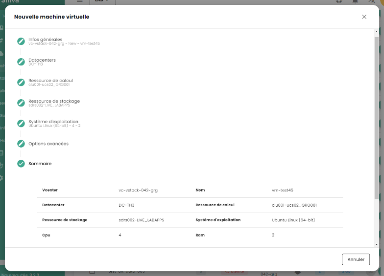

In queste guide, imparerete a gestire le vostre risorse IaaS del Cloud di Fiducia.

## Distribuire una macchina virtuale da un Template
Questa guida vi mostra passo dopo passo come implementare una macchina virtuale da un Template nella console di Shiva.

Sul portale di Shiva, recatevi nella scheda __'IaaS'__, poi __'Cataloghi'__. Prima di poter implementare un Template, questo deve essere caricato nel vostro catalogo privato, nella scheda __'Il mio catalogo'__.

A questo scopo, avete due possibilità:

- *importare il vostro proprio Template direttamente nel vostro catalogo privato,*
- *importare un modello dal catalogo pubblico di Cloud Temple.*

### Importare un Template personale nel catalogo privato

Nella scheda __'Il mio catalogo'__, cliccare su __'Pubblica file'__.

Seguire poi i passaggi per pubblicare il template, inserendo il suo nome e una descrizione, e scegliendo la sua posizione in una libreria.

Il Template dovrebbe quindi apparire nel vostro catalogo privato.

### Importare un Template dal catalogo pubblico

Nella scheda __'Catalogo pubblico'__, cliccate sul pulsante __'Aggiungi al mio catalogo'__ del Template della vostra scelta per importarlo nel vostro catalogo privato. Questo dovrebbe poi comparire nel vostro catalogo privato.

### Schierare il Template
Dopo aver importato il Template nel vostro catalogo privato, potete procedere con il suo dispiegamento cliccando su __'Distribuire'__.

Seguite poi le varie fasi di dispiegamento della risorsa, selezionando la sua posizione fisica (datacenter, cluster di calcolo, datastore) e altri parametri di configurazione opzionali.

## Creare una macchina virtuale da zero
Nella sezione __'IaaS'__ e poi __'Macchine virtuali'__, cliccate sul pulsante __'Nuova macchina virtuale'__ e seguite le diverse tappe di creazione della macchina.

1. __Informazioni generali__:
    - Selezionare l'opzione *'Crea una macchina virtuale'*;
    - Selezionare il vCenter;
    - Nominare la macchina virtuale.

2. __Scegliere la posizione della macchina virtuale__:
    - Il datacenter;
    - Il cluster di calcolo;
    - Il datastore.

3. __Configurazione della macchina virtuale__:
    - Sistema operativo;
    - vCPU;
    - RAM.

4. __Opzioni avanzate__:
    - Dischi virtuali;
    - Controllori;
    - Adattatori di rete.

## Dischi virtuali

### Creare un nuovo disco virtuale
Nel menu di una macchina virtuale, fare clic sulla scheda __'Dispositivi'__ per accedere all'elenco dei dischi virtuali e dei controller della macchina virtuale.
Nella sezione __'Dischi virtuali'__, fare clic su __'Nuovo disco virtuale'__ per aggiungere un nuovo disco alla macchina, quindi selezionare l'opzione __'Nuovo disco'__.

Quando si crea un nuovo disco, è necessario seguire i seguenti passaggi:

1. Scelta del percorso del disco (datastore).

2. Capacità del disco.

3. Tipo di provisioning:

    - **Statico a zero ritardato** (è la modalità consigliata),
    - **Statico a zero immediato**,
    - **Dinamico** (*)

4. Modalità:

    - **Persistente** (le modifiche vengono scritte immediatamente e in modo permanente sul disco virtuale). **Questa è la modalità consigliata.**
    - **Indipendente non persistente** (le modifiche apportate al disco virtuale sono registrate in un nuovo log e rimosse allo spegnimento, e non sono influenzate dagli snapshot). **Questa modalità non è supportata dal backup.**
    - **Indipendente persistente** (le modifiche vengono scritte immediatamente e in modo permanente sul disco virtuale, e non sono influenzate dagli snapshot). **Questa modalità non è supportata dal backup.**

5. Controllore automatico o manuale (IDE 0, IDE1, controllore SCSI 0).

(*) *La modalità dinamica consente di allocare progressivamente spazio sul disco nel datastore man mano che la macchina virtuale utilizza più spazio. Tuttavia, **questo metodo può causare il blocco della macchina virtuale se lo spazio necessario non è disponibile nel datastore, ciò può condurre alla corruzione della macchina**. Scegliere questa opzione richiede quindi un'analisi precisa e dettagliata dei vostri ambienti.*

### Aggiungere un disco virtuale esistente a una macchina virtuale
Nel menu di una macchina virtuale, cliccate sulla scheda __'Periferiche'__, cliccate su __'Nuovo disco virtuale'__ e selezionate l'opzione __'disco esistente'__.

### Modificare un disco virtuale
Nel menu di una macchina virtuale, cliccare sulla scheda __'Periferiche'__ e poi cliccare sul disco virtuale che si desidera modificare. Nella finestra che si apre, è possibile modificare la capacità del disco e/o il suo modo di provisionamento.

### Smontare o rimuovere un disco virtuale

Fare clic sulla barra delle azioni del disco virtuale desiderato. Per eliminarlo, cliccare su __'Elimina'__, e per smontarlo, cliccare su __'Smonta'__.

Si noti che __per eliminare un disco da una macchina virtuale, questa deve essere spenta__.

## Snapshot

### Prendere uno snapshot
Dirigetevi nella scheda __'Snapshot'__ di una macchina virtuale. Questa sezione mostra l'elenco degli snapshot della macchina virtuale, indicando per ognuno la data e se la quiescenza è attiva o meno.

Per creare un nuovo snapshot, cliccate sul pulsante __'Nuovo snapshot'__.

Potete quindi dare un nome al vostro snapshot e specificare in particolare se:

1. Desiderate catturare la memoria: Questo permette di ritornare allo stato completo della macchina con i processi che erano in esecuzione al momento dello snapshot. **Questa è l'opzione raccomandata.**
2. Non desiderate catturare la memoria: in questo caso, la macchina sarà semplicemente riavviata se si richiede un rollback su quello snapshot. È l'opzione più rapida da eseguire.
3. Se desiderate avvisare, tramite i vmware-tools, il sistema operativo dello scatto dello snapshot per permettergli di svuotare i buffer di scrittura.

{:height="70%" width="70%"}

### Ripristinare uno snapshot

Per ripristinare uno snapshot, cliccate sulla barra delle azioni corrispondente allo snapshot che desiderate ripristinare. Poi, cliccate su __'Ripristinare a'__.

Questa barra delle azioni vi permette anche di rinominare lo snapshot cliccando su __'Modifica'__, oppure di eliminarlo cliccando su __'Elimina'__.

**ATTENZIONE :**

- *Questa azione è **distruttiva**. Tutti i dati dallo snapshot in poi sono perduti.*
- *Fate attenzione **ai dischi indipendenti**, non devono far parte, ad esempio, di un cluster LVM, altrimenti si rischia di bloccare la macchina virtuale.*

## Reti
Nella sezione __'IaaS'__ del menu della console Cloud Temple, recatevi nella parte [__Reti__](../network/private_network.md#la-rete-nell'offerta-di-virtualizzazione-vmware).

Troverete lì l'elenco delle vostre reti virtuali private dispiegate nei vostri tenant.

### Creare un vLAN
Per creare una nuova rete virtuale privata, recatevi nella sezione [__Reti__](../network/private_network.md#le-réseau-dans-loffre-de-virtualisation-vmware).

### Collegare una macchina virtuale a una rete
Recatevi nella scheda __'Reti'__ della vostra macchina virtuale. Troverete l'elenco degli adattatori di rete della vostra macchina virtuale. Cliccate sul pulsante __'Nuovo adattatore di rete'__ e selezionate la rete desiderata.

Dovrete poi selezionare il tipo di adattatore così come l'opzione per la generazione dell'indirizzo MAC (automatica o manuale).

### Scollegare o rimuovere un adattatore di rete

Fare clic sulla barra delle azioni del dispositivo di rete che si desidera disconnettere o eliminare.
Fare clic su __'Disconnettere'__ per disconnettere l'adattatore di rete. Se si desidera eliminare l'adattatore di rete, è necessario prima disconnetterlo, quindi è possibile eliminarlo facendo clic su __'Eliminare'__.

