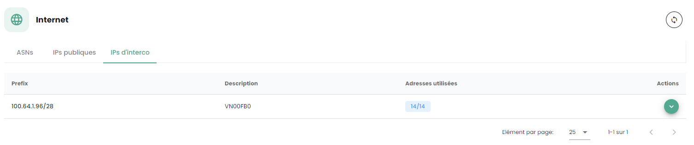
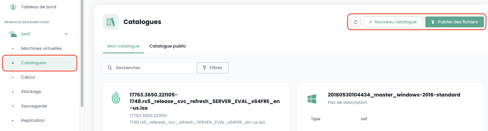
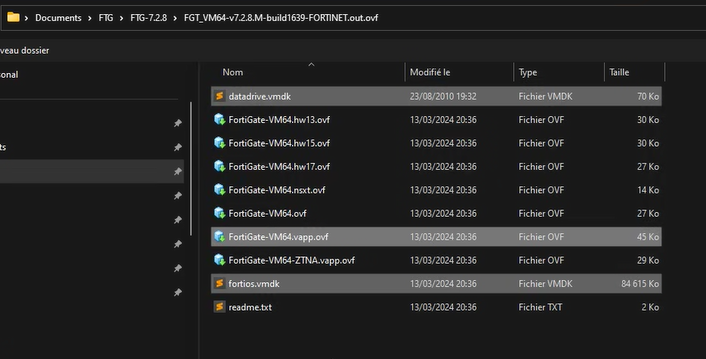
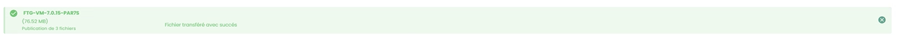
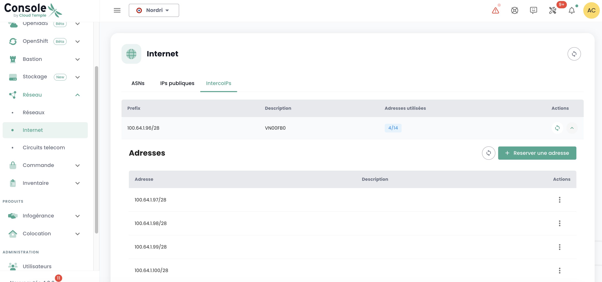
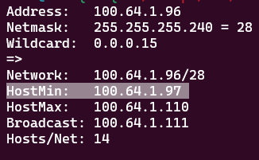
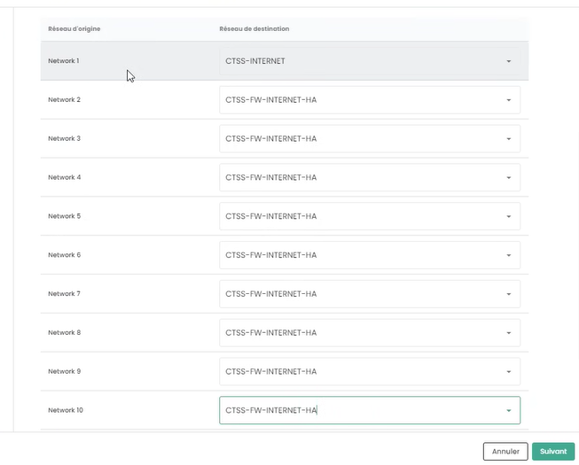
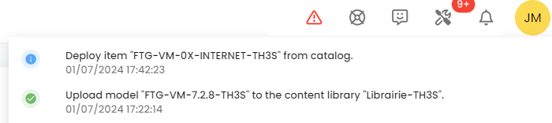
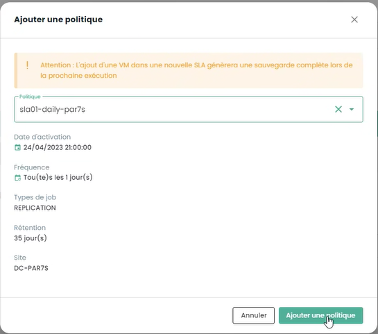
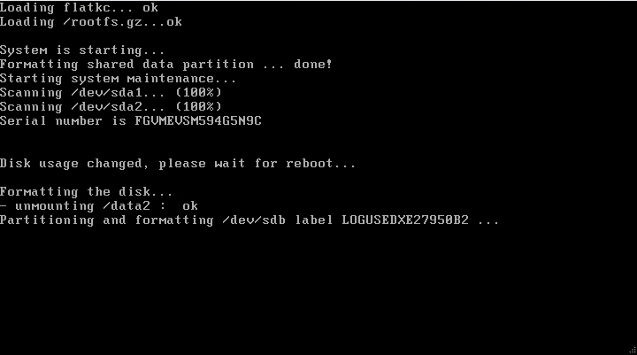

## Purpose of this Guide
This guide details the essential steps to effectively deploy an individual firewall or a firewall cluster in a SecNumCloud environment.

**Note:** *The configurations presented in this document serve as a reference guide and must be carefully adapted to the technical specificities, security requirements, and operational objectives unique to each environment*

## Prerequisites for This Guide
### Necessary Rights
Deployment of virtual appliances requires access to the client's tenant in the Cloud Temple console with the following specific permissions:

If you are using the **OpenIaaS** offer:

| Permission Name                                 | Permission Description                                                                                                            |
| ----------------------------------------------- | --------------------------------------------------------------------------------------------------------------------------------- |
| compute_iaas_opensource_console_access          | OpenIaaS offer - Opening of the console of a virtual machine                                                                     |
| compute_iaas_opensource_infrastructure_read     | OpenIaaS offer - Viewing advanced VMware resource data (affinity/anti-affinity rules, DRS configuration, etc.)                   |
| compute_iaas_opensource_infrastructure_write    | OpenIaaS offer - Advanced management of VMware resources                                                                          |
| compute_iaas_opensource_read                    | OpenIaaS offer - Viewing virtual machine type resources                                                                           |
| compute_iaas_opensource_management              | OpenIaaS offer - Management of virtual machine type resources                                                                     |
| compute_iaas_opensource_virtual_machine_power   | OpenIaaS offer - Management of a virtual machine's power                                                                          |
| activity_read                                   | Viewing of log journals and activities                                                                                            |

If you are using the **Vmware** offer:

| Permission Name                                 | Permission Description                                                                                                          |
| ----------------------------------------------- | --------------------------------------------------------------------------------------------------------------------------------|
| compute_iaas_vmware_console_access              | Vmware offer - Opening of the console of a virtual machine                                                                      |
| compute_iaas_vmware_infrastructure_read         | Vmware offer - Viewing advanced VMware resource data (affinity/anti-affinity rules, DRS configuration, etc.)                    |
| compute_iaas_vmware_infrastructure_write        | Vmware offer - Advanced management of VMware resources                                                                          |
| compute_iaas_vmware_read                        | Vmware offer - Viewing virtual machine type resources                                                                           |
| compute_iaas_vmware_management                  | Vmware offer - Management of virtual machine type resources                                                                     |
| compute_iaas_vmware_virtual_machine_power       | Vmware offer - Management of a virtual machine's power                                                                          |
| activity_read                                   | Viewing of log journals and activities                                                                                           |

If you wish to use __*Terraform*__, the following additional permissions are required:

| Permission Name                                 | Permission Description                                                                                                          |
| ----------------------------------------------- | --------------------------------------------------------------------------------------------------------------------------------|
| tag_read                                        | Viewing tags, except RTMS tags                                                                                                   |
| tag_write                                       | Management of tags, except RTMS tags                                                                                            |
| iam_read                                        | Viewing user rights                                                                                                             |
| iam_write                                       | Management of user rights                                                                                                       |

The OVA image of the appliance to be deployed must be available before starting the process. You will find Fortinet images on [the support site](https://support.fortinet.com/welcome/). It is necessary to have a Fortinet support account.

Go to the **Download section** then **Firmware Images**:


**As of July 1, 2024, version 7.2 is recommended.**

The image to be retrieved is the FGT_VM64 in OVF/ZIP format:

{:height="80%" width="80%"}

**Note:** *If you have subscribed to a Fortinet firewall work unit, Cloud Temple support can provide the image in OVA format as well as the associated license.*

| Infrastructure Work Units - VIRTUAL FIREWALLS        | Unit             | SKU                     |
| :--------------------------------------------------- | :---------------- | :---------------------- |
| FIREWALL UTM - Fortigate Virtual VM02V - without vdom | 1 virtual cluster | csp:fr1:licence:fw:ftg2 |
| FIREWALL UTM - Fortigate Virtual VM04V - without vdom | 1 virtual cluster | csp:fr1:licence:fw:ftg4 |
| FIREWALL UTM - Fortigate Virtual VM08V - without vdom | 1 virtual cluster | csp:fr1:licence:fw:ftg8 |
| FIREWALL UTM - Fortigate - 5 additional vdoms         | 5 vdom            | csp:fr1:licence:fw:vdom |

### Network Connectivity Information
You must have the necessary information to establish the BGP session with the backbone. This data is available in the Cloud Temple console, in the Network → Internet → ASNs section:

{:height="80%" width="80%"}

You must also have a range of public IP addresses whose scope is related to your needs. The reserved address range is indicated in the Cloud Temple console in the Network → Internet → Public IPs section. Here is an example:

{:height="80%" width="80%"}

Finally, you must have the block allocated to you on the BGP interconnection network to benefit from a route to the Internet. The Cloud Temple interconnection network is 100.64.0.0/16, and each access has an interconnection subnet of type /28. This network is used to establish the BGP session with the Cloud Temple routing core. You will find this range in the Cloud Temple console in the Network → Internet → Interconnection IPs section. Here is an example:

{:height="80%" width="80%"}

**Note:** *You must have subscribed to the associated workload units of Internet connectivity. You will then see the connectivity information in the Cloud Temple console.*

## Typical Network Architecture
The typical architecture of a Cloud Temple deployment is a Cluster type in business continuity. This implies the implementation and subscription to at least two availability zones within a region.

The standard deployment of firewalls is executed in a cluster, with one device in each SNC availability zone. A virtual network ensures the synchronization of the cluster. WAN ports access the Internet through the interconnection network.

An initial configuration is required to establish the BGP sessions, thereby enabling Internet connectivity. Private VLANs are routed to the virtual firewall's LAN interfaces through a trunk (aggregation of level 2 networks via technology 802.1q).

**Note:** *Although not a recommended architecture, this guide also applies to single-AZ deployments.*

## Importing the Fortinet appliance into the Cloud Temple console
### Unzipping the Appliance File
After downloading from the Fortinet support site, unzip the ZIP file to obtain:

- The VMDK virtual disks of the appliance,

- OVF files describing the appliance for various VMware virtual hardware formats.

{:height="80%" width="80%"}

Here are the types of templates commonly included in the .ZIP:

| Template                     | Compatible with                           |
| ---------------------------- | ----------------------------------------- |
| FortiGate-VM64.ovf           | ESXI 8.0(Hardware Version 20) or later    |
| FortiGate-VM64.hw13.ovf      | ESXI 6.5(Hardware Version 13) or later    |
| FortiGate-VM64.hw15.ovf      | ESXI 6.7U2+(Hardware Version 15) or later |
| FortiGate-VM64.hw17.ovf      | ESXI 7.0(Hardware Version 17) or later    |
| FortiGate-VM64.vapp.ovf      | ESXI 8.0(Hardware Version 20) or later    |
| FortiGate-VM64.nsxt.ovf      | ESXI 6.7U2+(Hardware Version 15) or later |
| FortiGate-VM64-ZNTA.vapp.ovf | ESXI 7.0(Hardware Version 17) or later    |

### Import the appliance into your image catalog via the Cloud Temple console
Log in to your tenant within the Cloud Temple console, and then go to "**Catalog**" and "**Publish files**":

{:height="80%" width="80%"}

Choose a name for your image. We recommend using: **FGT-VM-VERSION-AZ**, for example, here FGT-VM-*7.2.8*-*TH3S*:

{:height="80%" width="80%"}

Then indicate the image library of the availability zone **(1)**:

{:height="80%" width="80%"}

Next, choose the files to publish in the library **(2)**:

{:height="80%" width="80%"}

{:height="80%" width="80%"}

Click on "**publish files**" afterwards:

{:height="80%" width="80%"}

Wait for your files to finish uploading into the library:


*The operation is to be repeated for each availability zone where you wish to deploy an appliance.*

For example, for the second zone PAR7S:




**Note:**

- _**(1)**_ *Each availability zone has an image library for the hypervisors in that zone.*

- _**(2)**_ *for the .ovf file, choose a version whose virtual hardware is compatible with the version of the ESXi hypervisors (as of July 1, 2024, the maximum supported version is __v19__ corresponding to ESX 7.0.x.).*

## Deployment of the Fortinet appliance in an availability zone
### Planning Your BGP Interconnection Deployment
You must select an interconnection IP address for your future Firewall appliance. The first address is always the BGP Cloud Temple gateway. The other addresses are, in principle, available (unless you have previously deployed other equipment):



The rule is to take the next available IP addresses in sequence:



### Planning the Use of Your Public IP Addresses
All public IP addresses allocated are usable for your tenant. The size of the subnet depends on the amount of work units subscribed.


### BGP4 Configuration Parameters
Please note the following 3 important pieces of information for the continuation of the BGP4 configuration:

{:height="80%" width="80%"}

- **Partner AS**: the remote AS used to establish the BGP session from the perspective of the firewall, it pertains to the AS of Cloud Temple.

- **Route Servers**: the two BGP peers with which to establish a BGP session.

- **Name**: the tenant's own AS number; remove the prefix *AS* to retain only the number.


### Deploy the appliance on the infrastructure
From the library of the availability zone where you want to install your appliance, select the template and then "**Deploy**":


You must then name the virtual machine; we recommend the following nomenclature: FGT-VM-**0X**-**ROLE**-**AZ**

- **0X** corresponds to the Fortigate license type you have subscribed to:


- **ROLE**: For example, INTERNET for an INTERNET interconnection firewall.

- **AZ**: The availability zone


Next, choose the availability zone:


Then, select the target hypervisor cluster:


Choose the storage target:


Finally, indicate the configuration information of your appliance, in particular the addressing information obtained previously:


- **Token**: leave blank

- **Configuration URL**: leave blank

- **Hostname**: identical to the name of the VM envelope

- **DNS**: 208.91.112.53 and 208.91.112.2 (by default, but you may choose to use other DNS as you wish)

- **Interface IP**: first available interconnection IP

- **Netmask**: netmask of the interconnection range

- **Interface 2**: not configured

Next, click on **Next**. The configuration information for the interfaces should be provided. The first interface is to be used for internet access; the others are temporarily placed on the VLAN dedicated to high availability:



Finally, click on "**Deploy**".




When the deployment is complete, the Cloud Temple console will notify you:


Your appliance is now visible in the virtual machines:


### Assigning a Backup Policy
In a SecNumCloud environment, a virtual machine must have a backup policy in place before it can start. You can configure this in the policies and initiate the inventory task:


Assign the policy that corresponds to the desired Recovery Point Objective (RPO); by default, you can choose a daily policy:


You can confirm your selection:



If additional policies are required (as in this example 'daily' and 'monthly'), repeat the process for each additional policy.

### Starting the Virtual Machine

The virtual machine startup is performed from the Cloud Temple console:


It is possible to observe the console and the Fortinet appliance rebooting again after the first boot:


After this second boot, the IP address indicated in the virtual machine deployment at the **OvfProperties** section should respond to ping, provided there is access to the interconnection network.

## Initial Configuration

### Connecting to the Console 

In the Cloud Temple console, select your Fortinet appliance and request the appliance's console.


Depending on when you accessed the console, you may have witnessed the initial boot and reboot of the appliance:




You can then log in to the appliance's console; the username is "**admin**." The appliance will request that you change the password (there is no default password, just press ENTER).

You must then enter a new password.

**Please note: The appliance uses a QWERTY keyboard layout.**

**In case of a password error, you will need to reinstall your appliance.**


### BGP Session Configuration
In this step, we will configure your Fortinet appliance in console mode to establish the BGP4 link.

#### Configuration of the Public IP Range
The first step is to define the ranges of public IP addresses. To begin, we will configure only the first block. We will use the information you have previously noted down.

    config router prefix-list
        edit "pfx_net_public_customer"
        config rule
        edit 1
            set prefix 80.75.159.90/31
                unset ge
                set le 32
            next
        edit 100
            set action deny
            set prefix 0.0.0.0 0.0.0.0
                unset ge
                unset le
            next
        end
    next
    edit "pfx_deny_all"
        config rule
            edit 1
                set action deny
                set prefix 0.0.0.0 0.0.0.0
                unset ge
                unset le
        next
        end
    next
    end

You can then verify that the configuration has been successfully completed with the command:

    show router prefix-list

#### Configuration of the Route Map
A "route map policy" is used to define more complex routing policies that can influence or modify network traffic behavior based on specific criteria. Route maps are especially useful for advanced traffic management tasks, such as route filtering, traffic redirection, or the modification of route attributes in dynamic routing protocols like BGP (Border Gateway Protocol). In our context, it aims to secure your network from invalid announcements.

The second step is to configure the route map policy:

    config router route-map
        edit "rm_deny_all"
            config rule
            edit 1
                set match-ip-address "pfx_deny_all"
            next
        end
        next
        edit "rm_net_public_customer"
            config rule
            edit 1
                set match-ip-address "pfx_net_public_customer"
            next
        end
        next
    end

You can then verify that the configuration has been successfully completed with the command:

    show router route-map

#### BGP Announcement Configuration
We will now configure the BGP announcement. You must have, as seen above in this guide, the interconnection IP (here, the router-id), the IP address of the BGP4 peer (here, **100.64.0.1** and **100.64.0.2**), the local AS (here **4200000005**) and the previously configured Public IP range. _**Remember**_:


and


In this configuration, the AS (autonomous system) of Cloud Temple is 33930. AS 65001 is a private AS that represents you. The use of a private AS number at this level is cleaner, especially if multiple BGP connections need to be set up.

    config router bgp
        set as 65001                                    
        set router-id **100.64.1.110**                                             
        set network-import-check disable                                           
        set graceful-restart enable                                                
        config neighbor
            edit "100.64.0.1"  
                set capability-graceful-restart enable
                set ebgp-enforce-multihop enable
                set next-hop-self enable
                set soft-reconfiguration enable
                set ebgp-multihop-ttl 3
                set remote-as 33930
                set local-as 4200000005
                set route-map-in "rm_deny_all"
                set route-map-out "rm_net_public_customer"
                set keep-alive-timer 10
                set holdtime-timer 30
            next
            edit "100.64.0.2"
                set capability-graceful-restart enable
                set ebgp-enforce-multihop enable
                set next-hop-self enable
                set soft-reconfiguration enable
                set ebgp-multihop-ttl 3
                set remote-as 33930
                set local-as 4200000005
                set route-map-in "rm_deny_all"
                set route-map-out "rm_net_public_customer"
                set keep-alive-timer 10
                set holdtime-timer 30
            next
        end

    config network
        edit 1
            set prefix 80.75.159.90/31
        next
    end
    config redistribute "connected"
    end
    config redistribute "static"
        set status enable
    end
    end

You can then verify that the BGP sessions are established:

    get router info bgp summary

#### Configuration of the LoopBack Address

Using the loopback address to establish BGP sessions between peers improves session stability. The loopback addresses do not depend on the state of a specific physical interface. Therefore, even if an interface fails or if a path is interrupted, the BGP session can remain active as long as there is another valid routing path between peers. This increases network redundancy and resilience.

Utilizing loopback addresses for BGP sessions also helps to reinforce security. Security policies can be applied more uniformly and effectively to loopback addresses, and additional security measures such as authentication and access control lists can be more readily implemented.

We advise naming the LoopBack address using the first public IP of the first range, which should be the default address for outgoing Internet traffic: **LOOP_"PENULTIMATE OCTET OF THE PUBLIC IP"_"LAST OCTET OF THE PUBLIC IP"**

For example, if the first Public IP of your first range is 80.75.159.90/32, the loopback would be named **LOOP_159.90**.
In the command line of your appliance, type (**Please note 80.75.159.90/32 is just an example!**): 

```
    config system interface
        edit "LOOP_159_90"
        set vdom "root"
        set ip 80.75.159.90/32
        set allowaccess ping
        set type loopback
        next
    end
    config firewall ippool
        edit "NAT-PUB-ALL"
        set startip 80.75.159.90
        set endip 80.75.159.90
        next
    end
    config system dns
        set primary 96.45.45.45
        set secondary 96.45.46.46
        set source-ip 80.75.159.90
    end
    config system fortiguard
        set update-server-location eu
        set source-ip 80.75.159.90
    end
    config system ntp
        set ntpsync enable
        set source-ip 80.75.159.90
    end
```

This sets up initial NAT, DNS, intrusion prevention, and time synchronization configuration. Now your appliance should be able to ping the outside if the source IP address is the NAT IP (here in this example 80.57.159.90).

**We also advise changing the administration port, which by default is 80 or 443.**

#### WAN and HA Interface Configuration

To simplify the readability of interfaces in the management of equipment, we recommend renaming the interfaces so that their name corresponds to their role on the firewall. This is done via the definition of an alias for the interface.

Port1 is defined as WAN and port2 is renamed HA. For the HA port, an IP address in the APIPA subnet is set so that devices can join in this way once clustered.

```
config system interface
        edit "port1"
                set alias "WAN"
        next
        edit "port2"
                set ip 169.254.254.1 255.255.255.252
                set allowaccess ping
                set type physical
                set alias "HA"
                set snmp-index 2
        next
end
```

### Deployment of a Second Member

#### Deployment of the Second VM
To deploy an additional member for clustering, it is recommended to use a second Availability Zone (AZ) to ensure high availability of the firewall cluster.

For the deployment of the second appliance, repeat the previously indicated deployment actions in the second AZ:
- Adding the OVF template to a content library
- Deploying a VM from this content library
- Assigning a backup policy

We recommend maintaining the VM naming policy, which would be FGT-VM-0X-ROLE-AZ, and for the first interface's IP address, use the second free IP in the interconnection range.

#### WAN and HA Interface Configuration
Always with the aim of simplifying the readability of interfaces, they need to be renamed on the secondary member. It will also be necessary, during this stage, to configure the IP address of the High Availability (HA) interface so that the devices can communicate for clustering.

```
config system interface
        edit "port1"
                set alias "WAN"
        next
        edit "port2"
                set ip 169.254.254.2 255.255.255.252
                set allowaccess ping
                set type physical
                set alias "HA"
                set snmp-index 2
        next
end
```

### Clustering Setup
We will configure an Active/Passive clustering. The password is a shared key between the two cluster members and must be kept secure. Communication between the devices occurs over unicast, therefore the peer IP to specify is that of the HA interface of the firewall with which to establish the cluster.
Lastly, the interfaces mentioned in the *monitor* section are the supervised interfaces; if the L2 link is lost, it triggers a failover of the cluster.

For the first device, this configuration is as follows:

```
config system ha
    set mode a-p
    set group-name "FTG-HA-INTERNET"
    set group-id 16
    set password SECRET
    set hbdev HA 10
    set priority 100
    set monitor "HA" "WAN"
    set unicast-hb enable
    set unicast-hb-peerip 169.254.254.2
end 
```

Finally, on the second device, we will change the peer IP address and lower the priority so that the first device is elected by default as the active member of the cluster:

```
config system ha
    set mode a-p
    set group-name "FTG-HA-INTERNET"
    set group-id 16
    set password SECRET
    set hbdev HA 10
    set priority 200
    set monitor "HA" "WAN"
    set unicast-hb enable
    set unicast-hb-peerip 169.254.254.1
end 
```

Synchronization may take a few minutes to establish.
For a complete verification, the command *get sys ha status* is indicated. For a more succinct verification, one should perform *diag sys ha checksum cluster*.
When synchronization is functional, the checksums of the *all* line must be identical on both devices.

```
# diag sys ha checksum cluster
```
```markdown
================== FG3H0ZZZNNNNNNN1 ==================

is_manage_primary()=1, is_root_primary()=1
debugzone
global: 2e b4 fb 43 fb 7a 98 7f db ed c0 47 5b 35 e4 1f 
root: bb 66 88 7d df ab 27 f0 b3 a8 a7 72 f4 a0 f3 2d 
all: c9 4b 3b e2 1b e6 25 89 df d2 95 31 ba 8b 47 bb 

checksum
global: 2e b4 fb 43 fb 7a 98 7f db ed c0 47 5b 35 e4 1f 
root: bb 66 88 7d df ab 27 f0 b3 a8 a7 72 f4 a0 f3 2d 
all: c9 4b 3b e2 1b e6 25 89 df d2 95 31 ba 8b 47 bb 

================== FG3H0ZZZNNNNNNN2 ==================

is_manage_primary()=0, is_root_primary()=0
debugzone
global: 2e b4 fb 43 fb 7a 98 7f db ed c0 47 5b 35 e4 1f 
root: bb 66 88 7d df ab 27 f0 b3 a8 a7 72 f4 a0 f3 2d 
all: c9 4b 3b e2 1b e6 25 89 df d2 95 31 ba 8b 47 bb 

checksum
global: 2e b4 fb 43 fb 7a 98 7f db ed c0 47 5b 35 e4 1f 
root: bb 66 88 7d df ab 27 f0 b3 a8 a7 72 f4 a0 f3 2d 
all: c9 4b 3b e2 1b e6 25 89 df d2 95 31 ba 8b 47 bb 
```

#### Configuration of External Access on the Firewall

Firstly, we move the administration port from port 443 to port 8443 to free up a standard port that can be used for business purposes.
```
config system global
    set admin-sport 8443
end
```

Adding a custom service for flow rules to follow:
```
config firewall service custom
    edit "TCP-8443"
        set tcp-portrange 8443
    next
end
```

Allowing administration on the WAN interface and the loopback interface. It will be important at this stage to adapt the name of the LOOP interface as previously defined:
```
edit port1
    set allowaccess ping https ssh http
next

config system interface 
    edit "LOOP_0"
        set allowaccess ping https ssh http snmp
    next
end
```

We then create a flow rule that allows access to the administration interfaces on the loopback interface. This rule is very permissive; it allows all IP addresses, so it is advisable to subsequently filter based on explicitly permitted ranges.
```
config firewall policy
    edit 1
        set name "WAN to LOOP"
        set srcintf "port1"
        set dstintf "LOOP_0"
        set action accept
        set srcaddr "all"
        set dstaddr "all"
        set schedule "always"
        set service "ALL_ICMP" "HTTP" "HTTPS" "SSH" "TCP-8443"
    next
end
```

Finally, we restrict authentication for the admin account to pre-established IP ranges. This is a strong security recommendation from Cloud Temple.
```
config system admin
    edit "admin"
        set trusthost1 100.64.1.99/32
        set trusthost2 1.2.3.4/32
        set trusthost3 5.6.7.8/32
        set accprofile "super_admin"
        set vdom "root"
        set password SECRET
     next
end
```