## Objeto de esta guía

Esta guía detalla los pasos esenciales para desplegar eficazmente un cortafuegos individual o un clúster de cortafuegos en un entorno SecNumCloud.

**Nota:** *Las configuraciones presentadas en este documento sirven como guía de referencia y deben ser cuidadosamente adaptadas a las especificaciones técnicas, los requisitos de seguridad y los objetivos operacionales propios de cada entorno*

## Requisitos previos de esta guía

### Derechos necesarios
El despliegue de los dispositivos virtuales requiere acceso al tenant del cliente en la consola de Cloud Temple con los siguientes permisos específicos:

Si usa la oferta **OpenIaaS** : 

| Nombre del permiso                                   | Descripción del permiso                                                                                                              |
| ---------------------------------------------------- | ------------------------------------------------------------------------------------------------------------------------------------ |
| compute_iaas_opensource_console_access               | Oferta OpenIaaS - Apertura de la consola de una máquina virtual                                                                      |
| compute_iaas_opensource_infrastructure_read          | Oferta OpenIaaS - Consulta de datos avanzados de recursos VMware (reglas de afinidad/anti-afinidad, configuración drs, etc.)         |
| compute_iaas_opensource_infrastructure_write         | Oferta OpenIaaS - Gestión avanzada de recursos VMware                                                                                |
| compute_iaas_opensource_read                         | Oferta OpenIaaS - Consulta de recursos de tipo Máquinas Virtuales                                                                    |
| compute_iaas_opensource_management                   | Oferta OpenIaaS - Gestión de recursos de tipo Máquinas Virtuales                                                                     |
| compute_iaas_opensource_virtual_machine_power        | Oferta OpenIaaS - Gestión de la alimentación de una máquina virtual                                                                  |
| activity_read                                        | Consulta de los registros logs y actividades                                                                                         |

Si usa la oferta **Vmware** : 

| Nombre del permiso                                   | Descripción del permiso                                                                                                              |
| ---------------------------------------------------- | ------------------------------------------------------------------------------------------------------------------------------------ |
| compute_iaas_vmware_console_access                   | Oferta Vmware - Apertura de la consola de una máquina virtual                                                                        |
| compute_iaas_vmware_infrastructure_read              | Oferta Vmware - Consulta de datos avanzados de recursos VMware (reglas de afinidad/anti-afinidad, configuración drs, etc.)           |
| compute_iaas_vmware_infrastructure_write             | Oferta Vmware - Gestión avanzada de recursos VMware                                                                                  |
| compute_iaas_vmware_read                             | Oferta Vmware - Consulta de recursos de tipo Máquinas Virtuales                                                                      |
| compute_iaas_vmware_management                       | Oferta Vmware - Gestión de recursos de tipo Máquinas Virtuales                                                                       |
| compute_iaas_vmware_virtual_machine_power            | Oferta Vmware - Gestión de la alimentación de una máquina virtual                                                                    |
| activity_read                                        | Consulta de los registros logs y actividades                                                                                         |
  
Si desea utilizar __*Terraform*__, se requieren los siguientes permisos adicionales :

| Nombre del permiso                                   | Descripción del permiso                                                                                                              |
| ---------------------------------------------------- | ------------------------------------------------------------------------------------------------------------------------------------ |
| tag_read                                             | Consulta de etiquetas, excepto las etiquetas RTMS                                                                                    |
| tag_write                                            | Gestión de etiquetas, excepto las etiquetas RTMS                                                                                     |
| iam_read                                             | Consulta de derechos de usuarios                                                                                                     |
| iam_write                                            | Gestión de derechos de usuarios                                                                                                      |

La imagen OVA del dispositivo a desplegar debe estar disponible antes de iniciar el proceso. Puede encontrar las imágenes de Fortinet en [el sitio de soporte](https://support.fortinet.com/welcome/). Es necesario tener una cuenta de soporte de Fortinet.

Ir a la **sección Download** y luego **Firmware Images** :


**A partir del 1° de Julio de 2024, se recomienda la versión 7.2.**

La imagen a recuperar es la FGT_VM64 en formato OVF/ZIP :

{:height="80%" width="80%"}

**Nota :** *Si ha suscrito a una unidad de obra firewall de Fortinet, el soporte de Cloud Temple puede proporcionar la imagen en formato OVA así como la licencia asociada.*

| Unidades de obra de infraestructura - FIREWALLS VIRTUALES | Unidad            | sku                     |
| :-------------------------------------------------------- | :---------------- | :---------------------- |
| FIREWALL UTM -Fortigate Virtual VM02V - sin vdom          | 1 cluster virtual | csp:fr1:licence:fw:ftg2 |
| FIREWALL UTM -Fortigate Virtual VM04V - sin vdom          | 1 cluster virtual | csp:fr1:licence:fw:ftg4 |
| FIREWALL UTM -Fortigate Virtual VM08V - sin vdom          | 1 cluster virtual | csp:fr1:licence:fw:ftg8 |
| FIREWALL UTM -Fortigate - 5 vdoms adicionales             | 5 vdoms           | csp:fr1:licence:fw:vdom |

### Informaciones de conectividad de red

Debe disponer de la información necesaria para establecer la sesión BGP con el backbone. Estos datos están disponibles en la consola de Cloud Temple, en la sección Network → Internet → ASNs:

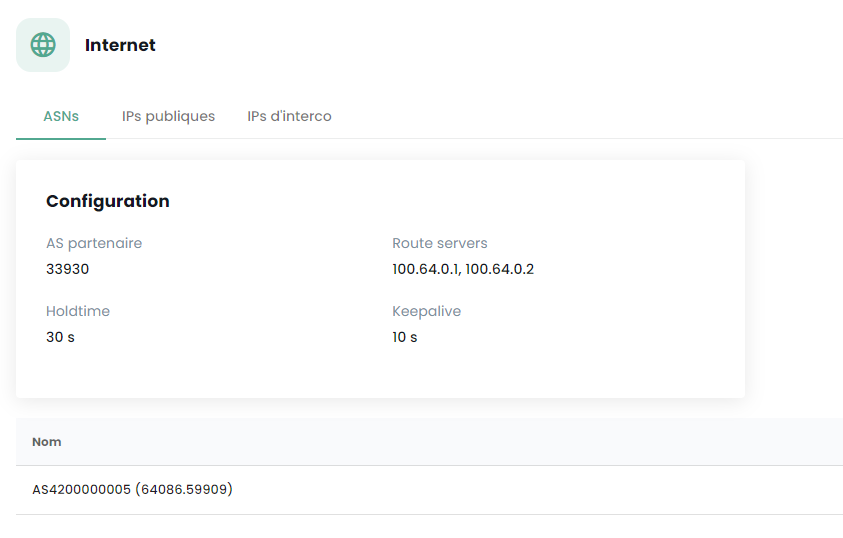{:height="80%" width="80%"}

También debe disponer de un rango de direcciones IP públicas cuya extensión esté relacionada con su necesidad. El rango de direcciones reservado está indicado en la consola de Cloud Temple en la sección Network → Internet → IP públicas. Aquí tiene un ejemplo:

{:height="80%" width="80%"}

Por último, debe disponer del bloque que se le ha asignado en la red de interconexión BGP para poder beneficiarse de una ruta hacia Internet. La red de interconexión de Cloud Temple es la 100.64.0.0/16 y cada acceso dispone de una subred de interconexión de tipo /28. Esta red sirve para el establecimiento de la sesión BGP con el núcleo de enrutamiento de Cloud Temple. Encontrará este rango en la consola de Cloud Temple en la sección Network → Internet → IPs de interconexiones. Aquí tiene un ejemplo:

{:height="80%" width="80%"}

**Nota:** *Debe haber suscrito a las unidades de trabajo asociadas con la conectividad a Internet. Entonces verá aparecer la información de conectividad en la consola de Cloud Temple.*

## Arquitectura de red típica
La arquitectura típica de un despliegue en Cloud Temple es de tipo Cluster en continuidad de actividad. Implica la implementación y suscripción a al menos 2 zonas de disponibilidad en una región.

El despliegue estándar de los firewalls se lleva a cabo en clúster, con un equipo en cada zona de disponibilidad SNC. Una red virtual asegura la sincronización del clúster. Los puertos WAN acceden a Internet a través de la red de interconexión.

Es necesaria una configuración inicial para establecer las sesiones BGP, permitiendo así la conectividad a Internet. Los VLAN privados se dirigen a las interfaces LAN del firewall virtual a través de un trunk (agregación de redes de nivel 2 mediante la tecnología 802.1q).

**Nota:** *Aunque no es una arquitectura recomendada, esta guía también se aplica a los despliegues mono-AZ.*

## Importar el appliance Fortinet en la consola de Cloud Temple
### Descompresión del archivo appliance
Después de descargarlo desde el sitio de soporte de Fortinet, descomprima el archivo ZIP para obtener:

- Los discos virtuales VMDK del appliance,

- Los archivos OVF que describen el appliance para diferentes formatos de hardware virtual de VMware.

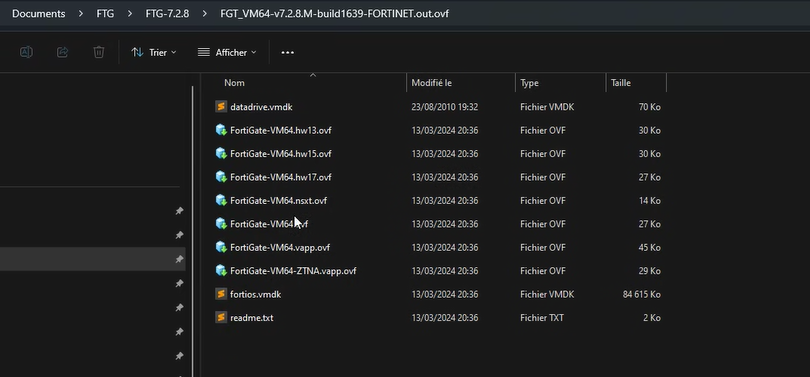{:height="80%" width="80%"}

Aquí están los tipos de plantilla comúnmente integrados en el .ZIP:

| Plantilla                    | Compatible con                            |
| ---------------------------- | ----------------------------------------- |
| FortiGate-VM64.ovf           | ESXI 8.0(Versión de hardware 20) o posterior |
| FortiGate-VM64.hw13.ovf      | ESXI 6.5(Versión de hardware 13) o posterior |
| FortiGate-VM64.hw15.ovf      | ESXI 6.7U2+(Versión de hardware 15) o posterior |
| FortiGate-VM64.hw17.ovf      | ESXI 7.0(Versión de hardware 17) o posterior |
| FortiGate-VM64.vapp.ovf      | ESXI 8.0(Versión de hardware 20) o posterior |
| FortiGate-VM64.nsxt.ovf      | ESXI 6.7U2+(Versión de hardware 15) o posterior |
| FortiGate-VM64-ZNTA.vapp.ovf | ESXI 7.0(Versión de hardware 17) o posterior |

### Importar el appliance en su catálogo de imágenes a través de la consola de Cloud Temple
Conéctese a su inquilino dentro de la consola Cloud Temple, y luego vaya a "**Catálogo**" y "**Publicar archivos**":

{:height="80%" width="80%"}

Elija un nombre para su imagen. Le recomendamos usar: **FGT-VM-VERSION-AZ**, por ejemplo aquí FGT-VM-*7.2.8*-*TH3S*:

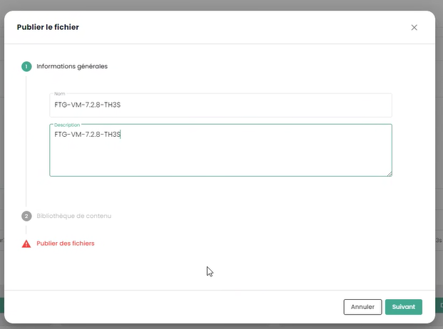{:height="80%" width="80%"}

Luego indique la biblioteca de imágenes de la zona de disponibilidad **(1)**:

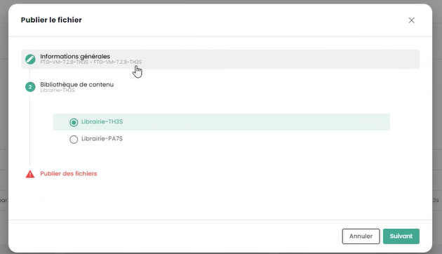{:height="80%" width="80%"}

Después, elija los archivos a publicar en la biblioteca **(2)**:

{:height="80%" width="80%"}

{:height="80%" width="80%"}

Haga clic en "**publicar archivos**":

{:height="80%" width="80%"}

Espere a que se complete la carga de sus archivos en la biblioteca:

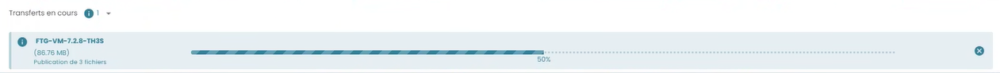


*La operación se debe repetir para cada zona de disponibilidad donde desee implementar un dispositivo.*

Por ejemplo, para la segunda zona PAR7S:


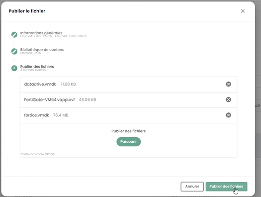


**Nota:**

- _**(1)**_ *Cada zona de disponibilidad tiene una biblioteca de imágenes para los hipervisores de esa zona.*
  
- _**(2)**_ *para el archivo .ovf, elija una versión cuyo hardware virtual sea compatible con la versión de los hipervisores ESXi (al 1 de julio de 2024, la versión máxima soportada es la __v19__ correspondiente a ESX 7.0.x.).*

## Implementación del appliance de Fortinet en una zona de disponibilidad
### Planificar la implementación de su interconexión BGP
Debe seleccionar una dirección IP de interconexión para su futura appliance Firewall. La primera dirección siempre es la gateway BGP de Cloud Temple. Las demás direcciones están, por tanto, disponibles en principio (a no ser que haya desplegado previamente otros equipos):


La regla es que se tomen las IP libres en secuencia:


### Planificar el uso de sus direcciones IP públicas

Todas las IP públicas asignadas son utilizables para su tenant. El tamaño de la subred depende de las unidades de obra suscritas.


### Parámetros de configuración BGP4
Tenga en cuenta las 3 informaciones importantes siguientes para la continuación de la configuración BGP4:

{:height="80%" width="80%"}

- **AS Socio** : el AS remoto utilizado para establecer la sesión BGP desde la perspectiva del firewall, se trata del AS de Cloud Temple.

- **Servidores de Rutas** : los dos pares BGP con los cuales establecer una sesión BGP.

- **Nombre** : el número de AS propio del inquilino; eliminar el prefijo *AS* para conservar solo el número.

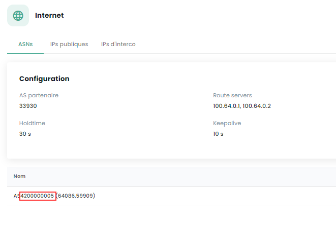

### Desplegar el appliance en la infraestructura
Desde la biblioteca de la zona de disponibilidad en la que desea instalar su appliance, seleccione la plantilla y luego "**Desplegar**":

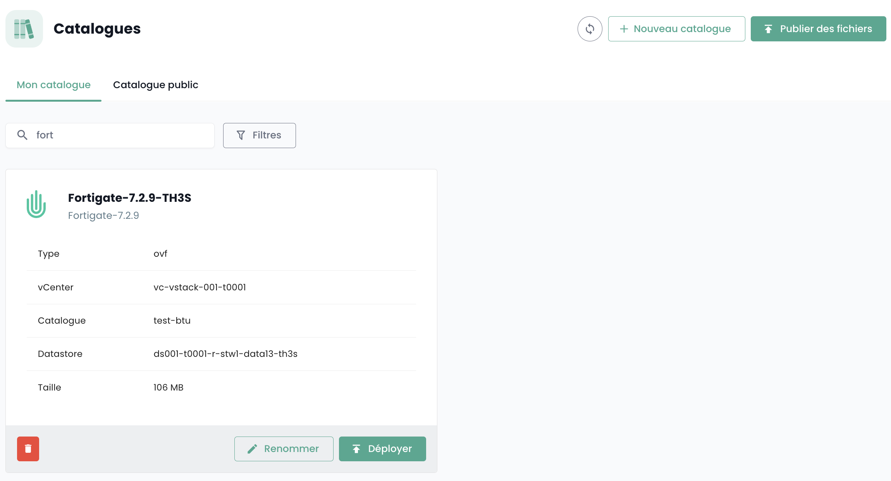

A continuación, debe nombrar la máquina virtual; le recomendamos la siguiente nomenclatura: FGT-VM-**0X**-**ROL**-**AZ**

- **0X**: corresponde al tipo de licencia Fortigate que ha suscrito:


- **ROL**: Por ejemplo INTERNET para un firewall de interconexión a INTERNET.

- **AZ**: La zona de disponibilidad


Elija luego la zona de disponibilidad:

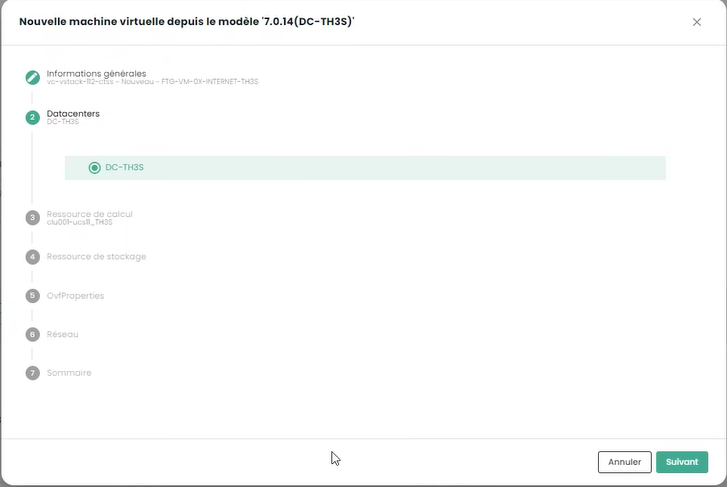

Después el clúster de hipervisor objetivo:


Elija el objetivo de almacenamiento:


Indique finalmente la información de configuración de su appliance, y en particular la información de direccionamiento obtenida previamente:

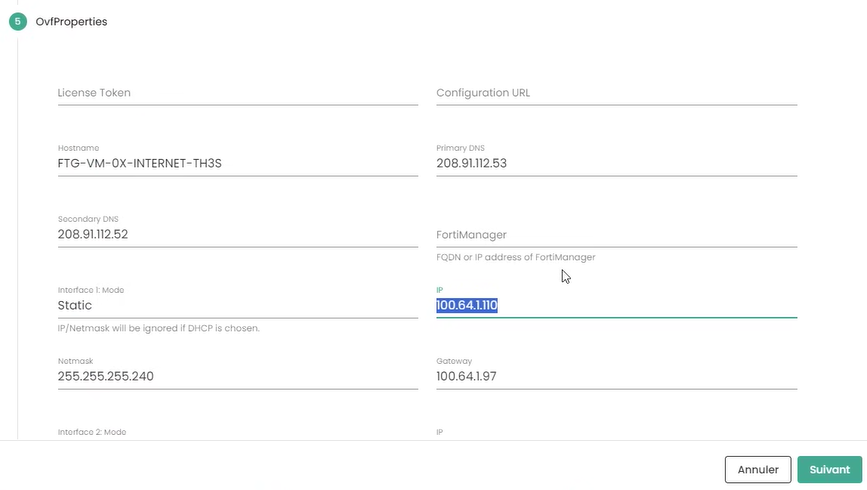

- **Token**: no indicar nada

- **URL de configuración**: no indicar nada

- **Hostname**: idéntico al nombre del sobre de la VM

- **DNS**: 208.91.112.53 y 208.91.112.2 (por defecto, pero puede decidir utilizar otros DNS a su conveniencia)

- **IP de interfaz**: primera IP de interconexión libre

- **Máscara de red**: máscara de red del rango de interconexión

- **Interfaz 2**: no configurada

Luego haga clic en **Siguiente**. Se deben proporcionar las informaciones de configuración de las interfaces. La primera interfaz se debe utilizar para el acceso a internet; las otras están temporalmente asignadas al VLAN dedicado a la alta disponibilidad:


finalmente, haga clic en "**Desplegar**".


Cuando el despliegue esté terminado, la consola de Cloud Temple se lo indicará:


Su appliance ahora está visible en las máquinas virtuales:


### Asignación de una política de copia de seguridad
En un entorno SecNumCloud, es requerido que una máquina virtual tenga una política de respaldo para poder iniciar. Usted puede configurarlo en las políticas e iniciar la tarea de inventario:


Asigne la política que corresponda al RPO deseado; por defecto puede elegir una política diaria:

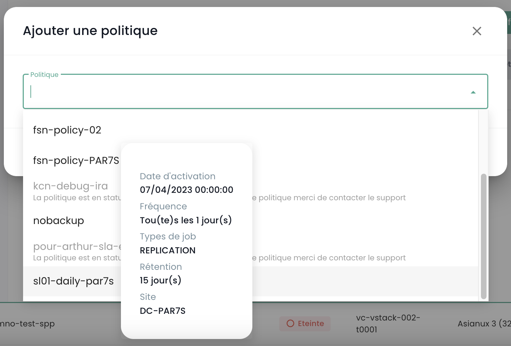

Puede confirmar su elección:


Si se requieren políticas adicionales (como en este ejemplo 'daily' y 'monthly'), repita la operación para cada política adicional.

### Inicio de la máquina virtual
El arranque de la máquina virtual se realiza desde la consola Cloud Temple:

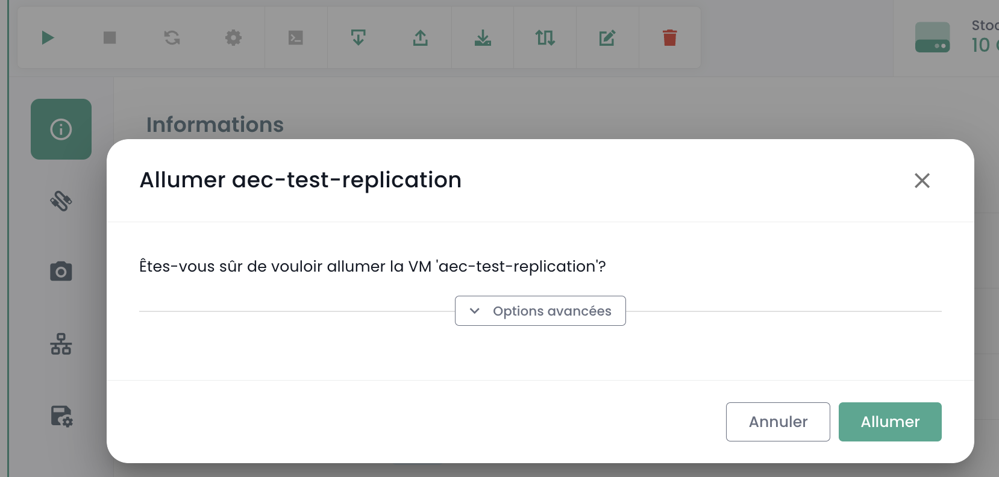

Es posible observar la consola y el appliance Fortinet reiniciando nuevamente después del primer arranque:


Después de este segundo arranque, la dirección IP indicada en el despliegue de la máquina virtual en la sección **OvfProperties**, debe responder al ping, siempre que haya acceso a la red de interconexión.

## Configuración inicial
### Conexión a la consola
En la consola de Cloud Temple, seleccione su appliance de Fortinet y solicite la consola del appliance.

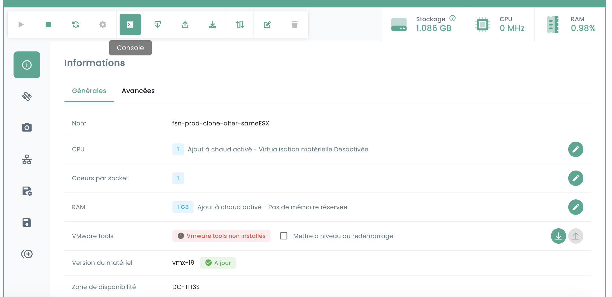

Dependiendo del momento en que accedió a la consola, puede haber visto el inicio y reinicio iniciales de la misma:


Luego, puede conectarse a la consola del appliance, el nombre de usuario es "**admin**". El appliance le pedirá que cambie la contraseña (no hay una por defecto, solo presione ENTER).

Entonces, debe ingresar una nueva contraseña.

**Atención: El appliance está en teclado QWERTY.**

**En caso de error de contraseña, deberá reinstalar su appliance.**

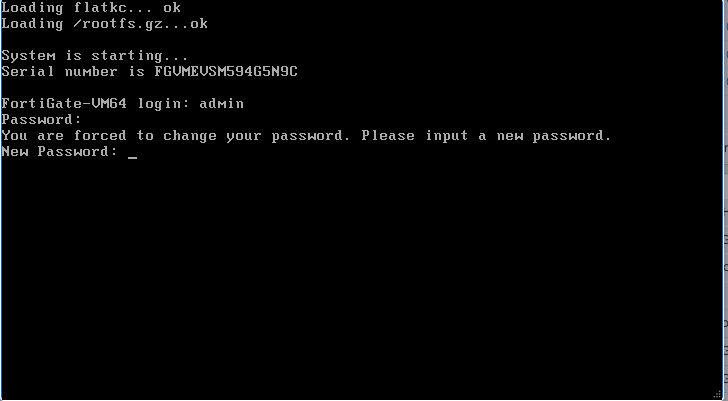


### Configuración de la sesión BGP
En esta etapa, vamos a configurar en modo consola su appliance Fortinet para establecer el enlace BGP4

#### Configuración del rango de IPs Públicas
El primer paso es definir los rangos de direcciones IP públicas. Para empezar, solo configuraremos el primer bloque. Utilizaremos la información que ha anotado previamente.

    config router prefix-list
        edit "pfx_net_public_customer"
        config rule
        edit 1
            set prefix 80.75.159.90/31
                unset ge
                set le 32
            next
        edit 100
            set action deny
            set prefix 0.0.0.0 0.0.0.0
                unset ge
                unset le
            next
        end
    next
    edit "pfx_deny_all"
        config rule
            edit 1
                set action deny
                set prefix 0.0.0.0 0.0.0.0
                unset ge
                unset le
        next
        end
    next
    end

Entonces puede verificar que la configuración se ha realizado correctamente con el comando:

    show router prefix-list

#### Configuración del mapa de ruta
Una "política de mapa de rutas" se utiliza para definir políticas de enrutamiento más complejas que pueden influir o modificar el comportamiento del tráfico de red basado en criterios específicos. Los mapas de rutas son particularmente útiles para tareas avanzadas de gestión de tráfico, tales como el filtrado de rutas, la redirección de tráfico o la modificación de atributos de ruta en protocolos de enrutamiento dinámico como BGP (Border Gateway Protocol). En nuestro contexto, tiene como objetivo proteger su red de anuncios no válidos.

El segundo paso consiste en configurar la política de mapa de rutas:

    config router route-map
        edit "rm_deny_all"
            config rule
            edit 1
                set match-ip-address "pfx_deny_all"
            next
        end
        next
        edit "rm_net_public_customer"
            config rule
            edit 1
                set match-ip-address "pfx_net_public_customer"
            next
        end
        next
    end

Entonces puede verificar que la configuración se realizó correctamente con el comando:

    show router route-map

#### Configuración del anuncio BGP

Ahora vamos a configurar el anuncio BGP. Debe tener en su posesión, como se vio anteriormente en esta guía, la ip de interconexión (aquí, el router-id), la dirección IP del peer BGP4 (aquí, **100.64.0.1** y **100.64.0.2**), el AS local (aquí **4200000005**) y el rango IP Público previamente configurado. _**Recuerde**_: 


y


En esta configuración, el AS (sistema autónomo) de Cloud Temple es el 33930. El AS 65001 es un AS privado que le representa. El uso de un número de AS privado a este nivel es más adecuado, especialmente si se deben configurar varias conexiones BGP.

    config router bgp
        set as 65001                                                                    
        set router-id **100.64.1.110**                                                     
        set network-import-check disable                                                    
        set graceful-restart enable                                                           
        config neighbor
            edit "100.64.0.1" 
                set capability-graceful-restart enable
                set ebgp-enforce-multihop enable
                set next-hop-self enable
                set soft-reconfiguration enable
                set ebgp-multihop-ttl 3
                set remote-as 33930
                set local-as 4200000005
                set route-map-in "rm_deny_all"
                set route-map-out "rm_net_public_customer"
                set keep-alive-timer 10
                set holdtime-timer 30
            next
            edit "100.64.0.2"
                set capability-graceful-restart enable
                set ebgp-enforce-multihop enable
                set next-hop-self enable
                set soft-reconfiguration enable
                set ebgp-multihop-ttl 3
                set remote-as 33930
                set local-as 4200000005
                set route-map-in "rm_deny_all"
                set route-map-out "rm_net_public_customer"
                set keep-alive-timer 10
                set holdtime-timer 30
            next
        end

    config network
        edit 1
            set prefix 80.75.159.90/31
        next
    end
    config redistribute "connected"
    end
    config redistribute "static"
        set status enable
    end
    end

Luego puede verificar que las sesiones BGP están establecidas:

    get router info bgp summary

#### Configuración de la dirección de LoopBack
Utilizando la dirección de loopback para establecer sesiones BGP entre pares, la estabilidad de la sesión se mejora. Las direcciones de loopback no dependen del estado de una interfaz física específica. Por lo tanto, incluso si una interfaz falla o si una ruta se interrumpe, la sesión BGP puede permanecer activa siempre que haya otra ruta de enrutamiento válida entre los pares. Esto incrementa la redundancia y la resiliencia de la red.

Usar direcciones de loopback para las sesiones BGP también ayuda a fortalecer la seguridad. Las políticas de seguridad pueden aplicarse de manera más uniforme y efectiva a las direcciones de loopback, y medidas de seguridad adicionales como la autenticación y las listas de control de acceso pueden implementarse más fácilmente.

Aconsejamos nombrar la dirección de LoopBack utilizando la primera IP pública del primer rango, que debería ser la dirección predeterminada para salir a Internet: **LOOP_"PENÚLTIMO OCTETO DE LA IP PÚBLICA"_"ÚLTIMO OCTETO DE LA IP PÚBLICA"**

Por ejemplo, si su primera IP Pública de su primer rango es 80.75.159.90/32, el loopback se nombra **LOOP_159.90**.
En la línea de comando de su dispositivo, escriba (**¡Atención 80.75.159.90/32 es aquí un ejemplo!**):

```
    config system interface
        edit "LOOP_159_90"
        set vdom "root"
        set ip 80.75.159.90/32
        set allowaccess ping
        set type loopback
        next
    end
    config firewall ippool
        edit "NAT-PUB-ALL"
        set startip 80.75.159.90
        set endip 80.75.159.90
        next
    end
    config system dns
        set primary 96.45.45.45
        set secondary 96.45.46.46
        set source-ip 80.75.159.90
    end
    config system fortiguard
        set update-server-location eu
        set source-ip 80.75.159.90
    end
    config system ntp
        set ntpsync enable
        set source-ip 80.75.159.90
    end
```

Esto permite la configuración inicial de NAT, DNS, prevención de intrusiones y el reloj. Ahora, su dispositivo debería poder hacer ping al exterior si la IP de origen es la IP de NAT (aquí en este ejemplo 80.57.159.90).

**También aconsejamos cambiar el puerto de administración, que por defecto es 80 o 443.**

#### Configuración de las interfaces WAN y HA
Con el fin de simplificar la legibilidad de las interfaces en la administración de los equipos, recomendamos renombrar las interfaces para que su nombre corresponda con su rol en el cortafuegos. Esto se realiza mediante la definición de un alias para la interfaz.

El puerto1 se define como WAN y el puerto2 se renombra HA. Para el puerto de HA, se define una dirección IP en el subred APIPA para que los equipos puedan unirse de esta manera una vez en clúster.

```
config system interface
        edit "port1"
                set alias "WAN"
        next
        edit "port2"
                set ip 169.254.254.1 255.255.255.252
                set allowaccess ping
                set type physical
                set alias "HA"
                set snmp-index 2
        next
end
```

### Despliegue de un segundo miembro


#### Despliegue de la segunda VM
Para desplegar un segundo miembro para la clusterización, se recomienda disponer de una segunda ZA para asegurar una alta disponibilidad del cluster de firewall.

Para el despliegue del segundo appliance, se deberá repetir las acciones de despliegue indicadas anteriormente en la segunda ZA:
- Añadido del template OVF en una biblioteca de contenido
- Despliegue de una VM desde esta biblioteca de contenido
- Asignación de una política de respaldo

Recomendamos mantener la política de nomenclatura de la VM, es decir FGT-VM-0X-ROL-ZA y para la dirección IP de la primera interfaz, se utilizará la segunda IP libre del rango de interconexión.

#### Configuración de las interfaces WAN y HA
Siempre con el objetivo de simplificar la legibilidad de las interfaces, estas deben ser renombradas en el segundo miembro. También será necesario, durante esta etapa, configurar la dirección IP de la interfaz HA para que los dispositivos puedan comunicarse para la configuración del cluster.

```
config system interface
        edit "port1"
                set alias "WAN"
        next
        edit "port2"
                set ip 169.254.254.2 255.255.255.252
                set allowaccess ping
                set type physical
                set alias "HA"
                set snmp-index 2
        next
end
```

### Configuración del cluster
Configuraremos un clúster Activo/Pasivo. La contraseña es una clave compartida entre los dos miembros del clúster y debe mantenerse de manera segura. La comunicación entre los dispositivos se realiza en unicast, por lo que la IP de par que se debe indicar es la de la interfaz HA del firewall con el cual establecer el clúster.
Finalmente, las interfaces mencionadas en la sección *monitor* son las interfaces supervisadas; si se pierde el enlace L2, esto desencadena un cambio de clúster.

En el primer dispositivo, esto resulta en la siguiente configuración:

```
config system ha
    set mode a-p
	set group-name "FTG-HA-INTERNET"
    set group-id 16
    set password SECRET
    set hbdev HA 10
	set priority 100
    set monitor "HA" "WAN"
    set unicast-hb enable
    set unicast-hb-peerip 169.254.254.2
end 
```

Finalmente, en el segundo, cambiaremos la dirección IP del par y reduciremos la prioridad para que el primer dispositivo sea elegido por defecto como el miembro activo del clúster:

```
config system ha
    set mode a-p
	set group-name "FTG-HA-INTERNET"
    set group-id 16
    set password SECRET
    set hbdev HA 10
	set priority 200
    set monitor "HA" "WAN"
    set unicast-hb enable
    set unicast-hb-peerip 169.254.254.1
end 
```

La sincronización puede tardar unos minutos en establecerse.
Para una verificación completa, el comando *get sys ha status* es el indicado. Para verificar de manera más sucinta, se debe utilizar *diag sys ha checksum cluster*
Cuando la sincronización está funcional, los checksums de la línea *all* deben ser idénticos en ambos dispositivos.
  
```
# diag sys ha checksum cluster
```
```
================== FG3H0ZZZNNNNNNN1 ==================

is_manage_primary()=1, is_root_primary()=1
zona de depuración
global: 2e b4 fb 43 fb 7a 98 7f db ed c0 47 5b 35 e4 1f 
raíz: bb 66 88 7d df ab 27 f0 b3 a8 a7 72 f4 a0 f3 2d 
todo: c9 4b 3b e2 1b e6 25 89 df d2 95 31 ba 8b 47 bb 

suma de comprobación
global: 2e b4 fb 43 fb 7a 98 7f db ed c0 47 5b 35 e4 1f 
raíz: bb 66 88 7d df ab 27 f0 b3 a8 a7 72 f4 a0 f3 2d 
todo: c9 4b 3b e2 1b e6 25 89 df d2 95 31 ba 8b 47 bb 

================== FG3H0ZZZNNNNNNN2 ==================

is_manage_primary()=0, is_root_primary()=0
zona de depuración
global: 2e b4 fb 43 fb 7a 98 7f db ed c0 47 5b 35 e4 1f 
raíz: bb 66 88 7d df ab 27 f0 b3 a8 a7 72 f4 a0 f3 2d 
todo: c9 4b 3b e2 1b e6 25 89 df d2 95 31 ba 8b 47 bb 

suma de comprobación
global: 2e b4 fb 43 fb 7a 98 7f db ed c0 47 5b 35 e4 1f 
raíz: bb 66 88 7d df ab 27 f0 b3 a8 a7 72 f4 a0 f3 2d 
todo: c9 4b 3b e2 1b e6 25 89 df d2 95 31 ba 8b 47 bb 
```


#### Configuración de los accesos externos en el firewall
Primero, movemos el puerto de administración del puerto 443 al puerto 8443 para permitir la liberación de un puerto estándar que se pueda utilizar para usos profesionales.
```
config system global
	set admin-sport 8443
end
```

Añadimos un servicio personalizado para las reglas de flujo que hay que seguir:
```
config firewall service custom
    edit "TCP-8443"
        set tcp-portrange 8443
    next
end
```

Autorización de la administración en la interfaz WAN y en la interfaz de bucle. Será importante en esta etapa adaptar el nombre de la interfaz LOOP tal y como se definió anteriormente:
```
edit port1
	set allowaccess ping https ssh http
next

config system interface 
	edit "LOOP_0"
        set allowaccess ping https ssh http snmp
	next
end
```

Luego, creamos una regla de flujo que autoriza el acceso a las interfaces de administración en la interfaz de bucle. Esta regla es muy permisiva; autoriza todas las direcciones IP, conviene filtrar luego sobre rangos explícitamente permitidos.
```
config firewall policy
    edit 1
        set name "WAN to LOOP"
        set srcintf "port1"
        set dstintf "LOOP_0"
        set action accept
        set srcaddr "all"
        set dstaddr "all"
        set schedule "always"
        set service "ALL_ICMP" "HTTP" "HTTPS" "SSH" "TCP-8443"
    next
end
```

Por último, restringimos la autenticación de la cuenta del administrador a rangos de IP preestablecidos. Esta es una fuerte recomendación de seguridad de Cloud Temple.
```
config system admin
    edit "admin"
        set trusthost1 100.64.1.99/32
        set trusthost2 1.2.3.4/32
        set trusthost3 5.6.7.8/32
        set accprofile "super_admin"
        set vdom "root"
        set password SECRET
     next
end
```