## Oggetto di questa guida
Questa guida dettaglia i passaggi fondamentali per distribuire efficacemente un firewall individuale o un cluster di firewall in un ambiente SecNumCloud.

**Nota:** *Le configurazioni presentate in questo documento servono da guida di riferimento e devono essere attentamente adattate alle specificità tecniche, ai requisiti di sicurezza e agli obiettivi operativi propri di ogni ambiente*

## Prerequisiti per questa guida
### Diritti Necessari
Il dispiegamento degli appliance virtuali richiede l'accesso al tenant del cliente nella console Cloud Temple con i seguenti permessi specifici:

Se utilizzate l'offerta **OpenIaaS**:

| Nome del permesso                              | Descrizione del permesso                                                                                                              |
| ---------------------------------------------- | ------------------------------------------------------------------------------------------------------------------------------------- |
| compute_iaas_opensource_console_access         | Offerta OpenIaaS - Apertura della console di una macchina virtuale                                                                    |
| compute_iaas_opensource_infrastructure_read    | Offerta OpenIaaS - Consultazione di dati avanzati delle risorse VMware (regole affinità/anti-affinità, configurazione DRS, ecc.)      |
| compute_iaas_opensource_infrastructure_write   | Offerta OpenIaaS - Gestione avanzata delle risorse VMware                                                                             |
| compute_iaas_opensource_read                   | Offerta OpenIaaS - Consultazione delle risorse di tipo Macchine Virtuali                                                              |
| compute_iaas_opensource_management             | Offerta OpenIaaS - Gestione delle risorse di tipo Macchine Virtuali                                                                   |
| compute_iaas_opensource_virtual_machine_power  | Offerta OpenIaaS - Gestione dell'alimentazione di una macchina virtuale                                                               |
| activity_read                                  | Consultazione dei registri log e attività                                                                                             |

Se utilizzate l'offerta **Vmware**:

| Nome del permesso                              | Descrizione del permesso                                                                                                              |
| ---------------------------------------------- | ------------------------------------------------------------------------------------------------------------------------------------- |
| compute_iaas_vmware_console_access             | Offerta Vmware - Apertura della console di una macchina virtuale                                                                      |
| compute_iaas_vmware_infrastructure_read        | Offerta Vmware - Consultazione di dati avanzati delle risorse VMware (regole affinità/anti-affinità, configurazione DRS, ecc.)       |
| compute_iaas_vmware_infrastructure_write       | Offerta Vmware - Gestione avanzata delle risorse VMware                                                                               |
| compute_iaas_vmware_read                       | Offerta Vmware - Consultazione delle risorse di tipo Macchine Virtuali                                                               |
| compute_iaas_vmware_management                 | Offerta Vmware - Gestione delle risorse di tipo Macchine Virtuali                                                                    |
| compute_iaas_vmware_virtual_machine_power      | Offerta Vmware - Gestione dell'alimentazione di una macchina virtuale                                                                 |
| activity_read                                  | Consultazione dei registri log e attività                                                                                             |
  
Se desiderate utilizzare __*Terraform*__, sono richiesti i seguenti permessi aggiuntivi:

| Nome del permesso                              | Descrizione del permesso                                                                                                              |
| ---------------------------------------------- | ------------------------------------------------------------------------------------------------------------------------------------- |
| tag_read                                       | Consultazione dei tag, esclusi i tag RTMS                                                                                             |
| tag_write                                      | Gestione dei tag, esclusi i tag RTMS                                                                                                  |
| iam_read                                       | Consultazione dei diritti utenti                                                                                                      |
| iam_write                                      | Gestione dei diritti utenti                                                                                                           |

L'immagine OVA dell'appliance da distribuire deve essere disponibile prima di iniziare il processo. Troverete le immagini Fortinet su [il sito del supporto](https://support.fortinet.com/welcome/). È necessario disporre di un account di supporto Fortinet.

Andare nella **sezione Download** poi **Firmware Images**:


**Al 1° Luglio 2024, si raccomanda la versione 7.2.**

L'immagine da recuperare è la FGT_VM64 in formato OVF/ZIP:

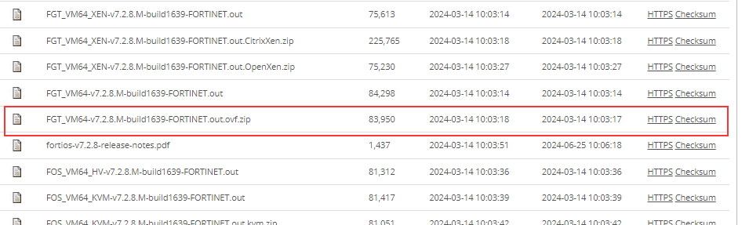{:height="80%" width="80%"}

**Nota:** *Se avete sottoscritto a una unità di opera firewall Fortinet, il supporto Cloud Temple può mettere a disposizione l'immagine in formato OVA nonché la licenza associata.*

| Unità di opera di infrastruttura - FIREWALLS VIRTUALI | Unità             | sku                     |
| :---------------------------------------------------- | :---------------- | :---------------------- |
| FIREWALL UTM -Fortigate Virtuale VM02V - senza vdom   | 1 cluster virtuale | csp:fr1:licence:fw:ftg2 |
| FIREWALL UTM -Fortigate Virtuale VM04V - senza vdom   | 1 cluster virtuale | csp:fr1:licence:fw:ftg4 |
| FIREWALL UTM -Fortigate Virtuale VM08V - senza vdom   | 1 cluster virtuale | csp:fr1:licence:fw:ftg8 |
| FIREWALL UTM -Fortigate - 5 vdom aggiuntivi           | 5 vdom             | csp:fr1:licence:fw:vdom |

### Informazioni di connettività di rete
Dovete disporre delle informazioni necessarie per stabilire la sessione BGP con il backbone. Questi dati sono disponibili nella console Cloud Temple, nella sezione Network → Internet → ASNs :

{:height="80%" width="80%"}

Dovete anche disporre di un blocco di indirizzi IP pubblici la cui estensione è proporzionata alle vostre esigenze. Il blocco di indirizzi riservato è indicato nella console Cloud Temple nella sezione Network → Internet → IP pubbliche. Ecco un esempio :

{:height="80%" width="80%"}

Infine, dovete avere il blocco che vi è stato assegnato sulla rete di interconnessione BGP per poter beneficiare di un percorso verso Internet. La rete di interconnessione Cloud Temple è la 100.64.0.0/16 e ogni accesso gode di una sotto-rete di interconnessione di tipo /28. Questa rete è utilizzata per lo stabilimento della sessione BGP con il core di routing Cloud Temple. Troverete questo blocco nella console Cloud Temple nella sezione Network → Internet → IPs di interconnessione. Ecco un esempio :

{:height="80%" width="80%"}

**Nota:** *Dovete aver sottoscritto alle unità di lavoro associate alla connettività Internet. Vedrete quindi apparire le informazioni di connettività nella console Cloud Temple.*

## Architettura di rete tipica
L'architettura standard di un dispiegamento Cloud Temple è di tipo Cluster per la continuità operativa. Implica l'implementazione e l'iscrizione ad almeno 2 zone di disponibilità in una regione.

Il dispiegamento standard dei firewall si realizza in cluster, con un'apparecchiatura in ogni zona di disponibilità SNC. Una rete virtuale assicura la sincronizzazione del cluster. Le porte WAN accedono a Internet tramite la rete di interconnessione.

È necessaria una configurazione iniziale per stabilire le sessioni BGP, permettendo così la connettività Internet. I VLAN privati sono instradati verso le interfacce LAN del firewall virtuale tramite un trunk (aggregazione di reti di livello 2 mediante la tecnologia 802.1q).

**Nota:** *Benché non sia un'architettura raccomandata, questa guida è applicabile anche ai dispiegamenti mono-AZ.*

## Importare l'appliance Fortinet nella console Cloud Temple
### Estrazione del file appliance
Dopo aver scaricato il file dal sito di supporto Fortinet, decomprimete il file ZIP per ottenere:

- I dischi virtuali VMDK dell'appliance,

- I file OVF che descrivono l'appliance per diversi formati di hardware virtuale VMware.

{:height="80%" width="80%"}

Ecco i tipi di template comunemente inclusi nel .ZIP:

| Template                     | Compatibile con                          |
| ---------------------------- | ----------------------------------------- |
| FortiGate-VM64.ovf           | ESXI 8.0(Versione Hardware 20) o successiva    |
| FortiGate-VM64.hw13.ovf      | ESXI 6.5(Versione Hardware 13) o successiva    |
| FortiGate-VM64.hw15.ovf      | ESXI 6.7U2+(Versione Hardware 15) o successiva |
| FortiGate-VM64.hw17.ovf      | ESXI 7.0(Versione Hardware 17) o successiva    |
| FortiGate-VM64.vapp.ovf      | ESXI 8.0(Versione Hardware 20) o successiva    |
| FortiGate-VM64.nsxt.ovf      | ESXI 6.7U2+(Versione Hardware 15) o successiva |
| FortiGate-VM64-ZNTA.vapp.ovf | ESXI 7.0(Versione Hardware 17) o successiva    |

### Importare l'appliance nel vostro catalogo di immagini tramite la console Cloud Temple

Connettiti al tuo tenant all'interno della console Cloud Temple, quindi vai in "**Catalogo**" e "**Pubblica file**":

{:height="80%" width="80%"}

Scegli un nome per la tua immagine. Ti consigliamo di utilizzare: **FGT-VM-VERSIONE-AZ**, per esempio qui FGT-VM-*7.2.8*-*TH3S*:

{:height="80%" width="80%"}

Successivamente, indica la libreria immagini della zona di disponibilità **(1)**:

{:height="80%" width="80%"}

Scegli poi i file da pubblicare nella libreria **(2)**:

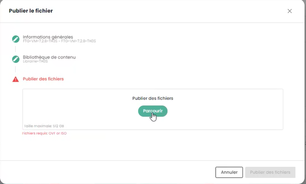{:height="80%" width="80%"}

{:height="80%" width="80%"}

Clicca poi su "**pubblica file**":

{:height="80%" width="80%"}

Attendi il completamento del caricamento dei tuoi file nella libreria:


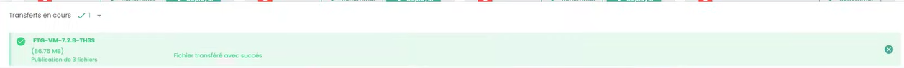

*L'operazione deve essere ripetuta per ogni zona di disponibilità in cui desideri distribuire un'applicazione.*

Ad esempio, per la seconda zona PAR7S:

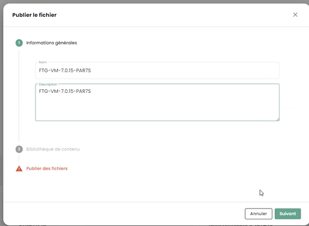


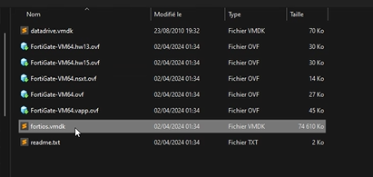


**Nota bene:**

- _**(1)**_ *Ogni zona di disponibilità dispone di una libreria immagini per gli ipervisor della propria zona.*

- _**(2)**_ *per il file .ovf, scegliere una versione che abbia un hardware virtuale compatibile con la versione degli ipervisor ESXi (al 1° luglio 2024, la versione massima supportata è la __v19__ corrispondente agli ESX 7.0.x.).*

## Distribuzione dell'applicazione Fortinet su una zona di disponibilità

### Pianificare il dispiegamento della vostra interconnessione BGP
Dovete selezionare un indirizzo IP di interconnessione per il vostro futuro appliance Firewall. Il primo indirizzo è sempre la gateway BGP Cloud Temple. Gli altri indirizzi sono quindi in linea di principio disponibili (a meno che non abbiate precedentemente dispiegato altri dispositivi):


La regola è quella di prendere gli indirizzi IP liberi in sequenza:


### Pianificare l'utilizzo dei vostri indirizzi IP pubblici
Tutti gli indirizzi IP pubblici allocati sono utilizzabili per il vostro tenant. La dimensione della sotto-rete dipende dalle unità di lavoro sottoscritte.


### Parametri di configurazione BGP4
Prendete nota delle seguenti 3 informazioni importanti per la successiva configurazione BGP4:

{:height="80%" width="80%"}

- **AS Partner** : l'AS remoto utilizzato per stabilire la sessione BGP dal punto di vista del firewall è quello di Cloud Temple.

- **Route Servers** : I due peer BGP con cui stabilire una sessione BGP.

- **Nome** : il numero di AS appartenente al tenant; rimuovere il prefisso *AS* lasciando solo il numero.


### Distribuire l'applicazione sull'infrastruttura

Dalla libreria dell'area di disponibilità in cui desiderate installare il vostro applicativo, selezionate il template e poi "**Distribuire**" :


Dopodiché, dovete assegnare un nome alla macchina virtuale; vi consigliamo la seguente nomenclatura: FGT-VM-**0X**-**RUOLO**-**AZ**

- **0X** : corrisponde al tipo di licenza Fortigate a cui avete sottoscritto:


- **RUOLO** : Per esempio INTERNET per un firewall di interconnessione INTERNET.

- **AZ** : L'area di disponibilità


Scegliete poi l'area di disponibilità :


Quindi il cluster ipervisore di destinazione :

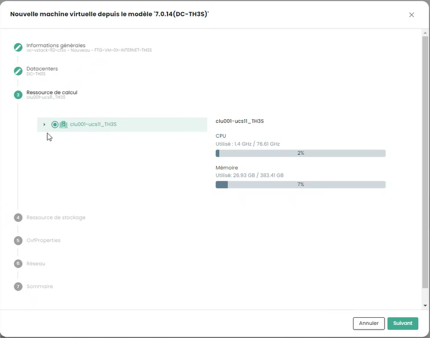

Scegliete il target di memorizzazione:

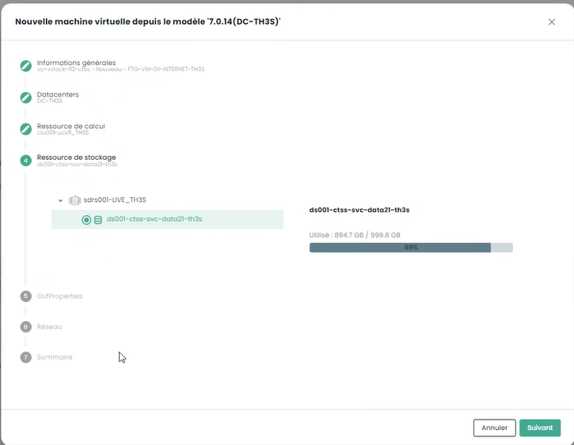

Indicate infine le informazioni di configurazione del vostro applicativo, e in particolare le informazioni di indirizzamento ottenute in precedenza :


- **Token** : non indicare nulla

- **URL Configurazione** : non indicare nulla

- **Hostname** : identico al nome del contenitore della VM

- **DNS** : 208.91.112.53 e 208.91.112.2 (di default, ma potete decidere di utilizzare altri DNS a vostra discrezione)

- **IP Interfaccia** : primo IP di interconnessione libero

- **Netmask** : netmask della rete di interconnessione

- **Interfaccia 2** : non configurata

Cliccate poi su **Avanti**. Le informazioni di configurazione delle interfacce devono essere fornite. La prima interfaccia è da utilizzare per l'accesso internet; le altre sono temporaneamente impostate sul VLAN dedicato alla high availability:


infine, cliccare su "**Distribuire**".

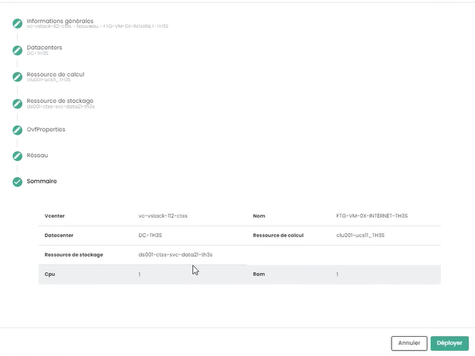


Quando il dispiegamento è completato, la console Cloud Temple vi informerà :

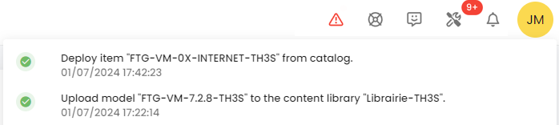

Il vostro applicativo è ora visibile nelle macchine virtuali :


### Assegnazione di una politica di backup
In un ambiente SecNumCloud, una macchina virtuale deve avere una politica di backup prima di poter essere avviata. Potete configurarla nelle politiche e avviare il compito di inventario:


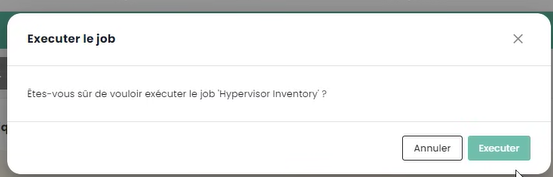

Assegnare la politica corrispondente al RPO desiderato, come impostazione predefinita potete scegliere una politica giornaliera:


Potete confermare la vostra scelta:


Se sono richieste politiche supplementari (come in questo esempio 'daily' e 'monthly'), ripetere l'operazione per ogni politica aggiuntiva.

### Avvio della macchina virtuale
L'avvio della macchina virtuale avviene dalla console Cloud Temple:


È possibile osservare la console e l'appliance Fortinet riavviarsi nuovamente al termine del primo avvio:


Dopo questo secondo avvio, l'indirizzo IP indicato nel dispiegamento della macchina virtuale nella sezione **OvfProperties**, deve rispondere al ping a condizione di avere accesso alla rete di interconnessione.

## Configurazione iniziale

### Connessione alla console
Nella console Cloud Temple, selezionate il vostro apparecchio Fortinet e richiedete la console dell'apparecchio.


A seconda del momento in cui avete acceduto alla console, potreste aver visto il boot iniziale e il riavvio di quest'ultimo:


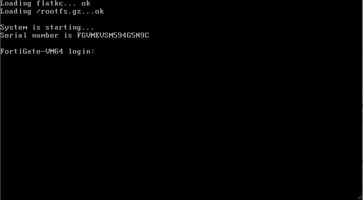

Potete poi connettervi sulla console dell'apparecchio, il nome utente è "**admin**". L'apparecchio vi chiederà di cambiare la password (non ce n'è una per default, premete solo ENTER).

Dovete quindi inserire una nuova password.

**Attenzione: L'apparecchio utilizza una tastiera QWERTY.**

**In caso di errore di password, dovrete reinstallare il vostro apparecchio.**


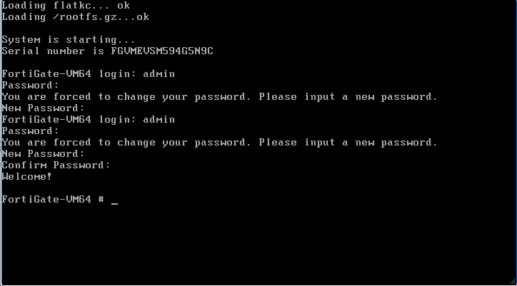

### Configurazione della sessione BGP

In questa fase, configureremo in modalità console il vostro appliance Fortinet per stabilire il collegamento BGP4

#### Configurazione del range di IP Pubblici

Il primo passo consiste nel definire gli intervalli degli indirizzi IP pubblici. Per cominciare, configureremo solo il primo blocco. Utilizzeremo le informazioni che avete precedentemente annotato.

    config router prefix-list
        edit "pfx_net_public_customer"
        config rule
        edit 1
            set prefix 80.75.159.90/31
                unset ge
                set le 32
            next
        edit 100
            set action deny
            set prefix 0.0.0.0 0.0.0.0
                unset ge
                unset le
            next
        end
    next
    edit "pfx_deny_all"
        config rule
            edit 1
                set action deny
                set prefix 0.0.0.0 0.0.0.0
                unset ge
                unset le
            next
            end
    next
    end

Potete poi verificare che la configurazione sia stata realizzata correttamente con il comando:

    show router prefix-list

#### Configurazione della route map
Una "route map policy" serve a definire politiche di instradamento più complesse che possono influenzare o modificare il comportamento del traffico di rete in base a criteri specifici. Le route map sono particolarmente utili per compiti avanzati di gestione del traffico, come il filtraggio di rotte, il reindirizzamento del traffico, o la modifica di attributi di rotta in protocolli di instradamento dinamico come BGP (Border Gateway Protocol). Nel nostro contesto, mira a proteggere la vostra rete dalle annunci non validi.

Il secondo passo consiste nello configurare la route map policy :

    config router route-map
        edit "rm_deny_all"
            config rule
            edit 1
                set match-ip-address "pfx_deny_all"
            next
        end
        next
        edit "rm_net_public_customer"
            config rule
            edit 1
                set match-ip-address "pfx_net_public_customer"
            next
        end
        next
    end

Potete poi verificare che la configurazione sia stata eseguita correttamente con il comando :

    show router route-map

#### Configurazione dell'annuncio BGP
Ora procederemo a configurare l'annuncio BGP. Dovete possedere, come visto precedentemente in questa guida, l'IP di interconnessione (qui, il router-id), l'indirizzo IP del peer BGP4 (qui, **100.64.0.1** e **100.64.0.2**), il local AS (qui **4200000005**) e l'intervallo IP Pubblico precedentemente configurato. _**Ricordatevi**_ :


e


In questa configurazione, l'AS (sistema autonomo) di Cloud Temple è il 33930. L'AS 65001 è un AS privato che vi rappresenta. L'utilizzo di un numero di AS privato a questo livello è più appropriato, in particolare se sono da configurare molteplici connessioni BGP.

    config router bgp
        set as 65001                                                                    
        set router-id **100.64.1.110**                                                     
        set network-import-check disable                                                    
        set graceful-restart enable                                                           
        config neighbor
            edit "100.64.0.1" 
                set capability-graceful-restart enable
                set ebgp-enforce-multihop enable
                set next-hop-self enable
                set soft-reconfiguration enable
                set ebgp-multihop-ttl 3
                set remote-as 33930
                set local-as 4200000005
                set route-map-in "rm_deny_all"
                set route-map-out "rm_net_public_customer"
                set keep-alive-timer 10
                set holdtime-timer 30
            next
            edit "100.64.0.2"
                set capability-graceful-restart enable
                set ebgp-enforce-multihop enable
                set next-hop-self enable
                set soft-reconfiguration enable
                set ebgp-multihop-ttl 3
                set remote-as 33930
                set local-as 4200000005
                set route-map-in \"rm_deny_all\"
                set route-map-out \"rm_net_public_customer\"
                set keep-alive-timer 10
                set holdtime-timer 30
            next
        end

    config network
        edit 1
            set prefix 80.75.159.90/31
        next
    end
    config redistribute "connected"
    end
    config redistribute "static"
        set status enable
    end
    end

Potete poi verificare che le sessioni BGP siano stabili:

    get router info bgp summary

#### Configurazione dell'indirizzo di LoopBack
Utilizzando l'indirizzo di loopback per stabilire sessioni BGP tra pari, la stabilità della sessione è migliorata. Gli indirizzi di loopback non dipendono dallo stato di un'interfaccia fisica specifica. Pertanto, anche se un'interfaccia cade in avaria o se un percorso viene interrotto, la sessione BGP può rimanere attiva finché esiste un altro percorso di routing valido tra i pari. Questo aumenta la ridondanza e la resilienza della rete.

L’utilizzo degli indirizzi di loopback per le sessioni BGP consente anche di rafforzare la sicurezza. Le politiche di sicurezza possono essere applicate in modo più uniforme ed efficace agli indirizzi di loopback, e misure di sicurezza aggiuntive come l'autenticazione e le liste di controllo degli accessi possono essere implementate più facilmente.

Consigliamo di nominare l'indirizzo di LoopBack utilizzando il primo indirizzo IP pubblico del primo range, che dovrebbe essere l'indirizzo di default per uscire su Internet: **LOOP_"PENULTIMO OTTETTO DELL'IP PUBBLICO"_"ULTIMO OTTETTO DELL'IP PUBBLICO"**

Ad esempio, se il vostro primo IP Pubblico del vostro primo range è 80.75.159.90/32, il loopback sarà nominato **LOOP_159.90**.
Nella linea di comando del vostro dispositivo, digitate (**Attenzione, 80.75.159.90/32 è qui un esempio!**): 

```
    config system interface
        edit "LOOP_159_90"
        set vdom "root"
        set ip 80.75.159.90/32
        set allowaccess ping
        set type loopback
        next
    end
    config firewall ippool
        edit "NAT-PUB-ALL"
        set startip 80.75.159.90
        set endip 80.75.159.90
        next
    end
    config system dns
        set primary 96.45.45.45
        set secondary 96.45.46.46
        set source-ip 80.75.159.90
    end
    config system fortiguard
        set update-server-location eu
        set source-ip 80.75.159.90
    end
    config system ntp
        set ntpsync enable
        set source-ip 80.75.159.90
    end
```

Questo consente la configurazione iniziale del NAT, del DNS, della prevenzione delle intrusioni e dell’orologio. Da questo momento in poi, il vostro dispositivo dovrebbe essere in grado di effettuare il ping all'esterno se l'indirizzo IP sorgente è l'IP di NAT (qui in questo esempio 80.57.159.90).

**Consigliamo anche di cambiare la porta di amministrazione, che di default è 80 o 443.**

#### Configurazione delle interfacce WAN e HA
Per semplificare la leggibilità delle interfacce nella gestione delle attrezzature, raccomandiamo di rinominare le interfacce affinché il loro nome corrisponda al loro ruolo sul firewall. Questo si effettua tramite la definizione di un alias per l'interfaccia.

La porta1 è definita come WAN e la porta2 è rinominata HA. Per la porta di HA, viene definito un indirizzo IP nel subnet APIPA affinché le attrezzature possano collegarsi in questo modo una volta in cluster.

```
config system interface
        edit "port1"
                set alias "WAN"
        next
        edit "port2"
                set ip 169.254.254.1 255.255.255.252
                set allowaccess ping
                set type physical
                set alias "HA"
                set snmp-index 2
        next
end
```

### Distribuzione di un secondo membro

#### Implementazione della seconda VM
Per distribuire un secondo membro per la configurazione in clustering, si raccomanda di disporre di una seconda AZ per garantire l'alta disponibilità del cluster di firewall.

Per il dispiegamento della seconda appliance, sarà necessario ripetere le azioni di dispiegamento indicate precedentemente nella seconda AZ:
- Aggiunta del template OVF in una libreria di contenuti
- Dispiegamento di una VM da questa libreria di contenuti
- Assegnazione di una politica di backup

Raccomandiamo di mantenere la politica di denominazione della VM, nello specifico FGT-VM-0X-ROLE-AZ e per l'indirizzo IP della prima interfaccia, si dovrà utilizzare il secondo IP libero della gamma di interconnessione.

#### Configurazione delle interfacce WAN e HA


Sempre nella prospettiva di semplificare la leggibilità delle interfacce, queste devono essere rinominate sul secondo membro. Sarà anche necessario, in questa fase, configurare l'indirizzo IP dell'interfaccia di HA affinché le apparecchiature possano comunicare per la creazione del cluster.

```
config system interface
        edit "port1"
                set alias "WAN"
        next
        edit "port2"
                set ip 169.254.254.2 255.255.255.252
                set allowaccess ping
                set type physical
                set alias "HA"
                set snmp-index 2
        next
end
```

### Creazione del cluster
Stiamo per configurare un clustering Attivo/Passivo. La password costituisce una chiave condivisa tra i due membri del cluster e dovrà essere conservata in modo sicuro. La comunicazione tra le apparecchiature avviene in unicast e quindi l'IP peer da indicare è quello dell'interfaccia HA del firewall con il quale stabilire il cluster.
Infine, le interfacce menzionate nella sezione *monitor* sono le interfacce monitorate, se il collegamento L2 è perso, ciò innescerà uno switch del cluster.

Sul primo apparecchio, ciò si traduce nella seguente configurazione:

```
config system ha
    set mode a-p
	set group-name "FTG-HA-INTERNET"
    set group-id 16
    set password SEGRETO
    set hbdev HA 10
	set priority 100
    set monitor "HA" "WAN"
    set unicast-hb enable
    set unicast-hb-peerip 169.254.254.2
end 
```

Infine, sul secondo, cambieremo l'indirizzo IP del peer e abbasseremo la priorità per assicurare che il primo apparecchio sia eletto di default come membro attivo del cluster:

```
config system ha
    set mode a-p
	set group-name "FTG-HA-INTERNET"
    set group-id 16
    set password SEGRETO
    set hbdev HA 10
	set priority 200
    set monitor "HA" "WAN"
    set unicast-hb enable
    set unicast-hb-peerip 169.254.254.1
end 
```

La sincronizzazione può richiedere alcuni minuti per stabilirsi.
Per un controllo completo, il comando *get sys ha status* è quello indicato. Per verificare in modo più sommario, utilizzare *diag sys ha checksum cluster*
Quando la sincronizzazione è funzionante, i checksum della linea *all* devono essere identici sui due apparecchi.

```
# diag sys ha checksum cluster
```

================== FG3H0ZZZNNNNNNN1 ==================

is_manage_primary()=1, is_root_primary()=1
debugzone
global: 2e b4 fb 43 fb 7a 98 7f db ed c0 47 5b 35 e4 1f 
root: bb 66 88 7d df ab 27 f0 b3 a8 a7 72 f4 a0 f3 2d 
all: c9 4b 3b e2 1b e6 25 89 df d2 95 31 ba 8b 47 bb 

checksum
global: 2e b4 fb 43 fb 7a 98 7f db ed c0 47 5b 35 e4 1f 
root: bb 66 88 7d df ab 27 f0 b3 a8 a7 72 f4 a0 f3 2d 
all: c9 4b 3b e2 1b e6 25 89 df d2 95 31 ba 8b 47 bb 

================== FG3H0ZZZNNNNNNN2 ==================

is_manage_primary()=0, is_root_primary()=0
debugzone
global: 2e b4 fb 43 fb 7a 98 7f db ed c0 47 5b 35 e4 1f 
root: bb 66 88 7d df ab 27 f0 b3 a8 a7 72 f4 a0 f3 2d 
all: c9 4b 3b e2 1b e6 25 89 df d2 95 31 ba 8b 47 bb 

checksum
global: 2e b4 fb 43 fb 7a 98 7f db ed c0 47 5b 35 e4 1f 
root: bb 66 88 7d df ab 27 f0 b3 a8 a7 72 f4 a0 f3 2d 
all: c9 4b 3b e2 1b e6 25 89 df d2 95 31 ba 8b 47 bb 
```


#### Configurazione degli accessi esterni sul firewall
Prima di tutto, si sposta la porta di amministrazione dalla porta 443 alla porta 8443 per rendere disponibile una porta standard che può essere utilizzata per scopi aziendali.
```
config system global
	set admin-sport 8443
end
```

Aggiunta di un servizio personalizzato per le regole di flusso da seguire:
```
config firewall service custom
    edit "TCP-8443"
        set tcp-portrange 8443
    next
end
```

Consentire l'amministrazione sull'interfaccia WAN e sull'interfaccia loopback. Sarà importante in questa fase adattare il nome dell'interfaccia LOOP come definito in precedenza:
```
edit port1
	set allowaccess ping https ssh http
next

config system interface 
	edit "LOOP_0"
        set allowaccess ping https ssh http snmp
	next
end
```

Si crea poi una regola di flusso che permetta l'accesso alle interfacce di amministrazione sull'interfaccia loopback. Questa regola è molto permissiva, consente tutte le indirizzi IP; sarà quindi necessario filtrarla successivamente per includere solo gli intervalli esplicitamente permessi.
```
config firewall policy
    edit 1
        set name "WAN to LOOP"
        set srcintf "port1"
        set dstintf "LOOP_0"
        set action accept
        set srcaddr "all"
        set dstaddr "all"
        set schedule "always"
        set service "ALL_ICMP" "HTTP" "HTTPS" "SSH" "TCP-8443"
    next
end
```

Infine, si restringe l'autenticazione dell'account admin a intervalli di IP predefiniti. Questa è una forte raccomandazione di sicurezza di Cloud Temple.
```
config system admin
    edit "admin"
        set trusthost1 100.64.1.99/32
        set trusthost2 1.2.3.4/32
        set trusthost3 5.6.7.8/32
        set accprofile "super_admin"
        set vdom "root"
        set password SEGRETO
     next
end
```