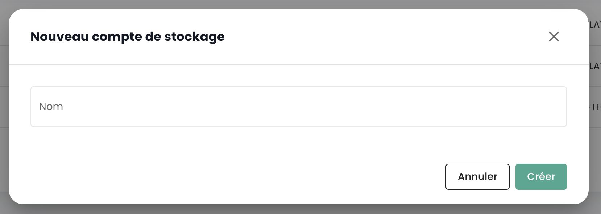

## General Technical Characteristics
### Dell ECS-Based Solution
The __Elastic Cloud Storage (ECS)__ solution by Dell is the foundation of Cloud Temple's object storage offering. It stands out as a benchmark in the cloud storage market. 
This offering is characterized by its high performance and adherence to industrial standards, ensuring 97% compatibility with Amazon AWS S3 object storage protocol.

Its standardized and reversible design guarantees smooth integration and transition for users, 
highlighting the flexibility and user-friendliness of the service.

### Regional Type Product
S3 Cloud Temple storage natively stores data across __three distinct availability zones__ within the same Cloud Temple region. This architecture is designed to provide high availability and maximum resilience against hardware or software failures:
- Erasure Coding (EC): We use a default EC 12+4 scheme, which divides the data into 12 data segments and 4 parity segments. This technique allows for the reconstruction of data even in the event of the loss of several segments.
- Data distribution: The EC segments are distributed across different nodes and racks, ensuring protection against disk, node, and even entire rack failures.
- Geographic replication: For additional protection, data is replicated across 3 availability zones, providing resilience against local disasters.

This replication ensures that even in the event of the failure of a zone, data remains accessible and intact, thus contributing to a highly resilient storage infrastructure.

### Compliance and Certification
Our S3 object storage infrastructure is designed to meet the highest standards in data protection and regulatory compliance. Here is an overview of our certifications, compliance standards, and audit processes:

- SecNumCloud Qualification: Our infrastructure is certified SecNumCloud, the security standard by the French National Cybersecurity Agency (ANSSI) for cloud computing services. This qualification ensures a high level of security and data sovereignty, specifically tailored to French and European requirements.
- HDS Certification (Health Data Hosting): Our infrastructure is designed to meet the requirements of health data hosting, offering a level of security suitable for sensitive medical data.
- ISO 27001 Certification: We follow the best practices outlined by the ISO 27001 standard for information security management.

### Native Encryption

Encryption is systematically applied to stored data, using specific methods and algorithms to secure the data. During the transfer, the TLS 1.3 protocol ensures data protection.

For stored data, several options are available:

- __client-side encryption__, where the user controls the keys and the process,
- __server-side encryption__, where various keys can be used, such as those managed by Cloud Temple or those provided by the client.

Here is a table summarizing the different encryption models offered by Cloud Temple S3 storage, as well as their advantages and disadvantages, including the protocols used:

| Encryption Model                                                    | Protocol Used                         | Advantages                                                                                                                    | Disadvantages                                                                                                                  |
| ------------------------------------------------------------------- | ------------------------------------- | ----------------------------------------------------------------------------------------------------------------------------- | ------------------------------------------------------------------------------------------------------------------------------ |
| **Server-side encryption with S3 managed keys (SSE-S3)**             | AES-256                               | - Simplified key management   - Transparency for the user                                                                  | - Less control for the user over the encryption keys                                                                           |
| **Server-side encryption with customer-provided keys (SSE-C)**       | AES-256                               | - Total control over the encryption keys   - Enhanced security                                                             | - Requires client-side key management   - Increased operational complexity                                                    |
| **Client-side encryption (CSE)**                                    | Depends on the client-side implementation | - Maximum control over data security   - Data is encrypted before leaving the company's perimeter                          | - Complex key management   - Performance potentially impacted by the client-side encryption/decryption process               |

Here are some explanations on this table:

- **SSE-S3 (Server-Side Encryption with S3 managed keys)**: In this model, Cloud Temple S3 storage handles the encryption and key management. Data is automatically encrypted when stored on the disk. This offers a simplified approach to encryption, without additional effort for clients.

- **SSE-C (Server-Side Encryption with Customer-provided keys)**: This model allows customers to provide their own encryption keys for enhanced security. Cloud Temple S3 storage uses these keys to encrypt data before it is stored. This offers increased control but requires secure management of the encryption keys on the client side.

- **CSE (Client-Side Encryption)**: Client-side encryption means that data is encrypted by the client before being sent to Cloud Temple S3 storage. This ensures that the data is secured throughout its transfer and storage, but requires key management and an encryption/decryption process on the client's side.

### Service Levels
Here are the main service levels of the S3 Cloud Temple offer:

| Commitment                                                   | Target                                                     |
| ------------------------------------------------------------ | ---------------------------------------------------------- |
| Availability of the Cloud Temple Object Storage Platform     | 99.99% measured monthly, maintenance window included       |
| Data durability                                              | 99.99999999%                                               |
| Guaranteed network bandwidth                                 | 1 Gbps                                                     |

## The Concept of "Bucket" in the Object Storage Ecosystem
An S3 bucket, popularized by Amazon Simple Storage Service (Amazon S3), is **a public storage container** in the cloud designed to hold an unlimited amount of data securely, reliably, and with high availability. Each S3 bucket can store files (referred to as "objects" in S3), ranging from documents and images to large databases or video files. Buckets are used to logically organize storage space within Cloud Temple's object storage, and each bucket is identified by a unique name provided by the user. S3 buckets offer advanced features, such as versioning, securing data through access control policies, and the ability to make data immutable.

## Listing All S3 Buckets in Your Tenant
You can access all of your buckets through the '__Object Storage__' menu of the Cloud Temple console:

You can view all the accounts created on your tenant and authorized to access the S3 service via the '__Storage Accounts__' tab.

## Creating a New Storage Account
Creating a storage account on your tenant is done by clicking on the '__New Storage Account__' button at the top right, in the '__Storage Accounts__' tab:

{:height="70%" width="70%"}

The platform then provides you with the access key and the secret key for your bucket:

{:height="70%" width="70%"}

__CAUTION:__ The secret and access keys are presented only once. After this initial display, it becomes impossible to view the secret key again. Therefore, it is essential to note this information immediately; otherwise, you will need to generate a new pair of keys.

The regeneration is done at the options level of the key by choosing the "Reset Access Key" option.

## Creation of an S3 bucket
Creating a new bucket is done by clicking the '__New bucket__' button at the top right of the screen:

A window then appears, and you must enter:

1. The **region** where your bucket will be created,
2. The **type** of bucket: performance or archiving,
3. The **name** of your bucket (it must be unique).

{:height="70%" width="70%"}

As of April 3, 2024, the available region is **FR1** (Paris) and only the performance type is available.

You must also choose who can access your bucket:

- **Private** Access: By default, access is limited to Cloud Temple's specific IP addresses.
- **Public** Access: Access is open to all internet addresses (including via the rule 0.0.0.0/0). We advise against this configuration due to its security implications.
- **Custom** Access: This option allows you to specify the IPv4 addresses or subnet ranges you wish to authorize.

## Associating a storage account with a bucket
Associating accounts with buckets is done in the '__Policies__' tab

This association allows the storage account to access the bucket. There are three roles:

1. **Maintainer**: Rights to read, write, manage permissions, and manage policy
2. **Reader**: Read files in the buckets and download them.
3. **Writer**: Read and edit, modify, delete files in the buckets.

{:height="70%" width="70%"}

## Browsing an S3 Bucket
When you click on the name of a bucket, you first access the '__Files__' tab to view its contents:

In the '__Settings__' tab, you can see the details of your S3 bucket:

You then have:

1. The name of the S3 bucket,
2. Its region,
3. The number of objects it contains and the bucket's size in bytes,
4. Its endpoint,
5. The lifecycle settings that define, among other things, the expiration of the bucket's objects. '__0__' corresponds to infinite retention.

You can modify the retention setting via the '__Edit__' button of the lifecycle:

Finally, you can modify its access typology.

## Limitations on access to your S3 buckets
Configuring access restrictions to your S3 buckets is very straightforward. During bucket creation, you have the choice between three access configurations:

{:height="70%" width="70%"}

- **Private** Access: By default, access is limited to specific Cloud Temple IP addresses.
- **Public** Access: Access is open to all internet addresses (including via the 0.0.0.0/0 rule). We advise against this configuration due to its security implications.
- **Custom** Access: This option allows you to specify the IPv4 addresses or subnet ranges that you wish to authorize:

{:height="70%" width="70%"}

*IPv6 support is planned for the first half of 2025.*

## Deletion of an S3 bucket
The deletion of a bucket is performed within the actions associated with the bucket by selecting the __'Delete'__ option.

_**WARNING: Deletion is irreversible and there is no way to recover the data.**_

## FAQ
### What is the maximum file size that can be handled with the web console?

The web limit is 40MB per file. Beyond that, you must use a native S3 client with the API.

### Which S3 client can I use to manage my files?
#### MINIO
You may use the Minio client, for instance:

https://min.io/docs/minio/linux/reference/minio-mc.html

For example:

    mc alias set <alias_name> https://reks2ee2b1.s3.fr1.cloud-temple.com <access_key> <secret_key>

To upload a file:

    mc cp test.txt <alias_name>/<bucket_name>

To retrieve a file:

    mc ls <alias_name>/<bucket_name>

#### Cloud Berry Explorer
You can also use [Cloud Berry Explorer](https://www.msp360.com/explorer/).

1. Connect using your endpoint and key:

2. Once connected, enter the name of the bucket in the navigation bar:

3. You can then use the bucket normally:

#### WINSCP 6.3.x
You can use [Winscp](https://winscp.net/eng/download.php):

1. Connect by using your endpoint, your access key, and your secret key:

2. Once connected, use WINSCP normally as you would with an FTP or SCP site:

### Does the S3 Cloud Temple service use the 'PathStyle' or 'UrlStyle' method?
Due to the constraints associated with the SecNumCloud certification, at this time, the offering is planned to use the '**PathStyle**' method. We are working to make the '**UrlStyle**' method available by H1 2025.

### What is the maximum number of buckets per tenant?
The maximum number of buckets for 1 tenant is 999.

### How to add a file's HASH when uploading an object?
Overall, file HASH is supported on our object storage through metadata. Some clients are able to compute a HASH on the fly and add it as metadata (minio-mc with md5 for example), for others, the data must be directly specified in the metadata.

1. Case of adding a HASH with the minio-mc client: this client supports the on-the-fly computation of an MD5 hash and its storage in the metadata

            ╰─➤  cat test.txt                       
            This is a test 
            ╰─➤  md5 test.txt                       
            MD5 (test.txt) = 8b34b2754802a46e3475998dfcf76f83
            ╰─➤  mc cp -md5 test.txt CLR-PUB/CLR-PUB
            ...lesur/Downloads/test.txt: 18 B / 18 B  ▓▓▓▓▓▓▓▓▓▓▓▓▓▓▓▓▓▓▓▓▓▓▓▓▓▓▓▓▓▓▓▓▓▓▓▓▓▓▓▓▓▓▓▓▓▓▓▓▓▓▓▓▓▓▓▓▓▓▓▓▓▓▓▓▓▓▓▓▓▓▓▓▓▓▓▓▓▓▓▓▓▓▓▓▓▓▓▓▓▓▓▓▓▓▓▓▓▓▓▓▓▓▓▓▓▓  111 B/s 0s
            ╰─➤  mc stat CLR-PUB/CLR-PUB/test.txt
            Name      : test.txt
            Date      : 2024-06-08 10:21:31 CEST 
            Size      : 18 B   
            ETag      : 8b34b2754802a46e3475998dfcf76f83 
            Type      : file 
            Encryption: SSE-S3
            Metadata  :
                Content-Type: text/plain 

2. Example of adding a sha256 "manually": for this we use the S3 attributes of the file.

            ╰─➤  cat test.txt
            This is a test
            ╰─➤  shasum -a 256 test.txt                            
            2c5165a6a9af06b197b63b924d7ebaa0448bc6aebf8d2e8e3f58ff0597f12682  test.txt
            ╰─➤  mc cp -md5 test.txt CLR-PUB/CLR-PUB -attr "checksum-sha256=$(shasum -a 256 test.txt | cut -f1 -d' ')"
            ...lesur/Downloads/test.txt: 18 B / 18 B  ▓▓▓▓▓▓▓▓▓▓▓▓▓▓▓▓▓▓▓▓▓▓▓▓▓▓▓▓▓▓▓▓▓▓▓▓▓▓▓▓▓▓▓▓▓▓▓▓▓▓▓▓▓▓▓▓▓▓▓▓▓▓▓▓▓▓▓▓▓▓▓▓▓▓▓▓▓▓▓▓▓▓▓▓▓▓▓▓▓▓▓▓▓▓▓▓▓▓▓▓▓▓▓▓▓▓  141 B/s 0s
            ╰─➤  mc stat CLR-PUB/CLR-PUB/test.txt                                                                     
            Name      : test.txt
            Date      : 2024-06-08 10:41:17 CEST 
            Size      : 18 B   
            ETag      : 8b34b2754802a46e3475998dfcf76f83 
            Type      : file 
            Encryption: SSE-S3
            Metadata  :
                X-Amz-Meta-Checksum-Sha256: 2c5165a6a9af06b197b63b924d7ebaa0448bc6aebf8d2e8e3f58ff0597f12682 
                Content-Type              : text/plain 

### How is Cloud Temple's S3 offering billed?
The price is a monthly fee, per GiB of storage, billed monthly. However, the platform calculates usage by the hour and carries out billing on a monthly basis of 720 hours.

For example, if you consume 30 GiB for 1 hour within a month and then none, and a few days later 30 GiB for 2 hours, the monthly bill will be *(Price (1 x 30 GiB) + 2 x Price (30 GiB)) / 720* for the month in question. The billing is in arrears.

## Upcoming Milestones
- *__The Pre-Signed URLs__ will be available by the end of Q4 2024.*
- *__The Immutability__ of an S3 bucket is scheduled for H2 2024.*
- *__S3 Glacier__ is planned for the end of H1 2025.*