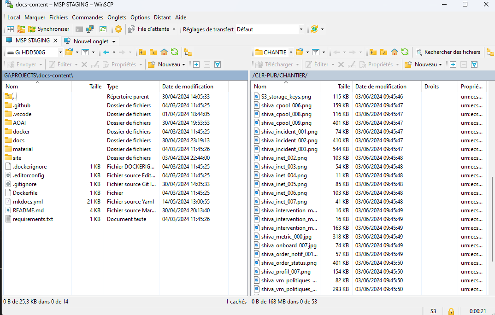

## Caratteristiche tecniche generali
### Soluzione basata su Dell ECS
La soluzione __Elastic Cloud Storage (ECS)__ di Dell è alla base dell'offerta di storage oggetto di Cloud Temple. Si distingue come un punto di riferimento nel mercato dello storage cloud.
Questa offerta si caratterizza per le sue alte prestazioni e la sua conformità alle norme industriali, assicurando una compatibilità del 97% con il protocollo di storage oggetto di Amazon AWS S3.

Il suo design standardizzato e reversibile garantisce un'integrazione e una transizione senza intoppi per gli utenti, evidenziando la flessibilità e la facilità d'uso del servizio.

### Prodotto di tipo regione
Il servizio di archiviazione S3 Cloud Temple conserva i dati in modo nativo su __tre distinte zone di disponibilità__ all'interno di una stessa regione Cloud Temple. Questa architettura è progettata per offrire alta disponibilità e massima resilienza contro guasti hardware o software:
- Erasure Coding (EC) : Utilizziamo di default uno schema EC 12+4, che divide i dati in 12 segmenti di dati e 4 segmenti di parità. Questa tecnica consente di ricostruire i dati anche in caso di perdita di più segmenti.
- Distribuzione dei dati: I segmenti EC vengono distribuiti su diversi nodi e rack, garantendo protezione contro i guasti di dischi, nodi e persino di interi rack.
- Replica geografica: Per una protezione aggiuntiva, i dati vengono replicati su 3 zone di disponibilità, offrendo resilienza in caso di disastri locali.

Questa replica assicura che, anche in caso di malfunzionamento di una zona, i dati rimangono accessibili e integri,
contribuendo così a un'infrastruttura di archiviazione altamente resiliente.

### Conformità e certificazione
La nostra infrastruttura di storage oggetti S3 è progettata per soddisfare gli standard più elevati in termini di protezione dei dati e conformità normativa. Ecco una panoramica delle nostre certificazioni, norme di conformità e processi di audit:

- Qualificazione SecNumCloud: La nostra infrastruttura è certificata SecNumCloud, il framework di sicurezza dell'ANSSI per i servizi di cloud computing. Questa qualificazione garantisce un livello elevato di sicurezza e sovranità dei dati, specificamente adattato alle esigenze francesi ed europee.
- Certificazione HDS (Hosting di Dati Sanitari): La nostra infrastruttura è progettata per soddisfare i requisiti dell'hosting di dati sanitari, offrendo un livello di sicurezza adatto a dati medici sensibili.
- Certificazione ISO 27001: Seguiamo le migliori pratiche definite dalla norma ISO 27001 per la gestione della sicurezza delle informazioni.

### Cifratura nativa
La crittografia è sistematicamente applicata sui dati memorizzati, utilizzando metodi e algoritmi specifici per garantire la sicurezza 
dei dati. Durante il trasferimento, il protocollo TLS 1.3 assicura la protezione dei dati.

Per i dati memorizzati, sono disponibili diverse opzioni:

- la __crittografia lato client__, dove l'utente controlla le chiavi e il processo,
- la __crittografia lato server__, dove possono essere utilizzate differenti chiavi, come quelle gestite da Cloud Temple o quelli fornite dal cliente.

Ecco una tabella che riassume i diversi modelli di crittografia offerti dallo storage S3 Cloud Temple,
così come i loro vantaggi e svantaggi, inclusi i protocolli utilizzati:

| Modello di Crittografia                                             | Protocollo Utilizzato                     | Vantaggi                                                                                                                       | Svantaggi                                                                                                                          |
| -------------------------------------------------------------------- | ----------------------------------------- | ------------------------------------------------------------------------------------------------------------------------------- | ---------------------------------------------------------------------------------------------------------------------------------- |
| **Crittografia lato server con chiavi gestite da S3 (SSE-ECS)**      | AES-256                                   | - Gestione semplificata delle chiavi   - Trasparenza per l'utente                                                           | - Minore controllo per l'utente sulle chiavi di crittografia                                                                       |
| **Crittografia lato server con chiavi fornite dal cliente (SSE-C)**  | AES-256                                   | - Controllo totale sulle chiavi di crittografia   - Sicurezza potenziata                                                    | - Necessita una gestione delle chiavi lato client   - Maggiore complessità operativa                                            |
| **Crittografia lato client (CSE)**                                    | Dipende dall'implementazione lato client | - Massimo controllo sulla sicurezza dei dati   - I dati vengono crittografati prima di lasciare il perimetro dell'azienda | - Gestione complessa delle chiavi   - Prestazioni potenzialmente influenzate dal processo di crittografia/decrittografia lato client |

Ecco alcune spiegazioni su questa tabella:

- **SSE-ECS (Server-Side Encryption with ECS managed keys)**: In questo modello, lo storage S3 Cloud Temple si occupa della crittografia e della gestione delle chiavi.
I dati vengono automaticamente crittografati quando vengono memorizzati sul disco. Questo offre un approccio semplificato alla crittografia, senza sforzo aggiuntivo per i clienti.

- **SSE-C (Server-Side Encryption with Customer provided keys)**: Questo modello permette ai clienti di fornire le proprie chiavi
di crittografia per una sicurezza rafforzata. Lo storage S3 Cloud Temple utilizza queste chiavi per crittografare i dati prima della loro memorizzazione.
Ciò offre un maggiore controllo, ma richiede una gestione sicura delle chiavi di crittografia lato cliente.

- **CSE (Client-Side Encryption)**: La crittografia lato client implica che i dati vengano crittografati dal cliente
prima di essere inviati allo storage S3 Cloud Temple. Ciò assicura che i dati siano protetti durante tutto il loro trasferimento e memorizzazione,
ma richiede una gestione delle chiavi e un processo di crittografia/decrittografia lato cliente.

### Livelli di servizio
Ecco i principali livelli di servizi dell'offerta S3 Cloud Temple:

| Impegno                                                     | Obiettivo                                                |
| ---------------------------------------------------------- | -------------------------------------------------------- |
| Disponibilità della piattaforma di Archiviazione Oggetti di Cloud Temple | 99,99% misurato mensilmente, finestra di manutenzione inclusa |
| Durabilità dei dati                                         | 99,99999999%                                             |
| Larghezza di banda di rete garantita                        | 1 Gbp/secondo                                            |

## Nozione di "bucket" nell'ecosistema dello storage oggetti
Un bucket S3, reso popolare dal servizio Amazon Simple Storage Service (Amazon S3), è **un contenitore di archiviazione pubblica** nel cloud progettato per mantenere una quantità illimitata di dati in modo sicuro, affidabile e altamente disponibile. Ogni bucket S3 può immagazzinare file (chiamati "oggetti" in S3), che variano da documenti e immagini a grandi database o file video. I buckets sono utilizzati per organizzare lo spazio di archiviazione in modo logico all'interno dello storage oggetto Cloud Temple, e ogni bucket è identificato da un nome univoco fornito dall'utente. I buckets S3 offrono funzionalità avanzate, come la gestione delle versioni, la protezione dei dati attraverso politiche di controllo degli accessi, e la possibilità di immutabilità.

## Elenca tutti i bucket S3 del tuo tenant
Potete accedere all'insieme dei vostri bucket attraverso il menu '__Archiviazione Oggetto__' della console Cloud Temple:

Potete vedere tutti gli account creati sul vostro tenant e autorizzati ad accedere al servizio S3 attraverso la scheda '__Conti di archiviazione__'.

## Creazione di un nuovo conto di archiviazione
La creazione di un account di archiviazione sul vostro tenant si effettua premendo il pulsante '__Nuovo account di archiviazione__' in alto a destra, nella scheda '__Account di archiviazione__' :

{:height="70%" width="70%"}

La piattaforma vi fornirà quindi la chiave di accesso e la chiave segreta del vostro bucket :

{:height="70%" width="70%"}

__ATTENZIONE:__ Le chiavi segrete e di accesso sono presentate una sola volta. Dopo questa prima apparizione, diventa impossibile consultare nuovamente la chiave segreta. È quindi essenziale annotare queste informazioni immediatamente; in mancanza di ciò, sarà necessario generare una nuova coppia di chiavi.

La rigenerazione si effettua al livello delle opzioni della chiave scegliendo l'opzione "Reimposta chiave di accesso".

## Creazione di un bucket S3
La creazione di un nuovo bucket si effettua cliccando sul pulsante '__Nuovo bucket__' situato in alto a destra dello schermo:

Si apre quindi una finestra dove dovete fornire:

1. La **regione** di creazione del vostro bucket,
2. Il **tipo** di bucket: performante o archiviazione,
3. Il **nome** del vostro bucket (deve essere unico).

{:height="70%" width="70%"}

Al 3 Aprile 2024, la regione disponibile è **FR1** (Parigi) e solo il tipo performante è disponibile.

Dovete anche scegliere chi può accedere al vostro bucket:

- Accesso **Privato**: Di default, l'accesso è limitato agli indirizzi IP specifici di Cloud Temple.
- Accesso **Pubblico**: L'accesso è aperto a tutti gli indirizzi Internet (in particolare tramite la regola 0.0.0.0/0). Sconsigliamo questa configurazione per le sue implicazioni in termini di sicurezza.
- Accesso **Personalizzato**: Questa opzione vi permette di specificare gli indirizzi IPv4 o le fasce di subnet che volete autorizzare.

## Associazione di un account di archiviazione a un bucket
Le associazioni degli account ai bucket sono realizzate nella scheda '__Politiche__'

Questa associazione consente di dare l'accesso del conto di archiviazione al bucket. Ci sono tre ruoli:

1. **Manutentore** : I diritti di lettura, scrittura, gestione dei diritti e gestione della politica.
2. **Lettore** : Leggere i file nei bucket e scaricarli.
3. **Scrittore** : Leggere ed editare, modificare e cancellare i file nel bucket.

{:height="70%" width="70%"}

## Esplorare un bucket S3

Quando si fa clic sul nome di un bucket, si accede prima alla scheda '__File__' per visualizzare il suo contenuto:

Nella scheda '__Impostazioni__' è possibile visualizzare i dettagli delle informazioni del proprio bucket S3:

Si hanno quindi:

1. Il nome del bucket S3,
2. La sua regione
3. Il numero di oggetti che contiene e la dimensione in byte del bucket,
4. Il suo endpoint,
5. I parametri del ciclo di vita che definiscono in particolare la scadenza degli oggetti del bucket. '__0__' corrisponde a una ritenzione infinita.

È possibile modificare il parametro di ritenzione tramite il pulsante '__Modifica__' del ciclo di vita:

Infine, è possibile modificare la sua tipologia di accesso.

## Limitazioni degli accessi ai vostri bucket S3
È molto semplice configurare le restrizioni di accesso ai vostri bucket S3. Durante la creazione di un bucket, avete la scelta tra tre configurazioni di accesso:

{:height="70%" width="70%"}

- Accesso **Privato** : Per impostazione predefinita, l'accesso è limitato agli indirizzi IP specifici di Cloud Temple.
- Accesso **Pubblico** : L'accesso è aperto a tutti gli indirizzi Internet (in particolare mediante la regola 0.0.0.0/0). Sconsigliamo questa configurazione a causa delle sue implicazioni in termini di sicurezza.
- Accesso **Personalizzato** : Quest'opzione vi permette di specificare gli indirizzi IPv4 o le fasce di sottoreti che desiderate autorizzare:

{:height="70%" width="70%"}

*Il supporto IPv6 è previsto per il primo semestre del 2025.*

## Cancellazione di un bucket S3
L'eliminazione di un bucket si effettua nelle azioni associate al bucket scegliendo l'opzione __'Elimina'__.

_**ATTENZIONE: L'eliminazione è definitiva e non esiste alcun modo per recuperare i dati.**_

## Domande frequenti
### Qual è la dimensione massima del file che può essere gestita tramite la console web?

Il limite sul web è di 40MB per file. Oltre questo, è necessario utilizzare un client nativo S3 con l'API.

### Quale client S3 posso utilizzare per gestire i miei file?
#### MINIO 
Potete utilizzare il client MinIO, ad esempio:

https://min.io/docs/minio/linux/reference/minio-mc.html

Ad esempio:

    mc alias set <nome_alias> https://reks2ee2b1.s3.fr1.cloud-temple.com <chiave_accesso> <chiave_segreta>

Caricare un file:

    mc cp test.txt <nome_alias>/<nome_bucket>

Recuperare un file:

    mc ls <nome_alias>/<nome_bucket>

#### Cloud Berry Explorer
Potete anche utilizzare [Cloud Berry Explorer](https://www.msp360.com/explorer/).

1. Connettiti utilizzando il tuo endpoint e la tua chiave:

2. Una volta connesso, inserisci il nome del bucket nella barra di navigazione:

3. Dopo sarà possibile utilizzare il bucket normalmente:

#### WINSCP 6.3.x
Potete utilizzare [Winscp](https://winscp.net/eng/download.php):

1. Connettiti utilizzando il tuo endpoint, la tua chiave di accesso e la tua chiave segreta:

2. Una volta connesso, utilizza WINSCP normalmente come un sito FTP o SCP:

### L'offerta S3 Cloud Temple utilizza il metodo 'PathStyle' o 'UrlStyle'?

Data le restrizioni associate alla qualificazione SecNumCloud, al momento, l'offerta è prevista per utilizzare il metodo '**PathStyle**'. Stiamo lavorando affinché il metodo '**UrlStyle**' sia disponibile per il S1 2025.

### Qual è il numero massimo di bucket per tenant?

Il numero massimo di bucket per 1 tenant è 999.

### Come aggiungere l'hash di un file durante il caricamento di un oggetto?
In generale, l'hash dei file è sostenuto sul nostro storage oggetto tramite i metadati. Alcuni clienti permettono il calcolo in tempo reale di un hash e di aggiungerlo come metadato (minio-mc con md5, per esempio), mentre per altri è necessario specificare il dato come metadato direttamente.

1. Esempio di aggiunta di un HASH con il cliente minio-mc: questo cliente supporta il calcolo in tempo reale di un hash MD5 e il suo immagazzinamento nei metadati

            ╰─➤  cat test.txt                       
            Questo è un test 
            ╰─➤  md5 test.txt                       
            MD5 (test.txt) = 8b34b2754802a46e3475998dfcf76f83
            ╰─➤  mc cp -md5 test.txt CLR-PUB/CLR-PUB
            ...lesur/Downloads/test.txt: 18 B / 18 B  ▓▓▓▓▓▓▓▓▓▓▓▓▓▓▓▓▓▓▓▓▓▓▓▓▓▓▓▓▓▓▓▓▓▓▓▓▓▓▓▓▓▓▓▓▓▓▓▓▓▓▓▓▓▓▓▓▓▓▓▓▓▓▓▓▓▓▓▓▓▓▓▓▓▓▓▓▓▓▓▓▓▓▓▓▓▓▓▓▓▓▓▓▓▓▓▓▓▓▓▓▓▓▓▓  111 B/s 0s
            ╰─➤  mc stat CLR-PUB/CLR-PUB/test.txt
            Nome      : test.txt
            Data      : 2024-06-08 10:21:31 CEST 
            Dimensione: 18 B   
            ETag      : 8b34b2754802a46e3475998dfcf76f83 
            Tipo      : file 
            Cifratura : SSE-S3
            Metadati  :
                Content-Type: text/plain 

2. Esempio di aggiunta manuale di un sha256: per fare ciò si usano gli attributi S3 del file.

            ╰─➤  cat test.txt
            Questo è un test
            ╰─➤  shasum -a 256 test.txt                            
            2c5165a6a9af06b197b63b924d7ebaa0448bc6aebf8d2e8e3f58ff0597f12682  test.txt
            ╰─➤  mc cp -md5 test.txt CLR-PUB/CLR-PUB -attr "checksum-sha256=$(shasum -a 256 test.txt | cut -f1 -d' ')"
            ...lesur/Downloads/test.txt: 18 B / 18 B  ▓▓▓▓▓▓▓▓▓▓▓▓▓▓▓▓▓▓▓▓▓▓▓▓▓▓▓▓▓▓▓▓▓▓▓▓▓▓▓▓▓▓▓▓▓▓▓▓▓▓▓▓▓▓▓▓▓▓▓▓▓▓▓▓▓▓▓▓▓▓▓▓▓▓▓▓▓▓▓▓▓▓▓▓▓▓▓▓▓▓▓▓▓▓▓▓▓▓▓▓▓▓▓▓▓  141 B/s 0s
            ╰─➤  mc stat CLR-PUB/CLR-PUB/test.txt                                                                     
            Nome      : test.txt
            Data      : 2024-06-08 10:41:17 CEST 
            Dimensione: 18 B   
            ETag      : 8b34b2754802a46e3475998dfcf76f83 
            Tipo      : file 
            Cifratura : SSE-S3
            Metadati  :
                X-Amz-Meta-Checksum-Sha256: 2c5165a6a9af06b197b63b924d7ebaa0448bc6aebf8d2e8e3f58ff0597f12682 
                Content-Type              : text/plain 

### Come è fatturato l'offerta S3 di Cloud Temple?
Il prezzo è un prezzo mensile, per Gio di archiviazione, fatturato mensilmente. Tuttavia, la piattaforma calcola l'utilizzo orario e effettua la fatturazione su una base mensile di 720 ore.

Ad esempio, se durante il mese consumate 30 Gio per 1 ora e poi nulla, e qualche giorno dopo 30 Gio per 2 ore, il conto mensile sarà di *(Prezzo (1 x 30 Gio) + 2 x Prezzo (30 Gio)) / 720* per il mese in questione. La fatturazione avviene a termine scaduto.

## Prossime pietre miliari
- *__Le URL Predisposte__ saranno disponibili alla fine del Q4 2024*
- *__L'immutabilità__ di un bucket S3 è prevista per S2 2024.*
- *__S3 Glacier__ è previsto per la fine del S1 2025*