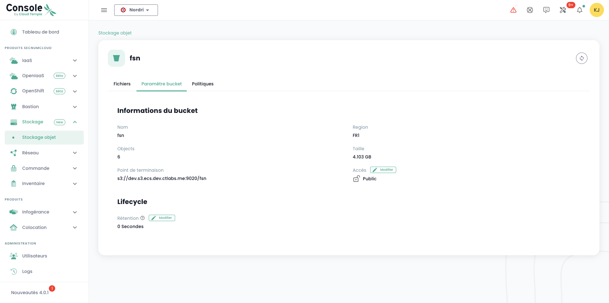

## Caractéristiques techniques générales

### Solution basée sur Dell ECS

La solution __Elastic Cloud Storage (ECS)__ de Dell est à la base de l'offre de stockage objet Cloud Temple. Elle se distingue comme une référence sur le marché du stockage cloud. 
Cette offre se caractérise par sa haute performance et son adhérence aux normes industrielles, assurant une 
compatibilité de 97% avec le protocole de stockage objet d'Amazon AWS S3. 

Sa conception standardisée et réversible garantit une intégration et une transition fluides pour les utilisateurs, 
soulignant la flexibilité et la convivialité du service.

### Produit de type région

Le stockage S3 Cloud Temple stocke les données de manière native sur __trois zones de disponibilité distinctes__ au sein d'une même région Cloud Temple. Cette architecture est conçue pour offrir une haute disponibilité et une résilience maximale face aux pannes matérielles ou logicielles :
- Erasure Coding (EC) : Nous utilisons par défaut un schéma EC 12+4, qui divise les données en 12 segments de données et 4 segments de parité. Cette technique permet de reconstruire les données même en cas de perte de plusieurs segments.
- Distribution des données : Les segments EC sont répartis sur différents nœuds et racks, assurant une protection contre les pannes de disques, de nœuds et même de racks entiers.
- Réplication géographique : Pour une protection supplémentaire, les données sont répliquées sur 3 zones de disponibilités, offrant une résilience face aux sinistres locaux.

Cette réplication assure que même en cas de défaillance d'une zone, les données restent accessibles et intactes, 
contribuant ainsi à une infrastructure de stockage hautement résiliente.

### Conformité et certification

Notre infrastructure de stockage objet S3 est conçue pour répondre aux normes les plus strictes en matière de protection des données et de conformité réglementaire. Voici un aperçu de nos certifications, normes de conformité, et processus d'audit :

- Qualification SecNumCloud : Notre infrastructure est certifiée SecNumCloud, le référentiel de sécurité de l'ANSSI pour les services de cloud computing. Cette qualification garantit un niveau élevé de sécurité et de souveraineté des données, spécifiquement adapté aux exigences françaises et européennes.
- Certification HDS (Hébergement de Données de Santé) : Notre infrastructure est conçue pour répondre aux exigences de l'hébergement de données de santé, offrant un niveau de sécurité adapté aux données médicales sensibles.
- Certification ISO 27001 : Nous suivons les meilleures pratiques définies par la norme ISO 27001 pour la gestion de la sécurité de l'information.

### Chiffrement natif

Le chiffrement est systématiquement appliqué sur les données stockées, utilisant des méthodes et des algorithmes spécifiques pour sécuriser 
les données. Durant le transfert, le protocole TLS 1.3 assure la protection des données. 

Pour les données stockées, plusieurs options sont disponibles :

- le __chiffrement côté client__, où l'utilisateur contrôle les clés et le processus, 
- le __chiffrement côté serveur__, où différentes clés peuvent être utilisées, telles que celles gérées par Cloud Temple ou celles fournies par le client.

Voici un tableau qui résume les différents modèles de chiffrement proposés par le stockage S3 Cloud Temple, 
ainsi que leurs avantages et inconvénients, y compris les protocoles utilisés :

| Modèle de Chiffrement                                               | Protocole Utilisé                      | Avantages                                                                                                                      | Inconvénients                                                                                                                     |
| ------------------------------------------------------------------- | -------------------------------------- | ------------------------------------------------------------------------------------------------------------------------------ | --------------------------------------------------------------------------------------------------------------------------------- |
| **Chiffrement côté serveur avec clés gérées par S3 (SSE-ECS)**      | AES-256                                | - Gestion simplifiée des clés   - Transparence pour l'utilisateur                                                           | - Moins de contrôle pour l'utilisateur sur les clés de chiffrement                                                                |
| **Chiffrement côté serveur avec clés gérées par le client (SSE-C)** | AES-256                                | - Contrôle total sur les clés de chiffrement   - Sécurité renforcée                                                         | - Nécessite une gestion des clés côté client   - Complexité opérationnelle accrue                                              |
| **Chiffrement côté client (CSE)**                                   | Dépend de l'implémentation côté client | - Contrôle maximal sur la sécurité des données   - Les données sont chiffrées avant de quitter le périmètre de l'entreprise | - Gestion complexe des clés   - Performance potentiellement impactée par le processus de chiffrement/déchiffrement côté client |

Voici quelques explications sur ce tableau :

- **SSE-ECS (Server-Side Encryption with ECS managed keys)** : Dans ce modèle, le stockage S3 Cloud Temple s'occupe du chiffrement et de la gestion des clés. 
Les données sont chiffrées automatiquement lorsqu'elles sont stockées sur le disque. Cela offre une approche simplifiée du chiffrement, sans effort supplémentaire pour les clients.
  
- **SSE-C (Server-Side Encryption with Customer provided keys)** : Ce modèle permet aux clients de fournir leurs propres clés 
de chiffrement pour une sécurité renforcée. Le stockage S3 Cloud Temple utilise ces clés pour chiffrer les données avant leur stockage. 
Cela offre un contrôle accru, mais nécessite une gestion sécurisée des clés de chiffrement côté client.

- **CSE (Client-Side Encryption)** : Le chiffrement côté client implique que les données soient chiffrées par le client 
avant d'être envoyées au stockage S3 Cloud Temple. Cela assure que les données sont sécurisées tout au long de leur transfert et stockage, 
mais requiert une gestion de clés et un processus de chiffrement/déchiffrement du côté du client.

### Niveaux de service

Voici les principaux niveaux de services de l'offre S3 Cloud Temple :

| Engagement                                                 | Cible                                                    |
| ---------------------------------------------------------- | -------------------------------------------------------- |
| Disponibilité de la plateforme Stockage Objet Cloud Temple | 99.99% mesuré mensuellement plage de maintenance incluse |
| Durabilité des données                                     | 99,99999999%                                             |
| Bande passante réseau garantie                             | 1 Gbp/seconde                                            |

## Notion de "bucket" dans l'écosystème du stockage objet

Un bucket S3, popularisé par le service Amazon Simple Storage Service (Amazon S3), est **un conteneur de stockage public** dans le cloud conçu pour conserver une quantité illimitée de données de manière sécurisée, fiable et hautement disponible. Chaque bucket S3 peut stocker des fichiers (appelés "objets" dans S3), allant de documents et images à de grandes bases de données ou fichiers vidéo. Les buckets sont utilisés pour organiser l’espace de stockage de manière logique au sein du stockage objet Cloud Temple, et chaque bucket est identifié par un nom unique fourni par l'utilisateur. Les buckets S3 offrent des fonctionnalités avancées, comme la gestion des versions, la sécurisation des données via des politiques de contrôle d'accès, et la possibilité d'immutabilité.

## Lister l'ensemble des bucket S3 de votre tenant

Vous pouvez accéder à l'ensemble de vos buckets via le menu '__Stockage Objet__' de la console Cloud Temple :

Vous pouvez voir tous les comptes créés sur votre tenant et autorisé à accéder au service S3 via l'onglet '__Comptes de stockage__'.

## Création d'un nouveau compte de stockage

La création d'un compte de stockage sur votre tenant se fait en appuyant sur le bouton '__Nouveau compte de stockage__' en haut à droite, dans l'onglet '__Comptes de stockage__' :

{:height="70%" width="70%"}

La plateforme vous donne alors la clef d'accès et la clef secrète de votre bucket :

{:height="70%" width="70%"}

__ATTENTION :__ Les clés secrète et d'accès sont présentées une seule fois. Après cette première apparition, il devient impossible de consulter à nouveau la clé secrète. Il est donc essentiel de noter ces informations immédiatement ; faute de quoi, il vous sera nécessaire de générer une nouvelle paire de clés.

La regeneration se fait au niveau des options de la clefs en choisissant l'option "Réinitialiser clé d'accès".

## Création d'un bucket S3 

La création de nouveau bucket se fait en cliquant sur le bouton '__Nouveau bucket__' en haut à droite de l'écran :

Une fenêtre s'affiche alors et vous devez renseigner :

1. La **région** de création de votre bucket,
2. Le **type** de bucket : performant ou archivage,
3. Le **nom** de votre bucket (il doit être unique).

{:height="70%" width="70%"}

Au 3 Avril 2024, la région disponible est **FR1** (Paris) et seul le type performant est disponible.

Vous devez aussi choisir qui peut accéder à votre bucket :

- Accès **Privé** : Par défaut, l'accès est limité aux adresses IP spécifiques de Cloud Temple.
- Accès **Public** : L'accès est ouvert à toutes les adresses Internet (notamment via la règle 0.0.0.0/0). Nous déconseillons cette configuration en raison de ses implications en termes de sécurité.
- Accès **Personnalisé** : Cette option vous permet de spécifier les adresses IPv4 ou les plages de sous-réseaux que vous souhaitez autoriser.

## Association d'un compte de stockage à un bucket

Les associations de compte aux buckets sont réalisées dans l'onglet '__Politiques__'

Cette association permet de donner l'accès du compte de stockage au bucket. Il y trois rôle :

1. **Maintener** : Les droits lecture, ecriture, gestion des droits et gestion de la politique
2. **Lecteur** : Lire les fichiers dans les buckets et les télécharger.
3. **Ecrivain** : Lire et éditer, modifier, supprimer les fichiers dans les buckets.

{:height="70%" width="70%"}

## Parcourir un bucket S3

Lorsque vous cliquez sur le nom d'un bucket, vous avez accès en premier à l'onglet '__Fichiers__' pour voir son contenu :

Dans l'onglet '__Paramètres__' vous pouvez voir le détail des informations de votre bucket S3 :

Vous avez alors :

1. Le nom du bucket S3,
2. Sa région
3. Le nombre d'objet qu'il contient et la taille en octets du bucket,
4. Son point de terminaison,
5. Les paramètres de cycle de vie qui définissent notamment l'expiration des objets du bucket. '__0__' correspond à une rétention infinie.

Vous pouvez modifier le paramètre de rétention via le bouton '__Modifier__' du cycle de vie :

Enfin, vous pouvez modifier sa typologie d'accès.

## Limitations des accès à vos bucket S3

Il est très simple de configurer les restrictions d'accès à vos buckets S3. Lors de la création d'un bucket, vous avez le choix entre trois configurations d'accès :

{:height="70%" width="70%"}

- Accès **Privé** : Par défaut, l'accès est limité aux adresses IP spécifiques de Cloud Temple.
- Accès **Public** : L'accès est ouvert à toutes les adresses Internet (notamment via la règle 0.0.0.0/0). Nous déconseillons cette configuration en raison de ses implications en termes de sécurité.
- Accès **Personnalisé** : Cette option vous permet de spécifier les adresses IPv4 ou les plages de sous-réseaux que vous souhaitez autoriser:

{:height="70%" width="70%"}

*Le support IPv6 est prévu pour le premier semestre 2025.*

## Suppression d'un bucket S3

La suppression d'un bucket se fait dans les actions associées au bucket en choisissant l'option __'Supprimer'__.

_**ATTENTION : La suppression est définitive et il n'existe aucun moyen de récupérer les données.**_

## FAQ

### Quelle est la taille maximale de fichier pouvant être manipulé avec la console web ?

La limite en web est de 40Mo par fichier. Au delà, il faut utiliser un client natif S3 avec l'API. 

### Quel client S3 puis-je utiliser pour gérer mes fichiers ?

#### MINIO 

Vous pouvez utiliser le client minio par exemple :

https://min.io/docs/minio/linux/reference/minio-mc.html

Par exemple : 

    mc alias set <alias_name> https://reks2ee2b1.s3.fr1.cloud-temple.com <access_key> <secret_key>

Pousser un fichier : 

    mc cp test.txt <alias_name>/<bucket_name>

Récupérer un fichier :

    mc ls <alias_name>/<bucket_name>

#### Cloud Berry Explorer

vous pouvez aussi utiliser [Cloud Berry Explorer](https://www.msp360.com/explorer/).

1. Connectez vous en utilisant votre endpoint et votre clef :

2. Une fois connecté, saisissez le nom du bucket dans la barre de navigation:

3. Vous pourrez alors utiliser le bucket normalement : 

#### WINSCP 6.3.x

Vous pouvez utiliser [Winscp](https://winscp.net/eng/download.php) :

1. Connectez vous en utilisant votre endpoint, votre clef d'accès et votre clef secrete :

2. Une fois connecté, utilisez WINSCP normalement comme un site FTP ou SCP :

### L'offre S3 Cloud Temple utilise-t-elle la méthode 'PathStyle' ou 'UrlStyle' ?

De part les contraintes associées à la qualification SecNumCloud, à cet instant, l'offre est prévue pour utiliser la méthode '**PathStyle**'. Nous travaillons à ce que la méthode '**UrlStyle**' soit disponible S1 2025.

### Quel est le nombre maximum de buckets par tenant ?

Le nombre maximum de buckets pour 1 tenant est de 999.

### Comment ajouter le HASH d'un fichier lors de l'upload d'un objet? 

Globalement, le HASH des fichiers est supporté sur notre stockage objet via les metadatas. Certains clients permettent de calculer à la volée un HASH et de l'ajouter en metadata (minio-mc avec md5 par exemple), pour d'autre, il faut préciser la donnée en metadata directement.

1. Cas de l'ajout d'un HASH avec le client minio-mc : ce client supporte le calcul à la volée d'un hash MD5 et le stockage dans les metadatas

            ╰─➤  cat test.txt                       
            Ceci est un test 
            ╰─➤  md5 test.txt                       
            MD5 (test.txt) = 8b34b2754802a46e3475998dfcf76f83
            ╰─➤  mc cp -md5 test.txt CLR-PUB/CLR-PUB
            ...lesur/Downloads/test.txt: 18 B / 18 B  ▓▓▓▓▓▓▓▓▓▓▓▓▓▓▓▓▓▓▓▓▓▓▓▓▓▓▓▓▓▓▓▓▓▓▓▓▓▓▓▓▓▓▓▓▓▓▓▓▓▓▓▓▓▓▓▓▓▓▓▓▓▓▓▓▓▓▓▓▓▓▓▓▓▓▓▓▓▓▓▓▓▓▓▓▓▓▓▓▓▓▓▓▓▓▓▓▓▓▓▓▓▓▓▓▓▓  111 B/s 0s
            ╰─➤  mc stat CLR-PUB/CLR-PUB/test.txt
            Name      : test.txt
            Date      : 2024-06-08 10:21:31 CEST 
            Size      : 18 B   
            ETag      : 8b34b2754802a46e3475998dfcf76f83 
            Type      : file 
            Encryption: SSE-S3
            Metadata  :
                Content-Type: text/plain 

2. Exemple d'ajout un sha256 "manuellement" : pour ce faire on utilise les attributs S3 du fichier.

            ╰─➤  cat test.txt
            Ceci est un test
            ╰─➤  shasum -a 256 test.txt                            
            2c5165a6a9af06b197b63b924d7ebaa0448bc6aebf8d2e8e3f58ff0597f12682  test.txt
            ╰─➤  mc cp -md5 test.txt CLR-PUB/CLR-PUB -attr "checksum-sha256=$(shasum -a 256 test.txt | cut -f1 -d' ')"
            ...lesur/Downloads/test.txt: 18 B / 18 B  ▓▓▓▓▓▓▓▓▓▓▓▓▓▓▓▓▓▓▓▓▓▓▓▓▓▓▓▓▓▓▓▓▓▓▓▓▓▓▓▓▓▓▓▓▓▓▓▓▓▓▓▓▓▓▓▓▓▓▓▓▓▓▓▓▓▓▓▓▓▓▓▓▓▓▓▓▓▓▓▓▓▓▓▓▓▓▓▓▓▓▓▓▓▓▓▓▓▓▓▓▓▓▓▓▓▓  141 B/s 0s
            ╰─➤  mc stat CLR-PUB/CLR-PUB/test.txt                                                                     
            Name      : test.txt
            Date      : 2024-06-08 10:41:17 CEST 
            Size      : 18 B   
            ETag      : 8b34b2754802a46e3475998dfcf76f83 
            Type      : file 
            Encryption: SSE-S3
            Metadata  :
                X-Amz-Meta-Checksum-Sha256: 2c5165a6a9af06b197b63b924d7ebaa0448bc6aebf8d2e8e3f58ff0597f12682 
                Content-Type              : text/plain 

### Comment est facturé l'offre S3 de Cloud Temple ?

Le prix est un prix mensuel, au Gio de stockage, facturé mensuellement. Cependant, la plateforme comptabilise l'usage à l'heure et réalise la facturation sur une base mensuelle de 720 heures.

Par exemple, si vous consommez dans le mois 30 Gio pendant 1h puis rien, puis quelques jours plus tard 30Gio pendants 2h, la facture mensuelle sera de *( Prix (1 x 30Gio) + 2 x Prix (30Gio) ) / 720* sur le mois considéré. La facturation est terme échue.

## Prochains jalons

- *__Les URL Présignées__ seront disponible fin Q4 2024*
- *__L'immutabilité__ d'un bucket S3 est prévue pour S2 2024.*
- *__S3 Glacier__ est prévu pour fin S1 2025*
