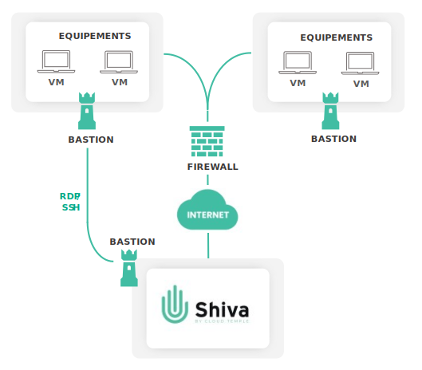

## C'est quoi le Bastion Cloud Temple ?

Le Bastion Cloud Temple est un service managé qui vous fournit une connectivité RDP ou SSH sécurisée depuis la console 
Cloud Temple vers vos infrastructures physiques et virtuelles, qu’elles soient situées sur le Cloud de confiance, sur un 
Cloud public ou onpremise. La solution Bastion permet d’administrer vos équipements sans les exposer à Internet. 

## Les avantages
| Avantage               |                                                                              Description                                                                               |   
|------------------------|:----------------------------------------------------------------------------------------------------------------------------------------------------------------------:|
| Gestion centralisée    |                                              Le Bastion Cloud Temple est accessible directement depuis le portail Shiva.                                               |   
| Sécurité               | Les équipements administrés via le Bastion ne sont pas exposés à Internet, ce qui les protège notamment de l'analyse de leurs ports par des utilisateurs malveillants. |  
| Infrastructure as Code |          Des APIs permettent de gérer le Bastion Cloud Temple entièrement "as Code" (création de session, connexion, modification et suppression de session).          |   

## Références (SKU)
| Référence                          |   Unité   |           SKU           |  
|------------------------------------|:---------:|:-----------------------:|
| ADMINISTRATION - Bastion SSH & RDP | 1 Session | cmp:bastion:session:std | 

## Concepts
### L'Appliance Bastion

L'Appliance Bastion est une machine virtuelle déployée en proximité de vos équipements. Cette Appliance permet de faire passer un flux sécurisé et direct depuis la plateforme Shiva vers les équipements à administrer qui sont situés dans le même réseau virtuel. 

Le flux est chiffré et encapsulé dans un tunnel VPN. La solution ne nécessite pas l’ouverture d’un flux depuis Internet vers vos infrastructures. Il suffit que l’Appliance ait accès à l’IP publique du module Shiva Bastion sur le port 443.

Une Appliance peut être utilisée pour effectuer une connexion rapide vers un équipement. À chaque connexion, le protocole souhaité, l’adresse IP de la machine et vos identifiants doivent être précisés. Pour éviter de remplir ces informations à chaque connexion, il est possible de créer des sessions associées à des équipements à administrer régulièrement.

### Les Sessions

Une session est une configuration de connexion à un équipement via un Bastion. Elle consiste à définir un équipement à administrer et l’Appliance à utiliser pour faire transiter le flux, et permet ainsi de se connecter plus rapidement à cet équipement. 

Cette solution est adaptée dans le cas d’une connexion régulière à un équipement à administrer. Les informations essentielles sont conservées, seuls vos identifiants sont requis lors de la connexion.
