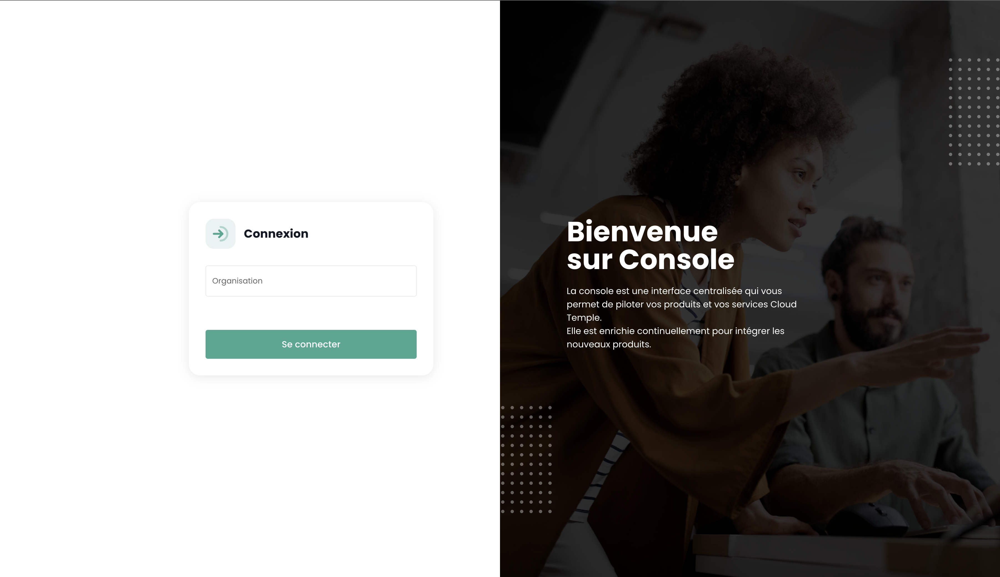
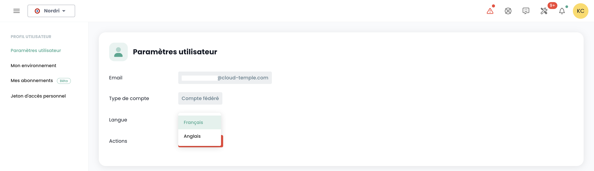
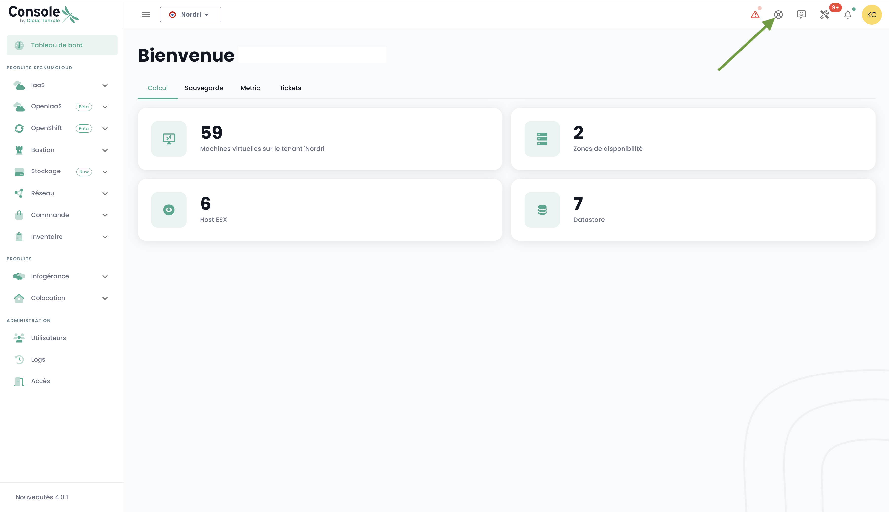
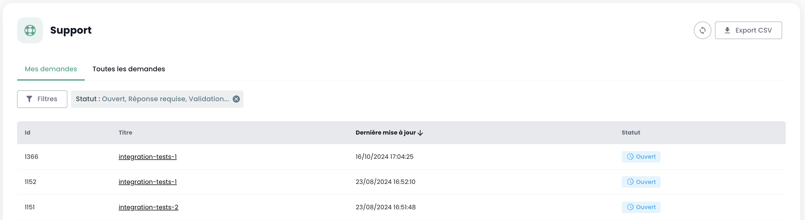

## Prérequis
- Avoir souscrit à une offre Cloud Temple. Pour souscrire simplement, vous pouvez [nous contacter](https://www.cloud-temple.com/contactez-nous/) ou par mail à l'adresse __contact@cloud-temple.com__.
- Avoir un accès à la console Shiva
- Avoir son IPv4 publique déclarée dans la zone de confiance Cloud Temple (l'accès à la console shiva est limité aux adresses de confiances identifiées)

## Connexion à votre tenant Cloud Temple
Shiva est accessible via l'URL ci-dessous:
    https://shiva.cloud-temple.com
    Ou bien depuis l'URL directe qui vous a été communiquée par mail.

La première page vous permet de sélectionner [l'organisation](iam/concepts.md#organisations) dans laquelle votre utilisateur a été créé.
Une fois l'entreprise renseignée, veuillez cliquer sur __'Se connecter'__.

Vous allez ensuite être redirigé vers une page vous demandant de vous authentifier.
Une fois connecté, vous arrivez sur cette page.

## Gestion de la langue
La console est disponible en __francais__, __anglais__. Vous pouvez changer la langue de fonctionnement grâce à l'icône __langue__ situé en haut à droite de l'écran.

Le changement de langue d'un utilisateur est à réaliser dans son __'Profil'__, en haut à droite de l'écran, dans les __'Paramètres utilisateur'__.

La configuration est faite pour chaque tenant [Tenant](iam/concepts.md#tenant).

## Accès au support technique

À tout moment, vous pouvez contacter __l'équipe de support Cloud Temple__ via __l'icône 'bouée'__ situé en haut à droite de l'écran.

Vous serez guidé pendant tout le processus de demande de support.

La première étape est l'identification du type de demande de support :

- Demander un conseil sur l'utilisation d'un produit (hors incident),
- Demander une assistance en lien avec votre compte client,
- Déclarer un incident ou demander un support technique.
- Demander l'assistance d'un service professionnel (mise à disposition d'un ingénieur Cloud Temple sur une problématique).

Vous avez ensuite la possibilité de donner des précisions et d'inclure des fichiers (image ou journaux par exemple).

Une fois votre demande effectuée, il est possible de retrouver vos demandes via __l'icône 'bouée'__ situé en haut à droite de l'écran :

## Accès aux fonctionnalités utilisateur via l'interface web

L'ensemble des fonctionnalités accessibles à votre utilisateur (en fonction de ses droits) est situé à gauche de l'écran, dans le bandeau vert.
Les fonctionnalités sont regroupés par module. Cela regroupe principalement :

- L'__inventaire__ de vos ressources,
- Le __suivi des opérations__,
- Le __pilotage des ressources IaaS__ (Calcul, stockage, réseau, ...)
- Le __pilotage des ressources OpenIaaS__ (Calcul, stockage, réseau, ...)
- L'accès aux __services annexes__ (Bastion, monitoring, ...)
- L'__administration de votre organisation__ (Gestion des tenants, des droits, ...)

L'activation d'un module pour un utilisateur dépend des droits de l'utilisateur. Par exemple le module __'Commande'__ ne sera pas disponible si l'utilisateur ne dispose pas du droit __'ORDER'__.

Voici une présentation des différents modules disponibles. De nouveaux modules viennent enrichir la console régulièrement :

- __Tableau de Bord__ : permet d'avoir rapidement une vue sur le __total des ressources de calcul et de stockage__, les statistiques de la __sauvegarde__ et une __synthèse des dossiers de support__,
- __Inventaire__ : permet d'avoir une vue de l'ensemble de vos ressources de type __'machines virtuelles'__. Si les __tags__ sont utilisés, il permet d'avoir une vue par __tag__ (par exemple, vue métier, vue applicatif, ...),
- __Infogérance__ : donne accès au suivi de vos __demandes de support__ et à la __métrologie des services__,
- __IaaS__ : permet le __pilotage des infrastructures IaaS VMware__ (Machines virtuelles, clusters, hyperviseurs, réplications, sauvegarde, ...),
- __OpenIaaS__ : permet le __pilotage des ressources Xen Orchestra__ (Machines virtuelles, sauvegarde, ...),
- __OpenShift__ : permet le pilotage de votre **architecture PaaS RedHat Openshift** et le management de vos containers sur les 3 zones de disponibilité de la plateforme.
- __Bastion__ : Permet de déployer et de piloter des appliances bastion SSH/RDP dans vos réseaux,
- __Réseau__ : permet le pilotage des __réseaux de niveau 2 et 3__, des __IP publiques__ et de vos __circuits télécoms__,
- __Colocation__ : Offre la vue sur les équipements situés en zone de __collocation mutualisée ou dédiée__,
- __Commande__ : Permet la commande de ressources et le suivi des déploiements,
- __Administration__ : Regroupe les fonctions d'administration des utilisateurs et des tenants ainsi que l'accès à la journalisation globale.

## Accès aux fonctionnalités utilisateur via l'API

L'accès à l'ensemble des fonctionnalités de la console Shiva est possible via l'API Shiva. Vous pouvez avoir le détail des verbes et des configurations via __'Profil'__ et __'APIs'__ :

## Provider Terraform

Cloud Temple met à votre disposition un provider Terraform pour piloter *"as code"* votre plateforme Cloud. Il est accessible ici :

https://registry.terraform.io/providers/Cloud-Temple/cloudtemple/latest
