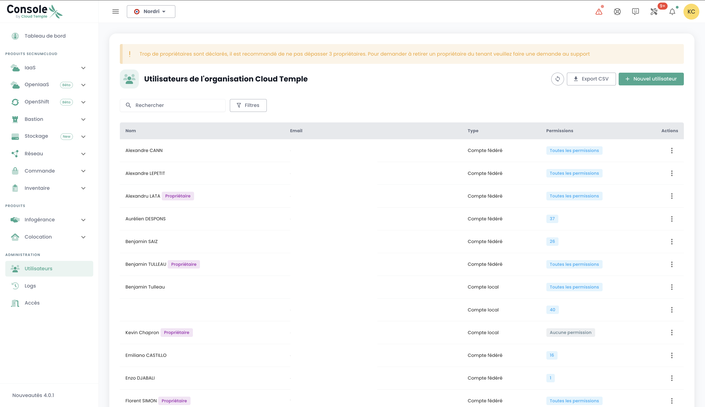

##  Tenant

### Création d'un tenant

La création d'un tenant est réalisée par une demande de service indiquant :

    Le nom de votre Organisation
    Le nom d'un contact avec son mail et n° de téléphone pour finaliser la configuration
    Le nom du tenant
    La zone de disponibilité ou à défaut le site physique souhaité pour le tenant

### Selection d'un tenant

La selection du tenant se fait depuis la page principale de la console Shiva :

*__Nota :__ Les ressources d'un tenant lui sont propres et ne sont pas mélangeable avec d'autres tenants.*

## Comptes d'accès à la console Shiva

Les comptes d'accès à la console Shiva sont créés par le compte maitre du commanditaire sur invitation (quelque soit le référentiel d'authentification).
Les informations d'identification sont globales à votre [Organisation](concepts.md#organisations).

*__Nota :__ La fédération d'identité se gère au niveau de l'organisation*

### Création d'un compte utilisateur dans votre organisation

La création d'un compte utilisateur dans votre organisation se fait par invitation. Pour inviter un utilisateur dans une [Organisation](concepts.md#organisations), aller dans le menu __'Administration'__ à gauche de votre écran sur le bandeau vert puis dans le sous menu __'Utilisateurs'__.  

Cliquer sur le bouton __'Nouvel Utilisateur'__ depuis la page des utilisateurs. 

Indiquer ensuite l'adresse de messagerie de l'utilisateur 

L'utilisateur va alors recevoir un mail de vérification.  

Une fois la vérification terminée, l'utilisateur pourra se connecter sur la console.

### Affectation des permissions à un utilisateur

La gestion des droits utilisateurs se fait depuis la page utilisateur. 

Par défaut, un utilisateur n'a pas de droit. Il est donc nécessaire que l'administrateur ayant fait l'invitation lui octroie les droits nécessaires à son activité. Il suffit de cliquer sur le menu __'Actions'__ de l'utilisateur et de choisir l'option __'Modifier'__.  

Le menu d'activation des droits apparait alors :

La configuration des permissions est à faire pour chaque [Tenant](concepts.md#tenants) de l'
[Organisation](concepts.md#organisations).

La liste des permissions et leur définition est accessible [ici](#permissions).

### Changer la langue d'un utilisateur

Le changement de langue d'un utilisateur est à réaliser dans son __'Profil'__, en haut à droite de l'écran, dans les __'Paramètres utilisateur'__.

La configuration est faite pour chaque tenant [Tenant](concepts.md#tenants).

### Abonnement aux notifications thématiques

La gestion des abonnements permet de recevoir les e-mails relatifs aux thématiques activées qui seront automatiquement envoyés lors de la survenue d'événements correspondants.

Elle est accessible dans le profil utilisateur, dans l'onglet "Mes abonnements" :

 Par exemple, en cas d'incident, des notifications par e-mail spécifiques à cette thématique seront générées.

La liste des thématiques disponibles est susceptible d'évoluer et de s'enrichir progressivement pour s'adapter aux besoins et aux changements dans notre environnement opérationnel.

## Permissions

### Quelles sont les permissions disponibles pour les comptes utilisateur de la console Shiva ?

Voici la liste des [permissions disponibles](#permissions).

### Comment ajouter une permission ?

Voici la [procédure d'affectation de permission est disponible ici](#permissions)

### Pourquoi je ne peux pas ajouter une permission ?

Pour ajouter une permission, vous avez besoin de posséder la permission __'iam_write'__ ainsi que la __permission que vous souhaitez ajouter__.

### Comment ajouter un utilisateur ?

*__Nota__ : Pour ajouter un utilisateur, vous devez posséder le droit __'iam_write'__.*

### Comment auditer les accès/permissions des utilisateurs ?

Allez sur la page utilisateurs et cliquez sur le bouton __'Exporter csv'__ :

### Comment supprimer un utilisateur ?

Dans le menu __'Administration'__ sur le bandeau vert à gauche de l'écran, dans le sous menu __'utilisateur'__, cliquer sur l'icône __'Action'__ de l'utilisateur cible et choisissez __'Supprimer'__.

*__nota__ :*
- *Pour ajouter un utilisateur, vous devez posséder le droit __'iam_write'__.*
- *S'il s'agit d'un utilisateur fédéré, __assurez-vous que l'utilisateur a été supprimé également depuis le référentiel d'identité__.*

### Comment réinitialiser son mot de passe ?
Il est possible de réinitialiser son mot de passe depuis la page de connexion de la console Shiva en cliquant sur __'Mot de passe oublié ?'__.

### Pourquoi certains utilisateurs sont grisés ?
Les utilisateurs grisés sont ceux n'ayant pas validé leur compte. Lors de la création du compte, ;'utilisateur a recu un mail de vérification.  

Une fois la vérification terminée, l'utilisateur pourra se connecter sur la console.  

Le compte est grisé tant que la vérification n'a pas été finalisée.

### Qu'est-ce qu'un Personal Access Token (PAT) ?

La génération d'une clé API, aussi appelée __Personal Access Token (PAT)__, 
est une manière sécurisée de se connecter aux API Shiva sans passer par une interface graphique. 

### Qu'est-ce que le MFA et est-il obligatoire ?
Le MFA (multi-factor authentication) est un concept de vérification de l'identité d'un utilisateur en deux étapes, appelée __authentification à double facteur__.

L'utilisateur doit fournir deux preuves d'identité distinctes. Dans le cas de la console Shiva, l'authentification à double facteur est obligatoire et requiert de rentrer un code à usage unique une fois que l'utilisateur a entré le mot de passe de son compte. 

## Gestion des accès et authentification

### Autorisation d'accès à un tenant : IP autorisées

L'accès à la console de gestion cloud est strictement limité aux adresses IP préalablement autorisées, en conformité avec les exigences de la qualification SecNumCloud. Cette restriction garantit un niveau de sécurité renforcé en ne permettant l'accès qu'aux utilisateurs provenant de plages d'IP spécifiées, minimisant ainsi les risques d'accès non autorisés et protégeant l'infrastructure cloud selon les standards de sécurité les plus élevés.

Il est désormais possible d'afficher la liste des adresses IP publiques autorisées sur le tenant et d’ajouter une nouvelle adresse IP publique à cette liste directement depuis l'onglet "Administration > Accès". 

Pour cela, l’utilisateur doit disposer du droit `console_public_access_read` pour consulter les IPs autorisées, et du droit `console_public_access_write` pour ajouter une adresse IP publique à la liste.

Il est alors possible d'ajouter une nouvelle IP:

Note : *La suppression d'un IP autorisée se fait par une demande de support dans la console Cloud Temple.*

### Qu'est-ce que le captcha ? Pourquoi peut-il bloquer la connexion à l'application ?
Le __'Captcha'__ est une mesure de sécurité permettant de protéger votre compte du spam et d'empêcher toute tentative de décryptage de mot de passe.

Le __'Captcha'__ soumet un test simple visant à vérifier qu'il s'agit bien d'un être humain et non d'un robot qui tente d'accéder au compte. 

La console Cloud Temple utilise un Captcha de type v3. Le type v3 est un test invisible qui établie un indice de confiance basé sur les interactions de l'utilisateur. 

La console Cloud Temple se base sur ce score d'indice de confiance pour autoriser ou non l'utilisateur pour se connecter. 

Si vous rencontrez des difficultés avec le test __'Captcha'__ pour vous connecter à la console Shiva, veuillez contacter le support utilisateur. 