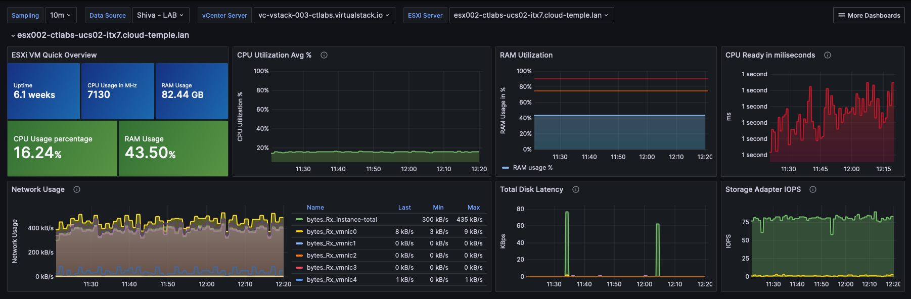

## Concept

La majorité des clients __Cloud Temple__ disposent d'outils de visualisation, de monitoring et de métrologie pour le suivi de leurs opérations. 

La philosophie de la console Shiva est de permettre l'accès à la donnée afin de s'intégrer dans cet outillage via un proxy prometheus intégré. 

Ce proxy vous permet de requêter et manipuler les donnes depuis un outil de visualisation comme [Grafana](https://grafana.com).

Il est cependant possible de visualiser certaines données de performances de vos ressources Cloud dans l'interface web de la console Shiva.

*__Nota :__ La philosophie __Cloud Temple__ n'est pas d'intégrer de multiples graphiques dans l'interface web, mais d'offrir le maximum d'informations accessibles par l'API*

## Tableau de bord intégré à l'interface web

*__Nota :__ Pour accéder à ces dashboards, il est nécessaire de posséder le droit __'metric_read'__*

### Suivi des emissions carbone pour le calcul 

Le tableau de board de la console Shiva intègre par défaut un graphique de suivi de la consommation électrique de votre calcul ainsi que l'estimation 
de l'émission de carbone associée.

Il est accessible directement dans la page d'accueil de l'interface web de la console Cloud Temple, en cliquant sur __'Metric'__ :

### Vue globale de la santé des machines virtuelles

La synthèse de l'état des machines virtuelles est accessible dans le menu __'IaaS'__ à gauche de votre écran, dans le sous menu __'Santé'__ puis __'Machines virtuelles'__

Cette synthèse donne, sur la plage de temps sélectionnée dans __'Filtres'__ :

- le nombre de CPU et la __moyenne d'utilisation CPU__, 
- le nombre de Go de mémoire et la __moyenne d'usage de la mémoire__, 
- Les moyennes de __latence d'accès au stockage__ en lecture et en écriture,
- Le __'CPU Ready'__ moyen de la machine virtuelle (ce qui correspond au temps moyen d'attente de disponibilité d'un core physique par la machine virtuelle).

Pour chaque VM, vous pouvez accéder à l'historique de ses performances en cliquant sur l'icône vert __'Historique'__ de la machine virtuelle dans la colonne action. :

Vous accédez alors à la page de visualisation graphique des données historisée, incluant une vue __performance environnementale__ :

## Utilisation avec __Grafana__

Il est possible pour la console Shiva de service de __datasource__ pour votre infrastructure [Grafana](https://grafana.com).

Vous trouverez tout un ensemble d'__exemple de configuration pour Grafana__ ici :

https://github.com/Cloud-Temple/console-grafana-iaas

