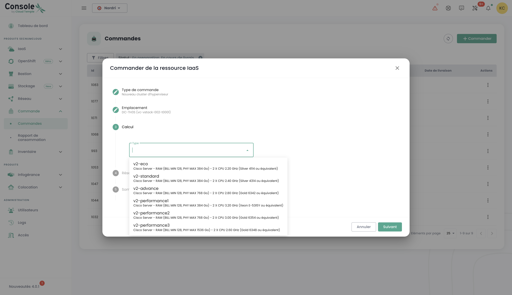

## Concept

Le suivi du déploiement de nouvelles ressources se fait dans le menu __'Commandes'__ accessible dans le bandeau vert à gauche de l'écran. 

Il permet de visualiser les ressources Cloud commandées, en cours de déploiement et les eventuelles erreurs au sein d'un [Tenant](iam/concepts.md#tenant) de votre [Organisation](iam/concepts.md#organisations).

*__Nota : A cet instant, la vue globale au niveau d'une organisation de l'ensemble des ressources déployées dans les différents tenants n'est pas encore possible.__ Ce sujet sera traité en 2024 par la mise en œuvre d'un portail dédié au commanditaire (au sens signataire) et au pilotage de son organisation.*

Le déploiement des ressources ou leur suppression se font dans chacun des produits dans les menus __'IaaS'__ et __'Réseau'__ à gauche de l'écran dans le bandeau vert.

Il est aussi possible de voir directement les livraisons au niveau des notifications de la console Cloud Temple :

Depuis la page de commandes, vous pouvez voir l'état d'avancement d'une livraison et éventuellement dialoguer avec l'équipe en apportant des commentaires ou des précisions :

**Note** : **Il n'est pas possible de lancer plusieurs commandes du même type de ressource simultanément. Vous devrez donc attendre que la commande en cours soit traitée et finalisée avant de pouvoir en effectuer une nouvelle. Cela garantit une gestion efficace et ordonnée des ressources au sein de votre environnement.**

## Commander une nouvelle zone de disponibilité

Il est possible d'ajouter une nouvelle zone de disponibilité en accédant au menu "**Commande**". Cette option vous permet d'étendre vos ressources et d'améliorer la disponibilité et la résilience de vos applications en quelques clics seulement :

On commence par sélectionner l'emplacement souhaité, en choisissant d'abord la région géographique, puis la zone de disponibilité (AZ) correspondante parmi celles qui sont disponibles. Cette étape permet d'adapter le déploiement de vos ressources en fonction de la localisation et des exigences de votre infrastructure :

Ensuite, procédez à la sélection du type de cluster d'hyperviseur désiré, en choisissant celui qui répond le mieux aux besoins de performance et de gestion de votre infrastructure cloud :

Sélectionnez ensuite le nombre d'hyperviseurs ainsi que la quantité de mémoire souhaitée, afin d'adapter les ressources à la charge de travail et aux exigences spécifiques de votre environnement cloud :

Sélectionnez ensuite le nombre de datastores à provisionner dans le cluster ainsi que leurs types. Il est important de noter que le nombre maximum de datastores autorisé est de 10, avec un minimum de 2 datastores requis. Chaque type de datastore différent entraînera la création d'un datastoreCluster supplémentaire. Par exemple, si vous choisissez 2 datastores de type "live" et 1 datastore de type "mass", cela aboutira à la formation de 2 datastoreClusters distincts :

Définissez la taille de stockage nécessaire pour la sauvegarde en veillant à prévoir une capacité équivalente à celle de votre stockage de production. Tenez compte d'un taux de compression moyen de 2 afin d'optimiser l'espace de sauvegarde et d'assurer une protection efficace de vos données:

Sélectionnez les réseaux à propager en fonction de vos besoins. Vous avez également la possibilité d'activer l'option "Accès internet" si nécessaire, en définissant le nombre d'adresses IP souhaitées, avec un choix compris entre 1 et un maximum de 8:

Vous obtenez ensuite un résumé des options sélectionnées avant de valider votre commande.

## Commander de la ressource stockage supplémentaire

La logique d'allocation du stockage en mode bloc sur les clusters de calcul est TODO

### Déployer un nouveau cluster de calcul

Procédez à la commande d'un cluster d'hyperviseur en sélectionnant les options adaptées à vos besoins en matière de virtualisation. Définissez les caractéristiques clés telles que le nombre d'hyperviseurs, le type de cluster, la quantité de mémoire, ainsi que les ressources de calcul requises :

Sélectionnez la zone de disponibilité :

Choisissez le type de lame de calcul :

Vous avez ensuite la possibilité de sélectionner des réseaux déjà existants et de les propager, ou bien d'en créer de nouveaux directement à cette étape, selon les besoins de votre infrastructure. Notez que le nombre total de réseaux configurables est limité à un maximum de 20:

Vous obtenez ensuite un résumé des options séléctionnées avant de valider votre commande et vous pouvez ensuite visualiser votre commande en cours :

### Déployer un nouveau cluster de stockage

Dans le menu "**commande**", procédez à la commande d'un **nouveau cluster de stockage** pour votre environnement en sélectionnant les options qui correspondent à vos besoins en termes de capacité, de performance et de redondance. Sélectionnez l'emplacement :

Définissez le nombre de datastores à provisionner dans le cluster ainsi que leur type, en respectant les limites suivantes : un minimum de 2 datastores et un maximum de 10 peuvent être configurés. Choisissez les types de datastores qui répondent le mieux à vos besoins en termes de performance, capacité et usage, afin d'optimiser le stockage de votre environnement :

Sélectionnez le type de stockage souhaité parmi les différentes options disponibles :

Vous accédez ensuite à un récapitulatif complet des options que vous avez sélectionnées, vous permettant de vérifier tous les paramètres avant de valider définitivement votre commande :

### Déployer un nouveau datastore au sein d'un cluster SDRS VMware

Dans cet exemple, nous allons ajouter du stockage en mode bloc pour une infrastructure VMware.
Pour ajouter un datastore supplémentaire dans votre cluster de stockage SDRS, allez dans le sous menu __'Infrastructure'__ puis __'VMWare'__. 
Choisissez alors la stack vmware et la zone de disponibilité. Allez ensuite dans le sous menu __'Stockage'__.

Choisissez le cluster SDRS correspondant aux caractéristiques de performance que vous souhaitez et cliquez sur le bouton __'Ajouter un datastore'__ qui se situe dans le tableau 
avec la liste des datastores. 

__nota__ :  
- *La taille de la plus petite LUN activable sur un cluster est de __500 Gio__.*  
- *Les performances d'un datastore vont de 500 iops/Tio en moyenne jusqu'à 15000 iops/Tio en moyenne. __C'est un bridage logiciel réalisé au niveau des contrôleurs de stockage__.*  
- *La comptabilité du volume de disque consommé par votre organisation est la somme de toutes les LUNs sur l'ensemble des AZs utilisées*.  
- *Les droits __'order'__ ainsi que __'compute'__ sont nécessaires au compte pour mener cette action.*

### Commander de nouveaux réseaux

La technologie réseau utilisée sur l'infrastructure Cloud Temple est basée sur [VPLS](https://fr.wikipedia.org/wiki/Virtual_Private_LAN_Service). Elle vous permet de bénéficier de __réseaux de niveau 2 en continuité entre vos zones de disponibilité au sein d'une région__. 
Il est aussi possible de partager des réseaux entre vos tenants et de les terminer en zone de hosting.
Basiquement, vous pouvez imaginer un réseau Cloud Temple comme un vlan 802.1q disponible en tout point de votre tenant.

TODO

La commande d'un nouveau réseau et les décisions de partage entre vos tenants, sont réalisées dans le menu __'Réseau'__ du bandeau vert à gauche de l'écran. Les réseaux seront d'abord créés, puis une commande distincte sera générée pour les propager. Vous pouvez suivre l'avancement des commandes en cours en accédant à l'onglet "Commande" dans le menu, ou en cliquant sur les labels d'information qui vous redirigent vers les commandes actives ou en cours de traitement.

Il est également possible de propager des réseaux déjà existants ou de séparer les deux étapes, en commençant par la création du réseau, puis en procédant à la propagation ultérieurement selon vos besoins. L'option de propagation se trouve dans les options du réseau sélectionné :

Cliquez sur l'option "Propager" pour un réseau déjà existant, puis sélectionnez la cible de propagation souhaitée. Cette étape vous permet de définir l'emplacement ou les ressources sur lesquelles le réseau doit être propagé :

### Désactivation d'un réseau

Un réseau peut également être désactivé si nécessaire. Cette option vous permet de mettre en pause temporairement l'accès ou l'utilisation du réseau sans le supprimer définitivement, offrant ainsi une flexibilité dans la gestion de votre infrastructure en fonction de vos besoins.

L'option de désactivation se trouve dans les options du réseau sélectionné. '

## Ajouter des hyperviseurs supplémentaires à un cluster de calcul

La logique de fonctionnement des clusters de calcul est TODO

L'ajout d'hyperviseurs à un cluster de calcul se fait dans le menu __'IaaS'__ dans le bandeau vert à gauche de l'écran.
Dans l'exemple suivant, nous allons ajouter du calcul sur un cluster d'hyperviseur utilisant la technologie VMware.

Allez dans le sous menu __'Infrastructure'__ puis __'VMWare'__. Choisissez alors la stack vmware et la zone de disponibilité et le cluster de calcul.
Dans cet exemple, il s'agit du __'clu001-ucs12'__. Cliquez sur le bouton __'Ajouter un host'__ qui se situe dans le tableau avec la liste des hosts, en haut à droite.

__nota__ : 

- *__La configuration d'un cluster doit être homogène__. Ainsi, il n'est pas permis de mixer les types d'hyperviseur au sein d'un cluster. Toutes les lames doivent être de même type.*
- *Les droits __'order'__ ainsi que __'compute'__ sont nécessaires au compte pour mener cette action.*

## Ajouter de la ressource mémoire supplémentaire à un cluster de calcul

La logique d'allocation de la mémoire sur les clusters de calcul est TODO

Pour ajouter de la mémoire vive sur un cluster, il suffit de se rendre sur la configuration du cluster (comme pour l'ajout d'un hôte de calcul tel que précédemment vue) et de cliquer sur __'Modifier la mémoire'__.

__nota__ :  
- *__Les machines sont livrées avec la totalité de la mémoire physique__. Le débridage de la ressource mémoire n'est qu'une activation logicielle au niveau d'un cluster.*  
- *Il n'est pas possible de modifier la quantité de mémoire physique d'un type de lame. Bien tenir compte de la capacité maximale d'une lame lors de la création d'un cluster.*  
- *Les droits __'order'__ ainsi que __'compute'__ sont nécessaires au compte pour mener cette action.*

