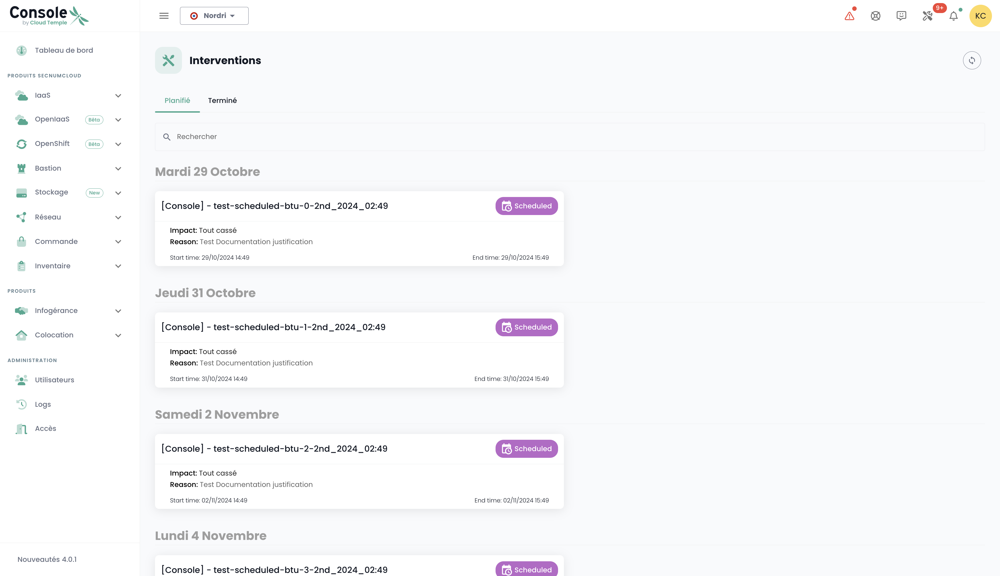
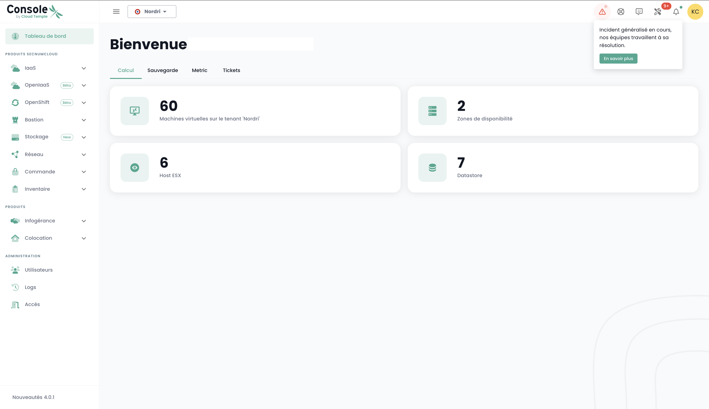
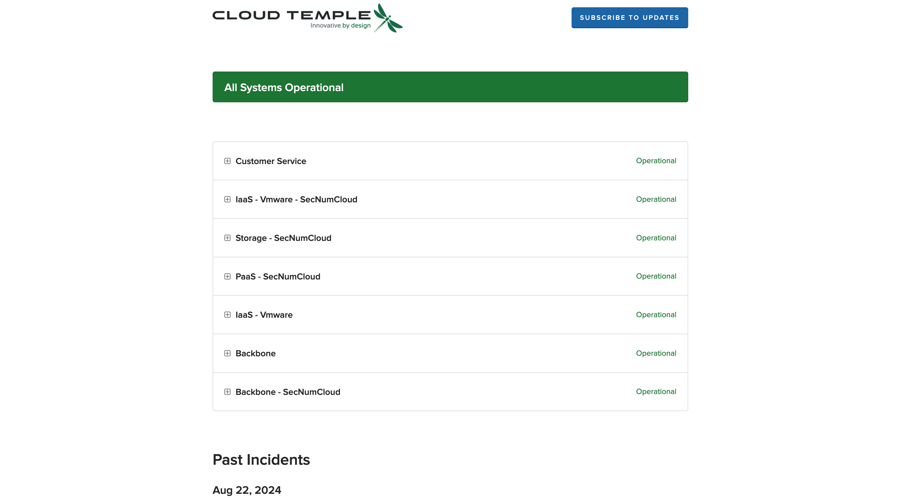
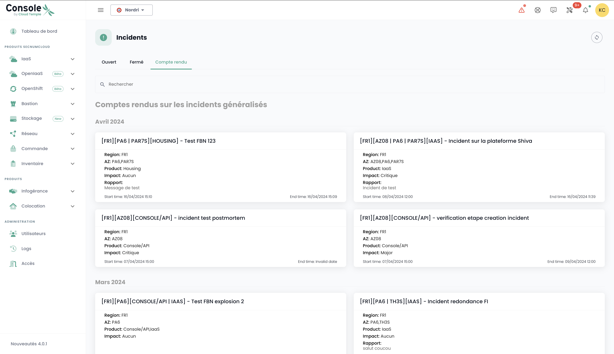

Comme toute plateforme d'infrastructure Cloud, la plateforme Cloud Temple fait l'objet de travaux et de maintenance matérielle et logicielle régulièrement.

## Accès aux opérations et incidents en cours

L'icône de suivi des opérations permet de visualiser les opérations planifiées sur l'infrastructure Cloud Temple ainsi que les incidents ouverts sur le tenant. Cette icône est accessible dans la barre d'icône en haut à gauche de l'écran et à la forme d'une icône __'Outils'__

Cette icône vise à fournir une visibilité sur les interventions planifiées, en cours et terminées et/ou les incidents sur le tenant.

Quand des interventions et/ou incidents sont en cours, un nombre apparait sur l’icône.

En cliquant sur visualisation rapide, vous trouverez les interventions en cours. Il est également possible de cliquer sur __‘Toutes les interventions’__ ou __‘Tous les incidents et rapports du tenant’__ pour afficher plus de détails.

## Suivi des interventions planifiées

La page Interventions est composée de deux onglets. Le premier onglet permet de visualiser les interventions prévues sur les 30 prochains jours et les interventions en cours.

Les interventions terminées quant à elles sont visibles dans le second onglet ‘Terminé’

L'accès à ces informations nécessite pour le profil de l'utilisateur la permission '**intervention_read**'.

## Gestion des incidents

Deux types d'incidents sont à distinguer : les incidents globaux, qui affectent l'ensemble du système, et les incidents spécifiques à un périmètre client, qui impactent uniquement les ressources ou services associés à un client particulier.

### Incidents globaux

La récupération des informations concernant les incidents globaux ne nécessite aucune permission particulière. Un bandeau rouge est affiché dès la connexion à la console pour avertir de la présence d'un incident global en cours de résolution. L'utilisateur a la possibilité de masquer ce bandeau temporairement durant sa session, mais celui-ci réapparaîtra à chaque nouvelle connexion ou lors d'un rafraîchissement de la page, tant que l'incident reste non résolu.

Un bouton __'En savoir plus'__ redirige vers la page publique de suivi des incidents, permettant d'accéder à des informations supplémentaires sur l'incident en cours :

Il est possible d'obtenir les rapports des incidents globaux. L'accès à ces rapports requiert la permission spécifique '**incident_management**'. 

Voici un exemple de l'onglet affichant ces rapports :

### Incidents sur un périmètre commanditaire

La visibilité des incidents spécifiques à un périmètre client nécessite la permission **incident_read**. Ces incidents sont représentés par une icône dédiée, accompagnée d'un badge rouge indiquant le nombre d'incidents en cours. 

L'icône est cliquable, permettant de lister les tickets associés aux incidents. Chaque ticket inclut un lien vers les détails de l'incident, offrant la possibilité de suivre l'avancement de leur résolution :

Pour consulter les détails d'un incident, il est nécessaire d'être l'auteur du ticket d'incident ou de disposer de la permission **support_management**.

### Gestion des notifications

Dans le but d'informer rapidement les utilisateurs en cas de nouvel incident, un système de notifications par e-mail a été mis en place. Depuis leur profil utilisateur, un onglet intitulé '*Mes abonnements*' permet aux utilisateurs de s'abonner aux notifications pour les deux types d'incidents. Ainsi, ils recevront un e-mail dans un délai très court lors de la déclaration ou de la résolution d'un incident.

L'objet de l'e-mail indiquera le type d'incident et, dans le cas d'un incident lié à un périmètre, le nom du périmètre impacté. La notification contiendra également un lien permettant d'accéder directement aux détails de l'incident :

