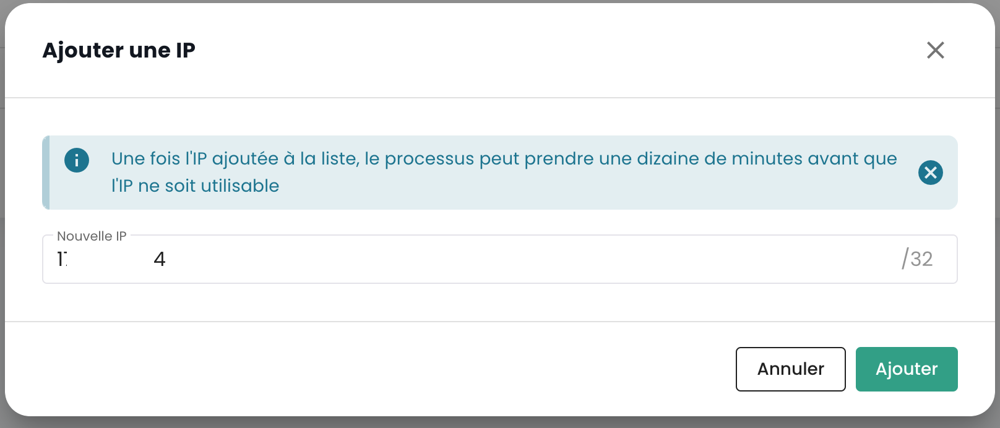

## Concept de tenant

Le tenant est un __regroupement de ressources au sein d'une organisation__. Une [Organisation](organisations.md) a au minimum un tenant (appelé __tenant par défaut__, pouvant être renommé). Généralement, plusieurs tenants sont utilisés pour segmenter les responsabilités ou les périmètres techniques.

Par exemple :

- Un tenant __Production__
- Un tenant __Préproduction__
- Un tenant __Recette__
- Un tenant __Qualification__

Mais il est aussi possible d'organiser les choses avec une __vue applicative__ ou par __criticité__ : 

- Un tenant __Application 1__ ou __Criticité 1__
- Un tenant __Application 2__ ou __Criticité 2__
- ...

Les ressources techniques commandées sont affectées à un tenant précis et ne sont pas partagées avec les autres tenants. Par exemple, un cluster d'Hyperviseur et les réseaux L2 associées ne sont disponibles que dans 1 tenant.
Concernant les réseaux, il est possible de demander des réseaux __'cross tenant'__ afin d'assurer la continuité réseau entre les tenants.

Les permissions des utilisateurs sont à définir dans chaque tenant. Ainsi chaque organisation doit bien réfléchir aux tenants souhaités. Ce point est généralement abordé en atelier initialisation, au moment de la création de l'organisation.

Il est possible de faire évoluer l'architecture en ajoutant ou supprimant des tenants.

Un tenant ne peut pas être vide. Il doit nécessairement être initialisé avec un minimum de ressource :

- Une zone de disponibilité (AZ, soit un datacenter physique),
- Un cluster de calcul,
- Un espace de stockage,
- Un vlan réseau.

## Création d'un tenant

La création d'un tenant est réalisée par une demande de service indiquant :

    Le nom de votre Organisation
    Le nom d'un contact avec son mail et n° de téléphone pour finaliser la configuration
    Le nom du tenant
    La zone de disponibilité ou à défaut le site physique souhaité pour le tenant

*__Nota__ : La création d'un tenant sera possible directement pour le commanditaire Q2 2024.*

| Référence de commande                                        | Unité    | SKU                     |  
|--------------------------------------------------------------|----------|-------------------------|
| TENANT - *(REGION)* - Activation d'un tenant                 | 1 tenant | csp:tenant:v1           |
| TENANT - *(REGION)* - Activation d'une zone de disponibilité | 1 tenant | csp:(region):iaas:az:v1 |

## Selection d'un tenant

La selection du tenant se fait depuis la page principale de la console Shiva :

*__Nota :__ Les ressources d'un tenant lui sont propres et ne sont pas mélangeable avec d'autres tenants.*

## Autorisation d'accès à un tenant : IP autorisées

L'accès à la console de gestion cloud est strictement limité aux adresses IP préalablement autorisées, en conformité avec les exigences de la qualification SecNumCloud. Cette restriction garantit un niveau de sécurité renforcé en ne permettant l'accès qu'aux utilisateurs provenant de plages d'IP spécifiées, minimisant ainsi les risques d'accès non autorisés et protégeant l'infrastructure cloud selon les standards de sécurité les plus élevés.

Il est désormais possible d'afficher la liste des adresses IP publiques autorisées sur le tenant et d’ajouter une nouvelle adresse IP publique à cette liste directement depuis l'onglet "Administration > Accès". 

Pour cela, l’utilisateur doit disposer du droit `console_public_access_read` pour consulter les IPs autorisées, et du droit `console_public_access_write` pour ajouter une adresse IP publique à la liste.

Il est alors possible d'ajouter une nouvelle IP:

Note : *La suppression d'un IP autorisée se fait par une demande de support dans la console Cloud Temple.*

## Consommation de ressource au sein d'un tenant

Il est possible de visualiser les ressources cloud consommées au sein d'un tenant, offrant ainsi une vue détaillée de l'utilisation des différents services déployés. Cette fonctionnalité permet aux utilisateurs de suivre en temps réel la consommation de leurs ressources, d'identifier les services les plus sollicités et d'optimiser leur utilisation en fonction des besoins. 

Dans le menu de la console, cliquez sur "Rapport de consommation" puis sélectionnez la période de temps souhaitée. Vous pourrez ainsi visualiser en détail la consommation des ressources cloud sur la période définie, ce qui vous permettra d’analyser l’utilisation des services et d’optimiser votre gestion en conséquence :

