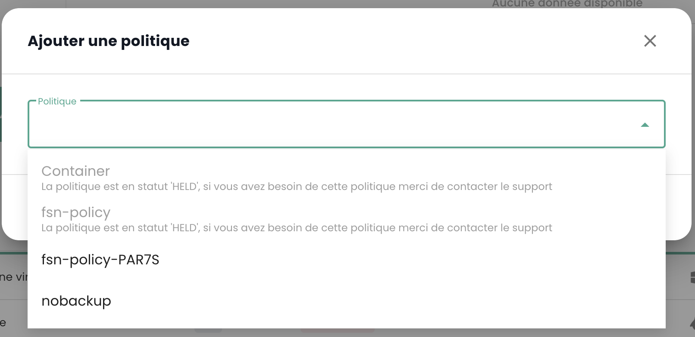

## Service de sauvegarde de machines virtuelles
Cloud Temple propose __une architecture de sauvegarde croisée native et non débrayable__ (elle est obligatoire dans la qualification secnumcloud francaise).

Les sauvegardes sont stockées dans une zone de disponibilité et sur un datacenter physique différent de celui qui héberge la machine virtuelle.

Cela permet de se protéger en cas de défaut majeur sur le datacenter de production et de restaurer sur un datacenter secondaire (incendie par exemple).

Cette solution comprend :

- La sauvegarde hors site à chaud de l'ensemble des disques,
- La présentation et le démarrage instantané d'une machine virtuelle depuis l'infrastructure de mass storage et le rechargement à chaud sur les SAN de production,
- La restauration partielle de fichiers depuis la sauvegarde,
- Une rétention limitée uniquement par l'allocation d'espace de stockage de masse.

Cette infrastructure de sauvegarde est basée sur la solution *IBM Spectrum Protect Plus*, une solution à architecture sans agent, 
simple d'utilisation et qui permet l'automatisation des processus de sauvegarde en plus d'une optimisation de l'espace de mass storage.

Les vitesses de sauvegardes et de restaurations sont dépendantes du taux de changement sur les environnements.
La politique de sauvegarde est configurable depuis [la Console Cloud Temple](../console/console.md) pour chaque machine virtuelle.

*__Nota :__*

*__Certaines machines virtuelles ne sont pas compatibles avec cette technologie de sauvegarde__ qui utilise les mécanismes de clichés instantanés de l'hyperviseur.
Ce sont typiquement les machines dont les charges d'écriture sur disque sont constantes. Il n'est pas possible pour l'hyperviseur de clore le cliché instantané ce qui 
oblige au gel de la machine virtuelle pour pouvoir terminer l'opération de cloture. Ce gèl peut durer plusieurs heures et n'est pas stoppable.*

*La solution est alors d'exclure le disque qui est cible d'écritures permanentes et de sauvegarder les données par une autre méthode.*

| Référence                                               | Unité | SKU                            |
| ------------------------------------------------------- | ----- | ------------------------------ |
| SAUVEGARDE - Accès au service IBM Spectrum Protect Plus | 1 VM  | csp:(region):iaas:backup:vm:v1 |

### Créer une politique de sauvegarde
Pour ajouter une nouvelle politique de sauvegarde, il faut faire une demande auprès du support. Le support est accessible depuis l'icône de bouée en haut à droite de la fenêtre.

La création d'une nouvelle politique de sauvegarde est réalisée par __une demande de service__ indiquant :

    Le nom de votre Organisation
    Le nom d'un contact avec son mail et n° de téléphone pour finaliser la configuration
    Le nom du tenant
    Le nom de la politique de sauvegarde
    Les caractéristiques (x jours, y semaines, z mois, ...)

### Assigner une politique de sauvegarde à une machine virtuelle

Lorsqu'une SLA est assignée à une machine virtuelle (VM), tous les disques associés à cette VM héritent automatiquement de la même SLA. Par la suite, il est possible de lancer manuellement l'exécution de la sauvegarde via l'onglet "Politiques de sauvegarde". À défaut d'un lancement manuel, la sauvegarde s'exécutera automatiquement selon le planning configuré par la SLA.

SecNumCloud rend obligatoire l'assignation d'une politique de sauvegarde à une machine virtuelle avant son démarrage. Dans le cas contraire, vous aurez la notification suivante :

Cliquez sur l’onglet __'Politiques de sauvegarde'__ du menu de votre machine virtuelle. Vous pouvez y visualiser la ou les politiques de sauvegardes assignée(s) à celle-ci.

Pour assigner une nouvelle politique de sauvegarde à la machine virtuelle, cliquez sur le bouton __'Ajouter une politique'__ et sélectionnez la politique de sauvegarde voulue.

### Assigner une politique de sauvegarde à un disque virtuel

Il est également possible d'assigner une SLA directement à un disque virtuel spécifique d'une machine. Dans ce cas, la machine virtuelle ne hérite pas de cette SLA appliquée individuellement au disque. Cependant, il n'est pas possible de lancer manuellement l'exécution de la sauvegarde au niveau des disques, car cette fonctionnalité n'est pas prise en charge dans Spectrum Protect Plus.

En revanche, il est possible d'exclure certains disques d'une ou plusieurs politiques de sauvegarde (SLA) de la VM, ce qui permet de désassigner une ou plusieurs SLA(s) sur une base disque par disque. Cette approche offre la flexibilité de lancer manuellement l'exécution de la sauvegarde d'une SLA sans affecter tous les disques de la machine virtuelle, permettant ainsi une gestion plus fine des sauvegardes.

Cliquez sur la barre d'actions du disque auquel vous souhaitez assigner une politique de sauvegarde. Puis, cliquez sur __'Politiques'__ et sélectionnez la politique de sauvegarde souhaitée.

_Nota_ : La politique à ajouter doit se trouver sur une zone de disponibilité différente de la machine virtuelle.

### Exécuter une politique de sauvegarde

Dans le menu __'Politiques de sauvegarde'__ de votre machine virtuelle, cliquez sur le bouton __'Exécuter'__ de la colonne __'Actions'__ de la politique de sauvegarde que vous souhaitez exécuter. 

Pour exécuter une politique de sauvegarde, vous pouvez également partir de la section __'Sauvegardes'__ dans le menu de
votre machine virtuelle. Cliquez sur le bouton __'Exécuter la sauvegarde'__, puis sélectionnez la sauvegarde que vous souhaitez exécuter dans la liste déroulante.

### Retirer une politique de sauvegarde

Dans le menu __'Politiques de sauvegarde'__ de votre machine virtuelle, cliquez sur le bouton __'Retirer'__ de la colonne __'Actions'__ de la politique de sauvegarde que vous souhaitez retirer. 

__Attention, il n'est pas possible de retirer la dernière SLA sur une machine virtuelle allumée :__

### Suppression d'une politique de sauvegarde : cas d'une politique de sauvegarde suspendue ("held")

Lorsque la dernière ressource est dissociée d'une politique SLA, le système détecte automatiquement cette situation. En conséquence, tous les travaux liés à cette politique SLA basculent automatiquement vers l'état "Suspendu" ("Held"). Il est important de noter qu'à ce stade, la suppression directe de la politique SLA n'est pas possible en raison de l'existence de travaux dépendants. Pour procéder à la suppression de la politique, une série d'étapes doit être suivie. 

Il faut vérifier que les travaux concernés sont effectivement à l'état "Suspendu". Une fois cette vérification effectuée, ces travaux peuvent être supprimés. Ce n'est qu'après avoir supprimé ces travaux dépendants que la politique SLA pourra être définitivement effacée du système.

Un cas particulier mérite une attention spécifique : l'ajout d'une nouvelle ressource à une politique SLA dont les travaux dépendants n'ont pas été supprimés. Dans cette situation, les identifiants des travaux seront conservés. Cependant, il est crucial de noter que les travaux en état "Suspendu" ne reprendront pas automatiquement. Une intervention manuelle sera nécessaire pour les réactiver et permettre leur exécution.

note : Pour toute précision sur cette situation, contactez le support Cloud Temple.

La console Cloud Temple empêche l'affectation d'une machine virtuelle à une politique suspendue :

De même, il n'est pas possible de démarrer une machine virtuelle qui est associée à une politique de sauvegarde suspendue :

### Restaurer une sauvegarde

L’onglet __'Sauvegardes'__ du menu de vos machines virtuelles vous permet d’accéder à la liste des sauvegardes de celle-ci. 
Pour restaurer une sauvegarde, cliquez sur le bouton __'Restaurer'__ sur la ligne correspondant à la sauvegarde que vous souhaitez restaurer. 

1. **Mode production** : Le mode production permet la reprise après incident sur le site local depuis le stockage primaire ou un site de reprise après incident distant, en remplaçant les images de machine originales par les images de récupération. Toutes les configurations sont transférées dans le cadre de la reprise, notamment les noms et les identificateurs, et tous les travaux de copie des données associés à la machine virtuelle continuent de s'exécuter. Dans le cadre d'une restauration en mode production, vous pouvez choisir de remplacer le stockage dans la machine virtuelle par un disque virtuel provenant d'une sauvegarde de machine virtuelle précédente. 

2. **Mode test** : Le mode test crée des machines virtuelles temporaires pour le développement, le test, la vérification d'instantané et la vérification de reprise après incident en fonction d'un planning réitérable, sans impact sur les environnements de production. Les machines de test s'exécutent aussi longtemps que nécessaire pour effectuer le test et la vérification, puis elles sont nettoyées. Via la mise en réseau isolé, vous pouvez établir un environnement sûr afin de tester vos travaux sans interférer avec les machines virtuelles utilisées pour la production. Les machines virtuelles qui sont créées en mode test possèdent des noms et des identificateurs uniques pour éviter tout conflit dans votre environnement de production.

3. **Mode clone** : Le mode Clone crée des copies des machines virtuelles pour les cas d'utilisation requérant des copies permanentes ou à exécution longue pour l'exploration de données ou la duplication d'un environnement de test sur un réseau isolé. Les machines virtuelles créées en mode clone possèdent des noms et des identificateurs uniques pour éviter tout conflit dans votre environnement de production. En mode clone, vous devez être attentif à la consommation des ressources car le mode clone crée des machines permanentes ou à long terme.

**La restauration est par défaut en mode "TEST" pour préserver la production** et il vous est possible de choisir le nom de la vm restaurée :

Notez que si les tests sont satisfaisant, il est possible de passer une machine virtuelle du mode test au mode production :

## Service de sauvegarde par agent

Pour les sauvegardes des environnements complexes (très gros serveurs de fichiers, SAP, bases de données...), Cloud Temple peut mettre à disposition au sein de votre tenant la solution IBM Storage Protect. 
Basée sur une architecture à agent et une plateforme dédiée, Spectrum Protect offre des mécanismes de sauvegarde de données avancés incluant compression, dé-duplication à la source et chiffrement.

Des agents de sauvegarde avancés sont disponibles pour les applications principales (telles que la messagerie électronique, les ERP...). 

Vous trouverez plus d'information sur IBM Storage Protect ici : https://www.ibm.com//products/storage-protect

| Référence                                                                                                              | Unité       | SKU                                      |
| ---------------------------------------------------------------------------------------------------------------------- | ----------- | ---------------------------------------- |
| SAUVEGARDE - Service IBM Storage Protect - 1 appliance virtuelle                                                       | 1 appliance | csp:(region):backup:sp:service:access:v1 |
| SAUVEGARDE - IBM Spectrum Protect - 1 Tio source sauvegardé incluant espace backup (pour une ) politique 7j - 5s - 6m) | 1 Tio       | csp:(region):backup:sp:1tio:v1           |

## Externalisation des sauvegardes sur bande LTO

**Remarque : Le service n'est plus commercialisé depuis le 1er décembre 2023.**

Dans l'optique de sécuriser au maximum vos données de sauvegarde, Cloud Temple propose d'écrire et de stocker les sauvegardes sur des bandes magnétiques LTO. 
Les données écrites sur bande sont chiffrées et non falsifiables.

Il convient de réserver le nombre de lecteurs LTO (technologie LTO8 ou LTO9) en fonction de vos besoins.

Cloud Temple fait appel à son partenaire [__Iron Mountain__](https://www.ironmountain.com) pour l'externalisation des sauvegardes sur bande (transport, stockage et gestion des bandes), 
afin de répondre aux besoins de protection des données, de reprise après sinistre et d'archivage légal.

| Référence                                                           | Unité       | SKU        |
| ------------------------------------------------------------------- | ----------- | ---------- |
| SAUVEGARDE - Réservation d'un lecteur LTO                           | 1 lecteur   | DEPRECATED |
| SAUVEGARDE - Bande LTO pour externalisation des backups             | 1 bande LTO | DEPRECATED |
| SAUVEGARDE - Service d'externalisation Iron Mountain des bandes LTO | 1 forfait   | DEPRECATED |
