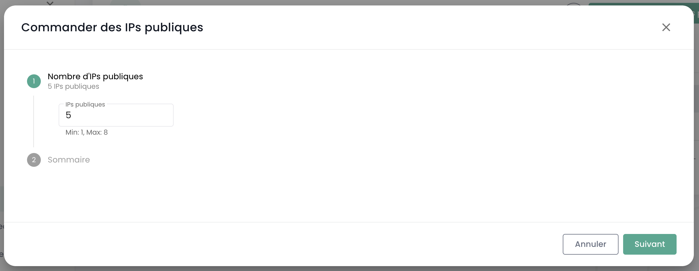
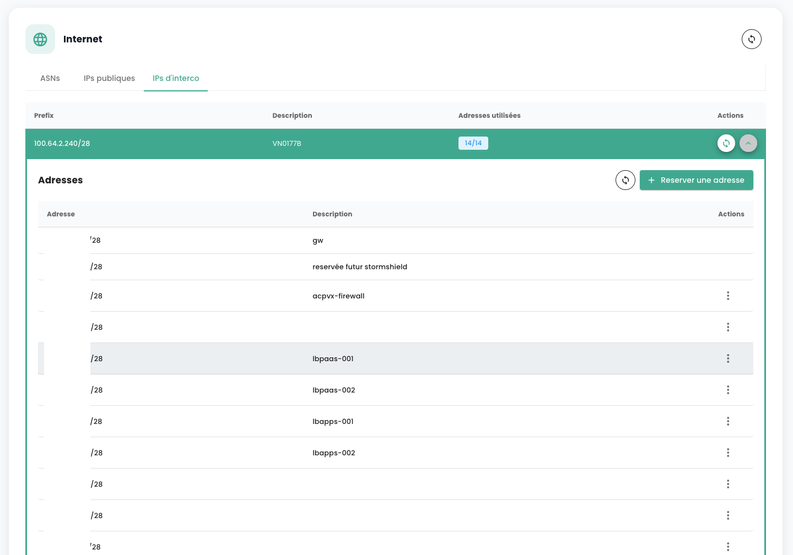

Cloud Temple met à disposition de ses clients des blocs d'__adresses IP publiques__ d'au minimum 8 IPv4, ou 64 IPv6, déclarées au RIPE, pour permettre votre connectivité Internet.

## Affectation d'un adressage internet publique Provider Aggregated (PA)

Dans ce contexte, vous utilisez des adresses IP publiques affectée à Cloud Temple, qui vous sont louées pour vos usages.

La création d'une connectivité internet et l'affectation des adresses IP publiques associées est réalisée par __une demande de service__ indiquant :

    Le nom de votre Organisation
    Le nom d'un contact avec son mail et n° de téléphone pour finaliser la configuration
    Le nom du tenant
    La taille du subnet souhaité (minimum /29 en IPv4 et /64 en IPv6)
    Si elles n'ont pas déjà été fournies, les informations RIPE (contact administratif notamment) seront demandées par le support

La livraison de l'accès internet se fait via le protocole BGP4 en retour de la demande de support, qui fournira les informations suivantes :

- *prefix public*
- *prefix d'interconnection*
- *any-cast gateway*
- *Subnet IP*
- *local AS*
- *AS de Cloud Temple*
- *keepalive timers et  hold-time timer*
- *les adresses des routes servers associées à votre tenant*.

L'utilisation du protocole BGP4 garantit un routage efficace de vos flux Internet vers la passerelle active de votre architecture, particulièrement dans les scénarios de déploiement multi-zones de disponibilité, comme c'est le cas pour des clusters de firewalls répartis entre deux zones de disponibilité.

## Blocs IPv4 

### Offre d'adresse IPv4 en version 1

__*Cette offre n'est plus commercialise depuis le 2 mai 2024*__

La livraison des IPv4 se fait dans __la limite des stocks disponibles__ pour nos clients, avec un bloc minimum 8 IPV4 (/29 ou 255.255.255.248).

Il est possible de visualiser les blocs d'adresses qui vous sont affectés dans le menu __*'IPs publiques'*__ du menu Réseaux dans le bandeau vert à gauche.

| Référence                             | Unité  | SKU                          |
| ------------------------------------- | ------ | ---------------------------- |
| Réseau - Plage IPv4 Publiques dédiées | 8 IPv4 | csp:(region):network:ipv4:v1 |

### Offre d'adresse IPv4 en version 2

La livraison d'une IPv4 se fait dans __la limite des stocks disponibles__ pour nos clients, par adresse IP.

Il est possible de visualiser les blocs d'adresses qui vous sont affectés dans le menu __*'IPs publiques'*__ du menu Réseaux dans le bandeau vert à gauche.

| Référence                     | Unité  | SKU                          |
| ----------------------------- | ------ | ---------------------------- |
| Réseau - IPv4 Publique dédiée | 1 IPv4 | csp:(region):network:ipv4:v2 |

## Blocs IPv6

__Au 1er mai 2024, l'offre d'adresses IP Publiques IPv6 n'est pas encore disponible à la commercialisation.__

La cible de commercialisation est prévue pour le deuxième semestre 2024.

| Référence                             | Unité   | SKU                          |
| ------------------------------------- | ------- | ---------------------------- |
| Réseau - Plage IPv6 Publiques dédiées | 64 IPv6 | csp:(region):network:ipv6:v1 |

## Adresses IP publiques Provider Independant (PI)

Si vous disposez de votre propre adressage Provider Independent, vous avez la possibilité de l'annoncer au sein de l'Autonomous System de Cloud Temple. Cela vous permet de continuer à utiliser vos propres adresses IP au sein de l'infrastructure Cloud Temple et de faciliter vos migrations.

Pour ce faire, réalisez __une demande de service__ indiquant :

    Le nom de votre Organisation
    Le nom d'un contact avec son mail et n° de téléphone pour finaliser la configuration
    Le nom du tenant
    Le bloque d'adresse IP PI que vous détenez et que vous souhaitez annoncer
    Si elles n'ont pas déjà été fournies, les informations RIPE associée seront demandées par le support 

Il n'y a pas de facturation spécifique pour les clients utilisant des adresses Provider Independant.

## Gestion de vos connectivités Internet

La gestion de la connectivité s'effectue via le menu **'Réseau'** > **'Internet'**. Ce menu centralise la gestion des adresses IP, offrant deux catégories distinctes :

1. **Adresses IP Publiques** : elles sont utilisées pour exposer vos services sur Internet, facilitant ainsi les échanges de données entrantes et sortantes.
2. **Adresses IP d'Interconnexion** : ces adresses permettent à vos passerelles de diriger le trafic vers le réseau spécifique de Cloud Temple, assurant une connexion sécurisée et efficace.

Les adresses IP publiques permettent l'accès Internet, tandis que les adresses IP d'interconnexion utilisées avec le protocole BGP4 assurent des connexions sécurisées entre réseaux. Ces dernières facilitent des échanges fiables et sécurisés entre votre tenant et le réseau Cloud Temple. L'emploi conjoint de ces adresses améliore la gestion du trafic et renforce la sécurité et la performance du réseau.

Voici l'interface principale pour la gestion des adresses IP :

L'onglet d'accueil correspond à votre ASN interne dédié à votre tenant. Il indique notamment les informations importante pour le paramétrage de votre connectivité BGP.

### Adresses IP publiques

Il est possible de voir et de commenter les blocs et adresses d'IP associé à votre tenant via l'IPAM intégré à la console Cloud Temple:

La commande d'adresses IPs publiques se fait via le bouton **'Commander des IPs publiques'** :

La réservation et l'affectation d'une adresse IP se font via le bouton **'Réserver une adresse'** :

La modification ou la suppression de la reservation via les boutons **'Actions'** :

Supprimer une réservation signifie que la ressource devient disponible pour un autre usage, mais reste allouée et facturée au client. 

Sur certaines lignes, le bouton **'Action'** n'est pas disponible, indiquant que les adresses IP sont réservées et donc non disponibles pour une utilisation.

### Adresses IP d'interconnexion

De la même façon, vous pouvez voir et commenter les blocs d'adresses IP d'interconnexion. Vous pouvez visualiser les sous réseaux d'interconnexions avec le réseau Cloud Temple et leur usage :

Vous pouvez facilement modifier, comme pour les adresses publiques, leur usage dans la gestion IPAM intégrée :

### Réservation de bande passante internet

La bande passante Internet est réservable par paliers de 100 Mbps. La capacité maximale disponible pour une passerelle est de 10 Gbps, potentiellement limitée par les caractéristiques techniques de votre passerelle. 

La facturation s'effectue au 95e percentile sur la période de facturation, habituellement un mois. Vous pouvez donc occasionnellement profiter d'un burst au-delà de votre capacité réservée.

| Référence                                 | Unité    | SKU                                     |
| ----------------------------------------- | -------- | --------------------------------------- |
| Réseau - Bande passante internet réservée | 100 Mbps | csp:(region):network:trafic:internet:v1 |

__*Remarque :*__
*Il n'y pas de __facturation volumétrique__ de type __'egress fees'. Vous ne payez que la réservation de bande passante.__*

## Anti-DDoS

Une attaque par déni de service distribué (DDoS) vise à dégrader ou mettre hors ligne un service en le surchargent via un trafic illégitime.

La protection Anti-DDoS de Cloud Temple vous protège contre les acteurs malveillants et __est active sans surcoût contre les attaques volumétriques__ : le filtrage est réalisé en amont par nos partenaires télécoms.

## Aller plus loin
- [Déployer un firewall virtuel](quickstart_network.md#déployer-un-firewall-opensource-pfsense-)
