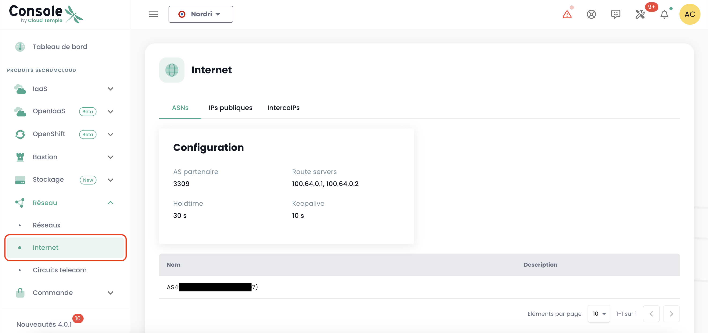
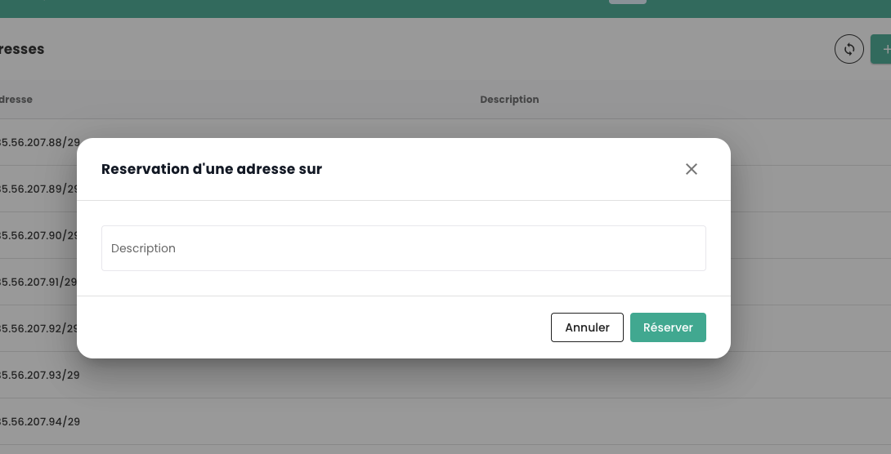

## Gestion de vos connectivités Internet

La gestion de la connectivité s'effectue via le menu **'Réseau'** > **'Internet'**. Ce menu centralise la gestion des adresses IP, offrant deux catégories distinctes :

1. **Adresses IP Publiques** : elles sont utilisées pour exposer vos services sur Internet, facilitant ainsi les échanges de données entrantes et sortantes.
2. **Adresses IP d'Interconnexion** : ces adresses permettent à vos passerelles de diriger le trafic vers le réseau spécifique de Cloud Temple, assurant une connexion sécurisée et efficace.

Les adresses IP publiques permettent l'accès Internet, tandis que les adresses IP d'interconnexion utilisées avec le protocole BGP4 assurent des connexions sécurisées entre réseaux. Ces dernières facilitent des échanges fiables et sécurisés entre votre tenant et le réseau Cloud Temple. L'emploi conjoint de ces adresses améliore la gestion du trafic et renforce la sécurité et la performance du réseau.

Voici l'interface principale pour la gestion des adresses IP :

L'onglet d'accueil correspond à votre ASN interne dédié à votre tenant. Il indique notamment les informations importante pour le paramétrage de votre connectivité BGP.

### Adresses IP publiques

Il est possible de voir et de commenter les blocs et adresses d'IP associé à votre tenant via l'IPAM intégré à la console Cloud Temple:

La commande d'adresses IPs publiques se fait via le bouton **'Commander des IPs publiques'** :

La réservation et l'affectation d'une adresse IP se font via le bouton **'Réserver une adresse'** :

La modification ou la suppression de la reservation via les boutons **'Actions'** :

Supprimer une réservation signifie que la ressource devient disponible pour un autre usage, mais reste allouée et facturée au client. 

Sur certaines lignes, le bouton **'Action'** n'est pas disponible, indiquant que les adresses IP sont réservées et donc non disponibles pour une utilisation.

### Adresses IP d'interconnexion

De la même façon, vous pouvez voir et commenter les blocs d'adresses IP d'interconnexion. Vous pouvez visualiser les sous réseaux d'interconnexions avec le réseau Cloud Temple et leur usage :

Vous pouvez facilement modifier, comme pour les adresses publiques, leur usage dans la gestion IPAM intégrée :

