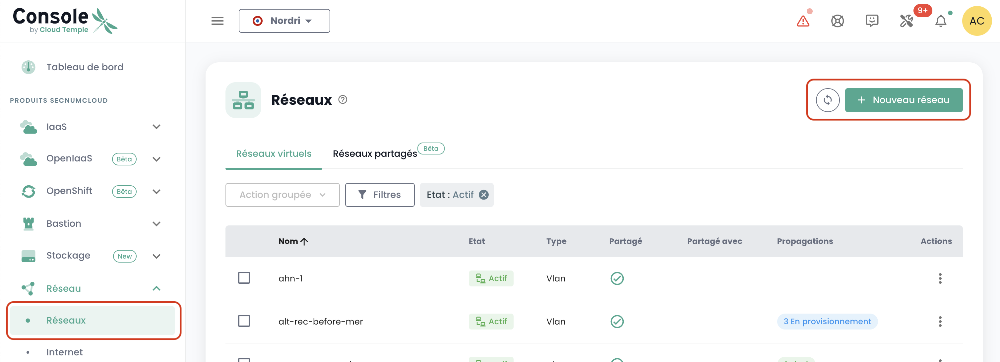
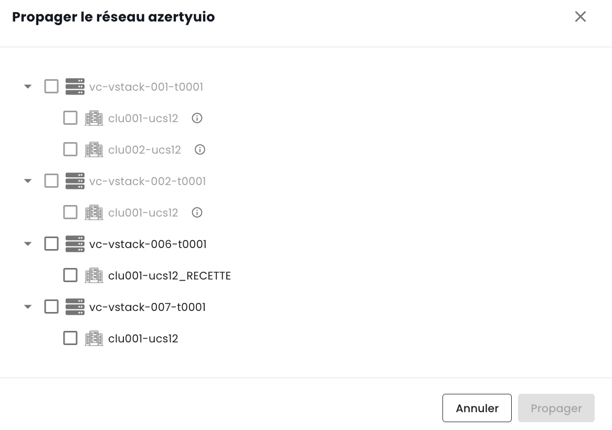

## Réseaux privés régionaux

La commande des réseaux privés au sein d'une région se réalise directement dans la console Cloud Temple. 

### Au sein d'un tenant

La création d'un réseau virtuel se fait dans le menu __*Network*__ sur le bandeau vert à gauche de l'écran.

Cliquer ensuite sur le bouton __*Nouveau réseau*__

Vous devez spécifier le nom de votre réseau qui sera affiché. Par défaut, l'ensemble de vos clusters accéderont à votre nouveau réseau.
Cependant, dans le sous menu __*Options Avancées*__, vous pouvez spécifier plus finement l'étendue de propagation au sein du tenant entre vos différents clusters.

L'ensemble des actions possibles sur vos réseaux se trouve dans le menu __*Actions*__ de chacun d'eux :

- L'activation du partage d'un réseau entre tenant d'une meme organisation.
- La désactivation du partage d'un réseau entre tenant d'une meme organisation.
- L'ajout d'un partage d'un réseau entre tenant d'une meme organisation.
- La suppression d'un partage d'un réseau entre tenant d'une meme organisation.
- La visualisation graphique de la propagation d'un réseau sur l'ensemble de vos clusters et de vos hyperviseurs au sein d'un tenant.
- La suppression d'une propagation au sein d'un tenant.
- La modification d'une propagation au sein d'un tenant.
- La suppression d'un réseau.

#### Visualisation de la propagation de vos réseaux

Vous pouvez facilement dans le menu __*Actions*__ visualiser pour un réseau sa propagation vers vos différents clusters au sein d'un même tenant. 
Choisissez l'option *"Visualiser la propagation"* :

 

#### Modification de la propagation

La modification d'une propagation au sein d'un tenant est réalisée par l'option *"Propager"* :
choisissez ensuite les clusters devant être intégrés à cette propagation.

__*Remarque :*__ *La modification de propagation est limitée à 20 réseaux par action.*

#### Suppression d'un réseau

La suppression d'un réseau au sein d'un tenant est réalisée par l'option *"Supprimer le réseau"* :

### Partage de réseau entre tenants

Par défaut, __les réseaux sont uniquement disponibles au sein d'un tenant__. Vous pouvez choisir de __partager un réseau entre plusieurs tenants__ pour des raisons techniques ou des raisons de connectivité.
Il est ainsi possible de partager un réseau entre vos __[Tenant](../../../console/iam/concepts/#tenant)__ au sein d'une même organisation.

Il suffit pour cela d'activer le partage comme ci-dessous.

Une fois l'activation du partage effectué, il vous suffit d'ajouter un partage comme ci-dessous.

Puis, sélectionner le tenant cible. Attention, la liste des tenants est dynamique. 
Elle dépend de votre organisation et de vos droits.

Une fois le réseau partagé, il sera visible dans l'onglet 'Réseaux partagés' depuis votre second tenant.

 
