Ce guide va vous aider à déployer votre __firewall opensource pfSense__ dans le Cloud de Confiance en seulement quelques minutes.

## Prérequis
Les prérequis à ce guide sont les suivants :

1. Avoir souscrit à l'offre Cloud Temple : vous devez disposer de votre organisation, de votre tenant et de vos accès,
2. Avoir les droits sur le module compute.

Ce document décrit les étapes à suivre pour déployer un firewall virtuel pfSense.

## Déployer un firewall opensource pfSense 

[pfSense](https://www.pfsense.org) est un projet open source basé sur freeBSD permettant de mettre en place un firewall virtuel.

Un firewall pfSense s'administre via une interface web, il faut donc disposer d'une deuxième machine 
avec une interface graphique ayant une adresse IP dans le même réseau LAN que le firewall pour pouvoir le configurer. 

Nous aurons besoin d'un ensemble de deux VM :

- la première sera la machine sur laquelle nous allons déployer le firewall
- la deuxième sera la machine à partir de laquelle nous allons administrer le firewall.

### Demander une livraison d'accès internet
La première étape consiste à récupérer [les informations d'accès internet ici ](https://docs.cloud-temple.com/network/internet/#gestion-de-vos-connectivites-internet). Vous devez avoir les informations suivantes :

- prefix public
- prefix interconnection
- any-cast gateway
- plage IP
- local AS 
- AS de Cloud Temple
- keepalive timers et le hold-time timer 
- les adresses des routes servers

### Installation et configuration réseau des interfaces

Vous pouvez ensuite déployer votre vm pfSense :

1. __Installation du firewall__ depuis le template pfSense dans shiva :
    - [(Déployer via la console)](../iaas/quickstart_iaas_template.md#déployer-une-machine-virtuelle-depuis-un-template)
    - [(Déployer via Terraform)](../iaas/quickstart_iaas.md#déployer-une-machine-virtuelle-via-terraform). 
2. __Configuration des interfaces LAN et WAN__ du firewall : l'interface WAN doit être dans votre vLAN internet, son IP sera prise dans la plage IP qui vous a été communiquée par le CDS ainsi que la default GW.
3. __Installation de la deuxième machine__ de management.
4. __Configuration de l'interface__ de la VM de management : cette machine doit être dans le même réseau que celui dans lequel l'interface LAN du firewall a été configurée.

### Accès au Firewall
Une fois que les deux VM sont bien installées, la deuxième étape consiste à accéder au firewall afin de commencer sa configuration.

- accéder à l'interface web du firewall depuis la vm de management :

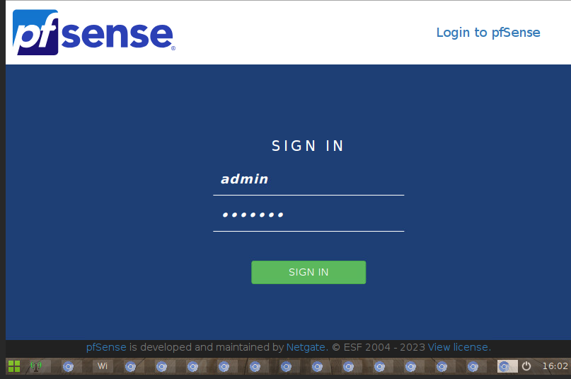
- login par défaut : 
    - username : *admin*
    - password : *pfsense* (pensez à changer le mot de passe par default)
  
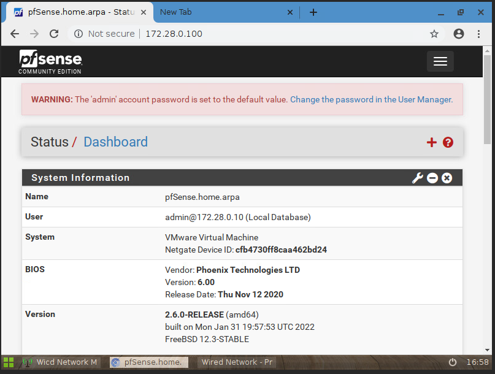
### Configuration du firewall 
Cette étape consiste à configurer les neighbors BGP du FW.

- dans un premier temps, pensez à autoriser le Flux BGP en TCP 179 dans __'Firewall > Rules'__ :

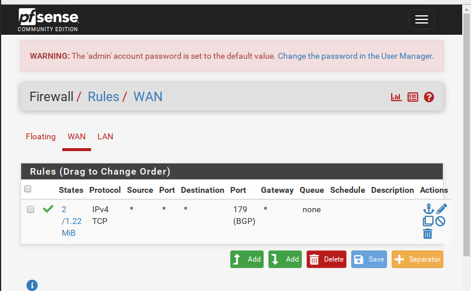

- Allez dans __'services > FRR BGP'__ pour commencer la configuration de votre session BGP :

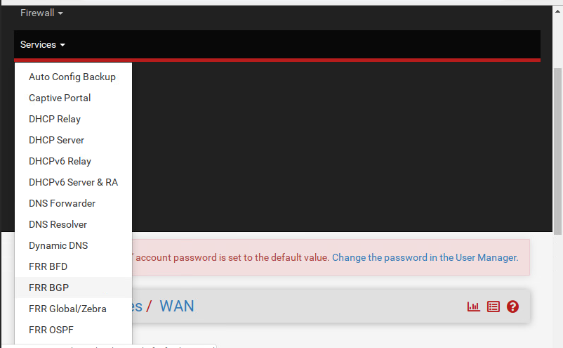

- Cochez les deux premières cases et indiquez le numéro de votre local AS et les times tel qui vous ont été communiqués par le CDS.

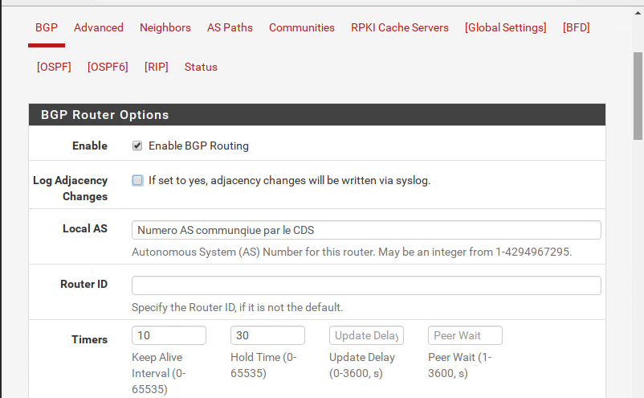

### Configuration des neighbors BGP
Dans Neighbors, cliquez sur +Add pour commencer à créer vos voisins BPG.

- Pour chaque neighbor : renseignez son IP adresse dans __'General Options > Name/address'__
   
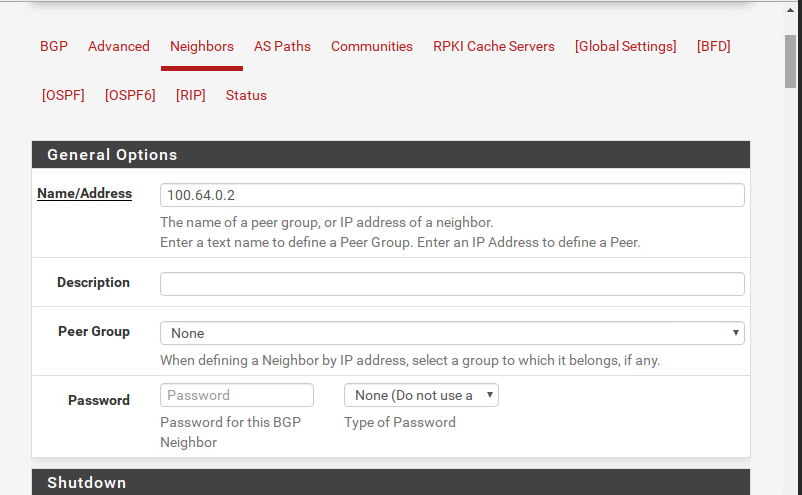

  - renseignez le remote AS (correspondant au numéro d'AS de cloud temple) dans basic options comme suit :
    
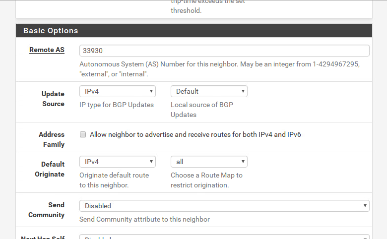

  - et enfin dans Advanced option, faites ceci :
     
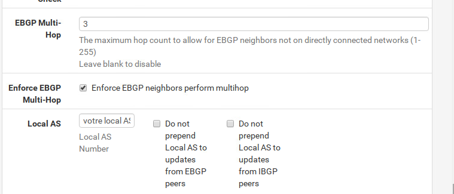

  - cochez la case qui définit le type de votre neighbor. Dans notre cas, c'est ``un route`` serveur :
     
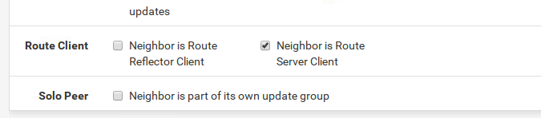

  - à la fin, n'oubliez pas de sauvegarder vos modifications en cliquant sur __'save'__ :
  
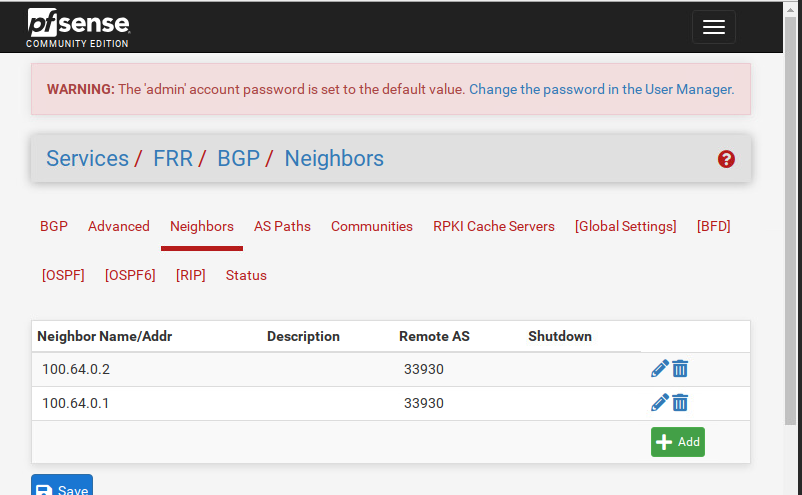 

### Vérification de l'état de la session bgp avec les neighbors 

Dans Status, vous pouvez voir l'état de la session BGP que vous venez de configurer 

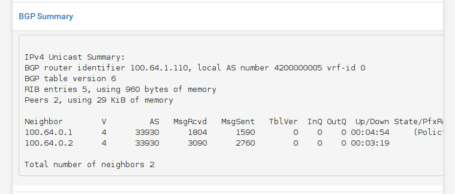 

Veillez à ce que le __BGP State__ soit à __established__. 

### Annoncer son préfixe public

Afin d'annoncer son préfixe public, vous pouvez créer des routes en /32 et faire la redistribution en static : 

- dans __*System > Routing > Static Routes*__ : créer vos routes static en /32 en mettant la Gateway à Null4- 127.0.0.1
- dans __*Services > FRR package > BGP > Network Distribution*__ : activez la ``redistribution`` en local en choisissant IPV4 dans ``Reditribute`` FRR static routes. 
