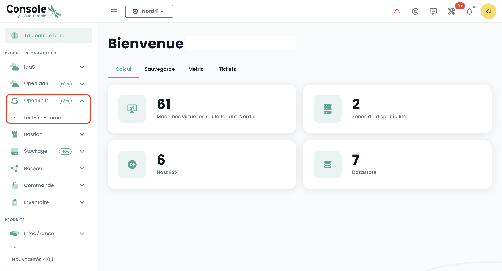

## Déployer une plateforme Redhat Openshift au sein de votre tenant

### Affectation des droits d'accès

Il est indispensable que l'administrateur du [Tenant](../console/iam/concepts.md#tenants) accorde le droit de gestion de la plateforme Openshift à l'utilisateur administrateur Openshift pour pouvoir y accéder :

### Accès à l'environnement Openshift au sein d'un tenant

Après l'affectation des droits, le module '__Openshift__' apparaît alors dans le menu de la console Cloud Temple :

Vous voyez alors apparaître les clusters Openshift qui sont déployés au sein de votre tenant.

Cliquez sur le cluster que vous souhaitez administrer. Vous accéder à l'environnement d'administration du cluster :

Après authentification, vous pouvez administrer votre cluster :

