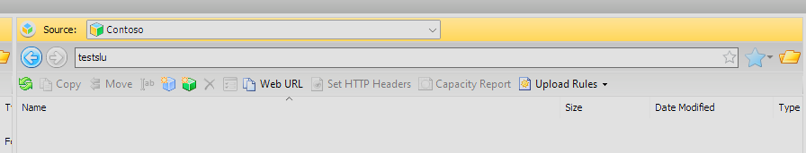
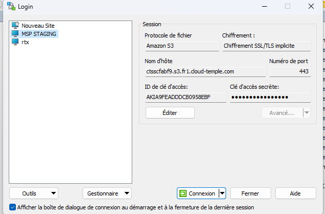

## Utiliser MINIO

Vous pouvez utiliser le client minio par exemple :

https://min.io/docs/minio/linux/reference/minio-mc.html

Par exemple : 
```
    mc alias set <alias_name> https://reks2ee2b1.s3.fr1.cloud-temple.com <access_key> <secret_key>
```
Pousser un fichier : 
```
    mc cp test.txt <alias_name>/<bucket_name>
```
Récupérer un fichier :
```
    mc ls <alias_name>/<bucket_name>
```
## Cloud Berry Explorer

vous pouvez aussi utiliser [Cloud Berry Explorer](https://www.msp360.com/explorer/).

1. Connectez vous en utilisant votre endpoint et votre clef :


2. Une fois connecté, saisissez le nom du bucket dans la barre de navigation:



3. Vous pourrez alors utiliser le bucket normalement : 


## Utiliser WINSCP 6.3.x

Vous pouvez utiliser [Winscp](https://winscp.net/eng/download.php) :

1. Connectez vous en utilisant votre endpoint, votre clef d'accès et votre clef secrete :



2. Une fois connecté, utilisez WINSCP normalement comme un site FTP ou SCP :


## Ajouter le HASH d'un fichier lors de l'upload d'un objet

Globalement, le HASH des fichiers est supporté sur notre stockage objet via les metadatas. Certains clients permettent de calculer à la volée un HASH et de l'ajouter en metadata (minio-mc avec md5 par exemple), pour d'autre, il faut préciser la donnée en metadata directement.

1. Cas de l'ajout d'un HASH avec le client minio-mc : ce client supporte le calcul à la volée d'un hash MD5 et le stockage dans les metadatas


            ╰─➤  cat test.txt                       
            Ceci est un test 
            ╰─➤  md5 test.txt                       
            MD5 (test.txt) = 8b34b2754802a46e3475998dfcf76f83
            ╰─➤  mc cp -md5 test.txt CLR-PUB/CLR-PUB
            ...lesur/Downloads/test.txt: 18 B / 18 B  ▓▓▓▓▓▓▓▓▓▓▓▓▓▓▓▓▓▓▓▓▓▓▓▓▓▓▓▓▓▓▓▓▓▓▓▓▓▓▓▓▓▓▓▓▓▓▓▓▓▓▓▓▓▓▓▓▓▓▓▓▓▓▓▓▓▓▓▓▓▓▓▓▓▓▓▓▓▓▓▓▓▓▓▓▓▓▓▓▓▓▓▓▓▓▓▓▓▓▓▓▓▓▓▓▓▓  111 B/s 0s
            ╰─➤  mc stat CLR-PUB/CLR-PUB/test.txt
            Name      : test.txt
            Date      : 2024-06-08 10:21:31 CEST 
            Size      : 18 B   
            ETag      : 8b34b2754802a46e3475998dfcf76f83 
            Type      : file 
            Encryption: SSE-S3
            Metadata  :
                Content-Type: text/plain 

2. Exemple d'ajout un sha256 "manuellement" : pour ce faire on utilise les attributs S3 du fichier.

            ╰─➤  cat test.txt
            Ceci est un test
            ╰─➤  shasum -a 256 test.txt                            
            2c5165a6a9af06b197b63b924d7ebaa0448bc6aebf8d2e8e3f58ff0597f12682  test.txt
            ╰─➤  mc cp -md5 test.txt CLR-PUB/CLR-PUB -attr "checksum-sha256=$(shasum -a 256 test.txt | cut -f1 -d' ')"
            ...lesur/Downloads/test.txt: 18 B / 18 B  ▓▓▓▓▓▓▓▓▓▓▓▓▓▓▓▓▓▓▓▓▓▓▓▓▓▓▓▓▓▓▓▓▓▓▓▓▓▓▓▓▓▓▓▓▓▓▓▓▓▓▓▓▓▓▓▓▓▓▓▓▓▓▓▓▓▓▓▓▓▓▓▓▓▓▓▓▓▓▓▓▓▓▓▓▓▓▓▓▓▓▓▓▓▓▓▓▓▓▓▓▓▓▓▓▓▓  141 B/s 0s
            ╰─➤  mc stat CLR-PUB/CLR-PUB/test.txt                                                                     
            Name      : test.txt
            Date      : 2024-06-08 10:41:17 CEST 
            Size      : 18 B   
            ETag      : 8b34b2754802a46e3475998dfcf76f83 
            Type      : file 
            Encryption: SSE-S3
            Metadata  :
                X-Amz-Meta-Checksum-Sha256: 2c5165a6a9af06b197b63b924d7ebaa0448bc6aebf8d2e8e3f58ff0597f12682 
                Content-Type              : text/plain 

