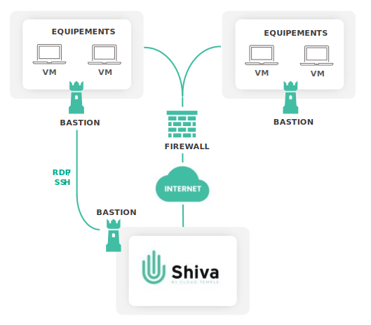

## What is the Cloud Temple Bastion?

The Cloud Temple Bastion is a managed service that provides secure RDP or SSH connectivity from the Cloud Temple console to your physical and virtual infrastructures, whether they are located on the trusted Cloud, on a public Cloud, or on-premise. The Bastion solution allows you to manage your devices without exposing them to the Internet.

## Benefits

| Benefit                |                                                                               Description                                                                               |   
|------------------------|:----------------------------------------------------------------------------------------------------------------------------------------------------------------------:|
| Centralized management |                                             The Cloud Temple Bastion is directly accessible from the Shiva portal.                                                     |   
| Security               | Devices managed via the Bastion are not exposed to the Internet, protecting them from malicious users scanning their ports.                                            |  
| Infrastructure as Code |             APIs allow you to manage the Cloud Temple Bastion entirely "as Code" (session creation, connection, modification, and deletion).                          |   

## References (SKU)

| Reference                           |   Unit    |           SKU           |  
|-------------------------------------|:---------:|:-----------------------:|
| ADMINISTRATION - Bastion SSH & RDP  | 1 Session | cmp:bastion:session:std | 

## Concepts

### The Bastion Appliance

The Bastion Appliance is a virtual machine deployed near your devices. This Appliance enables a secure and direct flow from the Shiva platform to the devices to be managed that are located in the same virtual network.

The flow is encrypted and encapsulated in a VPN tunnel. The solution does not require opening any flows from the Internet to your infrastructure. The only requirement is that the Appliance has access to the public IP of the Shiva Bastion module on port 443.

An Appliance can be used for quick connections to a device. For each connection, the desired protocol, the device's IP address, and your credentials must be specified. To avoid filling in this information for every connection, sessions can be created and associated with devices that are regularly managed.

### Sessions

A session is a connection configuration for a device via a Bastion. It involves defining a device to be managed and the Appliance to be used for the flow, allowing faster connection to the device.

This solution is ideal for regular connections to a managed device. Essential information is saved, and only your credentials are required during the connection.