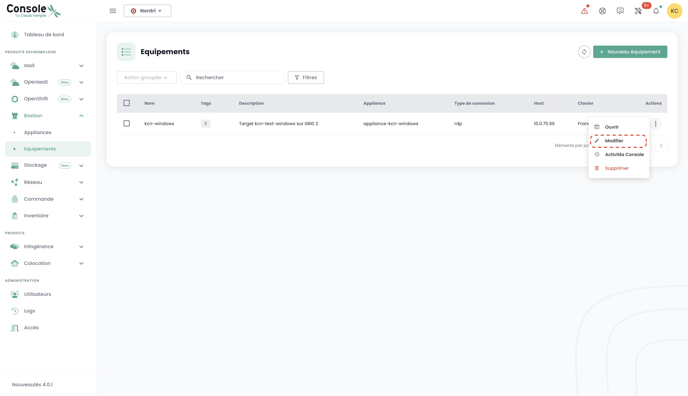

These tutorials guide you through deploying and managing a Cloud Temple Bastion from the Shiva portal.

## Prerequisites

1. You must subscribe to the Cloud Temple offer (Appliance Bastion subscription).
2. The devices to be managed must be accessible from the network where the Bastion Appliance is deployed.
3. You must have permissions for the Bastion module.
4. For an on-premise deployment of the Appliance, the corresponding network flows must be opened.

## Interface

Once logged into the Shiva web portal, navigate to the "Bastion" tab in the left menu.

The "Equipements" tab allows you to view the list of your devices. A device corresponds to a connection configuration via a Bastion Appliance. For each device, you can see its name, tags, description, the associated Appliance, the connection type (SSH or RDP), the host's IP, and the keyboard configuration.

You can filter the list of devices based on their tags, and a search engine is available to look up a session by name.

The "Appliances" tab displays the list of your Bastion Appliances. For each Appliance, the name and description are provided.

A search engine is also available to find an Appliance by name.

## Deploy an Appliance

Before deploying an Appliance, you need to request a subscription through a support ticket.

## Open a Connection to a Device

In the "Appliances" tab, click the action bar of the Appliance you want to open. Then click the "Ouvrir" button.

Next, provide the necessary connection details:

- Select the protocol (SSH or RDP);
- Enter the host's IP address;
- Enter authentication credentials;
- Configure the keyboard language.

Click "Connecter" to open the Appliance. The console for the virtual machine to be managed will then open.

## Register a Device

To regularly access a managed device, it's more convenient to create a device configuration, requiring only your username and password for each connection.

To do this, navigate to the "Equipements" tab in the "Bastion" menu, then click the "Nouveau équipement" button.

Provide the necessary details for creating your device:

- Device name;
- Description;
- Associated Appliance;
- Protocol type (SSH or RDP);
- Host IP address;
- Keyboard language.

A notification confirming the creation of the device configuration will appear in the top-right corner of the page. The configuration will then be added to your list of devices.

You can also create a new connection via the "Appliances" tab by clicking the action bar of the Appliance to which you want to associate a device configuration.

## Connect to a Device

Navigate to the "Equipements" tab in the "Bastion" menu. Click the action bar of the device you want to open, then click the "Ouvrir" button.

Each time you connect to the device, you only need to provide your authentication details.

After entering your credentials, a notification confirming the session start will appear, and the console for your virtual machine will open.

## Modify a Device Configuration

Navigate to the "Equipements" tab in the "Bastion" section. Click the action bar of the device you want to modify, then click the "Modifier" button.

You can then update the device name, description, associated Appliance, protocol type (SSH or RDP), host's IP address, or keyboard language.

## Delete a Device Configuration

Navigate to the "Equipements" tab in the "Bastion" section. Click the action bar of the device you want to delete, then click the "Supprimer" button.

