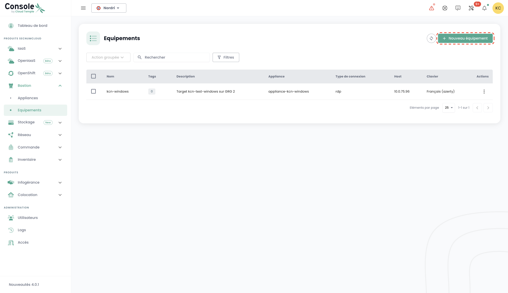
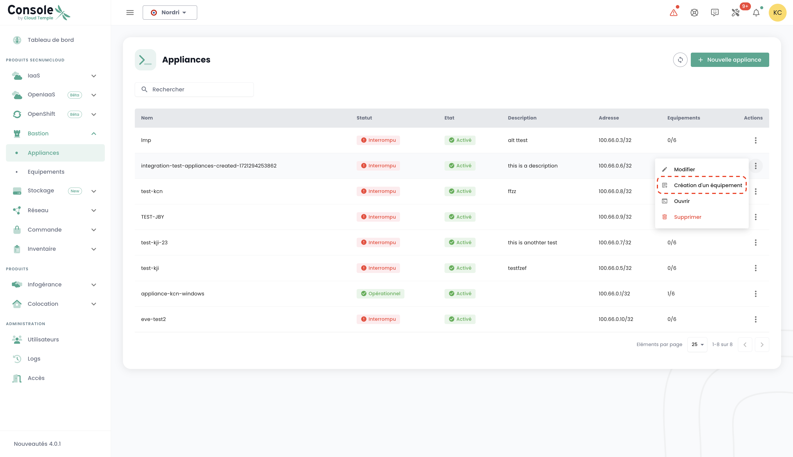
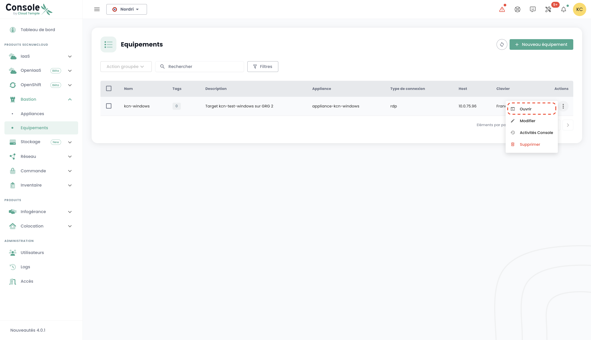
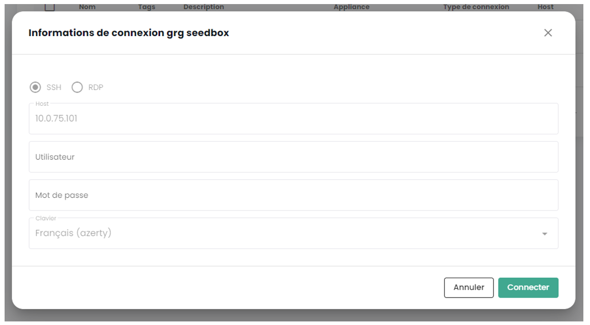

This quickstart guide shows you how to request the creation of an Appliance and how to register a new session and connect to it.

## Prerequisites

1. Have subscribed to the Cloud Temple offer (Appliance Bastion subscription).
2. The equipment to be administered must be accessible from the network where the Bastion Appliance is deployed.
3. Have the rights to the Bastion module.
4. In the context of an on-premise deployment of the Appliance, the corresponding flows must be open.

## Request Appliance Creation
Before deploying an Appliance, you must make a subscription request for an Appliance via a support request.
The support is accessible in the Shiva console from the lifebuoy icon on the top right bar of the window.

## Registering Equipment

To regularly access an equipment to administer, it is more suitable to create a session, which will only require your username and password at each connection.

To do this, go to the "Equipment" tab in the "Bastion" menu, then click on the "New equipment" button.

Then provide the necessary information to create your equipment:

    - Equipment name;
    - Description;
    - Associated appliance;
    - Protocol type (SSH or RDP);
    - Host IP address;
    - Keyboard configuration.

A notification indicating the creation of the equipment should appear at the top right of the page. The session will then be added to your list of equipment.

To create new equipment, you can also go through the "Appliances" tab by clicking on the action bar of the Appliance to which you wish to associate equipment.

## Connecting to Equipment

Go to the "Equipments" tab under the "Bastion" tab. Click on the action bar of the equipment you wish to open, and click the "Open" button.

During each connection to the equipment, you only need to provide your authentication details.

After entering your credentials, a notification confirming the start of the connection to your equipment appears, and the console to your virtual machine opens.