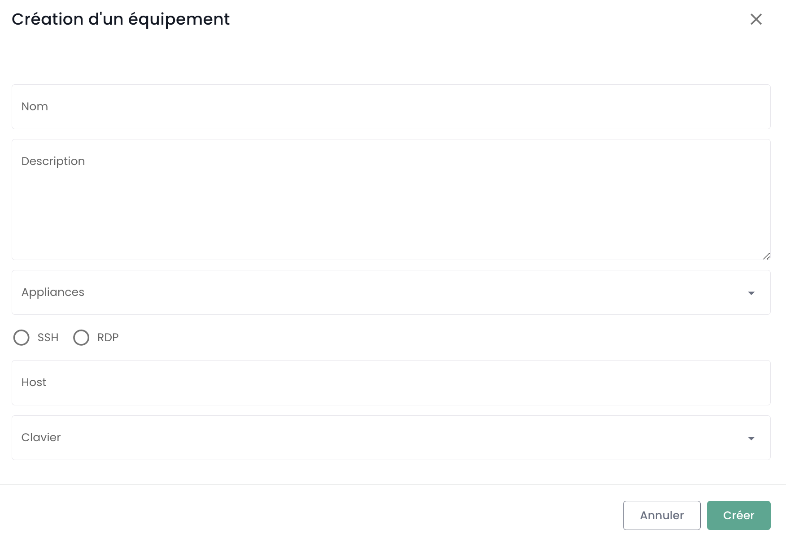

These tutorials help you deploy and manage a Temple Cloud Bastion from the Shiva portal.

## Prerequisites

1. Have subscribed to the Cloud Temple offer (Bastion Appliance subscription).
2. Equipment to be administered must be accessible from the network where the Bastion Appliance is deployed.
3. Have rights on the Bastion module.
4. In the case of an on-premise Appliance deployment, the corresponding flows must be open.

## Interface

Once connected to the Shiva web portal, navigate to the "Bastion" tab in the left menu.

The "Equipments" tab allows you to view the list of your equipment. An equipment corresponds to a connection configuration
via a Bastion Appliance. For each equipment, its name, tags, description, associated Appliance, connection type (SSH or RDP), host IP, and keyboard configuration are indicated.
You can filter the list of your devices according to the tags assigned to them, and a search engine allows you to search for a session by its name.

The "Appliances" tab gives you a list of your Bastion Appliances. For each Appliance, the name and description of the Appliance are specified.

A search engine is available to allow you to search for an Appliance by its name.

## Deploy an Appliance
Before you can deploy an Appliance, you must request a subscription for an Appliance via a support request.

## Open a flow to a device
In the "Appliances" tab, click on the action bar of the Appliance you want to open. Then click the "Open" button.

Then enter the required information for the connection:

    - Choice of protocol (SSH or RDP);
    - IP address of the host to be managed;
    - Credentials;
    - Keyboard configuration.

Then click on "Connect" to open the Appliance. The console of the virtual machine to administer will then open.

## Register a Device

To regularly access a device to administer, it is more suitable to create a device configuration, which will only require your username and password for each connection.

To do this, go to the "Devices" tab in the "Bastion" menu, then click on the "New device" button.

Then enter the necessary information to create your device:

    - Device name;
    - Description;
    - Associated Appliance;
    - Protocol type (SSH or RDP);
    - Host IP address;
    - Keyboard language.

A notification indicating the creation of your equipment configuration should appear at the top right of the page. The configuration is then added to your list of equipment.

To create a new connection, you can also go through the "Appliances" tab by clicking on the action bar of the Appliance to which you want to associate an equipment configuration.

## Connecting to Equipment

Go to the "Equipments" tab of the "Bastion" tab. Click on the action bar of the equipment you want to open, and click on the "Open" button.

For each connection to the equipment, you only need to provide your authentication information.

After entering your credentials, a notification confirming the start of the session appears, and the console to your virtual machine opens.
## Modify Equipment Configuration

Go to the "Equipment" tab in the "Bastion" section, click on the action bar of the equipment you want to modify, and click the "Modify" button.

You can then modify the equipment's name, description, associated Appliance, protocol (SSH or RDP), host IP address, or keyboard language.

## Delete Equipment Configuration

Go to the "Equipment" tab in the "Bastion" section, click on the action bar of the equipment you want to delete, and click the "Delete" button.

