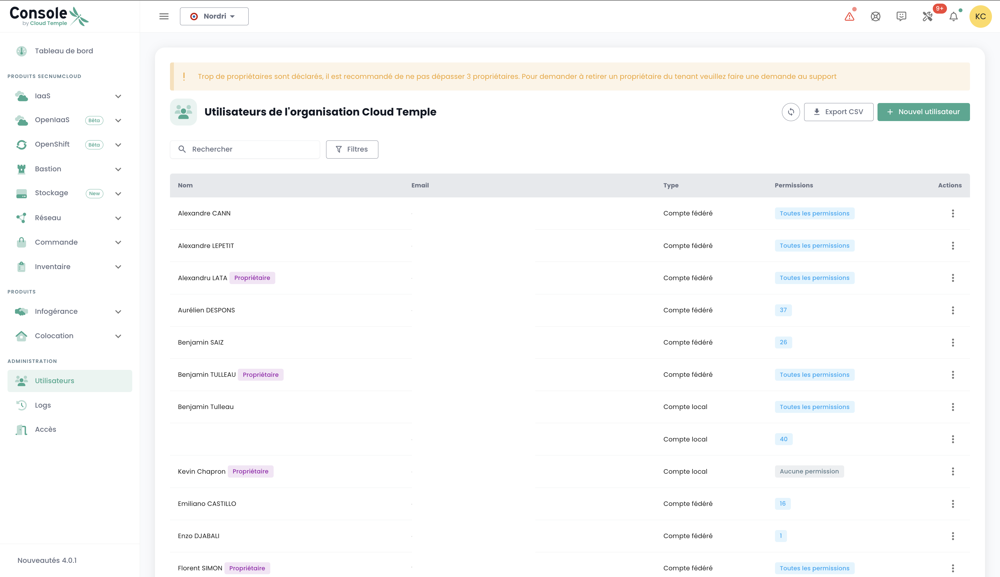
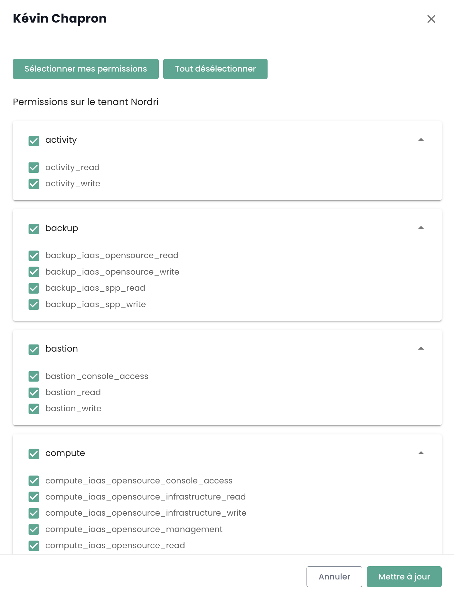

Shiva console access accounts are created by the sponsor's master account upon invitation (regardless of the authentication repository).
The credentials are global to your [Organization](organisations.md).

*__Note:__ [Identity federation is managed at the organization level](organisations.md#authentication-mechanisms)*

## Creating a user account in your organization

The creation of a user account in your organization is done by invitation. To invite a user to an [Organization](organisations.md), go to the __'Administration'__ menu on the left side of your screen on the green banner, then to the __'Users'__ submenu.

Click on the __'New User'__ button from the users page.

Then enter the user's email address.

The user will then receive a verification email.

Once the verification is completed, the user will be able to log in to the console.

## Assigning permissions to a user

User rights management is done from the user page.

By default, a user has no rights. Therefore, it is necessary for the administrator who sent the invitation to grant the necessary rights for their activity. Simply click on the user's __'Actions'__ menu and choose the __'Edit'__ option.

The rights activation menu then appears:

Permission configuration must be done for each [Tenant](tenants.md) of the [Organization](organisations.md).

The list of permissions and their definition can be accessed [here](permissions.md).

## Changing a user's language
The user's language change is to be made in their __'Profile'__, at the top right of the screen, in the __'User Settings'__.

The configuration is done for each tenant [Tenant](tenants.md).

## Subscription to thematic notifications

The management of subscriptions allows you to receive emails related to activated themes that will automatically be sent when corresponding events occur.

It is accessible in the user profile, under the "My subscriptions" tab:

For example, in the event of an incident, email notifications specific to this theme will be generated.

The list of available themes is likely to evolve and gradually enrich to adapt to the needs and changes in our operational environment.