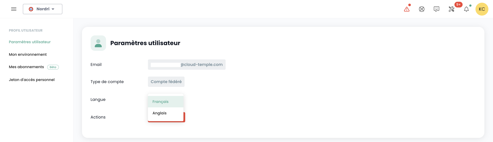

Les comptes d'accès à la console Shiva sont créés par le compte maitre du commanditaire sur invitation (quelque soit le référentiel d'authentification).
Les informations d'identification sont globales à votre [Organisation](organisations.md).

*__Nota :__ [La fédération d'identité se gère au niveau de l'organisation](organisations.md#mecanismes-dauthentification)*

## Création d'un compte utilisateur dans votre organisation

La création d'un compte utilisateur dans votre organisation se fait par invitation. Pour inviter un utilisateur dans une [Organisation](organisations.md), aller dans le menu __'Administration'__ à gauche de votre écran sur le bandeau vert puis dans le sous menu __'Utilisateurs'__.  

Cliquer sur le bouton __'Nouvel Utilisateur'__ depuis la page des utilisateurs. 

Indiquer ensuite l'adresse de messagerie de l'utilisateur 

L'utilisateur va alors recevoir un mail de vérification.  

Une fois la vérification terminée, l'utilisateur pourra se connecter sur la console.

## Affectation des permissions à un utilisateur

La gestion des droits utilisateurs se fait depuis la page utilisateur. 

Par défaut, un utilisateur n'a pas de droit. Il est donc nécessaire que l'administrateur ayant fait l'invitation lui octroie les droits nécessaires à son activité. Il suffit de cliquer sur le menu __'Actions'__ de l'utilisateur et de choisir l'option __'Modifier'__.  

Le menu d'activation des droits apparait alors :

La configuration des permissions est à faire pour chaque [Tenant](tenants.md) de l'[Organisation](organisations.md).

La liste des permissions et leur définition est accessible [ici](permissions.md).

## Changer la langue d'un utilisateur

Le changement de langue d'un utilisateur est à réaliser dans son __'Profil'__, en haut à droite de l'écran, dans les __'Paramètres utilisateur'__.

La configuration est faite pour chaque tenant [Tenant](tenants.md).

## Abonnement aux notifications thématiques

La gestion des abonnements permet de recevoir les e-mails relatifs aux thématiques activées qui seront automatiquement envoyés lors de la survenue d'événements correspondants.

Elle est accessible dans le profil utilisateur, dans l'onglet "Mes abonnements" :

 Par exemple, en cas d'incident, des notifications par e-mail spécifiques à cette thématique seront générées.

La liste des thématiques disponibles est susceptible d'évoluer et de s'enrichir progressivement pour s'adapter aux besoins et aux changements dans notre environnement opérationnel.