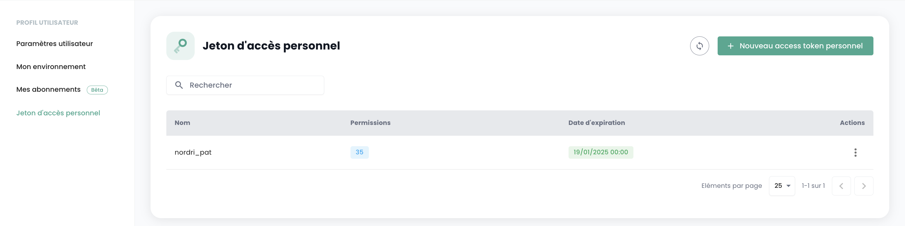
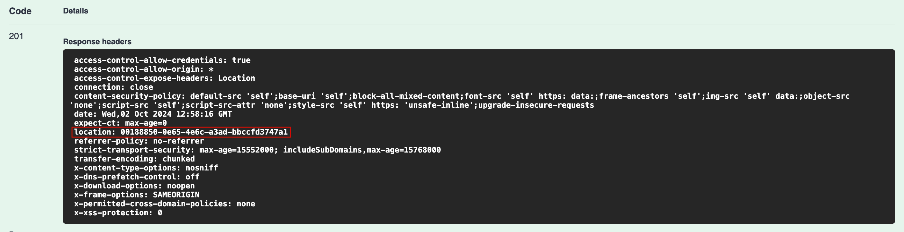

## API Keys

The __API key__ allows you to authenticate when making requests to the API. Generating an API key, also known as a __Personal Access Token (PAT)__, is a secure way to connect to Shiva APIs without using a graphical interface. Each of these tokens is linked to a tenant and the user who created it.

The creation of this token is done from your account. It is possible to generate multiple keys and configure permissions for each within the limits of your rights.

To create an API key, simply __click on your profile__:


In the profile menu, click on __'Personal Access Token'__



You will then see all the API keys that have been created for this user in this tenant. Click on __'New personal access token'__


You must then:
- Specify the name of this new token,
- Indicate an expiration date (maximum validity of 12 months),
- Choose the [permissions associated with the token](permissions.md).

The details regarding your token are then displayed. __Note that it is no longer possible to access them afterward.__

If you do not note this information, you will need to destroy and recreate the token.


For security reasons, it is recommended to create multiple tokens, each with a specific purpose (one token for each application or business process) rather than creating one token with all rights.

You then see the newly created token and its future expiration date.


## Access to the API portal

The OpenAPI 3.0 (Swagger) documentation for the Cloud Temple console APIs is available directly in the application:


Access to APIs requires authentication. Once authenticated, all operations must include the __'Authorization'__ header with the bearer access token obtained during the authentication phase.

The URL for endpoint access is directly provided in __Swagger__ (in the "Servers" object of each API page).

## Activities

The tracking of write-type requests (POST, PUT, PATCH, DELETE) is managed via activity management. Each request of this type automatically generates an associated activity. An HTTP status code 201 confirms the successful creation of the activity. The unique identifier of this activity is returned in the response headers under the key 'Location'.



Once the identifier is retrieved, it is possible to access the details of the activity using the API of the Activity module:


The activity's content includes all essential information to identify the operation, its execution date, and its progress status. Here is the model of an activity:

```
    {
    "tenantId": "UUIDV4",
    "description": "STRING",
    "type": "ComputeActivity" | "BackupActivity" | "IAMActivity" | "TagActivity" | "RTMSActivity" | "BastionActivity" | "SupportActivity",
    "tags": "STRING[]",
    "initiator": "UUIDV4",
    "concernedItems": [
        {
        "type": "string",
        "id": "string"
        }
    ],
    "id": "UUIDV4",
    "creationDate": "DATE",
    "operationType": "read" | "write",
    "state": "CompletedState | RunningState | WaitingState | FailedState"
}
```

The **state** object can take different forms depending on the activity's state, namely:

**waiting**, state before the operation has started:
```
    waiting: {}
```
**running**, state when the operation is in progress:
```json
    running: {
    status: string;
    startDate: Date;
    progression: number;
    };
```
**failed**, state if the operation failed:

```json
    failed: {
    startDate: Date;
    stopDate: Date;
    reason: string;
    };
```
**completed**, state if the operation is completed:
```json
    completed: {
    startDate: Date;
    stopDate: Date;
    result: string;
    };
```
**Note: The Identifier (UUIDv4) of the created resource is available in the activity result once it is completed.**

## API Limits

### Why limits?

The Cloud Temple console defines __ceilings on the volume of requests__ that a user can send
to the API over a given period. The establishment of these frequency ceilings is a common measure in API management, adopted for several essential reasons:

- **Abuse prevention**: These limits help maintain the integrity of the API by preventing abusive or careless usage that could compromise its operation.
- **Service Quality Assurance**: By regulating API access, we ensure an equitable distribution of resources, allowing all users to enjoy a stable and high-performance experience.

Take, for example, a poorly designed or inefficient script that attempts repetitive API calls, risking resource saturation and performance degradation. By establishing request thresholds, we prevent these situations and ensure the maintenance of __a seamless and uninterrupted service__ for all our clientele.

### What are the rate limits for the Cloud Temple console API?

We apply quantitative restrictions on user interactions with the console for each product.

The limits are defined in __requests per second (r/s) and per source IP__. Beyond the threshold limit, the system will respond with an HTTP 429 error code, indicating that the allowed request limit has been exceeded.
Here are the defined limits:

| Product              | Rate Limit   |
|----------------------|--------------|
| Cloud Temple Console | 60 req/s     |
| Identity (IAM)       | 60 req/s     |
| IaaS - Compute       | 60 req/s     |
| IaaS - Storage       | 20 req/s     |
| IaaS - Backup        | 60 req/s     |
| PaaS - S3            | 60 req/s     |
| PaaS - Openshift     | 60 req/s     |
| Network              | 60 req/s     |
| Hosting              | 60 req/s     |

### How do rate limits work?

If the number of requests sent to an API endpoint exceeds the allowed limit, the API endpoint will respond
__with an HTTP 429 response code__. This code indicates that the user has exceeded the number of allowed requests.
When this occurs, the API endpoint will also provide a JSON object as a response,
which will contain detailed information about the applied rate limit:

```json
    {
        "error": {
            "status": "429 Too Many Requests",
            "message": "Too Many Requests"
        }
    }
```


### How to avoid making too many requests?

It is recommended to limit the number of API calls made by your automation to stay below the rate limit set for the endpoint.

This situation often occurs when multiple requests are executed in parallel,
using multiple processes or threads.

There are several ways to improve the efficiency of your automation, including using __caching mechanisms__ and implementing a __progressive backoff retry system__. This method consists of taking a short pause when a rate limit error is encountered, and then retrying the request. If the request fails again, the pause duration is progressively increased until the request succeeds or until a maximum number of retries is reached.

This approach has many advantages:

- __Gradual backoff__ ensures that initial attempts are made quickly while longer delays are introduced in case of repeated failure.
- Adding __random jitter__ to the pause helps prevent all attempts from occurring simultaneously.

It is important to note that __unsuccessful requests do not affect your rate limit__.
However, continuously resending a request may not be a viable long-term solution,
as this behavior could be altered in the future. Therefore, we recommend not relying solely on this mechanism.

The __[Backoff](https://pypi.org/project/backoff/)__ and __[Tenacity](https://pypi.org/project/tenacity/)__ libraries in Python
are good starting points for implementing backoff strategies.