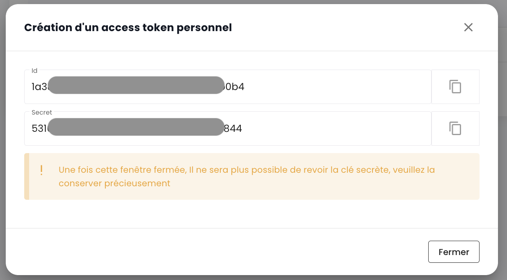

## Clés API

La __clé API__ permet de s'authentifier lorsque vous souhaitez faire des requêtes sur l'API. La génération d'une clé API, aussi appelée __Personal Access Token (PAT)__,
est une manière sécurisée de se connecter aux API Shiva sans passer par une interface graphique. Chacun de ces tokens est lié à un tenant et à l'utilisateur qui l'a créé.

La création de ce token se fait depuis votre compte. Il est possible de générer plusieurs clés et de configurer pour chacune les autorisations dans la limite de vos droits.

Pour créer une clef API, il suffit de __cliquer sur votre profil__ :


Dans le menu du profil, cliquer sur __'Jeton d'accès personnel'__


Vous avez alors à l'écran l'ensemble des clés API qui ont été créées pour cet utilisateur dans ce tenant. Cliquer sur __'Nouveau access token personnel'__


Vous devez alors :

- Indiquer le nom de ce nouveau jeton,
- Indiquer une date d'expiration (maximum 12 mois de validité),
- Choisir les [permissions associées au jeton](permissions.md).

Les détails concernant votre jeton sont alors affichés. __Attention, il n'est plus possible d'y accéder a posteriori.__

Si vous ne notez pas ces informations, vous devrez détruire et recréer le jeton.



Pour une question de sécurité, il est recommandé de créer plusieurs tokens ayant chacun une utilité spécifique (un token pour chaque application ou chaque processus métier) plutôt que de créer 1 token avec l'ensemble des droits.

Vous voyez ensuite le nouveau jeton créé et sa future date d'expiration.


## Accès au portail API

La documentation OpenAPI 3.0 (Swagger) des APIs de la console Cloud Temple est disponible directement dans l'application :


L'accès aux APIs nécessite d'être authentifié. Une fois authentifié toutes les opérations doivent avoir le header
__'Authorization'__ avec le bearer access token obtenu lors de la phase d'authentification.

L'URL des points d'accès est directement donnée dans __Swagger__ (dans l'objet "Servers" de chaque page APIs).

## Les activités

Le suivi des requêtes de type écriture (POST, PUT, PATCH, DELETE) est assuré via la gestion des activités. Chaque requête de ce type génère automatiquement une activité associée. Un code de statut HTTP 201 confirme la création réussie de l'activité. L'identifiant unique de cette activité est renvoyé dans les en-têtes de la réponse, sous la clé 'Location'.


Une fois l'identifiant récupéré, il est possible d'accéder aux détails de l'activité en utilisant l'API du module Activity :


Le contenu de l'activité inclut toutes les informations essentielles pour identifier l'opération, sa date d'exécution, ainsi que son état d'avancement. Voici le modèle d'une activité :

```
    {
    "tenantId": "UUIDV4",
    "description": "STRING",
    "type": "ComputeActivity" | "BackupActivity" | "IAMActivity" | "TagActivity" | "RTMSActivity" | "BastionActivity" | "SupportActivity",
    "tags": "STRING[]",
    "initiator": "UUIDV4",
    "concernedItems": [
        {
        "type": "string",
        "id": "string"
        }
    ],
    "id": "UUIDV4",
    "creationDate": "DATE",
    "operationType": "read" | "write",
    "state": "CompletedState | RunningState | WaitingState | FailedState"
}
```

L'objet **state** peut prendre différentes formes selon l'état de l'activité, à savoir :

**waiting**, état avant que l'opération n'ait commencé :
```
    waiting: {}
```
**running**, état lorsque l'opération est en cours :
```
    running: {
    status: string;
    startDate: Date;
    progression: number;
    };
```
**failed**, état si l'opération a échoué :
```
    failed: {
    startDate: Date;
    stopDate: Date;
    reason: string;
    };
```
**completed**, état si l'opération est terminée :
```
    completed: {
    startDate: Date;
    stopDate: Date;
    result: string;
    };
```
**Nota: l'Identifiant (UUIDv4) de la ressource créée est disponible dans le résultat de l'activité une fois celle-ci complétée.**

## Limites API

### Pourquoi des limites ?

La console Cloud Temple définit __des plafonds sur le volume de requêtes__ qu'un utilisateur peut adresser
à l'API sur une durée déterminée. L'instauration de ces plafonds de fréquence est une mesure courante dans la gestion des API, adoptée pour plusieurs motifs essentiels :

- **Prévention des abus** : Ces limites contribuent à la sauvegarde de l'intégrité de l'API en prévenant les usages
abusifs ou maladroits susceptibles de compromettre son fonctionnement.
- **Assurance de la qualité de service** : En régulant l'accès à l'API, nous veillons à une distribution équitable
des ressources, permettant ainsi à tous les utilisateurs de bénéficier d'une expérience stable et performante.

Prenons l'exemple d'un script mal conçu ou inefficace qui tente des appels répétitifs à l'API,
risquant de saturer les ressources et de dégrader les performances. En établissant des seuils de requêtes,
nous prévenons ces situations et assurons le maintien d'__un service fluide et sans interruption__ pour l'ensemble de notre clientèle.

### Quelles sont les limites de taux pour l'API de la console Cloud Temple ?

Nous appliquons des restrictions quantitatives sur les interactions des utilisateurs avec la console
pour chaque produit.

Les limites sont définies en __requêtes par secondes (r/s) et par IP source__. Au-delà du seuil limite, le système répondra
par un code d'erreur HTTP 429, signalant que la limite de requêtes autorisées a été dépassée.

Voici les limites définies :

| Produit              | Seuil limite |
|----------------------|--------------|
| Console Cloud Temple | 60 r/s       |
| Identité (IAM)       | 60 r/s       |
| IaaS - Calcul        | 60 r/s       |
| IaaS - Stockage      | 20 r/s       |
| IaaS - Sauvegarde    | 60 r/s       |
| PaaS - S3            | 60 r/s       |
| PaaS - Openshift     | 60 r/s       |
| Réseau               | 60 r/s       |
| Hébergement          | 60 r/s       |

### Comment fonctionnent les limites de taux ?

Si le nombre de requêtes envoyées à un point d'API excède la limite autorisée, le point d'API réagira en retournant
__un code de réponse HTTP 429__. Ce code indique que l'utilisateur a dépassé le nombre de requêtes permises.
Lorsque cela se produit, le point d'API fournira également un objet JSON en guise de réponse,
lequel contiendra des informations détaillées sur la limitation appliquée :
```
    {
        "error": {
            "status": "429 Too Many Requests",
            "message": "Too Many Requests"
        }
    }
```
### Comment éviter d'effectuer trop de requêtes ?

Il est recommandé de limiter le nombre d'appels d'API effectués par votre automatisation afin de rester en deçà
de la limite de taux fixée pour le point de terminaison.

Cette situation survient souvent lorsque plusieurs requêtes sont exécutées en parallèle,
à l'aide de plusieurs processus ou threads.

Il existe plusieurs moyens d'améliorer l'efficacité de votre automatisation, notamment en utilisant des mécanismes
de __mise en cache__ et en mettant en place __un système de rejeu avec atténuation progressive__. Cette méthode consiste
à effectuer une courte pause lorsqu'une erreur de limite de taux est rencontrée, puis à réessayer la requête.
Si la requête échoue à nouveau, la durée de la pause est augmentée progressivement jusqu'à ce que la requête réussisse
ou jusqu'à ce qu'un nombre maximum de réessais soit atteint.

Cette approche présente de nombreux avantages :

- __L'atténuation progressive__ garantit que les premieres tentatives sont jouées rapidement, tout en prévoyant des délais plus longs en cas d'échec répété.
- L'ajout d'__une variation aléatoire__ à la pause contribue à éviter que toutes les tentatives ne se produisent simultanément.

Il est important de noter que __les requêtes infructueuses n'affectent pas votre limite de taux__.
Cependant, renvoyer continuellement une requête pourrait ne pas être une solution viable à long terme,
car ce comportement pourrait être modifié à l'avenir. Nous vous recommandons donc de ne pas dépendre exclusivement de ce mécanisme.

Les bibliothèques __[Backoff](https://pypi.org/project/backoff/)__ et __[Tenacity](https://pypi.org/project/tenacity/)__ en Python
sont des bons points de départ pour implémenter des stratégies d'attenuation.
