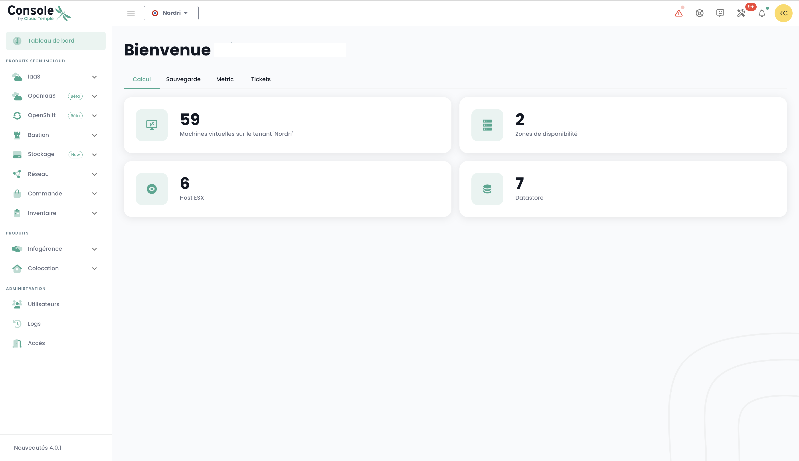
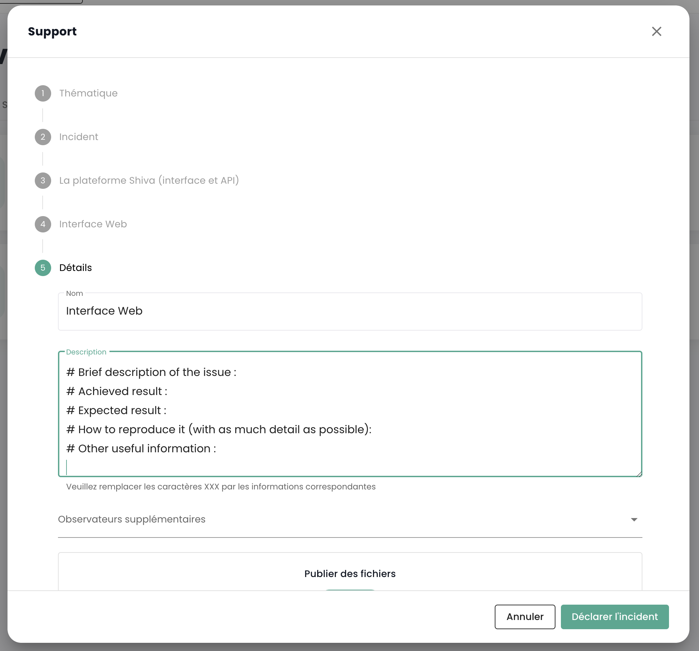

## Prerequisites
- Subscribed to a Cloud Temple offer. To subscribe easily, you can [contact us](https://www.cloud-temple.com/contactez-nous/) or by email at __contact@cloud-temple.com__.
- Have access to the Shiva console
- Have your public IPv4 declared in the Cloud Temple trust zone (access to the Shiva console is limited to trusted identified addresses)

## Connecting to your Cloud Temple tenant
Shiva is accessible via the URL below:
    https://shiva.cloud-temple.com
    Or from the direct URL that was communicated to you by email.

The first page allows you to select [the organization](iam/concepts.md#organisations) in which your user was created.
Once the company is specified, please click on __'Connect'__.

You will then be redirected to a page asking you to authenticate.
Once connected, you arrive on this page.

## Language Management
The console is available in __French__, __English__. You can change the operating language using the __language__ icon located at the top right of the screen.

Changing a user's language is to be done in their __'Profile'__, at the top right of the screen, in the __'User Settings'__.

The configuration is done for each tenant [Tenant](iam/concepts.md#tenant).

## Access to technical support

At any time, you can contact the __Cloud Temple support team__ via the __'lifebuoy' icon__ located at the top right of the screen.

You will be guided through the entire support request process.

The first step is identifying the type of support request:

- Requesting advice on using a product (outside of an incident),
- Requesting assistance related to your customer account,
- Reporting an incident or requesting technical support.
- Requesting the assistance of a professional service (providing a Cloud Temple engineer for an issue).

You then have the possibility to provide details and include files (image or logs for example).

Once your request is made, you can find your requests via the __'lifebuoy' icon__ located at the top right of the screen:

## Accessing user features via the web interface

All the features accessible to your user (depending on their rights) are located on the left of the screen, in the green banner.
The features are grouped by module. This mainly includes:

- The __inventory__ of your resources,
- The __operation tracking__,
- The __management of IaaS resources__ (Compute, storage, network, ...),
- The __management of OpenIaaS resources__ (Compute, storage, network, ...),
- Access to __ancillary services__ (Bastion, monitoring, ...),
- The __administration of your organization__ (Management of tenants, rights, ...)

Enabling a module for a user depends on the user's rights. For example, the __'Order'__ module will not be available if the user does not have the __'ORDER'__ right.

Here is a presentation of the different modules available. New modules are regularly added to the console:

- __Dashboard__ : provides a quick view of the __total compute and storage resources__, __backup statistics__, and __support ticket summary__,
- __Inventory__ : provides a view of all your __'virtual machines'__ resources. If __tags__ are used, it allows a view by __tag__ (for example, business view, application view, ...),
- __Managed Services__ : provides access to follow up on your __support requests__ and __service metrics__,
- __IaaS__ : allows the __management of VMware IaaS infrastructures__ (Virtual machines, clusters, hypervisors, replications, backup, ...),
- __OpenIaaS__ : allows the __management of Xen Orchestra resources__ (Virtual machines, backup, ...),
- __OpenShift__ : allows the management of your **RedHat OpenShift PaaS architecture** and the management of your containers across the platform's 3 availability zones.
- __Bastion__ : Enables the deployment and management of SSH/RDP bastion appliances in your networks,
- __Network__ : allows the management of __level 2 and 3 networks__, __public IPs__, and your __telecom circuits__,
- __Colocation__ : Offers a view of the equipment located in a __shared or dedicated colocation area__,
- __Order__ : Allows the ordering of resources and monitoring of deployments,
- __Administration__ : Groups the administrative functions for users and tenants as well as access to global logging.

## Accessing user features via the API

Access to all the features of the Shiva console is possible via the Shiva API. You can get the details of verbs and configurations via __'Profile'__ and __'APIs'__ :

## Terraform Provider

Cloud Temple provides you with a Terraform provider to manage your Cloud platform "as code". It is accessible here:

https://registry.terraform.io/providers/Cloud-Temple/cloudtemple/latest