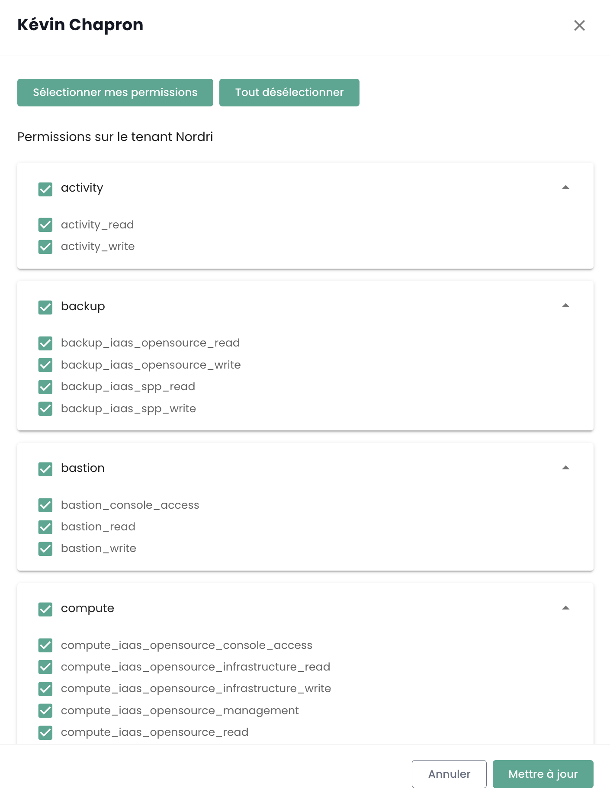
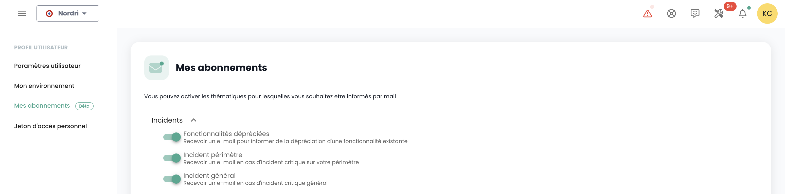

## Users

Access accounts to the Shiva console are created by the master account of the principal on invitation (regardless of the authentication repository).
Credentials are global to your [Organization](#organisations).

*__Note:__ [Identity federation is managed at the organization level](#organisations#mecanismes-dauthentification)*

### Creating a user account in your organization

Creating a user account in your organization is done by invitation. To invite a user to an [Organization](#organisations), go to the __'Administration'__ menu on the left of your screen on the green banner and then to the sub-menu __'Users'__.  

Click on the __'New User'__ button from the users' page.

Then, specify the user's email address 

The user will then receive a verification email.  

Once verification is complete, the user can log into the console.

### Assigning permissions to a user

User rights management is done from the user page.

By default, a user has no rights. Therefore, it is necessary for the administrator who issued the invitation to grant them the necessary rights for their activities. Simply click on the user's __'Actions'__ menu and choose the __'Edit'__ option.  

The rights activation menu will then appear:

Permission configuration must be done for each [Tenant](#tenants) of the [Organization](#organisations).

The list of permissions and their definitions is accessible [here](#permissions).

### Changing a user's language

The user's language change is done in their __'Profile'__, at the top right of the screen, in the __'User settings'__.

The configuration is done for each tenant [Tenant](#tenants).

### Subscribing to thematic notifications

The subscriptions management allows you to receive emails related to the activated themes that will be automatically sent when corresponding events occur.

It is accessible in the user profile, in the "My subscriptions" tab:

For example, in case of an incident, specific email notifications related to this theme will be generated.

The list of available themes is likely to evolve and progressively enrich to adapt to needs and changes in our operational environment.

## Permissions

The Shiva console allows for fine-grained management of user rights within an organization, with segregation by tenant.
Initially, the primary account of the principal allows for the initial configuration of accounts and their associated permissions.
Subsequently, the __'iam_write'__ right allows an account to administer the permissions of other users.

### Permissions available for users in your organization

The following permissions are configurable for each [user](#utilisateurs) and for each [tenant](#tenants#selection-dun-tenant) in your organization.

- __'read'__ type permissions are associated with consultation without the possibility of configuration.
- __'write'__ type permissions are associated with configuration modification.
- __These are permissions, not roles.__ Therefore, it is necessary to have both READ and WRITE permissions to modify a configuration.

__VERSION: 20241007__

| Permission Name                            | Permission Description                                                                                                        |
| ------------------------------------------ | ----------------------------------------------------------------------------------------------------------------------------- |
| activity_read                              | Viewing logs and activities                                                                                                   |
| activity_write                             | Managing logs and activities                                                                                                  |
| backup_iaas_opensource_read                | Managing backup resources - OpenIaaS Offer - viewing                                                                          |
| backup_iaas_opensource_write               | Managing backup resources - OpenIaaS Offer - modification                                                                     |
| backup_iaas_spp_read                       | Managing backup resources - VMware Offer - viewing                                                                            |
| backup_iaas_spp_write                      | Managing backup resources - VMware Offer - modification                                                                       |
| bastion_read                               | Viewing bastion resources                                                                                                     |
| bastion_write                              | Managing bastion resources (appliances, sessions, etc.)                                                                       |
| bastion_console_access                     | Console access authorization (ssh/rdp) for a resource protected by a Bastion appliance                                        |
| compute_iaas_opensource_console_access     | OpenIaaS Offer - Opening a virtual machine's console                                                                          |
| compute_iaas_opensource_infrastructure_read| OpenIaaS Offer - Viewing advanced data of Xen Orchestra resources                                                             |
| compute_iaas_opensource_infrastructure_write| OpenIaaS Offer - Advanced management of Xen Orchestra resources                                                               |
| compute_iaas_opensource_read               | OpenIaaS Offer - Viewing virtual machine resources                                                                            |
| compute_iaas_opensource_management         | OpenIaaS Offer - Managing virtual machine resources                                                                           |
| compute_iaas_opensource_virtual_machine_power| OpenIaaS Offer - Managing a virtual machine's power                                                                           |
| compute_iaas_vmware_console_access         | VMware Offer - Opening a virtual machine's console                                                                            |
| compute_iaas_vmware_infrastructure_read    | VMware Offer - Viewing advanced data of VMware resources (affinity/anti-affinity rules, drs configuration, etc.)              |
| compute_iaas_vmware_infrastructure_write   | VMware Offer - Advanced management of VMware resources                                                                        |
| compute_iaas_vmware_read                   | VMware Offer - Viewing virtual machine resources                                                                              |
| compute_iaas_vmware_management             | VMware Offer - Managing virtual machine resources                                                                             |
| compute_iaas_vmware_virtual_machine_power  | VMware Offer - Managing a virtual machine's power                                                                             |
| console_public_access_read                 | Viewing IPs authorized to access the console                                                                                  |
| console_public_access_write                | Adding IPs authorized to access the console                                                                                   |
| compute_virtual_machine_power              | Managing a virtual machine's power                                                                                            |
| documentation_read                         | Viewing Confluence documentation resources                                                                                    |
| housing_read                               | Viewing colocation resources                                                                                                  |
| iam_offline_access                         | Creating and deleting Personal Access Tokens (PAT)                                                                            |
| iam_read                                   | Viewing user rights                                                                                                           |
| iam_write                                  | Managing user rights                                                                                                          |
| intervention_read                          | Viewing planned changes and productions on the platform                                                                       |
| inventory_read                             | Viewing inventory resources                                                                                                   |
| inventory_write                            | Managing inventory resources                                                                                                  |
| monitoring_read                            | Viewing monitoring                                                                                                            |
| monitoring_write                              | Monitoring management                                                                                                             |
| metric_read                                   | Viewing health data on virtual machines and hosts                                                                                |
| network_read                                  | Viewing network resources                                                                                                        |
| network_write                                 | Management of network resources                                                                                                  |
| order_read                                    | Viewing infrastructure orders                                                                                                    |
| order_write                                   | Creating infrastructure orders                                                                                                   |
| object-storage_iam_management                 | Allows management of storage accounts on the S3 product                                                                          |
| object-storage_read                           | Allows viewing of buckets and bucket configurations                                                                             |
| object-storage_write                          | Allows editing of buckets and bucket configurations                                                                              |
| openshift_management                          | Allows connection to Openshift platforms (scoped to the tenant)                                                                  |
| Owner                                         | The user has administrative rights over a tenant                                                                                 |
| support_management                            | Viewing all support tickets of the tenant                                                                                        |
| support_read                                  | Viewing your own support tickets of the tenant                                                                                   |
| support_write                                 | Creating a support ticket for the tenant                                                                                         |
| tag_read                                      | Viewing tags, except RTMS tags                                                                                                   |
| tag_write                                     | Managing tags, except RTMS tags                                                                                                  |
| ticket_comment_read                           | Viewing comments                                                                                                                 |
| ticket_comment_write                          | Managing comments                                                                                                                |
| ticket_read                                   | Viewing tickets                                                                                                                  |
| ticket_write                                  | Managing tickets                                                                                                                 |

**Notes** :

- *There is no limit to the number of owners who can be defined on the tenant. However, the management interface will issue a warning when there are more than 3 owners to encourage limiting the number of owners for optimal security and access management.*
- *When adding a new owner, updating their permissions may take up to 60 minutes. This propagation time is normal and ensures that access rights are correctly applied to all associated services and resources.*
- *To remove an owner from the tenant, the user must submit a support request. This procedure ensures that changes to access rights are carried out securely and in accordance with best access management practices.*

### Deprecated Permissions

The following permissions are no longer available:

| Permission Name                                | Date       | Permission Description                                                                                            |
| ---------------------------------------------- | ---------- | ------------------------------------------------------------------------------------------------------------------ |
| backup_read  (**DEPRECATED**)                  | 07/10/2024 | Viewing backup resources                                                                                           |
| backup_write (**DEPRECATED**)                  | 07/10/2024 | Managing backup resources - modification                                                                           |
| compute_console_access (**DEPRECATED**)        | 07/10/2024 | Opening the console of a virtual machine                                                                           |
| compute_infrastructure_read (**DEPRECATED**)   | 07/10/2024 | Viewing advanced data of VMware resources (affinity/anti-affinity rules, drs configuration, etc.)                  |
| compute_infrastructure_write (**DEPRECATED**)  | 07/10/2024 | Advanced management of VMware resources                                                                            |
| compute_read (**DEPRECATED**)                  | 07/10/2024 | Viewing Virtual Machine resources                                                                                  |
| compute_management (**DEPRECATED**)            | 07/10/2024 | Managing Virtual Machine resources                                                                                 |
| compute_virtual_machine_power (**DEPRECATED**) | 07/10/2024 | Managing the power state of a virtual machine                                                                      |
| iam_manage_permissions (**DEPRECATED**)        | 07/10/2024 | Managing new rights for themselves                                                                                 |

## Organizations

The organization is linked to your __sponsor account__ and the associated __Cloud Temple contract__. It represents your entity (company, department, team, ...) which carries the contractual relationship between Cloud Temple and you.

### Principle of an organization

The organization has four main roles:

- It represents the __contractual entity__ for tracking and billing aspects,
- It defines __the global authentication mechanism configuration__: authentication can be local at the Shiva console level or remote via an identity federation service,
- It carries all __user accounts__,
- It __federates the tenants__ (Production, Preproduction, Dev, Application 1, Application 2, ...) that you define for your Cloud architecture needs.

The roles (rights/permissions) of users are configurable for each tenant defined in your organization. For example, an account can be authorized to order resources in one tenant, but not in another.

### Authentication Mechanisms

The Shiva console allows __authentication mechanism configuration__ at the organization level. You can use the Shiva console's local authentication directory or connect your organization to one of your authentication directories.  

The following external directories are supported:

- __OpenID Connect__ compatible directories,
- __SAML__ compatible directories,
- __Microsoft ADFS__
- __Microsoft EntraID__ (Microsoft Azure Active Directory)
- Amazon AWS Cognito
- Okta
- Auth0
- KeyCloak

## Tenant

The tenant is a __grouping of resources within an organization__. An [Organization](#organizations) has at least one tenant (called the __default tenant__, which can be renamed). Generally, several tenants are used to segment responsibilities or technical scopes.

For example:

- A __Production__ tenant
- A __Preproduction__ tenant
- A __Staging__ tenant
- A __Qualification__ tenant

But it is also possible to organize things with an __application view__ or by __criticality__:

- An __Application 1__ tenant or __Criticality 1__
- An __Application 2__ tenant or __Criticality 2__
- ...

The technical resources ordered are assigned to a specific tenant and are not shared with other tenants. For example, a Hypervisor cluster and the associated L2 networks are available only in one tenant.
Regarding networks, it is possible to request __cross-tenant networks__ to ensure network continuity between tenants.

User permissions must be defined in each tenant. Therefore, each organization must carefully consider the tenants it wants. This point is generally addressed during the initial workshop, at the time of organization creation.

It is possible to evolve the architecture by adding or removing tenants.

A tenant cannot be empty. It must necessarily be initialized with a minimum of resources:

- An availability zone (AZ, i.e., a physical datacenter),
- A compute cluster,
- A storage space,
- A network vlan.

| Order Reference                                              | Unit     | SKU                     |  
|--------------------------------------------------------------|----------|-------------------------|
| TENANT - *(REGION)* - Tenant activation                     | 1 tenant | csp:tenant:v1           |
| TENANT - *(REGION)* - Availability zone activation          | 1 tenant | csp:(region):iaas:az:v1 |

### Access authorization to a tenant: Authorized IPs

Access to the cloud management console is strictly limited to pre-authorized IP addresses, in compliance with SecNumCloud qualification requirements. This restriction ensures an enhanced level of security by allowing access only to users from specified IP ranges, thereby minimizing the risks of unauthorized access and protecting the cloud infrastructure according to the highest security standards.

Note: *The removal of an authorized IP is done through a support request in the Cloud Temple console.*

### Resource consumption within a tenant

It is possible to view the cloud resources consumed within a tenant, providing a detailed view of the usage of various deployed services. This feature allows users to monitor the consumption of their resources in real time, identify the most solicited services, and optimize their usage based on needs.

In the console menu, click on "Consumption report" then select the desired time period. You will be able to view in detail the consumption of cloud resources over the defined period, allowing you to analyze the use of services and optimize your management accordingly:

