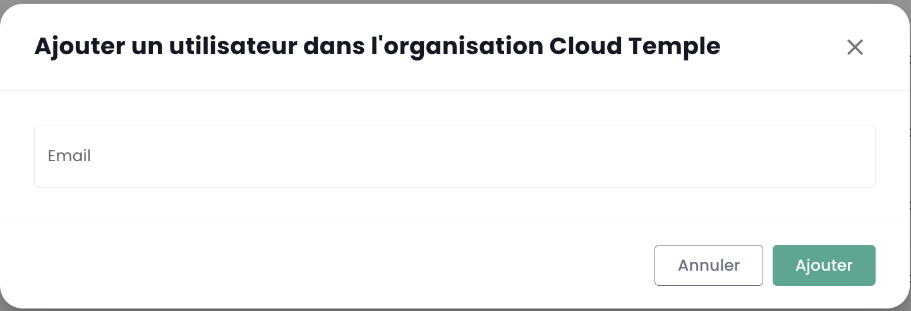
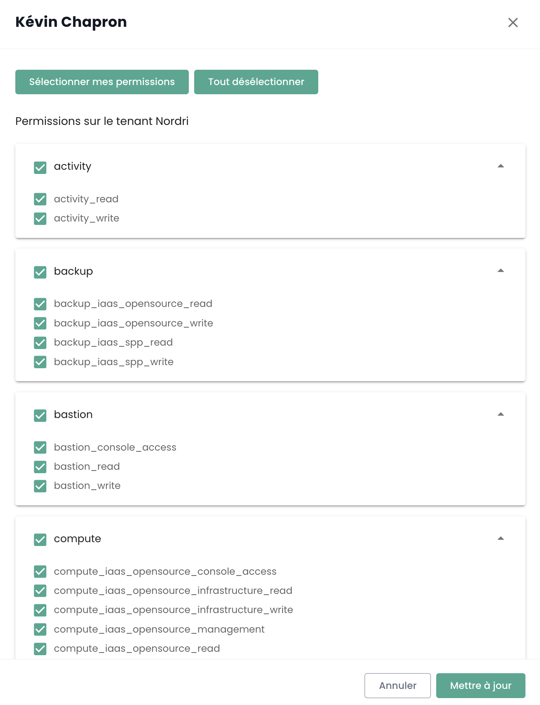

## Tenant

### Création d'un tenant

Creating a tenant is done through a service request indicating:

    The name of your Organization
    The name of a contact person with their email and phone number to finalize the configuration
    The name of the tenant
    The availability zone or the desired physical site for the tenant

### Selection d'un tenant

Selection of the tenant is done from the main page of the Shiva console:

*__Note:__ The resources of a tenant are specific to it and cannot be mixed with other tenants.*

## Comptes d'accès à la console Shiva

Access accounts for the Shiva console are created by the master account of the commissioner through invitation (regardless of the authentication directory).
The identification information is global to your [Organization](concepts.md#organisations).

*__Note:__ Identity federation is managed at the organization level*

### Création d'un compte utilisateur dans votre organisation

Creating a user account in your organization is done by invitation. To invite a user to an [Organization](concepts.md#organisations), go to the __'Administration'__ menu on the left of your screen in the green banner, then in the __'Users'__ submenu.  

Click on the __'New User'__ button from the users page. 

Then provide the user's email address 

The user will then receive a verification email.  

Once verification is complete, the user will be able to log into the console.

### Affectation des permissions à un utilisateur

User rights management is done from the user page.

By default, a user has no rights. Therefore, the administrator who sent the invitation needs to grant the necessary rights for the user's activity. Just click on the user's __'Actions'__ menu and choose the __'Modify'__ option.  

The rights activation menu then appears:

Permission configuration must be done for each [Tenant](concepts.md#tenants) of the
[Organization](concepts.md#organisations).

The list of permissions and their definitions is accessible [here](#permissions).

### Changer la langue d'un utilisateur

Changing a user's language is done in their __'Profile'__, at the top right of the screen, in the __'User Settings'__.

Configuration is done for each [Tenant](concepts.md#tenants).

### Abonnement aux notifications thématiques

Subscription management allows you to receive emails related to activated topics, which are automatically sent when corresponding events occur.

It is accessible in the user profile, under the "My subscriptions" tab:

 For example, in case of an incident, email notifications specific to this topic will be generated.

The list of available topics is likely to evolve and expand progressively to adapt to needs and changes in our operational environment.

## Permissions

### Quelles sont les permissions disponibles pour les comptes utilisateur de la console Shiva ?

Here is the list of [available permissions](#permissions).

### Comment ajouter une permission ?

Here is the [procedure for assigning permission available here](#permissions)

### Pourquoi je ne peux pas ajouter une permission ?

To add a permission, you need to have the __'iam_write'__ permission as well as the __permission you wish to add__.

### Comment ajouter un utilisateur ?

*__Note__ : To add a user, you must have the __'iam_write'__ right.*

### Comment auditer les accès/permissions des utilisateurs ?

Go to the users page and click on the __'Export csv'__ button:

### Comment supprimer un utilisateur ?

In the __'Administration'__ menu on the green banner to the left of the screen, in the __'user'__ submenu, click on the user's __'Action'__ icon and choose __'Delete'__.

*__note__ :*
- *To add a user, you must have the __'iam_write'__ right.*
- *If it is a federated user, __ensure that the user has also been removed from the identity directory__.*

### Comment réinitialiser son mot de passe ?
It is possible to reset your password from the Shiva console login page by clicking on __'Forgot password?'__.

### Pourquoi certains utilisateurs sont grisés ?
Grayed-out users are those who have not validated their account. Upon account creation, the user received a verification email.  

Once verification is complete, the user will be able to log into the console.  

The account is grayed out as long as the verification has not been completed.

### Qu'est-ce qu'un Personal Access Token (PAT) ?

Generating an API key, also called __Personal Access Token (PAT)__, 
is a secure way to connect to Shiva APIs without using a graphical interface. 

### Qu'est-ce que le MFA et est-il obligatoire ?
MFA (multi-factor authentication) is a concept of verifying a user's identity in two steps, called __two-factor authentication__.

The user must provide two distinct proofs of identity. In the case of the Shiva console, two-factor authentication is mandatory and requires entering a one-time code after the user has entered their account password. 

## Gestion des accès et authentification

### Autorisation d'accès à un tenant : IP autorisées

Access to the cloud management console is strictly limited to pre-authorized IP addresses, in compliance with SecNumCloud qualification requirements. This restriction ensures a higher level of security by allowing access only to users from specified IP ranges, thus minimizing the risks of unauthorized access and protecting the cloud infrastructure according to the highest security standards.

It is now possible to display the list of authorized public IP addresses on the tenant and add a new public IP address to this list directly from the "Administration > Access" tab. 

For this, the user must have the `console_public_access_read` right to view authorized IPs, and the `console_public_access_write` right to add a public IP address to the list.

It is then possible to add a new IP:

Note: *Removal of an authorized IP is done by a support request in the Cloud Temple console.*

### Qu'est-ce que le captcha ? Pourquoi peut-il bloquer la connexion à l'application ?
The __'Captcha'__ is a security measure to protect your account from spam and prevent any password decryption attempts.

The __'Captcha'__ submits a simple test to verify that it is a human and not a bot attempting to access the account. 

The Cloud Temple console uses a v3 Captcha. The v3 type is an invisible test that establishes a trust score based on user interactions. 

The Cloud Temple console relies on this trust score to allow or disallow user login. 

If you encounter difficulties with the __'Captcha'__ test when trying to log into the Shiva console, please contact user support.